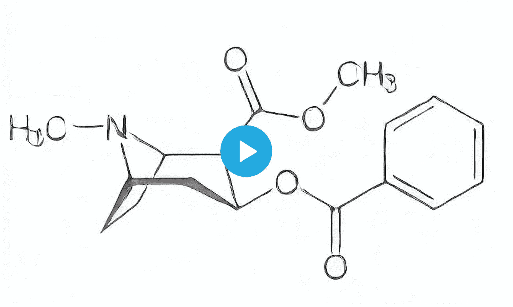

# 人工智能可卡因-毫升研究笔记本

> 原文：<https://medium.com/mlearning-ai/ai-cocain-ml-research-notebook-db2d00ce5799?source=collection_archive---------9----------------------->

## 机器学习艺术

## 立即观看(1 分钟)

[The New World of Art Consumption](https://mlearning.substack.com/p/ai-cocain?r=z7zu8&utm_campaign=post&utm_medium=web)

MLearning.ai 研究人员提供了 art 可卡因的全面描述，包括其化学成分和制备方法。此外，文中充满了从各个角度拍摄的高质量的可卡因照片，便于读者更深入地理解材料。