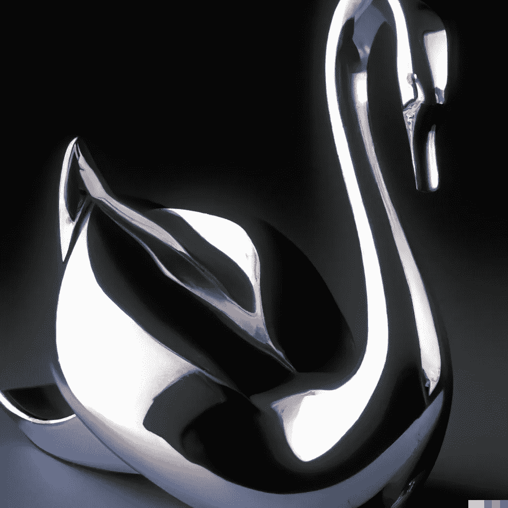

# 视频中对象的人工智能编辑

> 原文：<https://medium.com/mlearning-ai/ai-editing-of-objects-in-videos-6a20367ad16b?source=collection_archive---------5----------------------->

## [机器学习艺术](https://mlearning.substack.com)

## 使用文本对视频中的对象进行样式化

[A good alternative to DALL·E 2 that you can use while waiting](https://mlearning.substack.com/p/a-good-alternative-to-dalle-2-that?r=z7zu8&s=w&utm_campaign=post&utm_medium=web) — [Images Created with DALL·E, an AI system](https://mlearning.substack.com/p/a-good-alternative-to-dalle-2-that?r=z7zu8&s=w&utm_campaign=post&utm_medium=web)

## 什么是用 AI 编辑视频？

**人工智能驱动的视频编辑器**可以改变你的工作，让它变得更快更容易。它还自动化了大多数不需要太多关注的任务。它为人们做了一件次要的工作，所以我们现在有更多的时间…