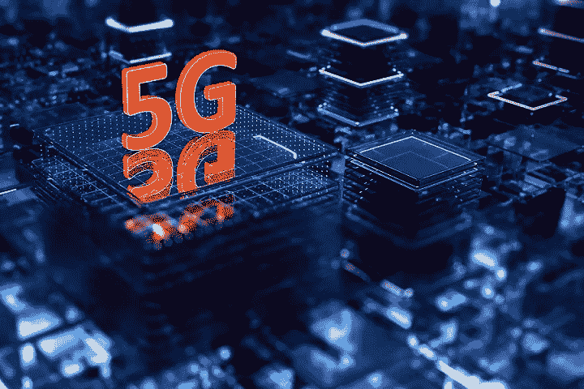
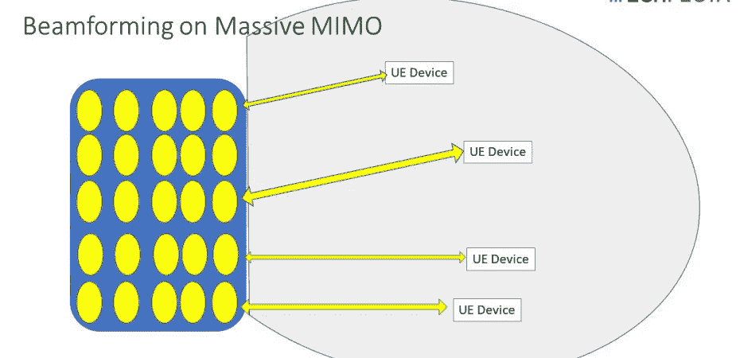
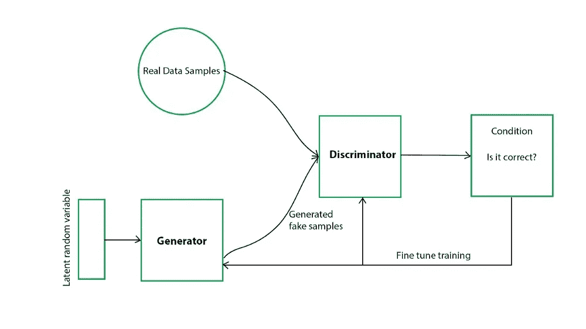
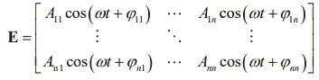
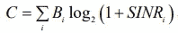
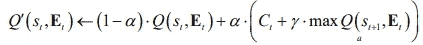
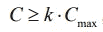

# 5G 网络的人工智能

> 原文：<https://medium.com/mlearning-ai/ai-for-5g-networks-295cc448ec22?source=collection_archive---------0----------------------->

5G 网络是过去几年的热门话题。令人惊讶的是，在冠状病毒传播后，它变得更加有名，因为一些人声称 5G 导致了疫情，尽管没有证据。抛开所有无意义的讨论，让我们专注于 5G 的发展。

5G 的主要优势是使用毫米波。与传统一代相比，这些波的频率更高，因此允许我们使用更宽的带宽，这也提高了数据速率。这意味着我们将有更快的连接，更多的设备同时连接到互联网和更少的延迟。但所有这些都是有代价的:毫米波很容易受到大气条件、建筑物或任何物理障碍的影响。与传统的低频信号不同，毫米波很容易衰减，无法长距离传输。由于这个原因，在电信中引入了新的概念。我们可以将这些概念归类为“5G 的 5 个基础”:

> 1 毫米波
> 
> **2-小细胞**
> 
> **3-大规模 MIMO**
> 
> **4 波束成形**
> 
> **5-全双工**

在本帖中，我们将重点关注 5G 的人工智能方法。所以主要的兴趣将会在第三和第四个特征上。让我们对这些专业术语做一个简单的解释。

## 大规模 MIMO

正如我们上面讨论的毫米波，无线通信会遭受衰减(功率损耗)和干扰(与其他信号的频谱冲突)。大规模 MIMO(多输入多输出)系统为这些问题提供了解决方案。许多天线阵列被放置在基站中。并且不是将单个天线链接到单个用户，而是将多个天线链接到多个用户。

## 波束形成

在传统的通信系统中，使用径向(圆形)辐射。这意味着信号向四面八方辐射。然而，用户并不是均匀地分布在一个圆上。相反，它们位于一些离散的位置上。这种情况使得环形辐射的使用效率非常低。它既浪费能量，也可能造成干扰。解决这个问题的方法是创建更多的针对特定用户的指示信号，而不是一个圆形的目标。

每个天线(或天线阵列)通过幅度和相位调整与特定目标相关联。我们可以想象波束形成解决方案如下。每个设备通过定向信号连接到相应的天线。波束形成方法允许我们避免消耗额外的频谱，节省能量并减少干扰。

解释了大规模 MIMO 和波束形成概念后，让我们探索如何将人工智能解决方案应用于这些概念。

## 人工智能解决方案

对于基站来说，通常不容易决定最佳波束形成调整，因为它们没有强大的计算资源。现场优化过程将花费大量的时间和能量，这是基站所不能承受的。为了解决这个问题，可以应用外部数据训练，并且只有预测过程可以留给基站。具有预构建的机器学习模型将大大减少波束形成优化所需的时间和功率。

与机器学习的其他应用领域(如计算机视觉或自然语言处理)不同，在通信系统中获取真实数据并不容易。特别是对于 5G，由于各种仪器的设置，生成真实数据是相当昂贵的。我们应该找到一种简单的方法来获得数据，而不必花费巨大的资本。

生成敌对网络(GANs)在创建看不见的数据中起着重要作用。它有相当受欢迎的应用，如通过检查现有的绘画重新绘制文艺复兴时期的绘画。在创建真实数据方面，GANs 是通信系统的完美选择。

Diagram for Generative Adversarial Networks

那么，在 5G 中，GANs 用在哪里呢？由于位置估计对于波束形成非常重要，我们可以基于一些概率分布来创建用户位置。一个神经网络(GAN)负责创建用户位置数据，另一个神经网络将输出相应的天线图，包括信号的振幅和相位。

Antenna Diagram

挑战来了！在传统的应用中，数据是有标签的。因此，我们知道预期的产出，并能够计算损失，无论是明确的还是连续的。但是在这里，没有预定义的输出，不允许我们执行损失计算。由于我们无法计算损失，我们可以尝试另一种方法来克服这个问题。定义一个奖励函数将帮助我们决定当前的天线图是否合适。如果我们退一步，纵观全局，我们会发现我们提出了强化学习模型。一个网络产生数据，一个创建天线图，最后一个负责奖励输出。

Reinforcement Learning Block Diagram

在不深入电信术语的细节的情况下，我们可以说使用下面的函数作为奖励函数将提高系统的吞吐量。第三个神经网络返回一个奖励，该奖励导致第二个神经网络如下更新天线图。

Reward Function [1]

Update the Current State [1]

重复这些步骤，直到我们满足下面的吞吐量标准:

Convergence Criterion [1]

## 摘要

我们通过强调两个基本组件来讨论 5G 的未来。我们还探索了如何应用人工智能来解决 5G 问题。由于通信系统遭受机器学习模型的数据可用性，监督训练不是一个可能的解决方案。取而代之的是一个由 3 个不同的神经网络组成的强化学习模型。该模型旨在最大化系统的吞吐量，从而为用户提供更好的服务[1]。

像诺基亚这样的电信公司利用机器学习解决方案来解决通信问题。你可以看看下面的报纸和新闻，了解更多信息。

# 参考

[1][https://www . research gate . net/publication/328836812 _ Deep _ Learning _ Based _ Massive _ MIMO _ beam forming _ for _ 5G _ Mobile _ Network](https://www.researchgate.net/publication/328836812_Deep_Learning_Based_Massive_MIMO_Beamforming_for_5G_Mobile_Network)

[2]https://arxiv.org/ftp/arxiv/papers/1811/1811.08792.pdf

[3][https://spectrum . IEEE . org/tech-talk/telecom/wireless/3-ways-Nokia-is-use-machine-learning-in-5g-networks](https://spectrum.ieee.org/tech-talk/telecom/wireless/3-ways-nokia-is-using-machine-learning-in-5g-networks)