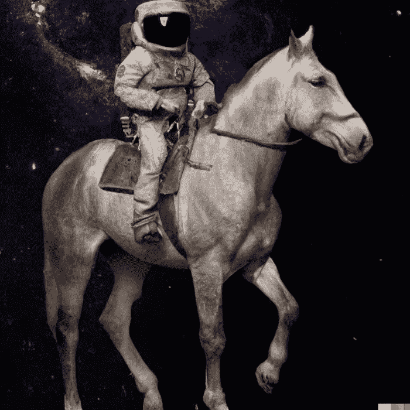

# 人工智能生成图像 Dall-E 2

> 原文：<https://medium.com/mlearning-ai/ai-generated-images-dall-e-2-116852299e9e?source=collection_archive---------6----------------------->

## Dall E 和 Dall- E2

一名宇航员骑着一匹逼真的马

假设你是一名平面设计师，被要求运用自己的想象力画一幅“骑着马的宇航员”的画。为此，你将尝试浏览一些宇航员和一匹马在太空中的照片，并尝试理解如何根据闪电和阴影进行合成…