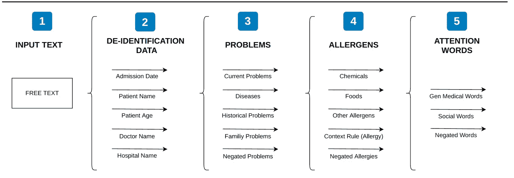
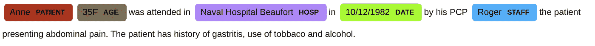
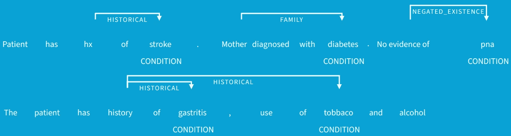
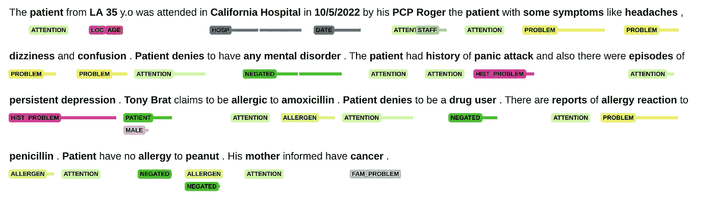
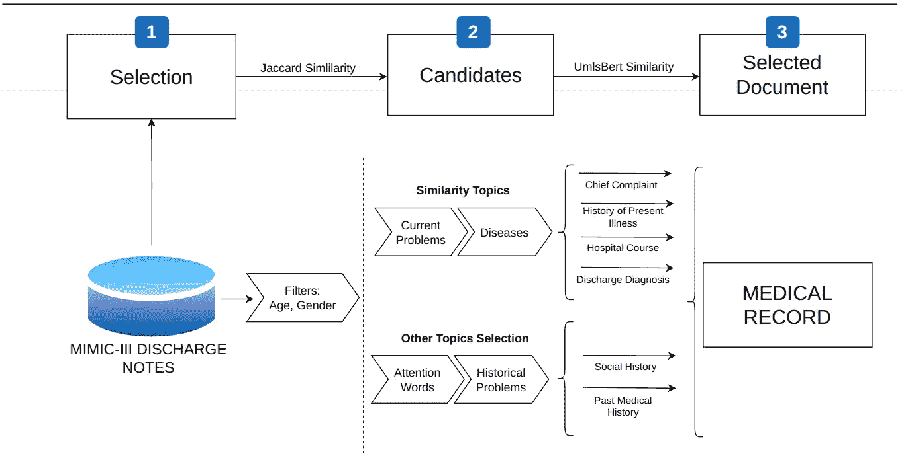
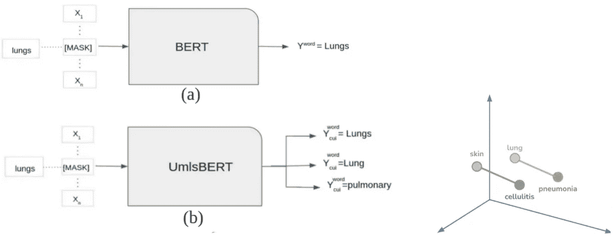
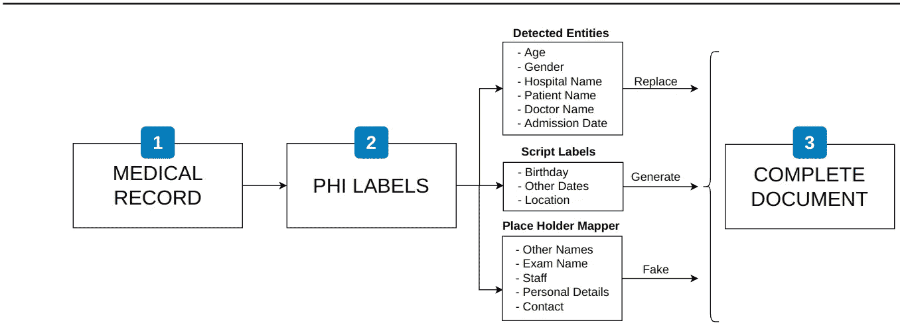
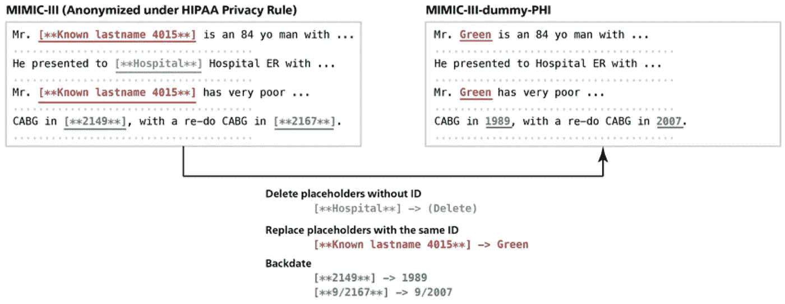
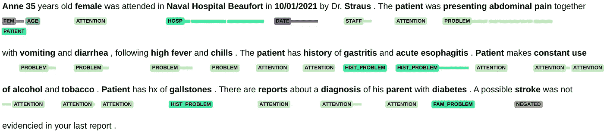

# 人工智能生成的医疗记录—第 1 部分

> 原文：<https://medium.com/mlearning-ai/ai-generated-medical-document-7ed0c510f2a?source=collection_archive---------5----------------------->

来自自由文本的合成医学文档

Yes, this is an AI-generated Image (OpenAI DALL·E), Credit: [Leonardo Lara](https://medium.com/u/ddd8420c179f?source=post_page-----7ed0c510f2a--------------------------------)

与最新的“大型语言模型”(LLM)进行对话时，有时你会觉得它对你的需求相对敏感，回答任何主题的问题。虽然这些模型经常产生令人印象深刻的输出，但如果不添加一些标记示例的“镜头”来针对特定任务进行微调，它们也无法推理和事实化基于现实世界的困难问题。

BigScience 宣布了一个名为 [BLOOM](https://huggingface.co/bigscience/bloom) 的 LLM，比 GPT 3 号(OpenAI)大，参数约为 1760 亿，这是一个由人工智能初创公司[拥抱脸](https://huggingface.co/) **协调的国际社区供电项目🤗**去年由 1000 多名志愿者研究员创建。与它的一些竞争对手不同，他们让这种前沿的人工智能广泛适用于世界各地的所有研究人员。

在 2 篇文章的系列中，我将展示 MedtriX 项目，该项目基于来自包含 59，652 个可自由访问的出院总结的 [MIMIC-III](https://physionet.org/content/mimiciii/1.4/) (重症监护医疗信息集市)数据集的 [BLOOM](https://huggingface.co/bigscience/bloom) ，从自由文本生成新的人工智能生成的医疗记录。

1 第一部分:从输入文本中识别医疗实体，与病历相似的方法，最后替换合成数据的值。

2 第二部分:AI 生成的医疗部分(医院课程、目前的疾病、社会历史和过去的医疗)通过微调 BLOOM 显示一些 MLOps 实践和部署 LLM 的指导。

MedtriX 应用程序可用于您自己在 Streamlit 上的实验:

[MedtriX Streamlit](http://ec2-18-215-16-187.compute-1.amazonaws.com:6565)

本文的所有内容都是我的 Github 资源库的一部分:

 [## GitHub - leoitcode/medtrix

### 这是一个从自由文本生成新的医疗报告的项目，包括人工智能生成的部分和病人报告。

github.com](https://github.com/leoitcode/medtrix) 

# 实体检测

## **个人资料**

为了在医疗记录上最精确地识别特定实体(患者和医生姓名、年龄、入院日期、医院)，我构建了一个[去标识](https://huggingface.co/obi/deid_roberta_i2b2)(去标识)变压器模型，通过 RoBERTa 进行微调以检测敏感数据。这种方法用于对真实的患者文档进行匿名处理，避免数据泄露。
结果是:

为了得到最佳的性别猜测，我应用了性别计算机脚本来推断人的性别。

## **问题、临床注意词和过敏原**

事实上，从这些医学术语到出院总结的匹配过程不仅仅是检测患者问题或健康相关的词，还检查该术语是否与过去的病史或否认的存在相关。有时候甚至不是病人自己的问题，而是家族史的问题。

***1-*** 我做了一些研究，发现了获得问题和疾病的最佳性能模型，应用了基于哈佛医学院生物医学信息学系(DBMI)i2b 2 数据集的 StandfordNLP [Stanza 生物医学模型](https://stanfordnlp.github.io/stanza/available_biomed_models.html])。为了更好的兼容性，我用一个非常有用的包把它放在了 spaCy 管道中，你可以在下面查看: [spacy-stanza](https://spacy.io/universe/project/spacy-stanza)

***2-*** 注意力是你需要的全部！因此，最推荐使用软件包 [scispaCy](https://allenai.github.io/scispacy/) 来识别一般医学词汇。

***3-*** 为了在这些实体之间有清晰可辨的边界，我使用了基于[上下文算法](https://www.ncbi.nlm.nih.gov/pmc/articles/PMC8861690/)的 [medspaCy](https://github.com/medspacy/medspacy) 上下文规则，来识别句子中找到的条件与另一个术语之间的关系。

spaCy displaCy Visualization

***4-*** 关于过敏和过敏原，我创建了一个函数，从 [spaCy Med7](https://github.com/kormilitzin/med7) ，食物和另一种基于过敏原数据库的物质[COMPARE](https://comparedatabase.org/)(**COM**premansive**P**protein**A**llergen**RE**source)。

这一步的最终结果是一个完整的自由文本，包含定义良好的实体:

Detected Clinical Entities

Full pipeline to get entities

# 相似文档选择

在整个医疗记录中，有几个主题，如“主诉”、“住院过程”和一些关于患者的历史，如“社会史”和“病史”。为了将从自由文本中找到的实体与出院小结进行匹配，让我们玩一些相似性游戏:

## ***1-雅克卡相似度***

Credit: [fast data science](https://fastdatascience.com/finding-similar-documents-nlp/)

对于医疗保健来说，这是一个非常基本的相似性方法，但是它只是在尽可能快地从近 6 万个候选项中缩小选择范围以提高整体性能时才派上用场。

## 2-UmlsBERT**T5【相似度】T6**

对于一个精简的文档集，这里我们使用一种简洁的方法将找到的术语与最佳文档进行匹配。 [UmlsBERT](https://github.com/gmichalo/UmlsBERT) 是一个上下文嵌入模型，它集成了统一医学语言系统(UMLS) Metathesaurus，考虑到特定医学词汇之间的关联，使用屏蔽 LM 的更新版本进行训练。

Credit: [UmlsBERT](https://aclanthology.org/2021.naacl-main.139.pdf)

UmlsBERT 相似性代码:

# 替换、生成和伪造数据

在每份模拟病历上，都有几个 PHI 标签(受保护的健康信息),用于匿名化原始的个人敏感数据。

但是出于医学文本生成的目的，有必要将每个项目放在适当的位置。编写了一个脚本来访问所选文档上的位置，替换姓名、数字并从入院日期开始按顺序生成新的日期。剩下的标签需要生成假术语，我可以用一个有用的工具来计算，这个工具有许多关于姓名、位置、联系人的假列表和大量兼容的正则表达式来完成文档。

Credit: [KART](https://www.researchgate.net/figure/Process-to-make-MIMIC-III-dummy-PHI_fig2_348213139)

# 最终文件形式

作为最终结果，我们来举例说明:

输入文本:

> “安妮 35F 于 2021 年 10 月 1 日在博福特海军医院接受斯特劳斯医生的治疗。患者出现腹痛，伴有呕吐和腹泻，并伴有高烧和寒战。患者有胃炎和急性食管炎病史。病人不断使用酒精和烟草病人有胆结石。有报道称他的父母被诊断患有糖尿病。你的上一份报告中没有证据表明可能是中风。”

***检测到的实体:***

***文档选中(*** 高亮显示注意词) ***:***

# 加贺又去哪里了

这项工作将在下一篇关于人工智能创建的新的综合病人报告和医疗部分的文章中继续进行。这第一部分可以在 [MedtriX Streamlit](http://ec2-18-215-16-187.compute-1.amazonaws.com:6565) 上找到你自己的自由文本表达式。

我希望你喜欢这第一部分。感谢您通读！！

## 关于我

我是莱昂纳多，目前专注于帮助机器学习在医疗保健中发挥重要作用。在 LinkedIn 上自由联系我，如果你在[Medium](/@leonardo.ti.bruno)上关注我，了解这一切将如何结束，我会很高兴。

如果你有问题或意见，请在评论中提出来！

 [## Mlearning.ai 提交建议

### 如何成为 Mlearning.ai 上的作家

medium.com](/mlearning-ai/mlearning-ai-submission-suggestions-b51e2b130bfb)