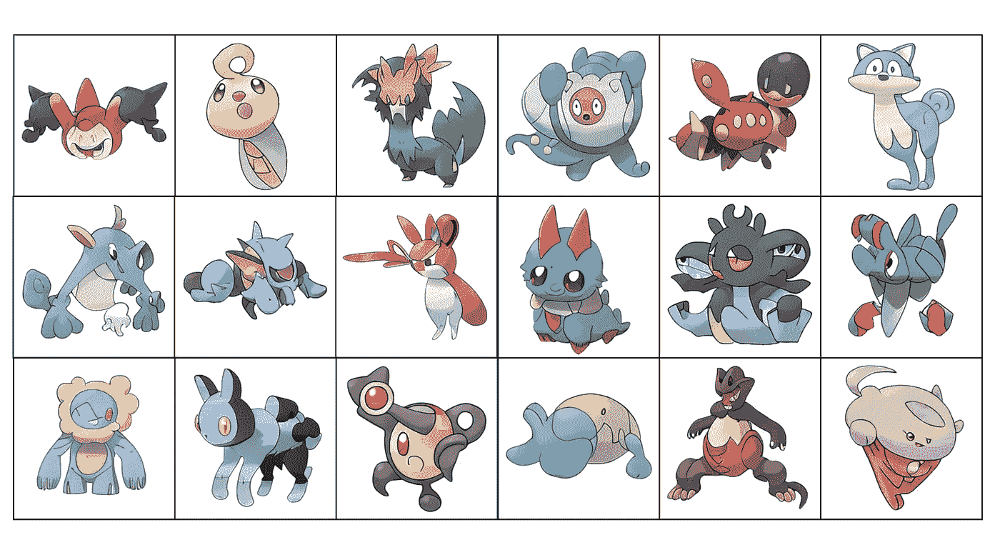

# 人工智能生成的口袋妖怪

> 原文：<https://medium.com/mlearning-ai/ai-generated-pokemon-aae395ec82e4?source=collection_archive---------0----------------------->

## 机器学习和艺术

## 这款笔记本可以让你在 2 次点击中创建人工智能艺术

generated by [ML](https://medium.com/mlearning-ai) model

如果人工智能在人类的艺术进程中扮演更重要的角色会怎样？如果人们理解人工智能可以创造出有价值的销售对象，那么创造力的目标会有所不同吗？