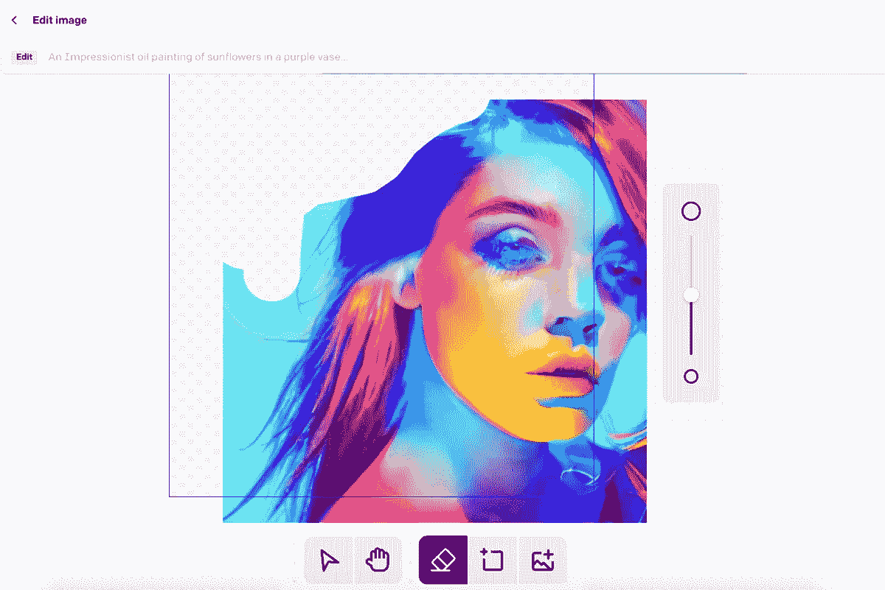

# AI 生成器取代 Photoshop

> 原文：<https://medium.com/mlearning-ai/ai-generators-replace-photoshop-7d9505b9992c?source=collection_archive---------2----------------------->

## Photoshop 时代的终结

## 新 DALL E 编辑指南

[NEW DALL·E Editor](https://evartology.substack.com/p/how-ai-art-is-revolutionizing-photoshopping?r=9hp4d&s=w&utm_campaign=post&utm_medium=web)

就目前所见，人工智能艺术产业(T3)在 T2 并没有放缓的迹象。尽管如此，人工智能艺术的主要工具一直在进化。因此，人工智能发电机将一步一步地逐步发展壮大。这可以从使用人工智能创作的艺术品数量中看出，这一数量仍在增长。