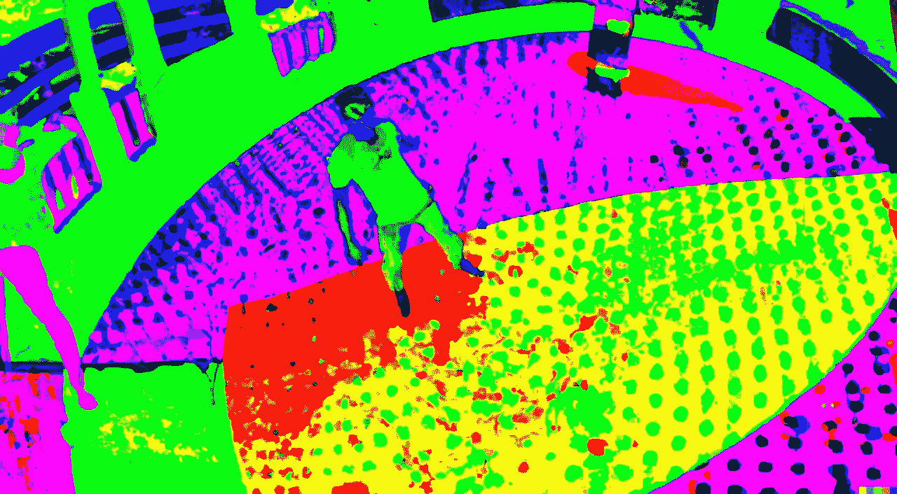

# 将 2D 变成 3D 杰作的人工智能生成器

> 原文：<https://medium.com/mlearning-ai/ai-generators-that-transform-2d-into-3d-masterpieces-a10659cd07ca?source=collection_archive---------0----------------------->

## [从 2D 图像创建 3D 环境](https://mlearning.substack.com/p/seeing-things-that-arent-in-the-cameras?r=z7zu8&s=w&utm_campaign=post&utm_medium=web)

## [AI 艺术下一个层次的到来](https://mlearning.substack.com/p/can-ai-generate-3d-models?r=z7zu8&s=w&utm_campaign=post&utm_medium=web)

[**3D representation for machine learning**](https://mlearning.substack.com/p/seeing-things-that-arent-in-the-cameras?r=z7zu8&s=w&utm_campaign=post&utm_medium=web)

## 人工智能的三维艺术作品

当前一代的[人工智能艺术生成器](https://evartology.substack.com/p/all-of-the-greatest-ai-powered-art?r=9hp4d&s=w&utm_campaign=post&utm_medium=web)无法创作 3D 作品。然而，已经尝试去理解 **3D 几何图形** …