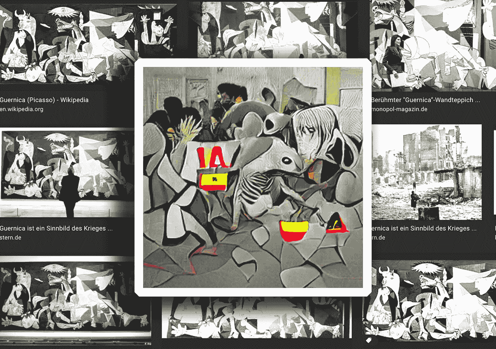

# 艾格尔尼卡

> 原文：<https://medium.com/mlearning-ai/ai-guernica-ffa3ef20d9bf?source=collection_archive---------3----------------------->

## 数据驱动艺术

## 面向艺术家的机器学习工具

[**art.MLearning.ai**](http://art.mlearning.ai/)

艺术与生活的方方面面交织在一起，它有表达人类状况的力量。例如，现代[机器学习](/mlearning-ai/mlearning-ai-concentrate-7f84164d5a7b)技术让我们能够在巴勃罗·毕加索的一幅标志性画作上创造出新的变化。艺术一直在不断发展，这只是新技术如何改变 T2 的另一个例子