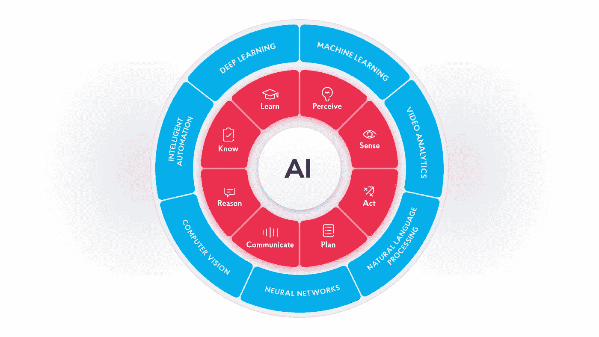
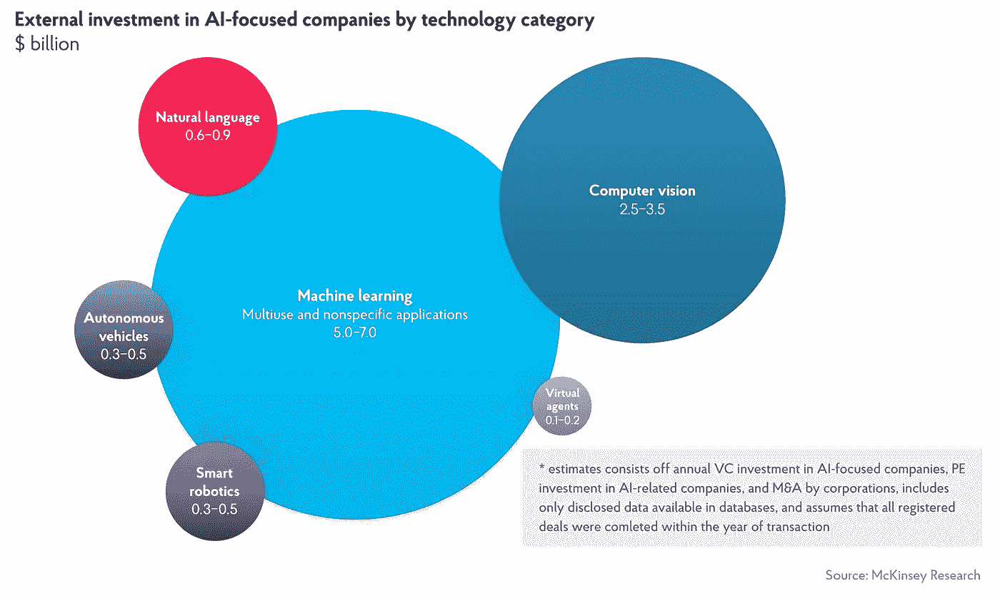
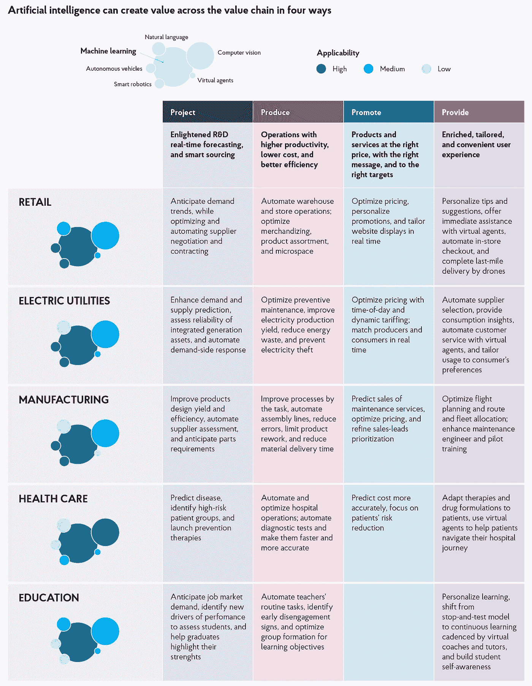

# 商业中的人工智能:胸怀大志

> 原文：<https://medium.com/mlearning-ai/ai-in-business-think-big-and-scale-with-intention-dc2cf523515f?source=collection_archive---------3----------------------->

## 近年来人工智能(AI)的快速发展为尚未采用该技术的组织敲响了警钟——你错过了大好时机！

人工智能允许企业释放出可操作的见解，否则这些见解将隐藏在大量数据中。我们从移动设备和计算机中生成的许多数据是非结构化的。它主要以照片、视频、短信、电子邮件、商业报告和社交媒体帖子的形式出现。使用人工智能，有可能识别这些数据集中的模式，并最终找到复杂商业问题的解决方案。

最终，人工智能保证了更好的需求预测、更高的工人生产率、更愉快的客户体验和更高的流程效率。

这些优势通常会转化为更好的收入。根据 Statista 的数据，人工智能在 2019 年为组织带来了超过 66.29 亿美元的收入，预计 2020 年的数字将达到 105.29 亿美元。到 2025 年，该技术将帮助企业产生额外的 597.84 亿美元收入。

# 在你的组织中采用人工智能；从小规模开始，稳步扩展

在商业环境中，人工智能有不同的入门方式。例如，如果你使用聊天机器人来推动客户参与，那么你已经在那里了——你正在使用人工智能。

尽管如此，专家们还是建议采取一个循序渐进的采用过程，这样当你最终推出复杂的人工智能解决方案时，你的系统和员工都为这些变化做好了准备。

# 第一步:理解人工智能的基础知识

有了人工智能，如果你直接跳进水里，就有很大的“溺水”风险。那是因为 AI 是一个广阔的领域。你需要知道每个分支需要什么，以理解如何从各种人工智能解决方案中提取价值。这里有一些你需要知道的快速的事情；

**定义**:人工智能是计算机科学的一个分支，专注于构建能够完成类似人类任务的智能机器。

**分支** : AI 有两大分支；机器学习和深度学习。每个分支都在提供能够像人类一样思考和行动的智能机器方面发挥了重要作用。

**机器学习:**机器学习是人工智能的一个分支，它教会机器自己行动。就像人类一样，机器人可以保留信息，并使用这些信息来采取行动或对未来的情况做出反应。机器学习旨在赋予机器在没有预先存在代码的情况下学习任务的能力。

**深度学习:**深度学习稍微复杂一点。它不仅仅是完成一项单一的任务，而是要求机器使用它们所拥有的知识(数据+洞察力)，通过像人类一样“思考”来解决更广泛的任务。设计用来模仿神经元或脑细胞的人工神经网络使深度学习成为可能。

**弱人工智能对强人工智能:**你也会经常遇到两个术语——弱人工智能和强人工智能。弱 AI 是只会模拟，不会思考，不会自己做决定的 AI。与此同时，强人工智能可以自行决策。

# 第二步:为人工智能的采用建立你的商业案例

一旦你理解了人工智能的基础，下一步就是考虑它将如何给你的组织带来好处。各种形式的人工智能(机器学习、深度学习、弱人工智能和强人工智能)将如何帮助您的业务流程？要回答这些问题，你需要为 AI 建立一个[商业案例。](https://hbr.org/2018/12/why-companies-that-wait-to-adopt-ai-may-never-catch-up)

首先要认识到现代组织必须超越成功的标准来思考；衡量增长的传统方法不再适用。引用毕马威 *2018 年 CEO 展望，*福布斯洞察团队强调，增长必须不再被视为收入或利润的量化指标。相反，“它还应该包括客户满意度和员工参与度等指标。”

因此，在挑选要解决的问题时，要从大处着眼。你想要一个能立即产生巨大影响的解决方案。

以下是一些需要记住的提示:

*   从基本的“日常”解决方案开始
*   将您的计划与商业价值直接联系起来
*   试运行一下，看看你是否得到了价值
*   随时准备好替代方案，以防第一个方案失败

除了从你的人工智能解决方案中获得价值之外，最重要的是你要让使用该解决方案的人加入进来，并让组织中的每个人都支持你的努力。赢得人们的方法是确保他们明白他们将获得多少利益。考虑使用统计数据和行业报告来证明你的观点。

# 第三步:逐步扩大规模

既然你已经理解了人工智能，并且有了实现该技术的商业案例，是时候推出你的计划了。

有两种广泛的方法来实现人工智能技术。首先，你可以自己做。你可以购买和安装软件，并培训员工使用它。然而，更好的选择是与 IT 供应商合作。供应商将进来，评估你现有的系统，并确定人工智能将在哪里以及如何提供帮助。大多数供应商也会帮助培训。

大多数人工智能供应商通常建议您从简单的人工智能解决方案开始，如聊天机器人和营销自动化。聊天机器人可以让你全天候吸引客户，而无需投入大量人力资源。与此同时，营销自动化包括预测技术，旨在帮助企业产生更多、更好的线索。

一旦你从聊天机器人和营销自动化中产生价值，你就可以扩展到更复杂的人工智能领域。一种可能性是将您的 IT 系统升级到软件和人工智能定义的基础设施，以便您可以处理人工智能技术所需的更高存储和计算能力。您也可以迁移到云，因为从云进行扩展要容易得多。

此后，通过投资人工智能解决方案，致力于让你的数据更容易理解，这些解决方案可以帮助你实现神经网络的更好可见性。其中一些活动将需要专门的人工智能工程师来帮助你挖掘和管理大量的数据。所以，做好将来雇佣一个的准备。

# NIX 如何提供帮助

NIX 可以成为您值得信赖的人工智能合作伙伴，帮助您在您的组织中采用和扩展人工智能，并获得最大收益。我们拥有必要的工具、技能和人力资源来部署和扩展您的人工智能计划，以帮助您提高效率和增加收入。请立即联系我们进行免费咨询。