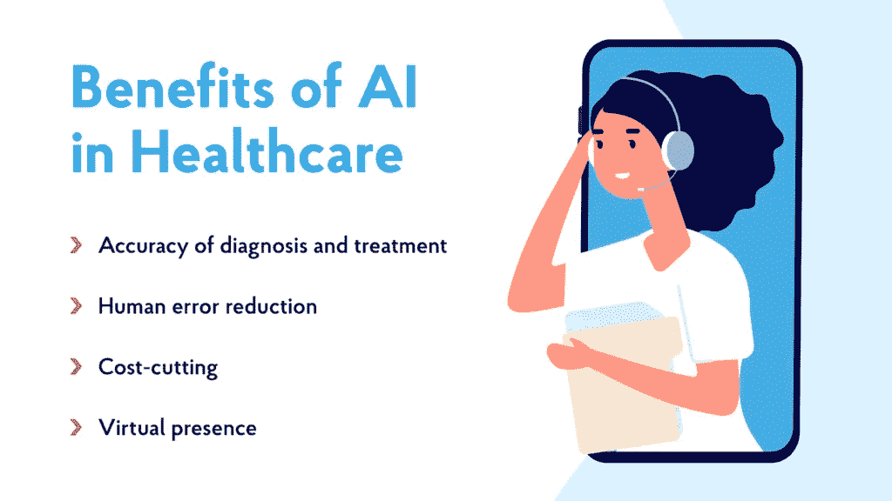
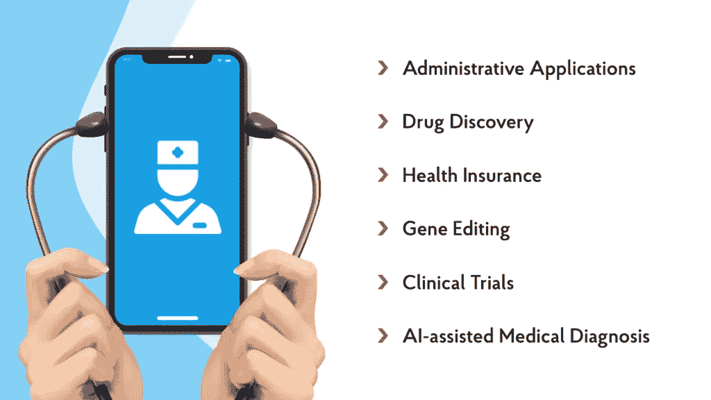

# 医疗保健中的人工智能—重塑行业的技术— NIX United

> 原文：<https://medium.com/mlearning-ai/ai-in-healthcare-technology-that-reshapes-the-industry-nix-united-3e00d9fb3d46?source=collection_archive---------3----------------------->

提供高水平的医疗保健服务变得越来越劳动密集型。由于众多的行政手续，这是一件总的来说既昂贵又昂贵的事情。这就是为什么[医疗保健提供商已经开始实施最新的人工智能技术](https://nix-united.com/services/ai-solutions-artificial-intelligence/)，以确保为患者提供最佳服务，并为医生、雇主、保险公司、制药公司和政府提供新的能力。在这方面，人工智能在数据分析、诊断的准确性、治疗预测的建立以及将医务工作者从额外的管理任务中解脱出来等方面带来了无与伦比的增强。

那么，人工智能如何融入医疗保健——它的最终角色是什么？让我们更深入地探讨这个主题，了解这项技术的核心，并回顾人工智能在医疗保健中的几个用例，以找出答案。

# 人工智能如何在医疗保健中发挥作用

[人工智能已经证明，在分析和分割由电子医疗记录、社交媒体、患者摘要、基因组和药物数据、行为和社会经济指标等产生的大量数据中的模式方面，它比人脑复杂得多](https://callminer.com/blog/smart-implementation-machine-learning-ai-data-analysis-50-examples-use-cases-insights-leveraging-ai-ml-data-analytics)。医疗保健提供商将医疗数据输入人工智能，人工智能然后探索这些数据，并展示医生根本无法检测到的行为模式和规律。

让人工智能负责识别和分析有益的医疗模式有助于提供者开发整体医疗方法——从整体上对该领域做出贡献——并从长远来看变得更加高效和富有成效。这是双赢的局面。[人工智能在医疗保健领域可能是最近的现象，但它正在以惊人的速度重塑这个行业](https://nix-united.com/blog/how-ai-can-improve-processes-in-healthcare-retail-and-banking/)。

以下是人工智能目前在医疗保健领域的应用中受益者的一些例子:

*   临床医生和研究人员使用人工智能来加快临床试验。人工智能有助于加快医疗编码搜索和确认，这在临床研究的进行和结论阶段至关重要。
*   患者可以通过连接到虚拟代理从医生那里获得个性化的健康计划。
*   医生可以使用人工智能更快地诊断疾病，并为患者提供更好的护理。

# 在医疗保健中实现人工智能的技术

如今在医疗保健领域使用的人工智能技术才刚刚开始，更具雄心的技术正在发展，涉及多种数据源的组合，为制药和生物技术领域带来更大的优势。让我们回顾一下今天在实践中广泛使用的不同类型的人工智能技术。

# 机器学习

[机器学习](https://www.businessinsider.com/artificial-intelligence-healthcare) (ML)帮助医疗保健行业在许多方面取得成果。ML 技术有许多不同的版本，但主要思想是相同的——计算机通过分析提供的数据来学习一些东西，并对其进行思考，为下一步行动提供建议。ML 每年都在医疗保健领域带来更多的人工智能，它通过几种方法做到这一点。

在临床领域，最常见的 ML 方法是基于监督学习的。这种 ML 哲学需要某些输入数据——例如，与目标患者数据的数据库相结合的患者的身体数据——来建立进一步的逻辑结果。

[深度学习是一个 ML 子领域](https://nix-united.com/blog/artificial-intelligence-vs-machine-learning-vs-deep-learning-explaining-the-difference/)，它使用复杂的神经网络来分析、处理和学习输入数据，类似于人类的学习方式。神经网络有助于对所有数据进行分类，并以方便、无障碍的格式接收这些数据，以供医务人员(尤其是援助从业者)感知，他们使用这一伟大的工具将潜在诊断缩小到最有可能的选项。

# 光学字符识别

教机器识别和理解类似人脑的视觉对软件和硬件工程师来说是一个巨大的挑战。但经过多年的不断发展，我们已经成功地用视觉丰富了我们的计算机，实现了更多的数字化优势。

在医疗保健领域，计算机视觉可以方便地用于识别各种视觉数据，包括由专门的神经网络正确扫描和识别的手写文档。然后，人工智能可以方便地为医务人员部门翻译打印格式的文档。这一应用和其他应用最终通过人工智能提高了现代医疗保健的效率。

# 基于规则的专家系统

自 80 年代以来，基于“如果-那么”规则变体的专家系统是医疗保健人工智能的流行技术。在这个系统中，与 ML 不同，程序员手动编码一个巨大的行为管理库，以允许系统运行。

然而，当行为模式的数量开始超过几千个时，某些模式开始与其他模式冲突，导致系统崩溃。此外，改变这种有点老派的系统的知识领域既费钱又费力。虽然基于规则的系统在人工智能中占有一席之地，但提供商越来越多地在医疗保健中采用具有 ML 功能的软件解决方案，而不是基于规则的系统，特别是当数据集变得非常大时。

# 人工智能在医疗保健中的应用

目前，在医疗保健行业，46%的服务运营人员、28%的产品和服务开发人员、19%的风险管理人员、21%的供应链管理人员以及 17%的营销和销售人员正在采用人工智能。此外，一些企业正在开发创新方法，将人工智能融入智能可穿戴设备、设备和应用程序，从而提高它们的效率。让我们来看看在医疗保健领域使用人工智能的一些领域。

# 机器学习在诊断和治疗中的应用

正确诊断疾病需要多年的医学训练。即便如此，诊断可能是一个漫长而昂贵的过程。因此，ML 算法，特别是深度学习算法，已经被越来越多地用于自动化疾病诊断，使其更容易实现。

**ML 在诊断中的当前应用**

*   在计算机断层扫描中发现肺癌和中风的迹象
*   使用心电图和心脏核磁共振成像评估心脏病风险
*   对皮肤图像中的皮肤损伤进行分类
*   检测眼睛图像中的糖尿病视网膜病变指征

应该注意的是，医生不会被 ML 或 AI 取代——这些技术的存在是为了支持医生，以改善患者的诊断和管理。人工智能解决方案和医生之间的比较是不合适的，因为他们没有竞争。未来的研究应该比较使用人工智能解决方案的医生和不使用智能技术的医生。

# 用于药物发现和临床试验的人工智能

将人工智能应用到药物发现的分析过程中，可以为这个臭名昭著的资源密集型领域节省数年的努力和数百万美元。

**人工智能在药物研发中的应用现状:**

*   分析疾病的生物学起源并鉴定用于治疗疾病的靶蛋白
*   分子适应性预测和最小副作用的筛选
*   确定临床试验的合适候选人

人工智能可以以量子力学级别的精度预测非常小的分子的物理和化学性质，同时大大降低了时间成本。制药公司在药物研究的所有阶段实施人工智能，从临床前试验开始，通过数据收集和分析，实现更高效和更具成本效益的过程。

基因编辑中的一个重要问题是，当使用成簇的规则间隔短回文重复序列(CRISPR)技术时，短指导 RNA 可以随机适合多个 DNA 位置，导致脱靶效应。人工智能算法可以通过预测给定 sgRNA 的目标和非目标效应来加速 DNA 编辑过程。

# 健康保险和管理应用

与病人护理相比，在医疗保健系统的管理功能中使用人工智能的好处并不那么有趣和具有革命性。然而，它有可能提高官僚机构的效率。

人工智能目前用于索赔和支付管理，以便在不同的数据库之间配对数据。保险公司和提供商必须验证每天提交的数百万份索赔是否正确，这一过程的自动化有助于提高效率和降低费用。

我们应该会在几年内看到 AI 在索赔处理、临床文档、医疗记录管理和其他功能方面的进一步实施。这项创新将继续为公司提高效率和降低成本。

# 人工智能在医疗保健中的未来

人类文明需要几千年来理解基本的医学概念，现在人工智能正在改变我们对医学和医疗保健的理解。世界各地的医学院和大学都跟不上这些变化的步伐，毕业生不得不适应快速变化的医学世界。这证明了人工智能在发展我们对医疗保健的理解和实践方面的惊人速度和效率。人工智能的未来会怎样？让我们来看看未来可能利用人工智能来推动医疗保健行业发展的其他技术。

# 虚拟和增强现实

虚拟现实(VR)和增强现实(AR)正在改变许多不同行业的面貌。这些技术正在建筑、电子商务、游戏、教育等领域不断发展。

想象一下，医生在课堂上通过使用逼真的模拟，将理论付诸实践，从而获得临床实践，这将是多么令人敬畏的事情。例如，外科医生可以使用虚拟现实来提高他们在不同情况下的技能。在模拟中练习将确保在真实过程中的惊人表现。在医疗保健领域用人工智能技术来解决这个问题将会产生巨大的效果。

现实是，使用 AR 和 VR 技术来培训医疗保健工作者将提高他们的能力，减少教学时间。[据报道，使用虚拟现实来教授医疗保健工作者可以提高 75%的技能保持率](https://www.researchgate.net/publication/328344033_Augmented_Reality_for_Health_and_Safety_Training_Program_Among_Healthcare_Workers_An_Attempt_at_a_Critical_Review_of_the_Literature_Proceedings_of_the_1st_International_Conference_on_Human_Systems_Eng),减少高达 52%的技能衰退。

VR 和 AR 还可以帮助外科医生在重大外科手术前让患者放心。许多病人害怕不确定性；医生可以通过使用易于理解的数字仪器向病人解释整个过程来消除这些疑虑。

AR 和 VR 还处于早期发展阶段。这些技术被完全整合还需要很多年。然而，它们在其他行业的全球使用无疑会被纳入医疗保健领域。

# 大数据管理

没有提到大数据，就没有人工智能趋势的列表，不是吗？大数据在 2020 年前开始获得一些牵引力。全球疫情向公众展示了医疗保健需要分析来理解大量信息。该行业很快意识到，在全球疫情期间，缺乏准确的数据可能会导致灾难。

这种理解导致对准确性的需求不断增加，随后提供大数据服务的不同企业的收入也随之增加。说这一趋势有助于拯救全球数百万人的生命，这是一种保守的说法。大数据还帮助各国规划疫苗接种活动和预测未来的新冠肺炎疫情。我们相信，大数据和人工智能在医院的相互作用将大幅提高效率。

# 定制的移动应用

现代人无法理解不使用智能手机的想法。如今，世界上几乎每个公民都拥有一部智能手机。据统计，大多数人每天至少使用手机 4 小时。因此，不同的应用程序开始通过连接全球各地的人们来利用这一点。

我们看到了通过使用人类技术的最新成就来提供直接医患沟通的巨大潜力。我们可以看到这些趋势的发生在疫情的早期。在新冠肺炎摧毁旧的现实之前，许多人已经病入膏肓。对这些人来说，与医生直接交流曾经是(现在仍然是)生死攸关的问题。

软件开发人员看到了这个问题的出现，并提供了数字解决方案。未来，我们将看到移动应用程序为患者定制，并与人工智能相结合，以增强诸如药丸和剂量提醒、检查血压、心跳或其他提醒、远程医生预约等功能。

# 结论

由人工智能支持的智能解决方案一方面可以帮助做出更好的决策(通过复杂的分析实现自动化)，另一方面可以可靠地检测异常(疾病筛查和诊断)——这只是人工智能可能使用的两个主要领域。行政效率和欺诈、浪费和滥用(FWA)是另外两个例子。

人工智能和人工智能将在许多方面重塑人们对健康和医疗保健的看法。人工智能自我学习和发现数据中人类难以或有时不可能发现的模式的能力非常有价值。

在这篇文章中，我们讨论了人工智能在医疗保健中的作用以及这些年来它是如何变化的。我们建议您查看该页面，了解如何将新的人工智能元素应用到您的业务中。

*原载于 2021 年 12 月 3 日*[*【https://nix-united.com】*](https://nix-united.com/blog/a-brief-guide-to-ai-in-healthcare/)*。*

 [## Mlearning.ai 提交建议

### 如何成为 Mlearning.ai 上的作家

medium.com](/mlearning-ai/mlearning-ai-submission-suggestions-b51e2b130bfb)