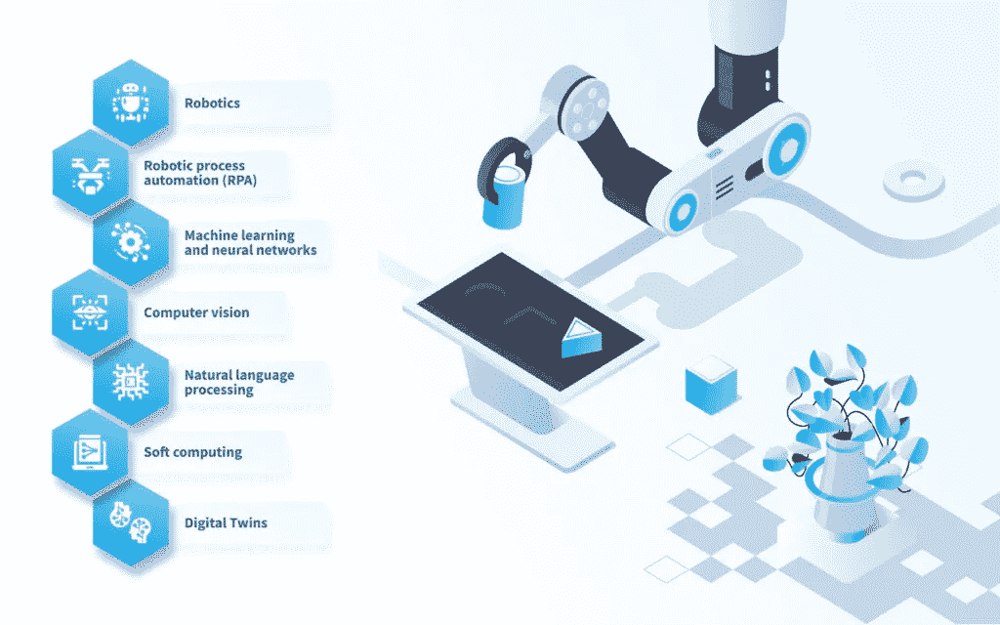

# 制造业中的人工智能:未来近在咫尺——尼克斯联合

> 原文：<https://medium.com/mlearning-ai/ai-in-manufacturing-industry-the-future-is-near-nix-united-4decb4e83e7b?source=collection_archive---------7----------------------->

人工智能是一个技术概念，它允许数字解决方案远远超出预定算法的执行。至于制造业的 AI，这个商业利基大多是标准化的，基于完全透明的逻辑。那么[人工智能开发服务](https://nix-united.com/services/ai-solutions-artificial-intelligence/)在这里如何发挥作用呢？下面我们来了解一下制造业市场的 AI。

# 人工智能是怎么进入制造业的？

直到最近，制造业的主要发展路线是使用端到端自动化系统。公司大规模实施基于强大的分布式计算设施的解决方案，控制整个生产周期。因此，生产和计算系统的集成确保了技术流程的灵活性和快速改变产品类型的可能性。然而，人工智能系统的快速发展为制造业的发展开辟了新的视野，并为建设全新水平的自动化系统创造了绝佳的机会。

例如，“非智能”解决方案根据给定的生产流程模型，在工作中使用预定义的业务逻辑和精确的计算。至于人工智能，这一概念使系统适应真实条件，即使在控制目标发生变化，以及受控对象的属性或环境参数出现不可预见的变化时，也能执行分配的任务。因此，制造业中的 AI 可以独立地改变控制算法，并在分析条件后寻找最优和有效的解决方案。

在形式上，我们可以区分智能系统与非智能系统的以下特征:

*   缺乏单一的预定义算法
*   受控系统及其参数的隐藏关系分析
*   处理来自不同来源的大量异构数据
*   基于未知输入数据的大样本做出决策

# 什么样的制造企业需要实施人工智能？

制造业中的人工智能可以应用于几乎所有业务领域和所有级别:

*   当设计以提高开发新产品的效率时，自动选择和评估供应商时，分析备件需求时。
*   在生产中改进业务流程并协调各种制造系统。在这种情况下，使用高度智能的解决方案有助于减少人为错误(人为因素)，简化生产流程，并在重建技术流程时减少停机时间。至于计算机视觉，这也是人工智能在制造业中的特殊用例之一(下面我们会讲到)，这样的解决方案可以分析员工和移动设备的动作，可视化评估零件的质量，分析设备的状态等。
*   在物流和供应链中改善运输路线的规划，减少原材料的交付时间，以及跟踪装运和交付过程的各个阶段。例如，在人工智能系统的帮助下，有可能在发货数量出现波动之前预测它们。
*   预测支持和维护服务的数量、定价管理以及分析客户对产品质量的满意度。

要了解更多关于人工智能在制造业中的应用，请阅读我们关于汽车中的 [AI 的文章。](https://nix-united.com/blog/ai-in-automotive-a-new-edge-of-the-automotive-industry/)

# 制造业中人工智能实施的 7 个最常见用例

制造业市场中的人工智能涵盖了许多更窄范围的智能技术。这包括机器学习、机器人机器、计算机视觉等。根据不同的目的，这些方法中的每一种都可以在生产中使用。让我们更详细地看看人工智能的用例。

制造业中使用的机器人专注于执行高度专业化的任务。虽然许多现代机器人可以在不实施这些复杂技术的情况下处理它们的任务，但人工智能的引入大大提高了自动化水平，使它们更加通用。因此，这种情况下的人工智能有助于降低生产成本，提高生产速度，并降低与人为因素相关的风险。

特别是，这种机器人今天已经在日本的一些工厂中用于材料的传送处理、组装零件和测试已经组装好的模型。

# 机器人过程自动化

人工智能辅助机器人化的另一个选择是流水线软件部署。这里我们讨论软件，它像机器人一样，自动化与在本地设备上实现工业软件相关的过程。

尽管这种技术概念不太适合制造业，但它在优化业务流程方面仍然很重要。例如，使用这种机器人消除了数据的不正确传输或泄漏，以及为企业的各个分支机构雇用当地专家的需要。

# 机器学习和神经网络

机器学习是一种人工智能技术，其中一种算法从训练数据中学习，以做出决策并识别真实收集数据中的模式。它可用于管道的优化。

作为人工智能在制造业中的一个例子，让我们考虑在熔炼金属时预测当前条件下的输出特性的情况。这个生产过程需要积累以前获得的数据。为了达到期望的质量，可能还需要确定合金的初始成分和熔化参数。这种情况下的机器学习提供了连续生产，允许公司降低原材料成本，优化元素组成，确保输出产品的质量，并更有效地管理冶炼过程。

这里也可以使用神经网络。使用人工“神经元”，它们在输入层接收输入数据。该输入被传递到隐藏层，隐藏层为输入分配一个权重，并将其发送到输出层。

因此，机器接受足够大量的输入数据集，每个数据集都与某些场景相关联。基于 ML 的机器发现输入信息中的模式，因此，在未来，它有机会预测某些事件的后果，评估各种假设场景，并在分析替代选项后做出最佳决策。

非智能系统和基于神经网络的系统之间的主要区别在于不需要手动输入处理规则。在处理了训练样本之后，这样的系统就成为了他们学科领域的数字专家。同时，这样的系统需要能够解决可能的矛盾、消除冗余和概括概念的严密知识控制的手段。这是需要操作员帮助的地方。

# 计算机视觉

计算机视觉是一套技术，它允许机器不将图像作为数据阵列来处理，而是以类似人类的方式来解释它们。计算机视觉在制造业中越来越受欢迎，允许公司自动化并显著改善需要视觉控制的过程。

作为使用案例之一，让我们考虑一个带有汽车零件的输送机，在产品质量控制过程中需要快速检测视觉缺陷。主要任务是使用深度学习对这些缺陷进行定位和分类，深度学习是一种机器学习技术，其中软件就像神经网络一样模拟人脑。在这种情况下，信息从一个级别转移到另一个级别以进行更准确的处理。训练这样的神经网络，需要现成的训练样本，训练样本的特点是输入数据的完整性和一致性。

因此，基于关于产品质量的一般想法，这样的人工智能解决方案一次又一次地生成适合缺陷分析的新输出数据。

你可以在这篇文章中找到更多关于人工智能在制造业和其他商业领域(如医疗保健、银行和零售)的信息。

# 自然语言处理

人工智能还可以用于自然语言处理(NLP)聊天机器人，以优化对企业员工请求的处理。这个概念位于机器学习和数学语言学的交叉点，旨在研究自然语言的分析和合成方法。

当正确实现时，企业员工可以使用这样的聊天机器人来报告问题、管理硬件和生成报告。因此，模仿人类语言，人工智能聊天机器人在经理，设备操作员和机器之间占据了一个中间环节，使他们的交流和互动更加高效和快速。

# 软计算

人工智能使公司能够减少设备正常运行时间，最大限度地减少过剩库存，预测设备的磨损，管理过剩废物，并通过环境意识解决能源浪费问题。

为了解决这些问题，专家经常实施基于软计算的解决方案，软计算是一套用于高度复杂任务的工具和方法，旨在处理不完整的信息，对于这些信息，没有严格的方法可以在可接受的时间内获得准确的结果。特别是，它们在传统的常规方法不能最佳解决的情况下工作良好。因此，软计算使得在制造业中找到非最优但足够好的解决方案成为可能。

# 数字双胞胎

大多数在制造业中使用机器学习和人工智能的公司迟早会面临数据缺乏的问题。因此，他们需要利用基于物理过程模拟的工程分析技术，用真实或虚拟实验的结果来补充现有的信息。同时，所创建的模型必须对应于实际的操作条件，并且不断地用关于操作对象的信息来更新。这就是数字双胞胎的作用。

digital twin 是一种复杂的动态模型，可在现有条件下以高精度实时再现设备和工艺操作的状态和参数。

由于不可能在一个工作模型上立即识别所有故障，因此有必要对假设条件进行正确建模，以从整体上预测和识别安全性和业务的最关键方面。因此，这种用例为使用基于历史和模拟数据的机器学习算法的操作员提供端到端的决策支持和建议。

你还可以在[网络安全](https://nix-united.com/blog/artificial-intelligence-in-cybersecurity-strengthening-the-defenses/)和[医疗保健](https://nix-united.com/blog/a-brief-guide-to-ai-in-healthcare/)中读到相关案例。

# 制造业中的人工智能挑战

制造业是一个成熟的商业领域，降低成本和流程优化是其重中之重。当然，人工智能为实现这些目标提供了新的机会，比许多其他数字概念更有效，但它也有缺点。

第一个挑战是实施和维护人工智能解决方案的成本相当高。一般来说，这需要几乎全部更换设备，当然这并不便宜。

在制造业中使用人工智能的另一个关键问题是错误的成本。特别是，机器的不正确操作或对情况的不正确评估会危及人的生命和健康。这就是为什么将人工智能引入企业必须是渐进的，需要行业专家的参与，这些专家同样精通其专业领域和用于实施人工智能解决方案的技术。通常，找到这样的人员是一项相当困难的任务，所以有时公司不得不从其他国家聘请专家。

下一个挑战是数据的数量和质量不足。与许多其他行业不同，历史数据很少存储在制造业中，也不用于分析，因此创建训练样本也需要大量的时间和金钱。因此，制造公司的全球数字化总是伴随着巨额投资，尤其是在重工业方面。

最后，另一个问题在于解决与多级流水线优化相关的常见问题，因为为了在几个独立的算法之间建立逻辑通信链，智能机器不仅会花费大量时间，而且还会出错。

# 人工智能在制造业中的前景

完全自主生产尚未到来。然而，人工智能系统可以成为操作员、技术人员和工程师的辅助过程控制解决方案，帮助他们做出更明智的决策，并最大限度地提高他们的生产率。

此外，人工智能通过对潜在故障和问题的早期预警，有助于减少设备停机时间。例如，发动机故障预测系统十次中有九次能准确检测出故障，使公司能够减少设备的停机时间和维护时间。

此外，远程监控和加快故障排除过程的能力提高了工作效率，而基于条件的维修优化了维护计划并增加了利润。

因此，人工智能确保了制造活动各方面工作流程的改进。

# 最后的想法

我们希望你现在对人工智能在制造业中的应用有更多的了解。

如你所见，制造业中的 AI 可以解决人因生理而无法应对的问题。这可能是在难以到达的地方，在化学生产中，在永久冻土条件下，或在高辐射水平下工作。第二，当人类的智能是主观的或者无法处理巨大的非结构化数据流时，例如，在预测严重故障、防止突然的设备故障、维护等方面，这样的解决方案是最佳的。因此，这种技术概念由于其准确性、高效性和窄焦点而在该行业中具有进一步发展的巨大前景。

如果您有兴趣在制造业中实施您基于人工智能的商业理念，请[联系我们](https://nix-united.com/blog/ai-in-manufacturing-between-human-and-robotic-era/#contact-us)。我们始终为合作伙伴提供最好的条件，并提供高质量的数字解决方案。

*原载于 2022 年 7 月 13 日*[*【https://nix-united.com】*](https://nix-united.com/blog/ai-in-manufacturing-between-human-and-robotic-era/)*。*

 [## Mlearning.ai 提交建议

### 如何成为 Mlearning.ai 上的作家

medium.com](/mlearning-ai/mlearning-ai-submission-suggestions-b51e2b130bfb)