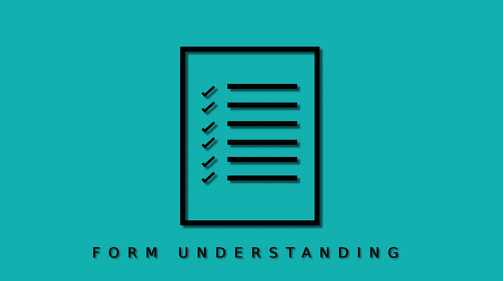
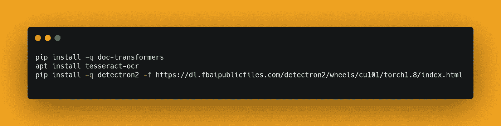
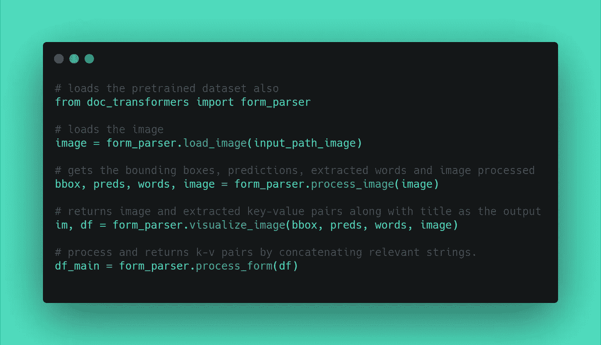
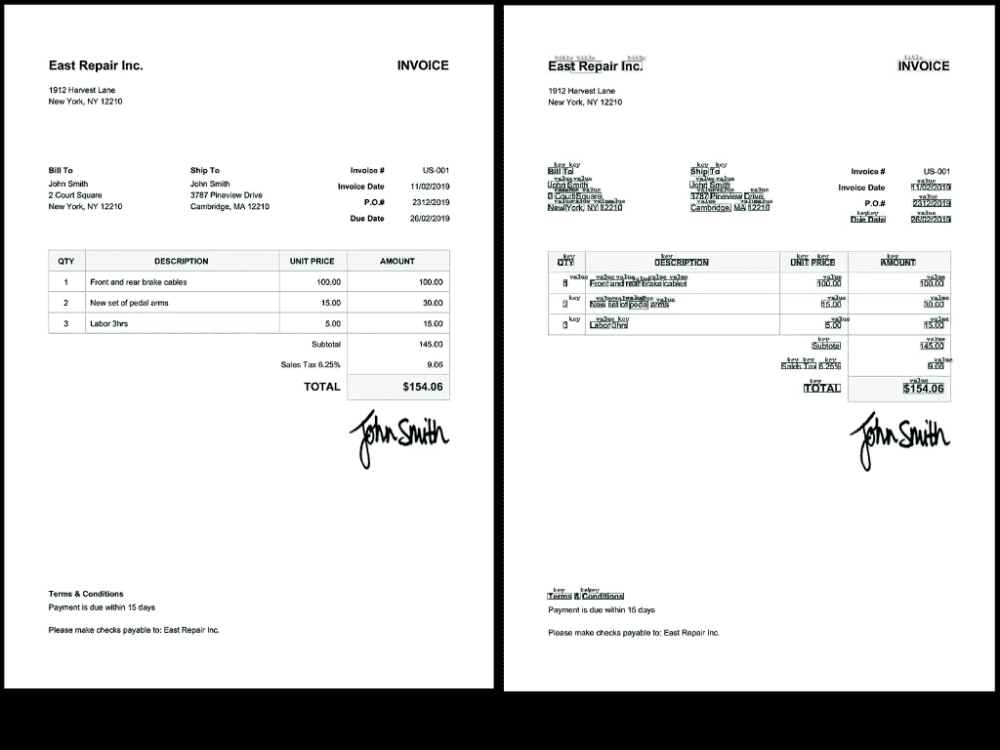
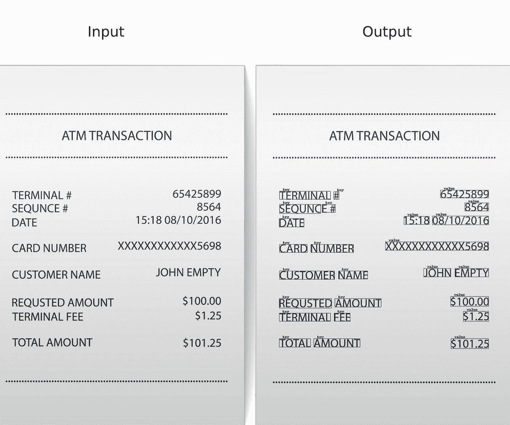
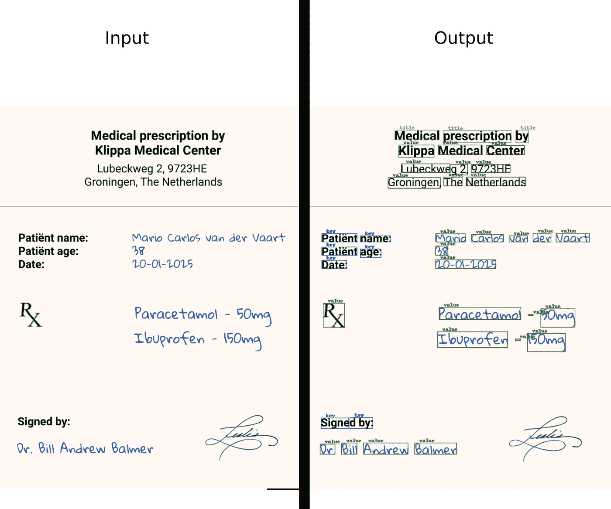

# 现实世界中的人工智能——形式理解

> 原文：<https://medium.com/mlearning-ai/ai-in-the-real-world-form-processing-c96912d80ef2?source=collection_archive---------1----------------------->

机器学习是通过学习如何有效地执行任何任务来使事情变得更容易，而不是改变每个参数的规则，人工智能将学会自己做事情。比我们在真实行动中看到的更完美的是，这就是为什么我计划了一系列迷你文章，试图引入人工智能可以并且已经极大提高性能的领域。第一个来自计算机视觉领域，CV 已经改进了许多部门的工作方式，从简单的图像处理到复杂的自动驾驶汽车，今天我们将看看它如何通过利用它的另一个姐妹 NLP 来优化形式理解。

# **动机**

不久前，人工智能世界的先驱之一 [HuggingFace](https://huggingface.co/) 发布了由[微软](https://huggingface.co/microsoft/layoutlmv2-base-uncased)开源的变形金刚版本 LayoutLM 模型。它在多模态框架中对文本、布局和图像使用预训练模型，在高层次上，该模型对文本对齐和匹配任务使用预训练方法。在此模型的上一版本中，它在训练、微调阶段使用了相同的技术，最新的 v2 版本在预训练阶段实现了相同的技术，即多模态框架的可视化嵌入。此外，该模型使用空间感知的自我注意机制，这有助于优化文本之间的关系提取。正如我们在高层次上看到的这个模型是如何工作的，我们可以跳到它是如何实现的。你可以在这里了解更多关于车型[的信息。](https://arxiv.org/abs/2012.14740)

# **实施**

如果你想亲自动手，按照你的意愿进行配置，你可以访问这个[链接](https://github.com/NielsRogge/Transformers-Tutorials/tree/master/LayoutLMv2)，HuggingFace 已经在实践中实现了 LayoutLM2 模型，或者如果你想为前面提到的实现获得一个简单的包装器，就直接跳到这个[简单的库](https://github.com/Vishnunkumar/doc_transformers)上，我已经创建了这个库，主要面向非开发人员。只需按照自述文件中的说明进行操作，就可以开始了。

## **安装所需的库**

## **执行下面的代码**

## **查看结果**

让我们尝试不同的场景

*   **发票:**

*   **自动柜员机收据:**

*   **医疗处方:**

最后，您可以下载键值对中的结果，例如，下面我给出了自动柜员机收据的结果

***双宾果！！！*** 正如我们在这里看到的，以一种可消耗的方式得到了可视化和结果。这就是这篇文章的全部内容，但是不要担心，我会确保在我们前进的过程中，我会想出更多吸引人的有趣的东西，在此之前，保重伙计们！！

等等，请在 [medium](https://nkumarvishnu5.medium.com/) 上关注我，你也可以到我的 git [repo](https://github.com/Vishnunkumar) 上寻找类似的概念，不要犹豫，在我的 [social](https://twitter.com/vishnun_uchiha) 上打开一个你想谈论的话题。谢谢你对我的支持，这是驱使我无条件这么做的动力。