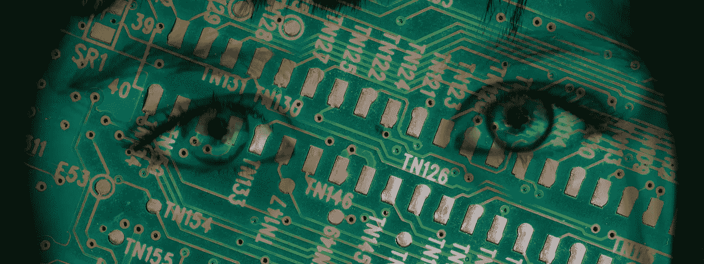

# AI 是 BS 的借口

> 原文：<https://medium.com/mlearning-ai/ai-is-an-excuse-for-bs-5662bc972dba?source=collection_archive---------6----------------------->

## 为什么人工智能会增加现有的问题

Photo illustration by yours truly, source credits: Photo by [Aleksey Popov](https://scop.io/collections/vendors?q=Aleksey+Popov) on [Scopio](https://scop.io/), Photo by [Yousaf Ayub](https://scop.io/collections/vendors?q=Yousaf+Ayub) on [Scopio](https://scop.io/)

我曾经在一座大办公楼里工作。有几个我确实不喜欢的人在大楼里工作。如果我在电梯里，看到其中一个混蛋急着去抓电梯，我会假装没注意到他们，让电梯门关上。如果那天晚些时候那些混蛋打电话给我，我会道歉，责怪…