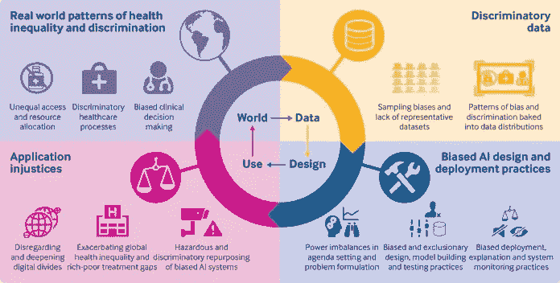
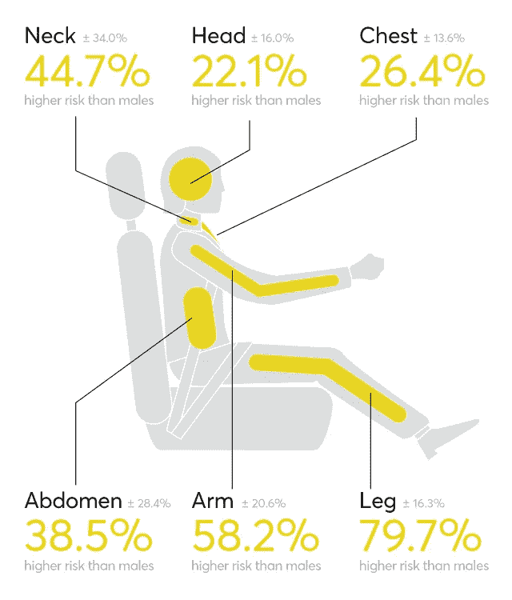

# 人工智能变得越来越好——在有偏见方面。

> 原文：<https://medium.com/mlearning-ai/ai-is-getting-better-and-better-at-being-biased-57800228cd3b?source=collection_archive---------2----------------------->

从历史上看，基于性别种姓的少数群体的价值观被系统地排除在外，甚至被记录在案，导致性别偏见或性别不可见的先验统计。

这个世界建立在数字不会错的理念之上；这些数据是客观的，只有在足够好的情况下才有用。此外，系统没有自己的良性思维。相反，他们根据提供给他们的信息编造一个解释。相反，他们根据给他们的数据编造一个理由。我们倾向于忘记这些代码是基于一个人自己的偏见、经历和态度。正如女权主义者、《看不见的女人》(Invisible Women)一书的作者卡洛琳·佩雷兹(Caroline Perez)所言，*“由于机器学习的工作方式，当你给它输入有偏见的数据时，它会变得越来越好——变得越来越有偏见***。”**

*因此，过去的数据是性别歧视的或不可见的，因为性别和基于种姓的少数群体已被排除在等式之外。随着人工智能变得越来越好，它将人类的尊严降低到一个数据点，这个数据点不关心我们最初试图用人工智能解决的问题。*

*数据科学家表示，人工智能主要通过两种方式延续性别偏见。一个是由算法和设计缺陷造成的，这些缺陷使得决策对特定性别、种族、宗教、地理位置或其他类型群体的人不公平。这可以从女权主义的角度看做是技术中的性别。另一个是通过投射技术性别的新数字产品强化性别陈规定型观念。*

**

***数据集出现偏差有很多原因。***

*一个**算法偏差** 未被注意到，却有着巨大的影响，可以改变一生。关于为什么人工智能系统让人们认为女性不如男性聪明，有很多理论。在人工智能中，这被称为内隐偏见。当编码者或设计者根据他们自己的刻板印象制作机器学习模型时，从一开始就使整个决策过程变得不公平。*

*取样和分析的其他阶段也会受到这一事实的影响。例如，**女性受重伤的几率比男性高 47%，死于车祸的几率比男性高 17%。因为大多数汽车座椅是为更高更重的男性制造的，直到最近，只有男性假人被用于碰撞测试。当男人为男人的身体制造汽车时，女人，甚至青少年、残疾人、肥胖和老人都没有被考虑在内。***

***女性受伤风险增加***

**

*Source: NHTSA Injury Vulnerability and Effectiveness of Occupant Protection Technologies for Older Occupants and Women*

*另一个常见的解释是训练数据集中的**覆盖偏差**。它通常是不完整的，或者它没有以应有的方式显示总体情况。这就是算法经常出错的原因。*

**2015 年的一项药物研究旨在了解酒精如何影响氟班色林，也被称为“女性伟哥”，有 23 名男性参与者，只有两名女性参与者。绝经前的女性应该服用这种药物来增强她们的性欲。Addyi 是 FDA 同年批准的一种药物的商标名。它现在以那个名字出售。**

*因此，人工智能系统也可能显示不同人群之间的数字鸿沟。大多数时候，用于训练算法的历史数据并不包含人们过去如何做事，这可能会使历史上处于弱势的群体不太可能获得工作或其他机会。2018 年有报道称，亚马逊的招聘实践向女性倾斜，因为过去 10 年的招聘数据大多是技术岗位的男性。这是这种偏见的一个众所周知的例子。研究表明，使用“女子象棋队”和“女子学院”等词汇的候选人，不管他们有多合格，都被算法排在了后面。当算法公开后，公司不得不解散制造它的小组。*

*此外，**确认偏差**会让算法难以处理。这是当一个研究人员只看或解释与他自己的想法一致的数据时，阻止他看其他的可能性和问题。数据不是以随机的方式从目标群体中的每个人那里收集的，这种方式会导致最一般化的结果。当涉及到不同人口群体的不同参与率和辍学率时，如果不考虑群体，就会出现参与偏差。除了上面提到的数据中的缺陷，大数据中可能还有另一种人们没有注意到的歧视:“离群值”在决策的情况下，离群者可能是少数人或没有被很好代表的群体。*

*人工智能系统的广泛使用使得指出一种歧视性算法变得很重要，这种算法因为人们的年龄、种族、pin 码或其他因素而不喜欢他们，这种算法正在伤害他们平等的人权，最终可能会重复过去的错误。一个有毒的技术环境假设它的用户是单种族的，健全的，和非正常的，这是不正确的。这是因为，随着我们对许多不同类型的性别和性的了解越来越多，这些不太知名的群体更有可能被系统本身贴上非典型的标签。*

***想法的三角测量***

*到 2030 年，人工智能将对医疗保健、汽车和金融领域产生最大的影响，这意味着这些行业最有改善和积极变化的空间。有了更个性化的解决方案，创造者也将把许多速度较慢的竞争对手挤出市场。这是因为他们会更善于倾听人们想要什么。大数据对于人类和机器之间关系的未来仍然非常重要。*

*对这样一个霸权行业的管理将是未来的头痛问题。它引起了人们对数字人权、隐私和不受歧视权的关注，预计这一领域在不久的将来会难以控制地提出所有这些问题。除非以独特的方式处理这一问题，否则世界各地几波女权运动、民权运动、少数群体权利和 LGBTQ+权利运动所取得的进展在不久的将来可能会面临风险。*

*为了确保人工智能没有偏见，人们需要三种不同的方式来做到这一点。解决这个问题的一个简单方法是保留按性别划分的数据。文化:人们不会考虑女性数据的必要性，因为“人类”几乎总是指一个男人，所以他们不会考虑这个问题。“男性违约”问题是女性每天面临的许多濒死风险的罪魁祸首。在游戏的最开始，我们需要确保我们的数据是交叉的和分类的。这意味着我们需要在我们的创造者中寻找性别和种族的多样性。*

*理解人工智能及其影响的很大一部分是能够理解人工智能系统是如何工作的，它根据数据做出决定。人工神经网络和深度学习工具正在被企业用来解决黑盒人工智能问题。这是连程序员都搞不清楚机器是如何导致某个结果的时候。直到发现一些错误或不寻常的事情，它才被注意到。*

*据说人工神经网络类似于人类大脑中的神经网络。据说判断是通过识别过去的模式和例子做出的，这一点仍然不清楚。面对不确定性和伦理问题，更简单、更容易解释的人工智能应该受到青睐。它可能不如更先进的 AI 模型，但这可以解释，因为它是道德的。*

*技术人种学家 Tricia Wang 提出了另一种解决问题的方法。她说厚数据要和大数据一起用。随着大数据的增长，王称之为“**量化偏差**”。这是一种自然的倾向，即重视那些看得见、衡量得了的东西，而不是看不见、衡量不了的东西。数据通过采取非常片面的、实证主义的方法限制了我们对世界的看法。她证明了将人类最优秀的智慧与定性和行为洞察相结合对于获得更完整的图像至关重要。*

*Cathy O'neil 在她广受欢迎的 ted 演讲中进一步阐明，*“你需要两样东西来设计一个算法——过去的数据和成功的定义”*。根据她的说法，定期检查之前数据的完整性和成功的定义以确保其公平，可以显著减少现有偏见的传播。这就引出了一个问题:谁在回答这些问题？他们在问什么问题？谁在设计这些新系统？决定使用什么数据来训练产品的人——他们是否遵守人工智能道德和性别平等的规则？他们在乎吗？*

*在这里看凯茜的 TED 演讲:【https://www.youtube.com/watch?v=_2u_eHHzRto *

*自动化系统不应该让我们的世界处于危险之中，而是需要被制造和训练来尊重和承认我们世界的多样性。在全球范围内，STEM 和数字技能教育生态系统由男性主导，这导致技术产品中严重缺乏少数群体。通过这种基于性别的调查过程，更加清楚地表明，女权主义观点对于确保每个人都受到平等对待非常重要。已经存在了几百年的家长制不能被允许通过男人制造的技术以潜在的形式出现。在进行和管理未来的、数据驱动的创新时，迫切需要更多的女性参与进来。这意味着表现不仅仅是技术或道德的问题，也是个人和政治的问题。*

* [## Mlearning.ai 提交建议

### 如何成为 Mlearning.ai 上的作家

medium.com](/mlearning-ai/mlearning-ai-submission-suggestions-b51e2b130bfb)*