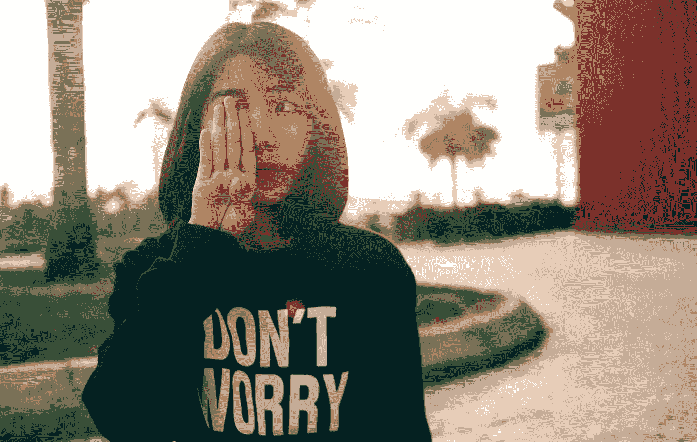

# 艾让艺术家成为帮凶

> 原文：<https://medium.com/mlearning-ai/ai-makes-artists-accomplices-c407722eb76e?source=collection_archive---------3----------------------->

## **AI-数字艺术的力量**

## 在艺术上缺乏情感经验

Photo by [Pham Khoai](https://www.pexels.com/@khoaiphm?utm_content=attributionCopyText&utm_medium=referral&utm_source=pexels) from [Pexels](https://www.pexels.com/photo/woman-covering-her-right-eye-using-her-right-hand-during-daytime-89643/?utm_content=attributionCopyText&utm_medium=referral&utm_source=pexels)

人工智能技术的发展对我们的日常生活产生了重大影响，为我们提供了更多的便利和时间。这种变化最显著的副作用之一是艺术生产的增长——从绘画到视频剪辑[再到 NFTs](/mlearning-ai/how-to-start-nfts-with-1-or-less-11a5a9079e7e) 。当我们享受这些发展时…