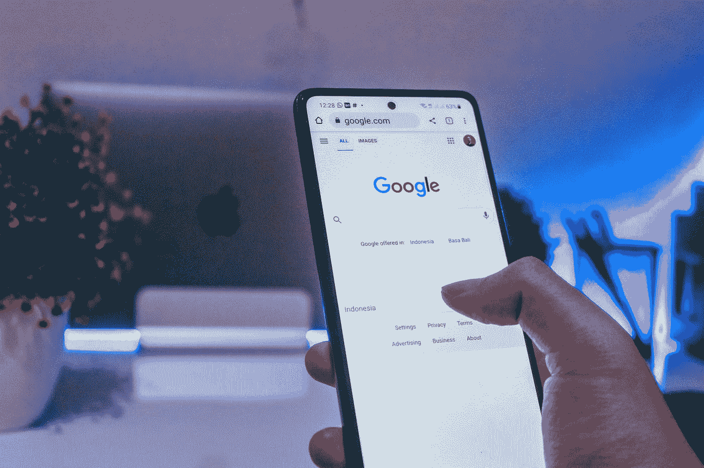

# 这周看的 AI/ML 博客和文章。#第 2 周

> 原文：<https://medium.com/mlearning-ai/ai-ml-blogs-and-articles-that-i-read-this-week-week2-746a50e7aa65?source=collection_archive---------6----------------------->

机器学习和人工智能令人兴奋，是人类发展最快的领域之一。在这个领域，事情发展得很快，每天都有可能影响我们未来的新的创新研究发布。在这篇文章中，我分享了一些我本周读到的很棒的博客和文章。

[**1)OpenAI 开源耳语多语种语音识别系统**](https://techcrunch.com/2022/09/21/openai-open-sources-whisper-a-multilingual-speech-recognition-system/)

Photo by [Jr Korpa](https://unsplash.com/@jrkorpa?utm_source=medium&utm_medium=referral) on [Unsplash](https://unsplash.com?utm_source=medium&utm_medium=referral)

这篇文章描述了 Open AI 推出的一个令人印象深刻的自动语音识别模型“Whisper”。Whisper 是一个开源的语音识别系统，经过 680，000 小时的多语言和多任务数据的训练，这些数据是从网络上收集的。Whisper 允许多种语言的转录。这个健壮的模型还支持将各种语言翻译成英语。这篇文章解释了 OpenAI 的模型与各种组织的其他高性能模型的不同之处在于使用了一个大型的多样化数据集。使用这样的数据集提高了对多种口音的识别，消除了背景噪音和技术语言。本文还描述了该模型的一些局限性。Whisper 此时无法立即执行实时文本转录。此外，由于该模型有时在嘈杂的数据集上被训练，所以该模型可以包括来自音频的在转录中没有说出的单词。该模型在某些语言中仍然表现不佳。

在这篇文章之后，我在 OpenAI 的博客中发现了更多关于 Whisper 的内容。你可以在这里找到。博客提到 Whisper 使用了一种高效的方法来进行语音到文本的翻译。Whispers 音频数据集的三分之一是非英语的，这可以有效地用于一些语言的转录或翻译成英语。博客更详细地解释了这个模型的架构。博客上还展示了该模型的一些例子。示例的结果相当令人印象深刻，并且表明尽管该模型有一些限制，但是 Whisper 仍然是一种有效的语音识别模型，由于其准确性和易用性，它可以用于各种应用中。

[**2)团队开发了更公平的排名系统，使搜索结果多样化**](https://techxplore.com/news/2022-09-team-fairer-diversifies-results.html)

Photo by [Arkan Perdana](https://unsplash.com/@arkanperdana?utm_source=medium&utm_medium=referral) on [Unsplash](https://unsplash.com?utm_source=medium&utm_medium=referral)

我们知道推荐系统会根据用户的个人资料和偏好向用户提供建议。搜索引擎根据用户输入的查询对网页和其他项目进行排名。在这两者中，项目的排序都是至关重要的。我们还知道，排名越高的项目越能得到用户的关注。这篇文章描述了康奈尔大学研究团队的有趣研究，他们创造了一个更公平的排名系统。文章提到，这些研究人员创建了这个排名系统，目的是在所有搜索推荐中公平地分配用户的注意力，以便只有少数热门搜索不会获得所有曝光。为了实现这一点，这些研究人员使用了经济学中的公平分配原则来开发这一系统。公平分配问题是关于在几个有权拥有资源的人之间公平分配资源。研究人员还指出了这种类型的推荐系统可以有所帮助的一些例子。其中一名研究人员举了一个例子，说明这个推荐系统如何让 YouTube 受益。他提到，如果这个系统在 YouTube 上使用，它将通过向用户提供各种视频推荐来满足用户。这也将是公平的各种视频创作者，因为它将允许他们赚取。本文还提到了其他一些例子，包括在线雇佣系统和为用户提供的各种电影推荐。你也可以在这里阅读研究论文[。这些年来，推荐系统已经变得越来越流行，并且如果这种系统被用于实时应用中，它们可能会显著地影响用户和服务提供商。](https://dl.acm.org/doi/10.1145/3534678.3539353)

**3)**[从地形语义中学习野外行走](http://ai.googleblog.com/2022/09/learning-to-walk-in-wild-from-terrain.html)

Photo by [Possessed Photography](https://unsplash.com/@possessedphotography?utm_source=medium&utm_medium=referral) on [Unsplash](https://unsplash.com?utm_source=medium&utm_medium=referral)

四足机器人是稳定运动和穿越人类无法到达的复杂环境的最佳机器人之一。这篇谷歌博客谈到了谷歌研究人员开发的一个创新框架，以提高机器人在这种环境中的操作能力。该博客(由一名研究人员撰写)提到，机器人需要对环境及其运动挑战有很好的理解才能实现这一点。最近的大多数研究集中在提高四足机器人在室内和城市环境中的能力。在这些方法中，机器人主要关注地形形状。这种机器人可能无法在复杂的越野地形中有效工作。本博客介绍了一个分层学习框架，该框架侧重于环境语义，如地形类型和接触属性(如摩擦)，这在越野地形中很有帮助。博客提到，当机器人开始行走时，框架根据它感知的环境语义决定机器人的移动技能。该框架允许机器人在各种越野地形中高效地执行任务。这种框架的局限性之一是，它需要手动转向命令来完成其路径并达到其目标。另一个限制是框架不支持敏捷行为。然而，我相信有了这样的创新；将来，我们可能很快就会有能够做奇妙活动来帮助人类的机器人。你可以在博客中找到关于框架和实验结果的更多细节。

[**4)X 射线、人工智能和 3D 打印让失落的梵高艺术品重获生机**](https://techxplore.com/news/2022-09-x-rays-ai-3d-lost-van.html)

Photo by [Ståle Grut](https://unsplash.com/@stalebg?utm_source=medium&utm_medium=referral) on [Unsplash](https://unsplash.com?utm_source=medium&utm_medium=referral)

这篇文章揭示了利用人工智能再造绘画的创新研究。你可能听说过著名的荷兰画家梵高。你可能也看过他的一些名画。你知道一些研究者最近重现了他丢失的艺术品吗？来自伦敦大学学院的两名研究人员使用 X 射线、人工智能和 3D 打印技术重现了这件遗失的艺术品。文章描述说，研究人员能够重现一幅隐藏的“两个摔跤手”的画作。据说梵高把这幅画的画布重新利用，画了一幅花的画。据说梵高在给他哥哥的一封信中提到了他的《两个摔跤手》的画作。使用 X 射线来找回丢失的画作并不新鲜。然而，这些研究人员开发了一系列算法来恢复这幅画，并赋予它生命。这些算法使用 X 射线透视画作，识别边缘并创建图形，使用人工智能预测梵高的绘画风格，使用 3d 打印生成最终的艺术作品。该团队还使用类似的技术重现了其他丢失的画作。研究人员还提到，仍然不可能说重建的艺术品与原画有多相似，因为这种信息不存在。我相信，尽管如此，这项研究可以被视为艺术领域的一项重大技术进步。

我希望你喜欢读这篇文章。

如果你觉得这篇文章有趣，请看看我的其他文章。如果你想在我发表新文章时得到通知，你也可以**订阅。**

你也可以在 [LinkedIn 上关注我。](https://linkedin.com/comm/mynetwork/discovery-see-all?usecase=PEOPLE_FOLLOWS&followMember=shruti-gaikwad)

任何想法或建议，不胜感激。

谢谢你。

 [## Mlearning.ai 提交建议

### 如何成为 Mlearning.ai 上的作家

medium.com](/mlearning-ai/mlearning-ai-submission-suggestions-b51e2b130bfb)