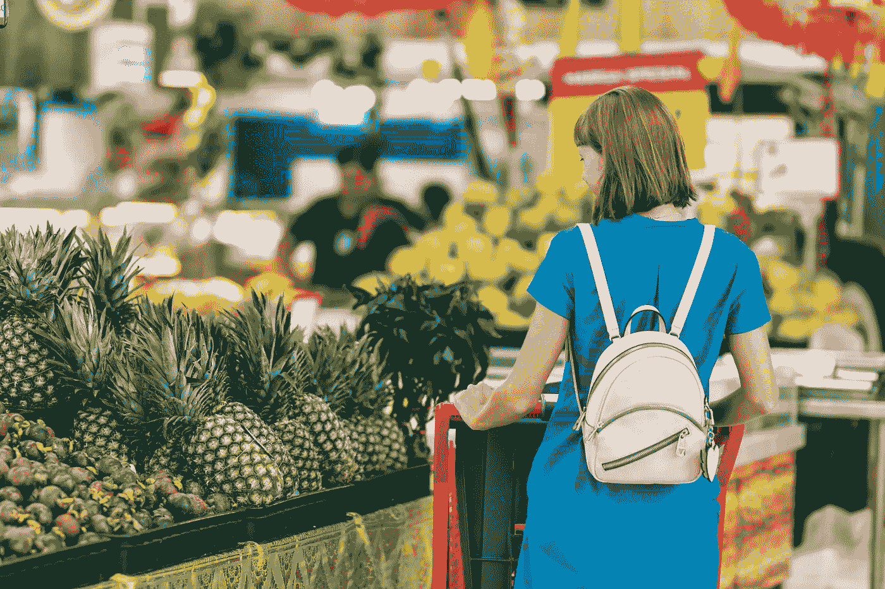

# 人工智能驱动的(免结账)零售

> 原文：<https://medium.com/mlearning-ai/ai-powered-checkout-free-retail-ff13788a989?source=collection_archive---------5----------------------->

## 真实世界人工智能

## 人工智能如何改变购物的未来

Photo by [Artem Beliaikin](https://www.pexels.com/@belart84?utm_content=attributionCopyText&utm_medium=referral&utm_source=pexels) from [Pexels](https://www.pexels.com/photo/woman-standing-beside-pineapple-fruits-2292919/?utm_content=attributionCopyText&utm_medium=referral&utm_source=pexels)

人工智能(AI)正在帮助为我们的许多日常任务提供更好的解决方案(T3)，去当地的杂货店逛逛也不例外。

随着计算机视觉、深度学习、传感器融合技术、计算机处理能力和云计算的最新进展，**免结账零售店**现在已经成为现实。

在本文中，我们探索了 *AI 在现实世界*中令人兴奋的应用。

# 什么是免结账零售？

想象一下去你当地的杂货店。你走进去，快速浏览了一下你的手机，然后走来走去拿你需要的东西。

你从货架上拿了几样东西。然后你改变主意，退回一两件商品。之后，你可以在商店里自由走动，以确保你有你需要的一切。

当你完成后，你只需走向出口，然后*直接走出商店*。

你买的东西——你拿起的那些，但不是你放回货架的那些——会通过一个手机应用程序被详细记录并记入你的账户。

您刚刚体验了**免结账购物**！

如果它还不在你的附近，那么它可能很快就要来了。

# 给客户和供应商带来的好处

如果技术可行，免结账购物对顾客有明显的吸引力——轻松、快捷、方便和免接触。

对于供应商来说,也有显著的优势，包括:

*   **实时库存更新**，因为所有产品采购都被持续跟踪
*   **详细分析**，给出收集到的丰富数据
*   更好地利用商店空间，因为不需要庞大的人工操作结账设备
*   **降低运营成本**，因为不需要专门的收银员

供应商的许多优势也可以改善客户体验。

例如，更低的运营成本可以带来*更低的产品价格*，以前受雇于收银台的员工可以转向更多的*增值职能*，如客户协助。

# 亚马逊 Go 和 Zippin

免结账购物听起来很神奇，但这并不是全新的。它已经存在了几年，足迹不断增长，尤其是该领域的两个领导者: [Amazon Go](https://www.amazon.com/b/ref=s9_acss_bw_cg_agojwo_1a1_w?node=20931384011&pf_rd_m=ATVPDKIKX0DER&pf_rd_s=merchandised-search-2&pf_rd_r=T7S7YKXX5KB8XBKSX380&pf_rd_t=101&pf_rd_p=21afee40-195f-4f61-a605-d0666e13ddb8&pf_rd_i=16008589011) 和 [Zippin](https://www.getzippin.com/) 。

Amazon Go 在 2016 年开设了第一家 *beta* 商店，只对员工开放，自 2018 年 1 月以来已经有*家公共商店*开业。

Zippin 较新，在 2018 年 8 月首次展示了其技术，但现在在许多国家和场所运营。

Amazon Go 将其免结账体验称为“*走出去*”技术，而 Zippin 更喜欢将其称为“*免结账*”。

Amazon Go 和 Zippin 使用的基本*技术框架*是相似的，尽管它们的商业模式不同——Amazon Go 经营*亚马逊拥有和经营的商店*而 Zippin 将其技术出售给*希望使用该技术的第三方运营商*。Zippin 不拥有和经营自己的商店。

Zippin 的技术还被用于零售环境*而不是*杂货店——例如娱乐和运动场所、公司校园，甚至是店中店。

# Amazon Go 和 Zippin 如何实现免结账技术

前面描述的简单的杂货店访问是免结账技术的核心部分——顾客访问一家商店，拿起几件商品，然后走出商店而不结账。

他们选择的所有商品都应该通过手机应用程序正确识别和计费。

虽然这个过程在概念上听起来很简单，但在实践中实现却极其困难。

# 免结账实施的挑战

实施免结账技术的实际挑战是多种多样的。我们来考虑几个:

## 识别客户

**当顾客走进免结账商店时，需要识别他们的身份**，当他们走动时，需要跟踪*，并正确地将*与他们挑选的商品*联系起来。*

由于*隐私问题*生物识别应该被避免，然而每个顾客需要被*唯一地*追踪。

那么**人群**呢？

当很多顾客同时在店里时，他们不应该相互混淆，他们挑选的商品也不应该被错误分配。

有时，两个或更多的顾客可能会用一个*共享账户*——比如家庭成员——进入商店，每个人都可以挑选他们*自己的*产品。在这些情况下，所有选择的产品都应该*与单个共享账户*相关联。

## 识别所选产品，说明所选产品的数量，并排除退回的产品

待售产品的**种类、形状、尺寸和颜色**及其包装*巨大*，然而所有选定的产品都需要*正确识别*。

有些产品可能会被取走，但随后*会将*放回货架上(如果顾客改变主意)——这些*不应该收费*。

有时，顾客拿起一件商品，*把它交给*给其他人——这项技术不应该混淆*该商品属于哪个账户*。

类似地，产品可能被拿起，然后放入袋子、手推车或购物车。同样，这项技术需要*正确考虑所选产品*，而不管它们在商店里是如何被携带的。

还有许多其他场景涉及到顾客选择、摆放以及产品在商店内的移动，技术需要成功地管理尽可能多的这些场景。

## 传感器的类型、位置和数量

在我们已经描述过的复杂的*真实世界场景*中，哪种**类型的传感器**最适合识别客户和产品？

*摄像机*是一个显而易见的选择，但是*它们应该放在哪里*以及*应该有多少个*？

摄像机也很容易被*遮挡*，或者*可能没有捕获足够的图像数据*用于正确识别。

需要一些*额外的*类型的传感器来为各种可能的用户场景提供更加*完整的感官描述*。

但是，当不同类型的传感器设备一起使用时，另一个挑战是协调它们的传感数据— *传感器融合* —以便针对任何给定的客户或产品交互进行*对齐*。

## 计算和网络要求

该系统的核心是**尖端的人工智能算法**，它将所有的感官数据汇集在一起。这需要一个足够强大的*计算和网络解决方案*。

但是不同的计算任务应该在哪里执行呢——本地执行还是远程执行呢？*带宽*要求是什么？所需的计算*硬件和软件*组件类型有哪些？

# 实施解决方案

显然，成功设计和部署免结账技术解决方案是一项令人生畏的任务，然而 Amazon Go 和 Zippin 已经在这样做了。

他们是怎么做到的？

通过*屡试不爽的*，精心设计的*最新 AI 和深度学习算法的组合*、*多功能硬件、*和*实用店面布局*。

虽然他们的实现有些不同，但 Amazon Go 和 Zippin 都采用了类似于 T21 的方法。

在 Zippin 的案例中，实施方法的*关键要素*如下(详见其描述性[白皮书](https://www.getzippin.com/the-future-of-retail-is-checkout-free)【1】):

*   **高架摄像机和货架上重量检测传感器的组合**
*   用于视觉识别任务的高级**深度学习算法**
*   现场计算的图像处理**和云中计算的传感器融合分析**
*   备份 24×7 **监控**
*   个人手机**基于应用的账户管理**

使用这一框架，Zippin 已经解决了上述大部分挑战，并成功地将其技术部署到*各种用例*中。

Zippin 现在用于大型*零售商*、小型*便利店*、*体育场*(萨克拉门托国王黄金 1 号中心和丹佛野马爱玛客)*企业园区*(东京富士通员工便利店)*店内店*(俄罗斯 Azbuka Vkusa 商店的特殊“店内店”通道)。

Amazon Go 也在增长，截至 2021 年初，它在美国有 27 家商店，在英国有 3 家。

***Introduction to Amazon Go***

# 实施解决方案如何应对挑战

上述实施方法*以多种方式应对了免结账环境的挑战*—让我们来看一些:

**头顶摄像头**，附着在商店天花板上，可以*放置在整个商店*和*避免面部识别*。这有助于缓解隐私问题，同时头顶位置允许*不受阻碍地跟踪整个商店的顾客*。

顾客*不是通过生物统计学*识别的，而是作为*像素化的物体*(基于*头顶*视图)可以被*唯一跟踪*。

单个顾客在店内走动时，会被从*摄像机移交到*摄像机。

将摄像头与**货架上的重量检测传感器**相结合，可以改善*产品识别*并帮助*识别产品退货*。

这一点很重要，因为光是视觉数据*不足以*涵盖摄像机的*视线模糊的情况*或者难以检测到*多个产品*正在被处理的情况。通过将视觉数据与重量检测传感器相结合，可以更加确定地识别这些情况。

**通过在*现场*和*云*之间分离计算任务**，可以处理更有效的*计算平衡*。现场计算*减少了云所需的带宽*，并提供即时结果。

**备份监控**可以帮助*纠正问题*并为复杂的技术故障提供(远程)人工协助。

通过**移动应用**管理每个顾客的账户细节和购买允许*可移植性和共享*——例如，如果一个家庭团体进入一家商店，进入商店的每个家庭成员将被*扫描到同一个账户*，所有家庭成员挑选的产品可以*记录到同一个账户。*

总的来说，该解决方案旨在提供*积极和多样化的体验*。

当这个概念在 2019 年初还是相当新的时候，[福布斯](https://www.forbes.com)撰稿人[安德里亚·程](https://www.forbes.com/sites/andriacheng/)参观了旧金山的一家亚马逊 Go 商店[亲自体验这项技术](https://www.forbes.com/sites/andriacheng/2019/01/13/why-amazon-go-may-soon-change-the-way-we-want-to-shop/?sh=70193afa6709)【2】。她的布置给她留下了深刻的印象。

在程参观期间，店里有许多兴奋的顾客。他们*参与*这项技术，并有类似于“*如果你把东西放回错误的货架会怎样？*、*对于一个带着家人走进来的爸爸，系统是如何运作的？*”。

正如我们所描述的，该系统可以*处理这些情况*，亚马逊 Go 的店内代表很乐意在当天解释这一点。

# 概括起来

*   **免结账购物**是由*先进的人工智能*、*计算机处理、*和*传感器融合*技术推动的一种日益增长的零售趋势
*   对于顾客来说，免结账购物**快捷方便**，同时为零售商提供**更低的运营成本**和**更好的数据**监控
*   **Amazon Go** 和 **Zippin** 是免结账技术领域的两个领导者，亚马逊经营自己的*T21 商店，Zippin 为其他零售商的商店提供*装修服务*——随着更多的商店成功推出，两家公司都享受着*增长的足迹**
*   实施免结账解决方案的**挑战**包括*客户和产品识别*、*跟踪店铺内的*活动、*传感器的选择和放置、*以及用于*计算和处理的充足系统*
*   Amazon Go 和 Zippin 采用了类似的实现方法，包括*天花板安装的摄像头*结合*重量检测上架传感器*、*高级人工智能*系统(深度学习计算机视觉和传感器融合数据)、*分布式计算*网络，以及以客户为中心的*移动应用*

**参考文献**

[1] Zippin 白皮书，*免结账购物:零售业的未来已经到来*，下载自:[https://www . getzippin . com/The-Future-of-Retail-is-check-Free，](https://www.getzippin.com/the-future-of-retail-is-checkout-free,)2021 年 5 月。

[2] Andria Cheng，*为什么 Amazon Go 可能很快改变我们的购物方式*，福布斯(在线)，2019 年 1 月。

*最初发表于 2021 年 5 月 9 日*[*https://highdemandskills.com*](https://highdemandskills.com/ai-application-amazongo-zippin/)*。*

 [## 最近的帖子- HDS

### 直觉及其在人工智能中的应用

highdemandskills.com](https://highdemandskills.com/blog/)