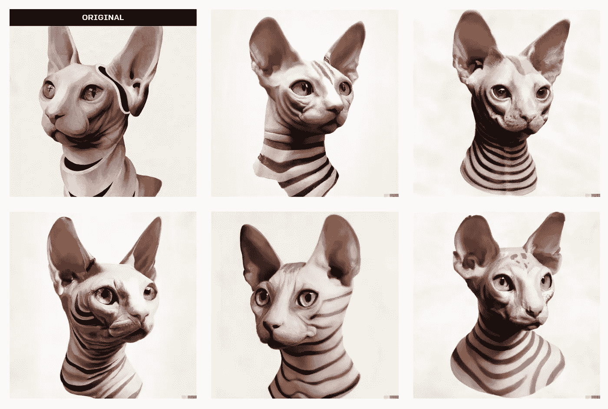

# 人工智能在不到 20 秒的时间内重建了我的绘画——看看结果

> 原文：<https://medium.com/mlearning-ai/ai-recreate-my-paintings-in-under-20-seconds-see-the-results-4be9652566bd?source=collection_archive---------1----------------------->

Image by [Author](/@jimclydemonge)

[Dall-E2](https://labs.openai.com/) 在从文字描述中生成超现实主义绘画方面确实不错。毫无疑问。

但它还有另一个令人印象深刻的功能:对现有图像进行变形。

看看这个来自他们[官网](https://openai.com/dall-e-2/)的例子。