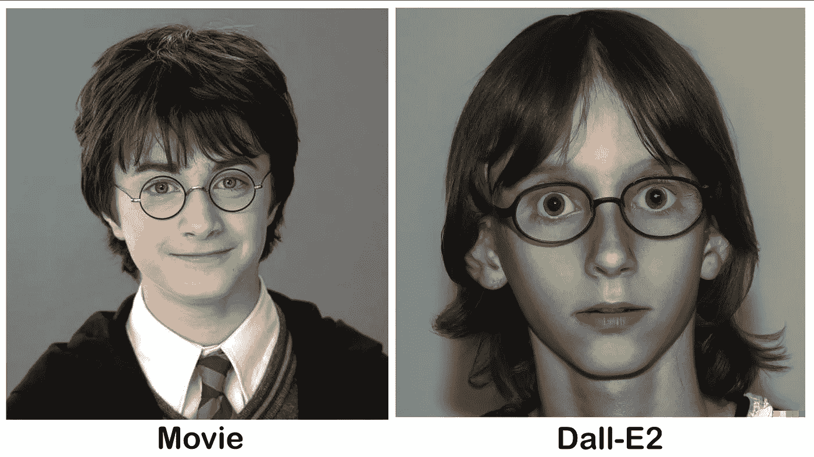

# 人工智能根据书籍描述重新想象 5 个哈利波特角色

> 原文：<https://medium.com/mlearning-ai/ai-reimagines-10-harry-potter-characters-based-on-book-descriptions-3e6b312720a7?source=collection_archive---------0----------------------->

Side-by-side comparison of Harry from the movie and Dall-e2

OpenAI 的 Dall-E2 在过去的几个月里席卷了互联网。

人工智能具有强大的功能，从生成带有文本描述的图像，修补，到对现有图像进行修改。

今天，我想把它令人印象深刻的能力，从文字描述制作超现实的肖像图像…