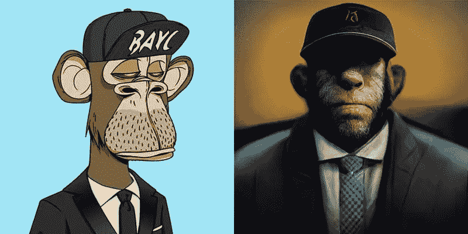

# AI 重新想象现实中无聊的猿类

> 原文：<https://medium.com/mlearning-ai/ai-reimagines-bored-apes-in-reality-5946601adfbd?source=collection_archive---------1----------------------->

Bored Ape #3562

我认为这将是一个有趣的实验，重新想象一些无聊的猿类在现实的*虚幻的引擎*风格中的样子。所以我使用了 [Midjourney](https://www.midjourney.com/home/) (MJ)，一个人工智能驱动的艺术生成器来创建一些效果图。

如果你不熟悉[无聊猿游艇俱乐部](https://boredapeyachtclub.com/)，它是迄今为止最受欢迎的 NFT 项目之一。一个从 web 3 崛起的互联网本土品牌。