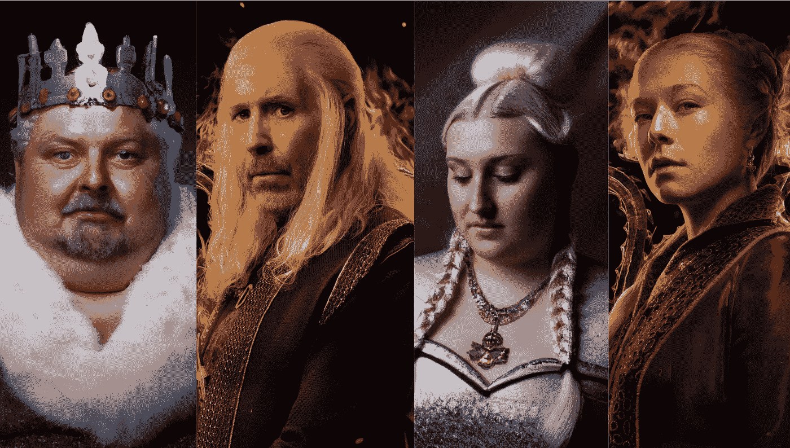

# 艾根据书籍描述重新想象龙屋的角色

> 原文：<https://medium.com/mlearning-ai/ai-reimagines-house-of-the-dragon-characters-based-on-book-descriptions-70350297ed08?source=collection_archive---------0----------------------->

Image by [Jim Clyde Monge](https://medium.com/u/819323b399ac?source=post_page-----70350297ed08--------------------------------)

如今，互联网上到处都是龙之家。*HBO Max 出品的热门电视剧《T4》的前传《权力的游戏》获得了流媒体服务历史上最受关注的首播。*

*故事根据乔治·r·r·马丁的*火&血*改编，详细描述了坦格利安家族的历史。而电视里的历史细节…*