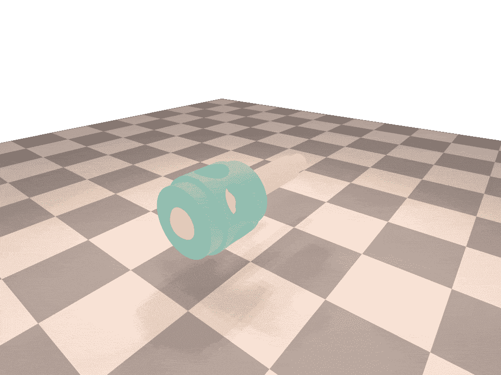

# 人工智能在几分钟内解决 80 个零件的装配

> 原文：<https://medium.com/mlearning-ai/ai-solves-80-part-assembly-in-minutes-b63c3d5edcb9?source=collection_archive---------4----------------------->

## [机器学习艺术](https://mlearning.substack.com)

## 装配任务的新 ML 算法| [代码+数据集](#57a1)

[Machine Learning Monetizing with DEMO Ready to Use](https://open.substack.com/pub/evartology/p/-leverage-your-creative-work-with?r=9hp4d&utm_campaign=post&utm_medium=web)

车辆、家具和电气设备只是日常用品的几个例子，这些日常用品可能由成千上万个单独的部件组成。CAD 软件用于创建每个组件，然后在一步一步的过程中进行数字化组装。