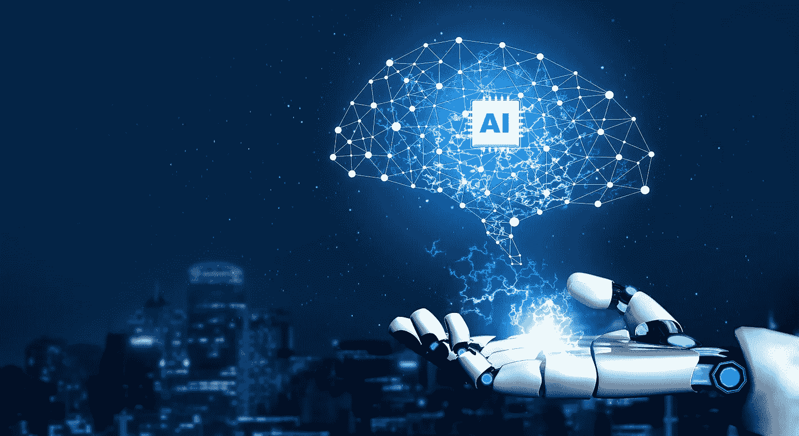
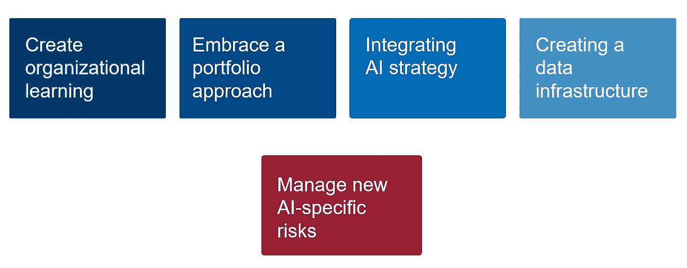
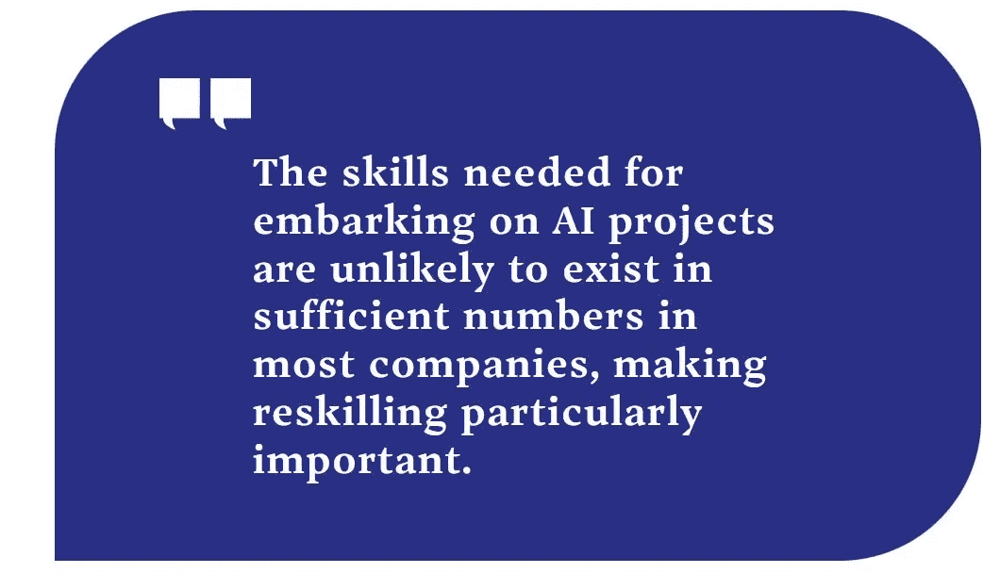
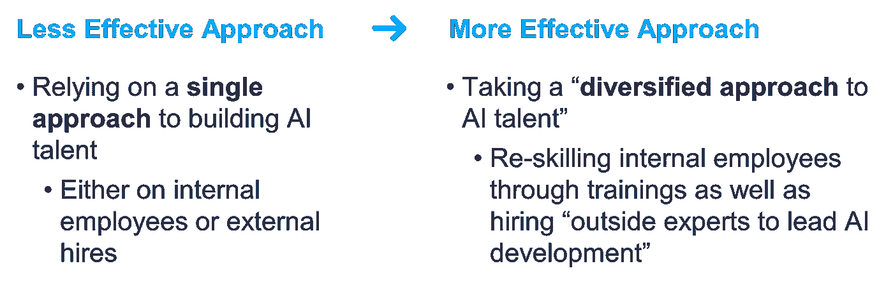
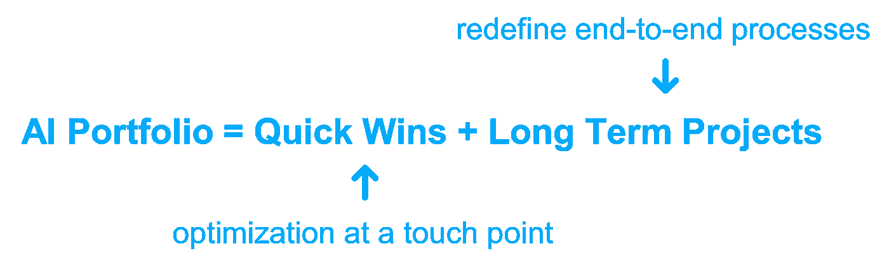
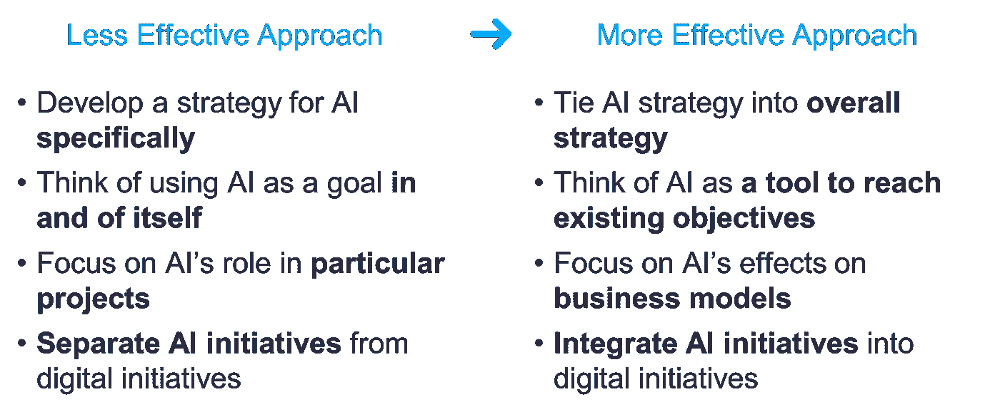
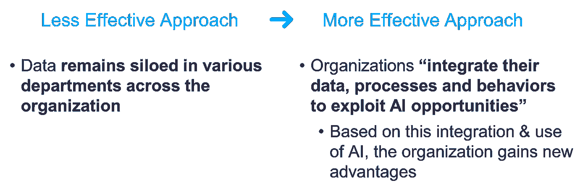
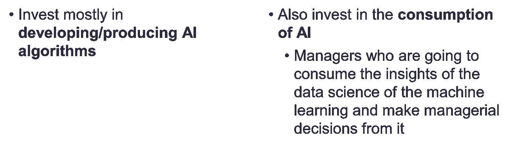
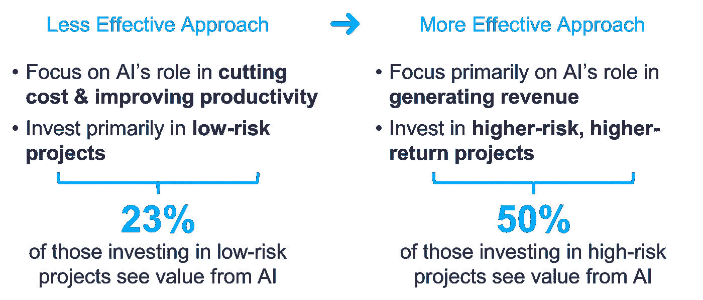

# 商业转型的人工智能战略

> 原文：<https://medium.com/mlearning-ai/ai-strategies-for-business-transformation-36ef0edd0d7a?source=collection_archive---------7----------------------->

**定义**

**人工智能:**

它**T5 是由[机器](https://en.wikipedia.org/wiki/Machine)展示的[智能](https://en.wikipedia.org/wiki/Intelligence)，而不是由[动物](https://en.wikipedia.org/wiki/Animal_cognition)包括[人类](https://en.wikipedia.org/wiki/Human_intelligence)展示的**自然智能**。**

“人工智能”一词此前曾被用来描述模仿和显示“人类”认知技能的机器，这些认知技能与人类思维相关，如“学习”和“解决问题”。

**业务转型**:

在[管理层](https://en.wikipedia.org/wiki/Management)中，有人说**业务转型**包括对[业务](https://en.wikipedia.org/wiki/Commerce)的经营方式进行根本性的改变，以帮助应对[市场环境](https://en.wikipedia.org/wiki/Market_environment)的变化。

它是从根本上改变整个企业或业务部门的系统、流程、人员和技术的过程。

**商业转型的人工智能战略**

沃顿商学院提供的基于内容的策略很少(也采访了行业专家)；麻省理工学院斯隆管理学院[和波士顿咨询集团](https://sloanreview.mit.edu/projects/winning-with-ai/)开展的调查/研究如下:

1.  **创建组织学习**:

*   基于“速赢”的项目(2-3 个月)可以被视为向员工展示人工智能的好处，并就其潜力建立共识。

*   此外，在扩大人才基础时，需要采取结构化的方法，既注重内部员工的再培训，也注重聘用外部专家。
*   这也有助于公司建立更大人工智能项目所需的技能，如大规模数据收集、处理和标记。

**方法:**

2.**采用投资组合方法:**

*   组合方法有助于成功释放机器智能的力量。首先是速赢，然后是追求多个项目的长期目标。

*   **速赢**专注于将现成的 ML(经过适当调整)应用于内部员工接触点。
    速赢的一些例子包括:
    -帮助药剂师查找替代药物的语音界面
    -安排内部会议的工具
*   **速赢**还可以帮助内部员工了解人工智能可以带来什么。
*   **长期项目**最有影响力，因为它们涉及重新思考端到端流程，而不仅仅是关注点优化。

**接近**:

3.**整合 AI 策略:**

*   将人工智能战略整合到更广泛的组织战略中。
*   从长远来看，整合是关键。然而，公司确实是从不太雄心勃勃的目标开始，作为更大目标的先导。

**方法:** 应用于前一主题的方法之上。

4.**创建数据基础设施:**

*   拥有可以用于人工智能工作的数据基础设施将会有所帮助。
*   以下是一些基础设施需求:
    -硬件(专用芯片组和可扩展计算平台)
    -软件(开源框架和开发者工具)
    -数据&算法(市场)

**方法:**

*****************************************************************************************************

5.**管理新的人工智能特定风险:**

在从人工智能中获取价值方面最有效的组织关注收入和增长方面，而不仅仅是成本方面。

**接近**:

**注**:查看我的下一篇文章，了解管理人工智能风险的详细信息。

**参考文献**

**注:**本文所有内容仅取自以下链接。

1.  [https://knowledge.wharton.upenn.edu](https://knowledge.wharton.upenn.edu/)
2.  [https://sloanreview.mit.edu/](https://sloanreview.mit.edu/)
3.  [https://www.wikipedia.org](https://www.google.com/url?sa=t&rct=j&q=&esrc=s&source=web&cd=&cad=rja&uact=8&ved=2ahUKEwiegMa9jJf6AhVpSWwGHQxWBfwQFnoECAMQAQ&url=https%3A%2F%2Fwww.wikipedia.org%2F&usg=AOvVaw3ay7vaEtH0yTTYdDmrvinX)

**接下来是什么**

你喜欢我的文章吗？
如果是，**跟随** me 获取未来更新；并提供你的**赞**和**评论**。

 [## Mlearning.ai 提交建议

### 如何成为 Mlearning.ai 上的作家

medium.com](/mlearning-ai/mlearning-ai-submission-suggestions-b51e2b130bfb)