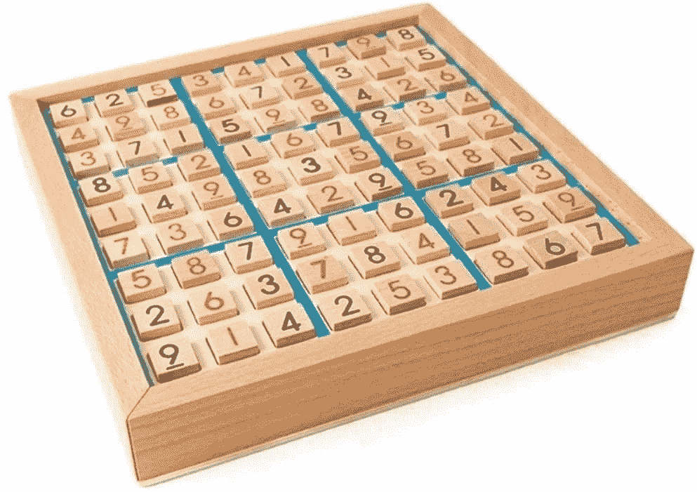
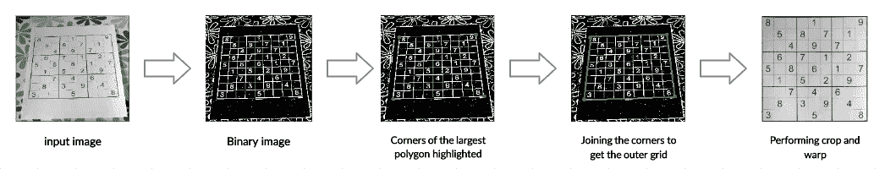
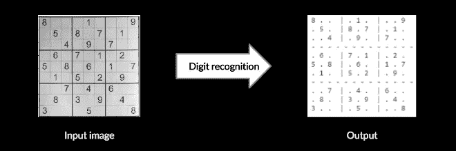
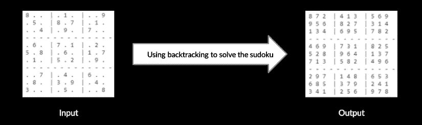
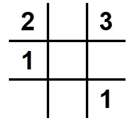
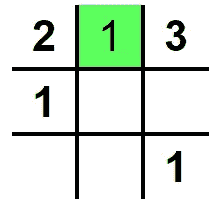
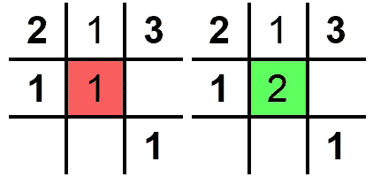
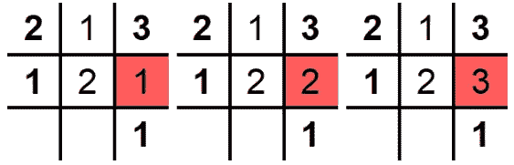
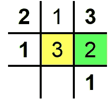
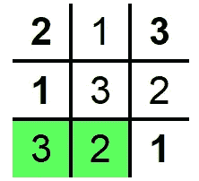

# 人工智能数独求解器

> 原文：<https://medium.com/mlearning-ai/ai-sudoku-solver-cb41b36e446b?source=collection_archive---------1----------------------->

数独是一种益智游戏，玩家将数字 1 到 9 插入到由 9 个正方形组成的网格中，9 个正方形再细分为 9 个更小的正方形，每个数字在每个水平线、垂直线和正方形中出现一次。

# 目录

1.  人工智能数独求解器
2.  方法
3.  结论

## 人工智能数独求解器

使用 OpenCV、深度学习和回溯算法，我们可以解决数独难题。首先，建立字符识别模型，该模型可以从数独网格图像中提取数字，然后使用回溯方法来解决这个问题。基于深度学习的 AI_Sudoku_Solver 架构使用 [OpenCV](https://opencv.org/) (opencv==4.2.0)和 Python (python==3.7)。模型卷积神经网络(CNN)在 [Tensorflow](https://www.tensorflow.org/) 上使用 [Keras](https://keras.io/) (keras==2.3.1)进行数字识别。

## 方法

这里，我们可以将流程分为 3 个部分:

1.在图像中寻找数独谜题。
2。从数独中提取数字。
3。用回溯法解决数独。

**在图像中寻找数独谜题:**在这一部分，我们将关注如何从输入图像中提取数独网格，即我们的感兴趣区域(ROI)。

1.  **将输入图像转换为二进制图像**:该步骤包括将输入图像转换为灰度图像，对灰度图像应用高斯模糊，然后进行阈值处理、逐位非运算和图像扩张。
2.  **检测图像中最大的多边形:**该步骤包括寻找轮廓和选择最大的轮廓。现在从最大的轮廓，选择最极端的点，将是 4 个角落。函数 cv2.findContours 返回它在图像中找到的所有轮廓。在按区域对从图像返回的轮廓进行分类之后，可以容易地选择最大的轮廓。
3.  **裁剪和扭曲最大的轮廓:** 这种方法很简单，因为我们有 4 个角的坐标，我们可以使用扭曲，这给了图像更好的透视效果。

**从数独中提取数字:**提取较小的网格，由于我们已经知道一个数独网格有 81 个相似维度的单元格(9 行 9 列)。我们可以简单地迭代图像的行长和列长，并将每个单元格传递给 CNN 模型进行数字识别。请浏览这篇[文章](https://github.com/kurapan/CNN-MNIST)以了解使用 CNN 进行数字识别的更多细节。

提取数字后，我们的数独网格将看起来像…

**用回溯法解数独:**现在我们已经把图像转换成了数组，我们只需要根据数独的规则，做一个能有效填充空格的函数。

> 让我们通过一个使用 3x3 数独的例子来理解回溯是如何工作的。假设我们要解决给定约束的网格-
> 
> 每列都有从 1 到“n”的唯一数字或空格。
> 
> 每列都有从 1 到“n”的唯一数字或空格。

**1。**我们需要填充 5 个空格，让我们从从左到右和从上到下遍历空格开始。

**2** 。让我们将 1 放入第一个遇到的空间，并检查是否满足所有约束。这里似乎 1 很好，因为它在行和列中都是唯一的。

**3。**移动到下一个网格，我们再次从保留 1 开始，但是我们可以看到它在列中不是唯一的，因此我们检查 2，2 满足所有约束

**4。**对于第三个空网格，我们可以看到 3 个数字 1、2、3 都不满足约束。

**5。**为了解决这个问题，我们后退一步，在我们填充的最后一个网格中增加数字，并确保满足约束条件。现在我们继续下一个格里格，我们可以看到 2 适合它。

**6。**同样，我们填充剩余的网格，达到最优解。

现在我们已经了解了回溯是如何工作的，让我们使用解决 9x9 数独时使用的约束来创建一个函数，并在我们从上一步获得的数组上测试它。

## 结论

在这篇文章中，我们了解到

1.  轮廓和翘曲的概念。
2.  数字识别的深度学习模型。
3.  回溯算法。

# 参考

1.  [数独求解器](https://github.com/murtazahassan/OpenCV-Sudoku-Solver)
2.  [数字识别](https://github.com/kurapan/CNN-MNIST)
3.  [回溯算法](https://techwithtim.net/tutorials/python-programming/sudoku-solver-backtracking/)
4.  [中型文章](/swlh/how-to-solve-sudoku-using-artificial-intelligence-8d5d3841b872)

该代码可在[**https://github.com/Devashi-Choudhary/AI_Sudoku_Solver**](https://github.com/Devashi-Choudhary/AI_Sudoku_Solver)获得。如有任何问题或疑问，请直接联系我，电话:[**github.com/Devashi-Choudhary**。](https://github.com/Devashi-Choudhary)

在 LinkedIn 上找我:[**https://www.linkedin.com/in/devashi-choudhary-84677b109/**](https://www.linkedin.com/in/devashi-choudhary-84677b109/)

*谢谢！*