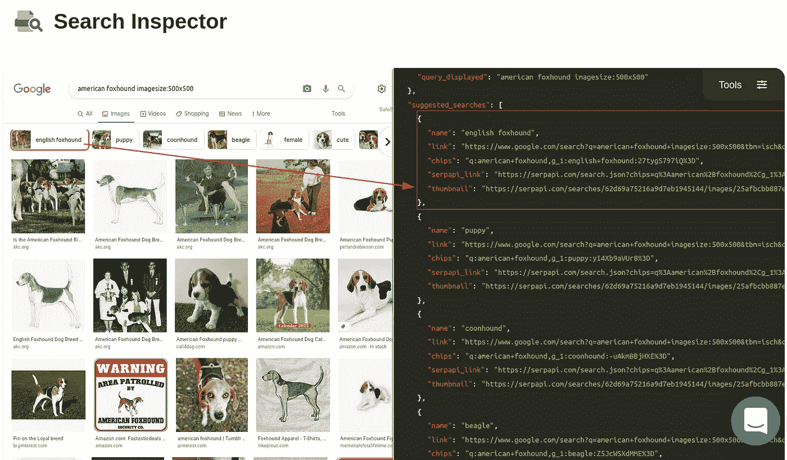
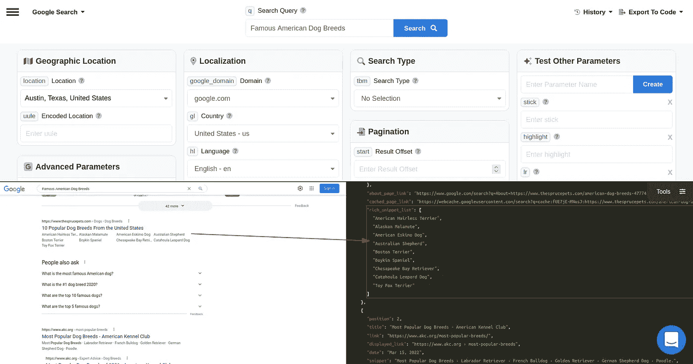
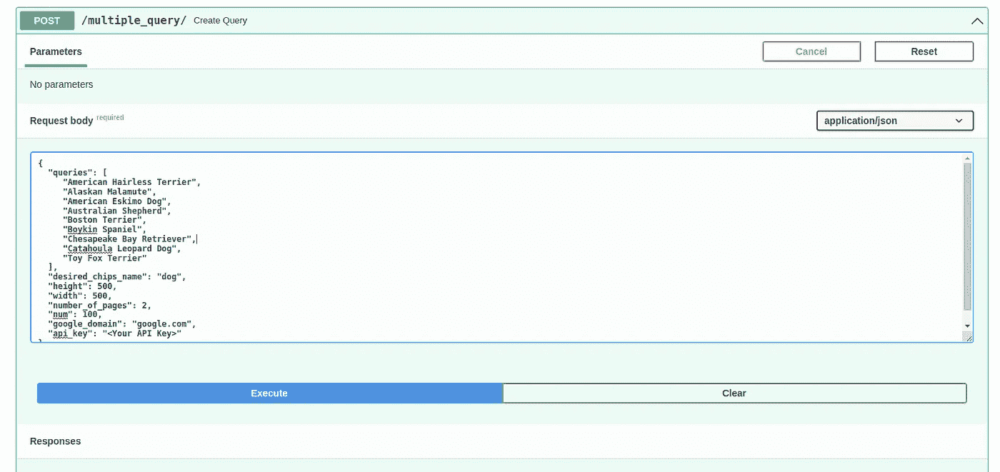
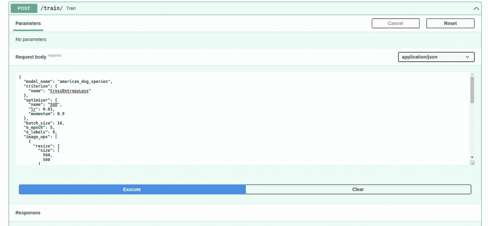
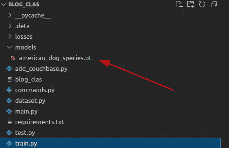

# 人工智能大规模培训

> 原文：<https://medium.com/mlearning-ai/ai-training-at-scale-f21cda9e9126?source=collection_archive---------6----------------------->

这是与人工智能实现相关的系列博文的一部分。如果你对故事的背景或情节感兴趣:

在上周，我们已经探索了如何使用 chips 参数负责缩小结果，在 [SerpApi 的 Google Images Scraper API](https://serpapi.com/images-results) 中查询具有特定高度的图像，以训练机器学习模型。本周我们将探索用多个同类查询自动更新图像数据集，并在更大规模的深度学习中看到结果。

# 什么是规模化人工智能？

该术语指的是在机器学习训练过程中使用的扩展图像数据集的可扩展性，以及以最小的努力在规模上扩展或再训练机器学习模型。简单来说，如果你有一个区分猫和狗的模型，你应该能够通过自动收集猴子图像和重新训练来轻松扩展人工智能训练，或者通过使用不同的框架来扩展现有的分类器。具有大型模型的人工智能解决方案需要有效的工作流来实现模型开发。

# 如何减少训练时间？

通过使用清晰的数据，你可能会减少噪音，并可以拥有有效的人工智能模型，这些模型可以胜过其他人工智能模型。在计算机视觉中，这一方面更加重要，因为与负责 nlp(自然语言处理)的算法相比，工作负载将发生显著变化。

# 轻松清除数据

在前一周，我已经展示了如何从谷歌搜索中手动获取`chips`参数。 [SerpApi](https://serpapi.com) 能够创建不同`chips`值的列表，并在`suggested_searches`键下提供它们。

这里需要注意的一点是，不同查询的`chips`值将有不同的值。然而，您可能会获得特定查询的`chips`值，并针对该特定查询跨不同页面运行它。

例如，查询`American Foxhound imagesize:500x500`和规格`dog`的`chips`值为:
`q:american+foxhound,g_1:dog:FSAvwTymSjE%3D`

`American Hairless Terrier imagesize:500x500`的相同`chips`值为:
`q:american+hairless+terrier,g_1:dog:AI24zk7-hcI%3D`

正如您所观察到的，`chips`值的加密部分是不同的。这就是为什么你需要至少调用一次 [SerpApi 的 Google Images Scraper API](https://serpapi.com/images-results) 来获得想要的`chips`值。

我在我们的`Query`类中添加了一个名为`desired_chips_name`的新键，以检查`suggested_searches`中期望的`name`的结果:

此外，在`Download`类中还需要另一个函数来提取`chips`值并将其用于搜索:

该函数负责用查询调用 [SerpApi](https://serpapi.com) 并返回所需的`chips`参数，以及在`Query`类中更新它。

现在，使用所需的规范自动进行调用并将其添加到我们的人工智能模型数据集中以用于机器学习训练所需的一切都已就绪，让我们声明一个用于执行多个查询的类:

`queries`这里将是你要分类的查询列表。例如:犬种列表
`desired_chips_name`键将是它们共同的规格。这种情况下是`dog`。
`height`和`width`将是深度学习训练需要采集的图像的大小。
`num`将得到每页的结果数。
`number_of_pages`将是你想要得到的页数。当 num 为 100 时，1 将给出大约 100 个结果，2 将给出大约 200 个图像，等等。
`google_domain`是您想要搜索的谷歌域名。
`api_key`是你对 SerpApi 唯一的 API 键。

让我们定义自动按顺序调用查询并将图像及其分类上传到存储数据集的函数:

我们用`chips_serpapi_search`查询 [SerpApi](https://serpapi.com) 一次，然后使用`chips`值运行实际的搜索。然后，我们将所有图像移动到图像数据集存储，以训练我们在早些时候创建的机器学习模型。

最后，让我们在`main.py`为它声明一个端点:

# 大规模培训

为了展示的目的，我们将使用 8 种美国犬种。事实上，我们甚至可以集成 [SerpApi 的 Google Organic Results Scraper API](https://serpapi.com/organic-results)来自动获取`Famous American Dog Breeds`并用我们的`queries`键运行它。这超出了今天博客文章的范围。但是它是一个多用途用例的良好指示器。

如果你带着[下面的链接](https://serpapi.com/playground?q=Famous+American+Dog+Breeds&location=Austin%2C+Texas%2C+United+States&gl=us&hl=en&newPara=stick+highlight+lr+async+as_qdr)去游乐场，你将会看到你想要的结果:

现在我们将把列表放在`organic_result`中，并把它放在`/multipl_query`端点的`MultipleQueries`对象中:

这本字典将在 Google US 中为我们获取高度为`500`和宽度为`500`的`2`页(在`200`图片周围)，以及我们输入的每个犬种的`dog`的筹码值(具体来说缩小到只有犬图片)。

您可以观察到图像被上传到 N1QL 存储服务器:

如果你想为你的机器学习项目创建自己的优化，你可以[在 SerpApi](https://serpapi.com) 申请免费试用。

现在我们已经有了我们需要的一切，让我们训练机器学习模型，在/train 端点区分美国狗的品种，使用下面的字典:

人工智能模型将使用我们上传到数据集的图像进行大规模自动训练，在这种情况下，通过我的计算机的高性能 GPU(也可以用 cpu 进行训练):

我感谢用户的关注，也感谢 SerpApi 的聪明人让这篇博文成为可能。本周，我们的重点不是创建具有良好指标的有效模型，而是创建的自动化过程。在接下来的几周里，我们将致力于修复它的缺陷和缺失部分。这些部分包括对 ml 模型进行分布式训练的能力，支持所有优化器和标准，添加可定制的模型类，能够在不同文件类型(文本、视频)上训练机器学习模型，不有效地使用管道，利用不同的数据科学工具，支持其他机器学习库，如 tensorflow 和 pytorch 等。我不打算做一个最先进的项目。但我的目标是创造一个解决方案，轻松创建人工智能系统。我还旨在为生态系统内创建的不同深度学习模型的比较创建一个视觉。我们还将讨论可视化培训过程，以获得有效的模型。目标是拥有一个开源库，在那里你可以随意缩放你的模型。

*原载于 2022 年 7 月 19 日*[*【https://serpapi.com】*](https://serpapi.com/blog/automatic-training-at-scale/)*。*

 [## Mlearning.ai 提交建议

### 如何成为 Mlearning.ai 上的作家

medium.com](/mlearning-ai/mlearning-ai-submission-suggestions-b51e2b130bfb)