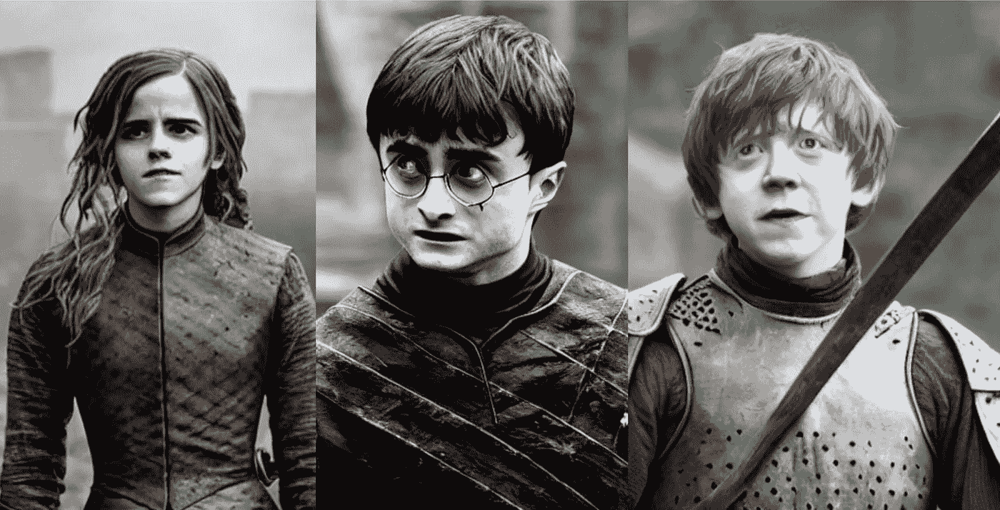

# 人工智能将《哈利·波特》中的五个角色转换成《权力的游戏》中的角色

> 原文：<https://medium.com/mlearning-ai/ai-transforms-five-harry-potter-cast-into-game-of-thrones-characters-39e4af6b426e?source=collection_archive---------0----------------------->

Image by [Jim Clyde Monge](https://medium.com/u/819323b399ac?source=post_page-----39e4af6b426e--------------------------------)

一种新的文本到图像的人工智能工具正在互联网上掀起波澜，因为它能够从一个简单的文本提示中生成著名人物的逼真图像。

AI 工具叫做[稳定扩散](https://github.com/CompVis/stable-diffusion)。

与其竞争对手 [Dall-E2](https://openai.com/dall-e-2/) 和 [MidJourney](https://www.midjourney.com/app/) 相比，它创建照片的速度快了三倍，而且完全免费。