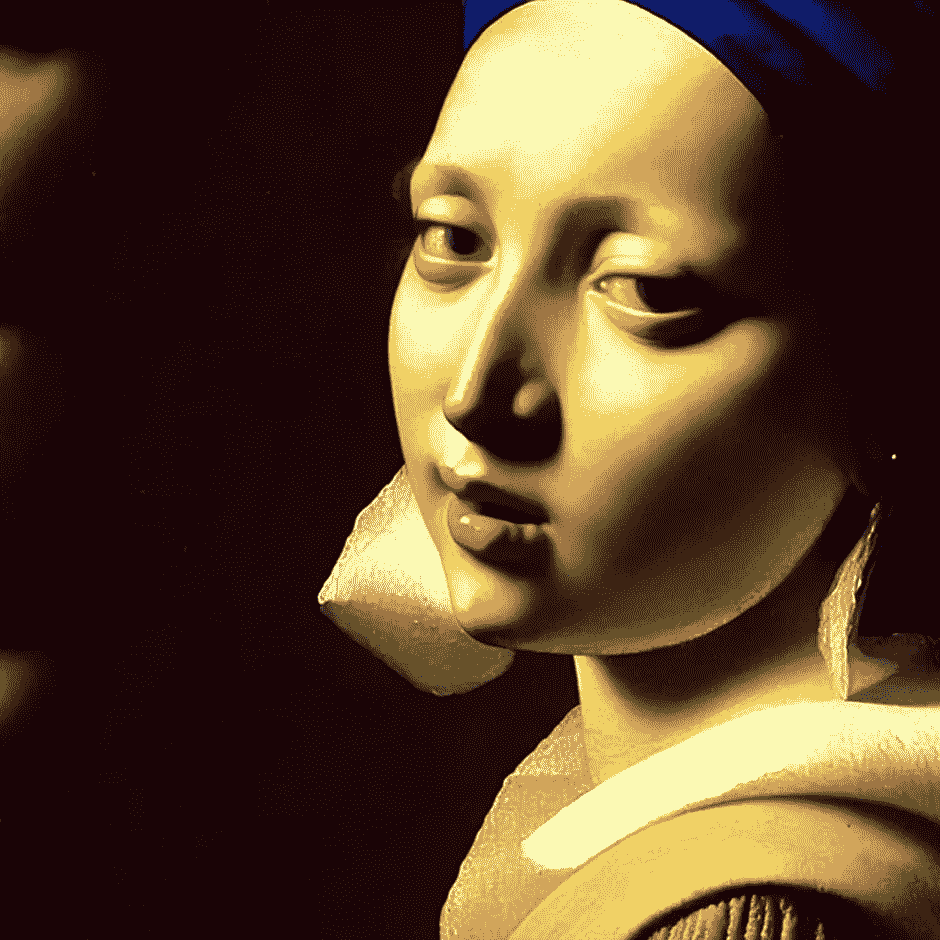
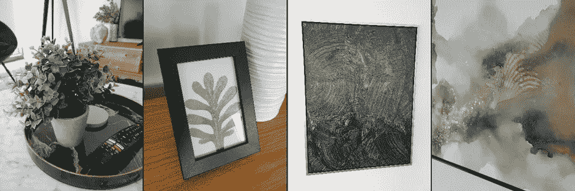

# 人工智能的观察方式:致敬，仿造和伪造

> 原文：<https://medium.com/mlearning-ai/ai-ways-of-seeing-the-homage-the-faux-and-the-fake-59615d3fc792?source=collection_archive---------5----------------------->

## 通过意图而不是工具和技巧来理解艺术

我很高兴向大家展示 medium.com 系列的第六部作品，它在一定程度上打破了约翰·伯格的名著《T2 的视角》(1972 年，企鹅出版社)的传统。这本书对我的智力和创造力的发展产生了巨大的影响。我鼓励你去读它。

到目前为止，这个系列的所有文章都是可视化的。但是我们已经到了使用我们的语言的时候了。别急，还是会有一些图的。在我们开始之前，你可能想看看前一集:

 [## 人工智能的观察方式:向芭芭拉·克鲁格致敬

### 第五部分:探索概念艺术家芭芭拉·克鲁格的 AI 风格

medium.com](/@aimindmeld/ai-ways-of-seeing-homage-barbara-kruger-5be4271d37c0) 

## 技术与意图

假设我们想要进行一场关于人工智能艺术或一般艺术的智能对话。为此，我们需要一个共享的知识框架。

以下意在向你介绍一种思想，即具体的技术，生产手段(手工、机械、数字、黑魔法)作为艺术欣赏的考虑因素相对不重要；重要的是艺术家的意图。这主要是对艺术的心理理解。

首先，一个快速的视觉帮助:

你可能听说过塞尔吉奥·莱奥内的经典西部片*、好的、坏的和丑陋的*？很好。在这篇文章中，我会给你*敬意，假的，和假的*。

## **致敬**

想象一下，我们想要学习如何做一些需要技巧、练习和一定程度的奉献甚至痛苦才能实现的事情。我们如何最好地实现这一点？我们会无休止地四处游荡，还是去上一堂课？找老师？也许研究伟人，或者我们崇拜的人？效仿和模仿？即使我们从未接受过任何正式的训练，但总会有影响、灵感、我们崇拜的榜样、阅读的文章、参与的社区，以及我们喜欢并从中汲取力量的节目和活动。

这个基本的观察让我们对什么是好的艺术以及它是如何产生的有一点心理理论。我们可以非常自信地说，每个从事创造性工作的人，从最基本的方面来说，也是在从事他们从那些他们害怕、钦佩或想给他们留下深刻印象的人身上学到的东西——他们的老师、导师、爱人、灵感和同事。他们可以竞争，也可以合作。但他们都有某种心理动机:留下深刻印象，赢得胜利。这就是为什么我们可以把好的艺术描述为敬意。至少，这里的主张是，它会一直有这种质量的成分存在。

现在，因为我们生活在这样的时代，有些人可能很难接受这种想法。自我的本质是，我们总是想把我们最好的结果归因于我们自己，把我们的失败和灾难归因于他人的影响。而这种心理其实和我刚才描述的正好相反。你见过一个艺术家、音乐家或者才华横溢的人不自信吗(原谅我的法语)？我没有。

然而，我们更好的自我知道我说的是真的，艺术是一门手艺，一门学科，一个终生的学习，它绝不是即时的满足和按钮，真正有价值的东西来之不易。我的一位伟大的老师，鲍勃·詹姆斯，习惯说我们必须“付出我们的代价”

在我们结束“致敬”这个话题之前，我将展示一些我正在进行的项目的图片，这个项目叫做“作为女人的上帝”这些是以我欣赏或认为富有表现力的艺术家风格制作的图像。换句话说，这是一种敬意。不要太在意技术。本质上，这并不重要，我可以挥一挥魔杖，说“imagio！”并创造了这种艺术；或者我可以用油画颜料在展开的画布上画出来。这有什么关系？

## **一些致敬的例子**

Figure 1 Homage Max Beckmann, God as a woman, Digital/Algorithmic, 768x768px, Serial Number 00471–1700848058

Figure 2 Homage Jackson Pollock/2D Styles, God as a woman, Digital/Algorithmic, Serial Numbers various

Figure 3 Homage Rembrandt, God as a woman, Digital/Algorithmic, 1024x2024px, Serial Number 00578–244371750

Figure 4 Homage Johannes Vermeer, God as a woman, Digital/Algorithmic, 1024x1024px, Serial Number 00604–502702067

这就是敬意。好的方面。我们继续吧。

**山寨**

我必须解释这种虚假的最好方式是从我最近在一个付费住处拍摄的一些照片开始。

Figure 5 Some Faux Art

在左边，你可以看到一棵人造植物在一个小塑料盆里，里面有人造土壤。在中间的左边，是一个小的，有框的植物叶子图片。在中间右侧，是一个更大的框架画布。图像看起来像是黑色油漆的扫掠，并且有一个透明的丙烯酸树脂用梳子工具在表面上擦拭，以创建一个乳白色的纹理。右边是另一幅加框画布的特写，这幅画上有灰色、黑色和金色墨水的斑点。

现在明白了吧，我完全清楚这些物品出现在我的付费住宿中的原因。没有一个聪明房东会给他们的房子提供任何昂贵的东西，更重要的是，没有人会把任何有争议的、有挑战性的、甚至是有趣的东西放进付费公寓。目标正好相反——完全避免制造任何感觉，除了不引人注目、不是空的，但仍然有家具。这些是*占位符*。

这些是人造物体的例子。他们*看起来*是绘画、植物和花盆，但是他们没有这些东西的真实性。它们不会成长，我们对它们的看法也不会随着我们继续观察它们而发展。如果它们消失了，我们不会想念它们，如果我们移动，它们很可能会被扔进垃圾箱。

如果我们反思创造这些物品的行业，我们知道它完全是通过商业的需求而创造出来的。有趣的是，这些物体*确实有一种* *风格*。这种风格有些空洞，有些遥远，有些机械，但它本身并不丑陋。这是 T4 式的商业模式。当商业需求压倒一切时，这种风格就出现了。这是人造的。

我们需要继续前进，但我会赶紧补充说，像股票图像这样的整个行业主要都是人造艺术。你可能会说这是不公平的，许多股票图像都是好的，但任何完全只是为了出售东西而存在的东西，任何主要作为愉快购物体验的背景而存在的东西，都是人造的。是*艺术*，不是致敬。不是*假*，因为假的东西是故意骗人的。但是所有的一切——你见过的用作商业背景的每一张图片——都是假的。它有一种风格，通常在这种意义上它是相当复杂的。但有许多迹象表明，它不是敬意，它没有爱，它不是出于好奇、兴趣或激情而创造的。它之所以被创造出来，是因为有人需要展现艺术或工艺或复杂或质量的外观，但实际上并不具备这些东西。它不能。为什么？因为那会分散人们对前景中产品的注意力。

为了提供一些完整的感觉，我想我会看到它是多么具有挑战性，使人造的。以下是今天早上为这篇文章的目的。

Figure 6 An example of Faux art — a promotional image for the Volkswagen T2

Figure 7 Another Example of Faux art — a promotional image for the Tesla Model S.

Figure 8 A third example of Faux. The Tesla Model S again

我通常不讨论提示，因为我知道在人工智能艺术工作流程中使用的提示并不重要。分享提示没那么有用，有用的是知道意图。但是为了理解正在做的事情，下面是上面的提示:

> 一辆大众 t2，黎明时分拍摄于加州，商业广告摄影风格
> 
> 一辆特斯拉 Model S，黎明时分拍摄于加州，商业广告摄影风格，高清，逼真，细致

你可以看到我指定的风格是“商业广告摄影风格。”

请注意，美丽的加州早晨的阳光和光线只是汽车的背景。地球本身，已经存在了数十亿年，被推向服务，为亿万富翁赚更多的钱。如果我想让一个穿着比基尼的女孩躺在引擎盖上，而且非常愚蠢，我也可以这么做。

虚假的最重要的信号之一是存在着不是他们自己的人，他们被雇来微笑和扮演假人。在广告界，他们用一个词来形容这些人:人才。在任何敬意中，在任何美好的事物中，所代表的人类并没有假装或表演出人形的角色。他们是人，人类的代表，他们有真实的感受和经历。它们是真实的。他们可能正在扮演一个角色，就像一个演员所做的那样，但是他们通过表演的意图是使观察他们的情绪和经历变得更大，而不是更小。而在人造家具中，人体模型的意图总是融入家具中，不引人注意。它们为产品发光让路。

有一部精彩的电影叫做*蒙特娄的耶稣*，它的主题是敬意和虚伪的对比。

所以这是假的，不好的。现在让我们继续讨论伪造品的丑陋之处。

## **山寨**

每个人都明白什么是敲竹杠。但是我们生活在有趣的时代。在我住的地方，我的手机每天会响两到三次，有人打电话来试图诱骗我。我妻子得到了更多，因为她的手机号码被公开了。这种程度的攻击——我不认为任何其他词是合适的——是显著的，因为没有人对此做任何事情。

我们生活在一个虚假经常出现的世界，就在看不见的角落，我们已经习惯于关注它的出现。但是它的属性是什么呢？

与这个讨论相关的是我所谓的超风格。超风格是任何具有“超乎想象”的属性的东西，用来打动人、愚弄人、欺骗人。我们可以在*深度伪造*中看到这一点，它使用超风格来惊喜和激发对否则完全平庸的材料的兴趣。

超级风格可以通过人工智能艺术方法如扩散来实现，但超级风格本身并不是“假的”要成为“假”的东西，必须有恶意的或故意欺骗的目的。

上述“20 大深度虚假视频”中的例子在 YouTube 上被允许，正是因为它们不是以造成伤害为目的的虚假，而是为了明显的娱乐目的而使用 hyperstyle。如果它们是“真正的”假货，它们将违反 YouTube 政策，被删除。一个“真正的”假货的例子是最近的一段宣传视频，视频中乌克兰总统告诉他的士兵投降。

我希望你们不要认为艺术是复制品就等同于艺术是赝品。石版画和丝网版画(用复制设计的技术制作)是赝品吗，因为它们的特殊制作过程？当然不是。许多照片是从同一张底片冲洗出来的呢？不。让某物变假的是*愚弄或欺骗*的意图。例如，如果一幅画被说成是艺术家的作品，但却是别人伪造的，只是为了欺骗买家，那就是赝品。*建筑* *工艺本身*很可能是*而非*赝品，这幅画很可能使用了非常相似的技术和材料才得以成功出售。

假货与骗局和骗子有很大的联系。三张牌蒙特是一种流行的纸牌游戏场景，其中马克赢现金的希望总是变成输现金。但是今天有没有一种流行的艺术形式是像这样的骗局呢？是的，我在考虑 NFTs。他们所谓的“Nifties”是一个骗局。不是因为技术，而是因为意图。整个 NFT“市场”是一个精心制作的三张牌，用来把人和钱分开。

目前就这些。

如果你觉得这个故事很有趣，你可能会喜欢阅读我的斯图尔特品牌致敬，宇宙飞船地球人工智能项目:

 [## 宇宙飞船地球人工智能项目

### 20 幅受地球启发的人工智能图像应该会让你大吃一惊

medium.com](/@aimindmeld/the-spaceship-earth-ai-project-497f306b39dc)  [## Mlearning.ai 提交建议

### 如何成为 Mlearning.ai 上的作家

medium.com](/mlearning-ai/mlearning-ai-submission-suggestions-b51e2b130bfb)