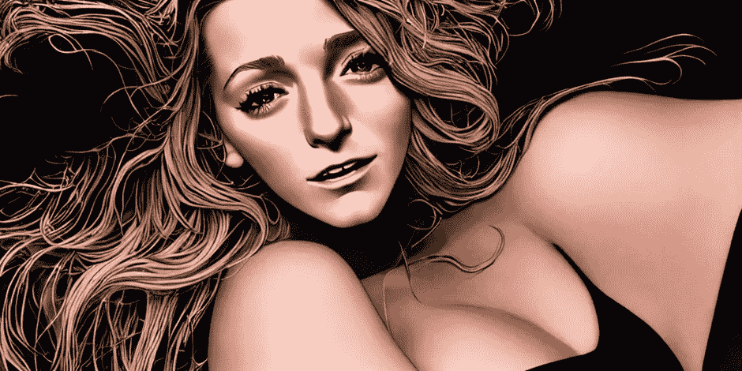
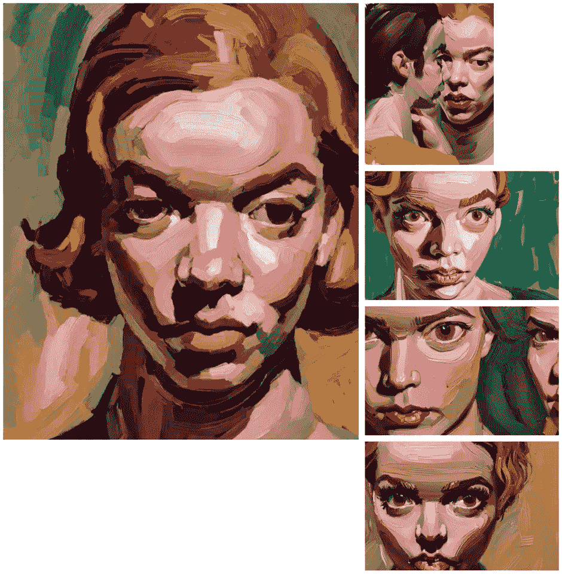
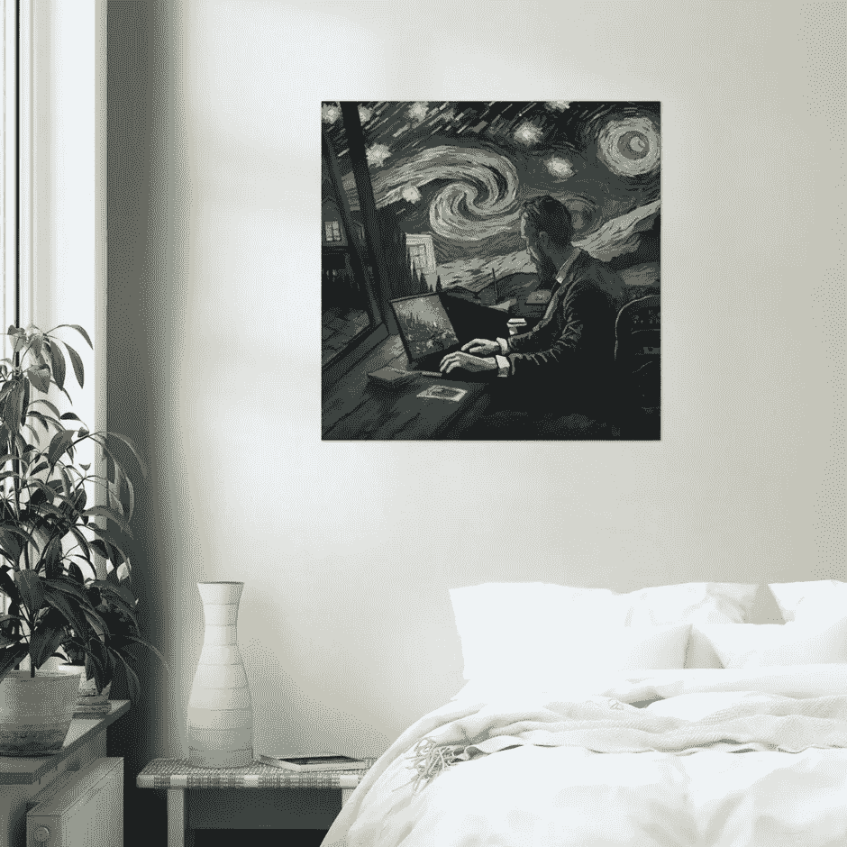
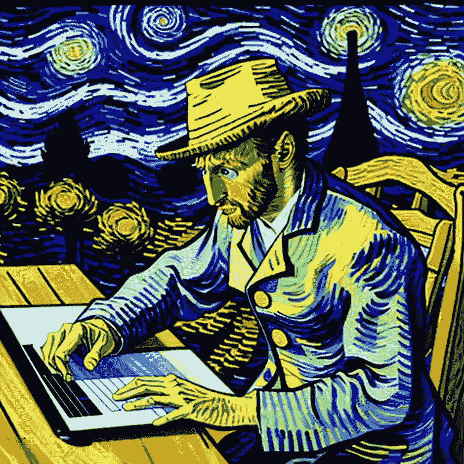
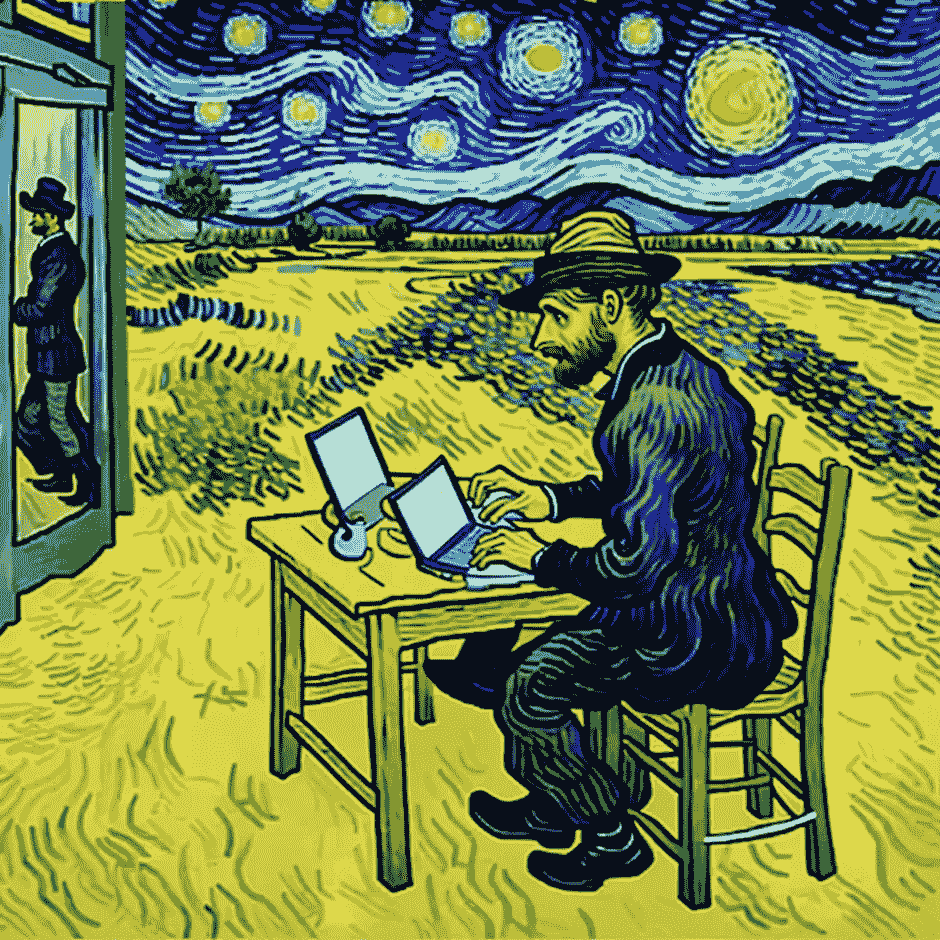
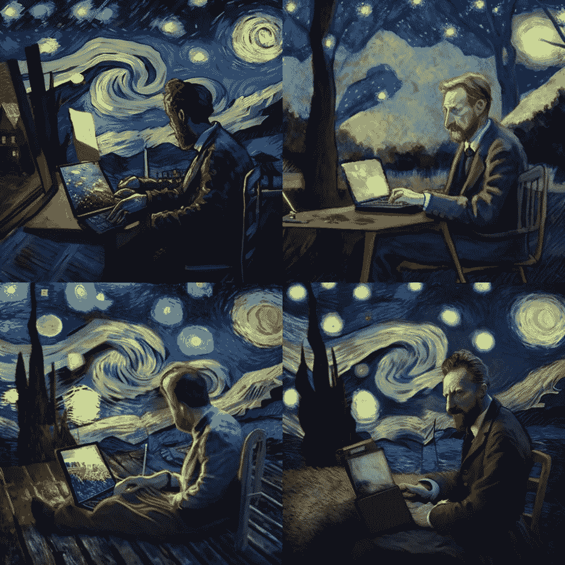
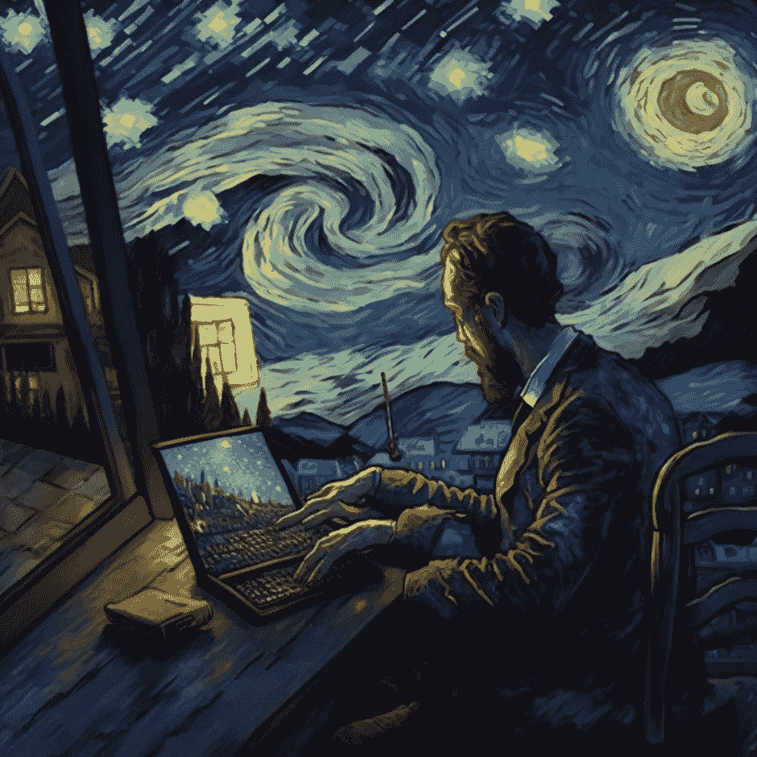
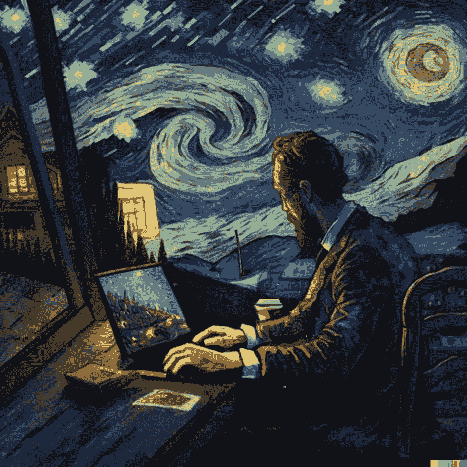
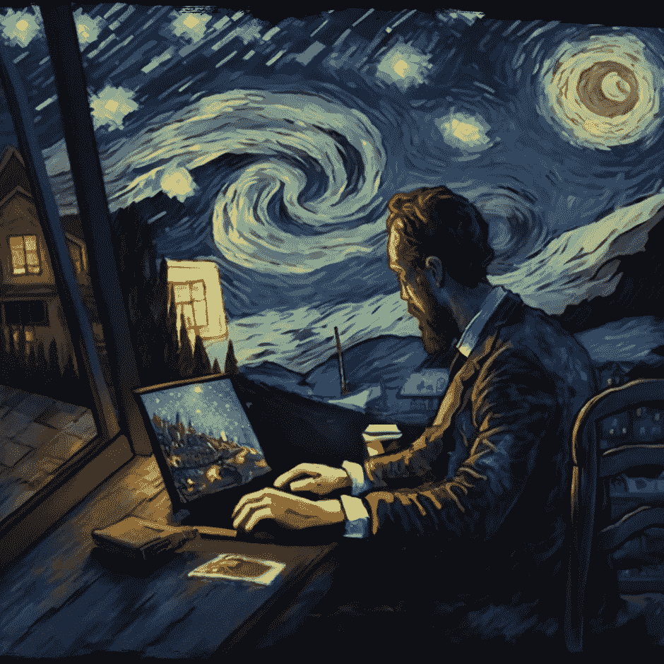

# 艾的观看方式:文森特创作了《星夜》

> 原文：<https://medium.com/mlearning-ai/ai-ways-of-seeing-vincent-creates-the-starry-night-2ad47c9c1e0d?source=collection_archive---------5----------------------->

## **记录使用人工智能艺术生成器制作的作品的开发过程**

我很高兴向大家展示 medium.com 系列的第七部作品*人工智能的视角*，这部作品在一定程度上打破了约翰·伯格的名著*的视角* (1972 年，企鹅出版社)的传统，探索艺术。这本书对我的智力和创造力的发展产生了巨大的影响。我鼓励你去读它。

在这一期中，我们将看看我用来创作一些作品的具体过程。我不喜欢透露我的“秘密”,因为这有商业优势，但另一方面，记录一个过程总是好的。以下是我们将关注的内容:

Article header image, Vincent the Digital Artist at work.

在此之前，您可能会喜欢阅读本系列的前一部分:

 [## 人工智能的观察方式:致敬，仿造和伪造

### 通过意图而不是工具和技巧来理解艺术

medium.com](/mlearning-ai/ai-ways-of-seeing-the-homage-the-faux-and-the-fake-59615d3fc792) 

## **机会主义过程**

许多媒体的注意力都集中在人工智能艺术图像创作的容易程度和速度上。但这并不真正正确，这只是不了解内情的人所做的表面观察。

如果艺术家主要作为一个系统的操作者，站在接受的立场上，人工智能艺术是相当容易和快速的。这是因为缺乏更好的描述，一种 SAAS，“艺术即服务”，或“AAAS”

在 AAAS 中，操作者的作用是观察，直到足够多的连续尝试被尝试产生一个在美学上满足他们的艺术品。这就是很多人理解 AI 艺术的方式。输入一个提示，返回一些东西。

对此有一个词，叫机会主义。在一切艺术活动中，都有机会主义的成分，这不是错的，也不是坏的。然而，机会主义艺术完全受制于系统的相对丰富性。这就像秋天走在苹果园里。我们会找到很多吃的。但今年晚些时候，什么也没找到。

为了超越这个阶段，在持续高效的人身上可以观察到两种形式的活动:对工具和技术(基本上是手艺)的掌握和创造力。

人工智能艺术的工艺方面还处于非常初级的阶段，我将在下面记录的是非常初级的。程序员们当然还在继续他们的工作，但是美工们也在忙着解决问题。这就是“工艺”方面。

在我们对机会主义的类比中，通过掌握工具和技术，工艺增加了从过程中产生有价值的东西的机会。我可以告诉你，我们还远远没有掌握。

创意呢？为了理解这一点，我们需要一个创造力的理论。

## **创造力的工作理论**

为了真正具有创造性，人工智能渲染的输出必须是对我们有意义的东西，并且必须超越数据科学家的意图。为了成为“艺术”，渲染的输出必须*大于标准*。

这是关键的秘密，是数据科学家不知道的事情，并且可以理解地需要帮助来理解。这就像一个人负责建造一艘船。该船必须在陆地上建造，并有一些严格的要求，如物理工程和材料性能的限制。但是只有在波涛汹涌的大海中驾船出海的水手才能说这艘船是否适合航行。

一般来说，数据科学家的目标是标准化。这有很强的经济和社会原因。他们的目标是使输出模式与伴随训练集中输入图像的单词描述(标记、标签)正相关。从这个角度来看，如果有人输入一条狗的提示，而另一端出来的东西看起来或多或少像一条狗，那么就可以衡量成功。数据科学家在他们的盒子上打勾。

那还不是艺术。

这就像要汤一样。如果我们在一家意大利餐馆点了蔬菜通心粉汤，我们很可能会得到一些。但是如果我们去希腊餐馆，我们会被告知他们没有。这是意料之中的。但是如果我们去一家中国餐馆，点平安夜火鸡——他们给我们上北京烤鸭，会怎么样呢？

这就是创造力。

我们需要一个迭代过程，对所有可能的参数进行强有力的控制。这是工艺的功能。不可能确切地知道给定的一组参数会产生什么样的结果，尤其是在涉及随机种子的情况下。但是我们可以创造有利的条件——去正确的餐馆，点菜单上正确的菜。

但是为了让北京烤鸭远离火鸡大餐，我们必须努力。有时我们不得不导致“非规范性的结果”被发射出来。有风险的结果。我们必须弄脏自己，抓住机会。超越数据科学家的意图。

这里有一些我们目前可用的技术。

## **非标准技术:图像渲染尺寸 Foobar**

数据科学家使用矩形训练集进行训练，通常为 512x512px。这是证明数据科学家不是艺术家的原因之一。正方形不是画布的最佳形状。如果他们消息灵通，他们会使用更多的黄金分割矩形(例如，ISO A 系列尺寸)。

但是，假设模型使用正方形，我们可以通过要求非正方形的矩形来克服规范性。

这样做的结果往往是相当痛苦的。头开始从脑袋里冒出来，胳膊和腿开始飞翔，脖子伸长，小版本的大图像出现。但这种迭代探索往往会推送渲染算法。它可以做意想不到的事情，也可以做非凡的事情。

对我来说，这种操作最意想不到的方面是发现改变输出大小会导致非线性效果:不是稍微大一点的尺寸会导致稍微大一点的渲染，而是一个小的改变，比如说 512x512 到 512x640px，有时会以非常戏剧性的方式改变图像输出。诸如 512x1024px 之类的较大变化通常会产生戏剧性的特效，如下所示:

Figure 1 Dramatic spatial distortion caused by image generation in a plane not anticipated by the data modelers

这种非线性行为可能表现出混沌特性。当一个维度向外延伸时，会产生两倍和三倍的效果，有时会出现感觉像混乱的边界条件。这就是事情开始变得奇怪的地方。

Figure 2 Nonlinear distortion of form due to image generation forced onto the over-extended x-axis

## **非规范技术:琐碎与禁忌融合**

已经观察到并且可能是设计意图，提示某些事物的组合有时会产生所请求事物的美学上令人愉悦的组合。要求组合可以导致保持理性的不同结果，就像一只戴着现实帽子的现实狗，或者它可以产生非理性的组合，就像一只实际上是半狗半帽子的狗。

我称之为*融合*。当我们将社交上或传统上不可组合的事物组合在一起时(由于禁忌等。)然后我们就搞*禁融合*。

实际上，直到历史上的这个时候，融合主要是通过讲故事和通过非视觉手段来实现的，因为想象力可以很容易地融合事物，而在物质世界中则更困难。这可以通过意识流写作来实现，就像詹姆斯·乔伊斯的《尤利西斯》。这绝对是毕加索工具箱中的一件工具。但在人工智能艺术中，它现在有了自己的地位。

但是，为了达到“艺术”，我们必须超越像狗的帽子一样的琐碎效果，追求更严肃的意图。例如，我们可以将一个著名的白人重新想象成一个非裔美国人，以展示如果我们都是黑人，世界会是什么样子:

Figure 3 Hilary Rodham Clinton imagined as a beautiful black woman.

Figure 4 A Well-known actress transformed into a handsome young man using a custom Dream booth model

这种技术可能对考虑重新分配性别的人很有帮助。他们可以看到和想象一个他们有不同性别的未来状态。

## **非标准技术:一致的塑料形式**

但这种塑料形式的持久性也有重要的纯艺术应用。它可以使整个创意画布上呈现的所有图像*成为同一种塑料形式的表现*。也就是说，它产生或增强了调用之间的一致性。

就机会主义斗争而言，一致但可塑的结果的产生对于克服机会主义是非常有用的。我们可以更好地预测结果会令人满意。

Figure 5 A collage of results from different invocations showing plastic form consistency

这种类型的效果通常涉及定制的培训，这是 AAAS 提供商可能不会很快做的事情。他们感兴趣的是一个通用的服务来产生通用的输出。这些产出可以用来制造像沃尔玛那样的产品。

现在，制作一个可以将艺术家自己的脸(或他们的狗，或其他什么)放入模型的定制模型令人兴奋不已。(自然，我们都做过)。但这多少有点轻视了一种工具的巨大艺术力量，这种工具可以跨越时间和空间创造一致的渲染。

塑料形态的一致性本质上是对人类记忆的启发。它让我们有机会遇到让我们想起其他人的人。人类的记忆是可塑的，但它保留了跨越时间和空间的记忆的主要特征。我们继续认出老朋友，即使他们的身体在这个过程中已经老化和改变。

诸如此类。

## **非标准技术:迭代效应**

某些效果只能通过将一个图像到图像转换的结果传递到下一个迭代中来产生，直到达到期望的“烹饪”量。这些效果包括 impasto 效果，就像真实的绘画一样，需要构建绘画效果:

Figure 6 Application of Impasto by iteration

**非标准技术:迭代和跨平台工作流程**

还有其他种类的迭代，比如跨平台或跨工具的操作，它们相当于一个工作流。这就是我将要展示给你们的更详细的例子。我现在要用一首我刚刚完成的曲子来回顾一下，这首曲子叫做《文森特创造星夜》为了激发讨论，下面是商业产品的样子:

Figure 7 Vincent Creating the Starry Night on His Laptop

**探索创意**

我所接受的艺术理论相当于接受这个概念高于其他相关事物，如工具和技术，无论是为了钱还是免费做的，等等。这意味着对我来说，为了成为艺术，结果必须超越对一个事物的规范预期:它必须重新定位或重新分配或强制重新评估普通的预期结果。

对于梵高来说，这已经被重复了很多次，以至于在一个重新利用的东西上看到《星夜》已经是老生常谈了。他的风格被无休止地用作模因；它不再真的是一件可以轻易保鲜的东西。梵高的风格实际上是相当粗糙的，这就是为什么它很容易被模仿却很难使用。它反映了艺术家内心的骚动。

所以，我在逃避。

然而，我下载了一个定制模型，据称是根据电影《爱上文森特》中的图像进行训练的，我很想看看它能做什么。

这是我制作的第一张机会主义图片:

Figure 8 Vincent van Gogh making Pokémon on his laptop

它应该代表文森特·梵高在他的笔记本电脑上制作神奇宝贝人物，你可以看到向日葵神奇宝贝。这很有趣。

文森特可能真的在笔记本电脑上创作了《星夜》的想法很快就出现在我的脑海里，大约是在这张机会主义图片出现的时候:

Figure 9 Vincent with a Starry Night backdrop

你可以看到这在风格上是完全不可用的。

在这个阶段，我开始从事更具挑战性的工作。这个概念要求笔记本电脑屏幕应该显示星空。当然，在图 6 中，我们可能会推断笔记本电脑显示的是星空，但我想真实地表现出来。

这就是多工具方法进入事物计划的地方。下面是一个概念，我试着在显示器上画出星空并固定右手。我把这个给我妻子看，向她解释这个想法:

Figure 10 Vincent with laptop but blank screen and mangled right hand

## **将 Midjourney 和 DALL-E 整合到工作流程中**

在这个阶段，我认为中途尝试是明智的。

Figure 11 Initial prompt on Midjourney

这里的提示是“文森特·梵高用笔记本电脑创作《星夜》，外面是星夜。”

显然，Midjourney 第 4 版是一个非凡的文体成就。它并没有完全实现，但对于第一次尝试来说，它相当不错。

我最看重的是它没有“梵高风格”或者至少是那种风格和诠释的淡化。这是*中途风格*。

这是左上方的高端:

Figure 12 Upscaled top right from Figure 11

这很好。概念是有的。你的手是怎么回事？

我认为像这样的图像证明，在底部，中途仍然是稳定的扩散或以某种方式使用相同的算法，因为混乱的手渲染看起来像我们经常得到的稳定扩散。手是人工智能的特殊渲染问题之一。我将在未来的*人工智能观察方式*中讨论这个问题。

回到手头的问题，该怎么办？我知道这在中途是无法修复的。以上是尽善尽美。所以，对于手来说，要拔出大枪。

修补是一个技术过程，通过它可以进一步操纵图像渲染。我还不太擅长这个，但是我认为最终正确的想法总是逐步迭代的。一定是这样的。然而，为了简洁起见，我没有展示中间步骤。以下是 DALL-E 的精华:

Figure 13 Inpainting phase from DALL-E

DALL-E 甚至在右边添加了一个一次性纸质咖啡杯，让一个工作中的数码艺术家的形象更加可信。另一方面，DALL-E 试图用一个公司标志来塑造自己的形象。这是令人恼火的，也是避免 DALL-E 的一个很好的理由。我本来可以用其他工具进行修复，但我知道这是最好的方法。

下一阶段的工作包括使用稳定扩散。你可以在上面的图像中看到白色的小斑点。这些在中途源代码中不存在，它们与修复渲染有关。可以在绘画程序中使用“修复”工具来修复这些问题，但也可以通过 img2img 来使用稳定扩散来修复它们。为此，我使用了一种传统的采样方法，CFG 等级为 15，去噪为 0.01 到 0.02。

基本上，这些设置使图像通过 img2img 例程，就像一个清洁的无操作过滤器。影响可以微调到非常微妙。如果结果随后被加载回输入，则该过程可用于进行逐步调整。

下图显示了这种“清洗”过程以及稳定扩散修复和放大，这是一本经典科幻杂志的封面:

Figure 14 Before, during, and after an img2img “wash” (examples not to scale).

上面显示的是 379x550px 的初始状态，然后是修复去除一些东西后，最后是“洗过”的结果，放大到 1024x1472px。你可以在艾萨克·阿西莫夫的肖像上看到这种效果，这种效果已经被改变了，在龙牙上，这种效果已经被增强了，图像的整体整洁和平滑。字体开始退化，但这就是我在这种情况下要做的。我不确定 img2img 的这种“治愈”属性之前是否有过记载。

但是回到文森特的笔记本电脑上，这是最终版本和替代版本。

Figure 15 Final result ready for production upscaling.

Figure 16 A nice alternate with a truer “van Gogh” style.

这种选择对于我想要的风格来说太老套了，但是它很好。这里手比较好，但是咖啡杯已经逃了。

目前就这些。记得“文森特在他的笔记本电脑上制作星夜”[在 Redbubble](https://www.redbubble.com/i/poster/Vincent-making-Starry-Night-by-happymeld/131486910.E40HW) 上出售，正好赶上圣诞节。这是季节，嗬，嗬，嗬。

如果你喜欢这一集，你可能会喜欢跟随我获得更新，因为更多的*人工智能看*的方式将会出现。

 [## 大卫·史密斯-中等

### 阅读大卫·r·史密斯在媒体上的文章。戴夫是一名技术专家，也是 aimindmeld.com 公司的所有者

medium.com](/@aimindmeld)  [## Mlearning.ai 提交建议

### 如何成为 Mlearning.ai 上的作家

medium.com](/mlearning-ai/mlearning-ai-submission-suggestions-b51e2b130bfb)