# 人工智能将取代创造力——第二部分

> 原文：<https://medium.com/mlearning-ai/ai-will-replace-creativity-part-ii-9deb409c9f7d?source=collection_archive---------2----------------------->

DALLE·2 generated this image from the text “AI will replace creativity”

使用 [Codex JavaScript 沙箱](https://beta.openai.com/codex-javascript-sandbox)您可以从文本(！)

我花了一个下午，解决了一个学校作业。

练习的最终结果应该是这样的:

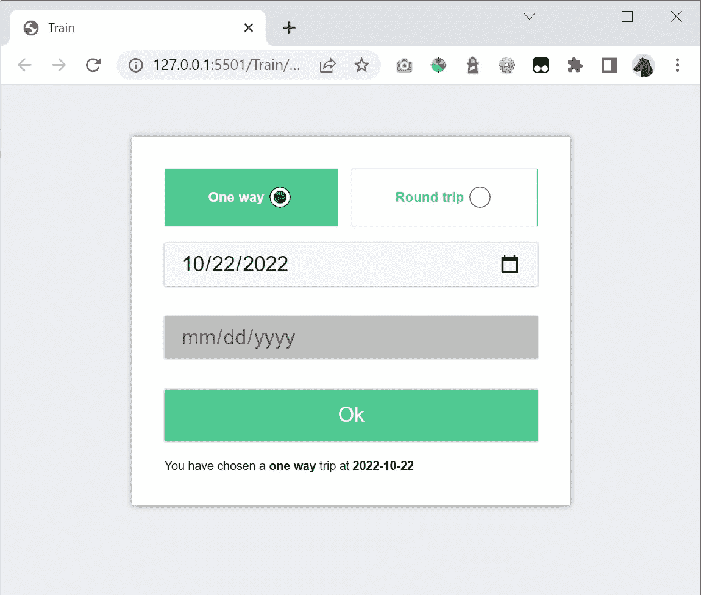

用户可以选择*单程*或*往返*。当按下 *ok* 时，应显示与选择相对应的文本。

这看起来是一个简单的任务，但困难在于细节。界面应该对用户的选择做出反应:文本应该在适当的时候显示和隐藏，按钮和日期选择器应该在用户做出不同选择时启用或禁用。验证部分并不难，但也很重要。如果选择单程或往返，文本(“您已选择……”)应该会有所不同。

我不在乎样式，但我希望组件的行为符合我对学生的期望。

我们走吧！

# 放置 GUI 组件

首先你看到我对人工智能的输入。然后您会看到生成的代码。

> 添加两个单选按钮，用户可以在“单程”和“往返”之间进行选择

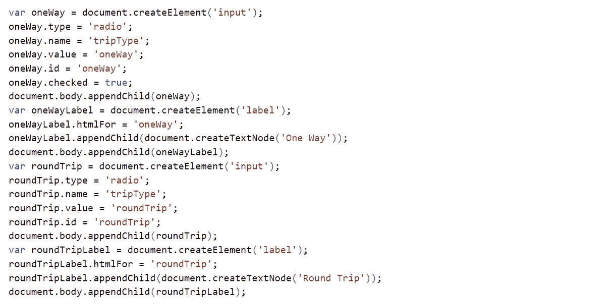

Ok so this is a bit mechanical. But anyway, it’s really crazy that the AI understands my comment and can write functional code!

> 添加两个日期选择器:“from”和“back”

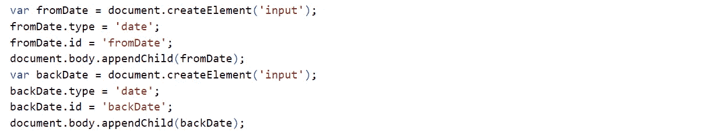

I wonder why “var” is used instead of “let”? Maybe Codex has parsed a lot of rather old code

> 添加一个确定按钮

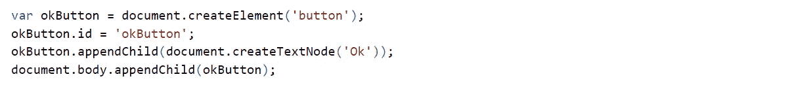

> 添加放置结果文本的位置

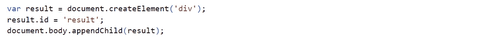

# 确认

> 创建一个函数来验证表单:1)如果选择了单向，并且清除了第一个日期选取器，则表单无效 2)如果选择了往返，并且清除了任何日期选取器，则表单无效

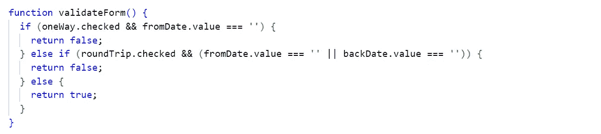

Quite impressive. The comment isn’t super specific and mechanical, I write “the first datepicker…” and “..any datepicker…” but it solves it somehow

# 对用户行为做出反应

> 创建函数 updateForm:如果 validateForm()返回 false，则禁用 Ok 按钮。启动时运行此功能

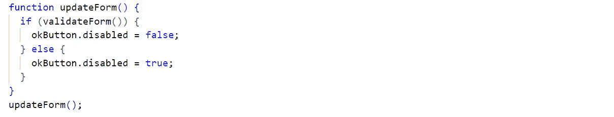

“Run this at startup” — the AI understands that the last line is necessary. A small but impressive move.

> 如果用户更改任何输入，运行 updateForm

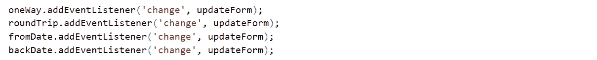

> 如果点击了“确定”按钮并选择了“单程”,写下类似“你选择了 2022-10-19 的单程旅行”的内容。如果选择往返，写下“您选择了从 2022 年 11 月 3 日到 2022 年 11 月 7 日的往返”

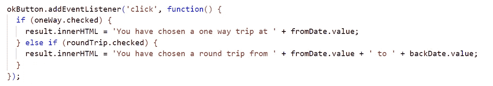

This is really cool. A human would understand the comment, but it’s impressive that a machine can. It understand that I’m not looking for some exact dates like 2022–11–03 but the value for fromDate and backDate

> 创建一个函数 clearResult 来清除结果文本

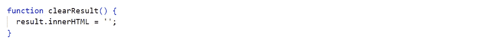

This is an example of a comment I had to write to make the later code a bit cleaner

> 如果用户更改任何值，运行 clearResult

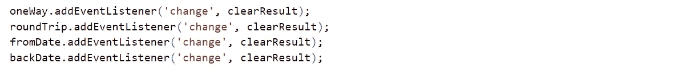

> 如果选择了一种方式，隐藏第二个日期选择器。启动时也隐藏它

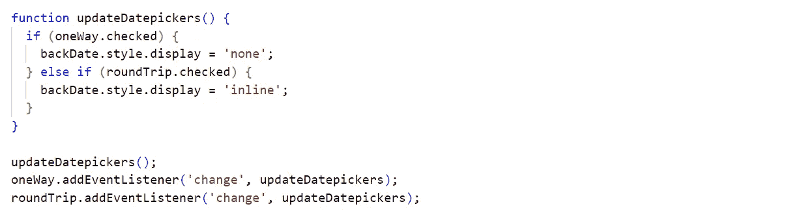

# 反射

我对它的效果印象深刻。花了一段时间才想出正确的评论。有时人工智能会生成快速难看的代码，所以我不得不撤销并做得更具体一些，比如:创建返回 y 的函数 X。

花了 2-3 个小时才找到评论，而我可能会在 1 个小时内用老方法解决这个问题。但我是一个初级评论人工智能作者，也是一个高级老式开发人员，所以我想我写评论比写代码快只是个时间问题。

最终的代码需要一点重构，但由于这只是早期版本的 Codex，未来几年将会发生很多事情。这让我同时感到高兴和悲伤。就像荷马吃他喜欢的龙虾一样。

我认为人工智能能做的事情很迷人，但我不想让人工智能独享所有乐趣。

我很想听听你的评论和想法😊

 [## Mlearning.ai 提交建议

### 如何成为 Mlearning.ai 上的作家

medium.com](/mlearning-ai/mlearning-ai-submission-suggestions-b51e2b130bfb)