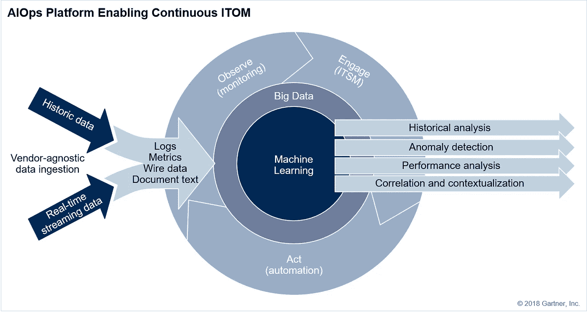

# AIOps —运营分析重新定义

> 原文：<https://medium.com/mlearning-ai/aiops-operations-analytics-redefined-9b957334e7f5?source=collection_archive---------4----------------------->

Photo by [Henri L.](https://unsplash.com/@d3cima?utm_source=medium&utm_medium=referral)

> “数据是一种珍贵的东西，它将比系统本身持续更久。” —蒂姆·伯纳斯·李爵士

我们生活在一个激动人心的时代，在人工智能的帮助下，大量利用数据的力量。从人工智能成为改变业务流程的下一件大事，到客户参与的灵魂，机会是无穷的。IT 运营是目前人工智能可以证明自己实用性的最有前途的领域之一。

我们已经看到世界上一些最大的技术公司逐渐转向人工智能解决方案。随着客户和员工要求更快的响应时间、更可靠的服务和 IT 运营团队越来越多地被要求快速交付定制报告或仪表盘，以此作为跟踪 KPI 的一种方式，这些企业抛开传统思维，开始拥抱人工智能是有意义的。因此，让我们来看看如何将人工智能用于 IT 运营，以提高业务绩效。

# 什么是 AIOps？

最初被称为算法 IT 运营的概念后来在 2016 年被 Gartner 作为一个行业类别创造为 AIOps。Gartner 对 AIOps 的官方描述是:

> “AIOps 平台利用大数据、现代机器学习和其他高级分析技术，通过主动、个性化和动态的洞察力，直接和间接增强 IT 运营(监控、自动化和服务台)功能。AIOps 平台支持同时使用多种数据源、数据收集方法、分析(实时和深度)技术和呈现技术。”

简而言之，AIOps 是一种借助数学算法和模型更好地监控、分析和改善系统性能的方法，通过精确的参与方法提供对整个平台的实时感知，从而提高 IT 运营的效率。

# AIOps 和 DevOps

近年来，随着社会和技术的转变，IT 系统经历了巨大的发展。这种加速的一个巨大副作用是这些解决方案的开发和部署速度很快，而且这些系统会产生大量的数据。传统的 IT 开发和运营方法根本无法应对这种情况，最终导致项目的最后期限推迟。正是这些原始的技术问题催生了 DevOps。

DevOps 可以定义为软件开发和 IT 运营的结合，以加速开发过程。DevOps 方法的优势在于，它确保了更快、更有效的流程，并改善了最终用户体验。在改进的通信和协作的帮助下，操作环境趋于更加稳定。DevOps 为整个工作流程提供了所需的灵活性，这使得它成为全球商业实体的最爱。现在，越来越多的企业在容器和微服务的帮助下采用云原生应用，以实现更好的可扩展性和容错能力。这反过来又使 DevOps 团队的工作变得更加复杂。他们现在需要一个更强大的解决方案，能够更高效地发现和消除问题。

这就是 AIOps 发挥作用的地方，它帮助 DevOps 团队处理日常 IT 任务。通过将人工智能和机器学习算法应用于监控数据，AIOps 可以学习环境的行为并相应地生成警报。根据检测到的异常，AIOps 将能够将所有来源的重要警报关联到可操作的上下文洞察，从而实现 DevOps 自动化。全面的 AIOps 解决方案还能够确定根本原因和影响，并根据之前的解决步骤和反馈提出潜在的解决方案。

# 它是如何工作的？

## 数据源

AIOps 使用传统的 IT 监控数据源，如日志、指标、网络数据等。然后，可以使用算法进一步分析来自所有这些来源的数据，以识别后续事件，否则，由于输入数据流的数量和复杂性，这将需要繁重的人工工作。

## 大数据

为了帮助实时处理 IT 流数据，Hadoop 等大数据平台为机器学习/人工智能算法提供了支持。

## 算法/机器学习

AIOps 平台将需要使用不同的算法来充分利用接收到的数据。这将包括:

*   **使用各种 KPI 分析系统性能**
*   识别可能需要采取行动的**模式**
*   **关联不同数据集之间的关系**并根据需要分组
*   通知并授权合适的人采取正确的行动。

所有这些算法都是基于 ***机器学习*** ，将 ***人工智能*** 注入系统，赋予其自行摄取和适应新信息的能力。在 IT 运营中，机器学习是 AIOps 区别于传统 ITOps 的地方。在没有机器学习的情况下，AIOps 平台相对于传统 ITOps 只能提供增量改进。

## 自动化

作为人工智能分析的结果而产生的动作然后可以被自动化，以对事故或场景提供更快速和精确的响应，从而提高整体系统性能。

借助 AIOps 算法建立的特性及其自动化构成了 AIOps 平台的五个主要用例*—***性能分析、异常检测、事件关联和分析、IT 服务管理*** 和 ***自动化。****

# *用户是谁？*

*AIOps 是一个平台，所有类型和规模的组织都可以将它用于不同的场景。*

## *云原生中小企业*

*云原生基础设施是 AIOps 最适合的，因为应用程序将作为容器内的微服务进行部署，对于中小型企业来说，完全选择这种在该规模下更具成本效益和效率的基础设施是理想的。*

*尽管云本地环境中的应用程序更容易开发和维护，但这使得服务间的通信变得更加复杂。部署的数量也将非常多，所有这些加在一起会使 IT 运营变得非常困难。AIOps 将是对 DevOps 的一个非常有价值的补充。*

## *环境复杂的大型企业*

*大型企业会处理跨越不同技术类型的系统，消耗大量数据。维护这样的系统，提供有效的分析将是最适合 AIOps 的工作。*

## *具有混合环境的企业*

*基于云的工作负载有其自身的优势，但本地基础架构也是如此，尤其是在处理高度机密的数据时。因此，组织有时会选择混合基础架构，以充分利用两者的优势。*

*但是，这可能会让 IT 运营部门为跟踪所有事情而头疼。AIOps 帮助团队保持对这种基础设施设置的控制。*

## *经历数字化转型的企业*

*数字化转型是用数字化流程取代非数字化或手动流程，从而转变业务或相关服务的过程。这也可能是用更新的技术平台对现有数字服务的升级。数字解决方案可以在性能增强的基础上实现新的创新和创造力。*

*AIOps 在这种需要精确分析的转换项目中非常有用。*

# *我的看法*

*AIOps 是新的数字化转型浪潮中不可或缺的一部分，在这一浪潮中，整个行业都在转向云原生基础设施。*

*单一系统的时代已经一去不复返了，因为企业在 DevOps 方法的帮助下采用模块化架构以获得更好的灵活性，这在另一方面大大增加了这些系统的复杂性。*

*AIOps 为 IT 操作人员提供了急需的缓解，他们似乎正在努力适应这种基础设施的巨大需求。*