# 数据驱动的 Airbnb 房产搜索:如何找到你理想的家

> 原文：<https://medium.com/mlearning-ai/airbnb-property-shopping-the-data-scientist-way-b86abd992787?source=collection_archive---------5----------------------->


Photo by [Karsten Winegeart](https://unsplash.com/@karsten116?utm_source=medium&utm_medium=referral) on [Unsplash](https://unsplash.com?utm_source=medium&utm_medium=referral)

你在考虑投资一个短期出租的房产吗？在这篇文章中，我将带你一步一步地评估一个理想市场中可以用作 Airbnb 度假租赁的房产——佛蒙特州西多佛，靠近斯诺山滑雪场。我们将首先分析该地区的市场趋势，并使用这些信息，通过机器学习模型来估计目标物业的公平市场价值。接下来，我们将比较我们的估计值和评估人的估计值。最后，使用来自 AirDNA 的数据，我们将估计未来的租金，并使用贴现现金流模型来确定该物业是否是一项合理的投资。到本文结束时，你将对如何使用定量方法评估短期租赁物业有一个全面的了解。

# 1.雪山，市场需求:

位于佛蒙特州西多佛的著名滑雪胜地斯诺山是来自纽约、康涅狄格和波士顿等邻近州的游客的主要目的地。距离波士顿仅两小时车程，距离纽约仅四小时车程，该位置为短期租赁物业提供了绝佳的机会。然而，找到每年游客数量的数据可能很困难。为了了解该地区的滑雪需求，我利用了各种工具，如谷歌搜索趋势、当地新闻文章和来自 AirDNA 的数据来衡量该地区的兴趣。

## 一.来自谷歌趋势的线索:

我用来估计该地区需求的工具之一是谷歌趋势。通过分析与雪山和周边地区相关的关键词的搜索量，我能够深入了解潜在游客的兴趣水平。为了获得更多信息，我将“雪山”的搜索量与《华尔街日报》一篇文章中提到的其他滑雪场进行了比较。结果很有启发性；与汽船滑雪场和鞍背山等其他滑雪场相比，斯诺山的搜索量相当不错。该数据进一步证明了雪山是一个受欢迎的热门目的地，为该地区短期租赁物业的潜在成功提供了支持。

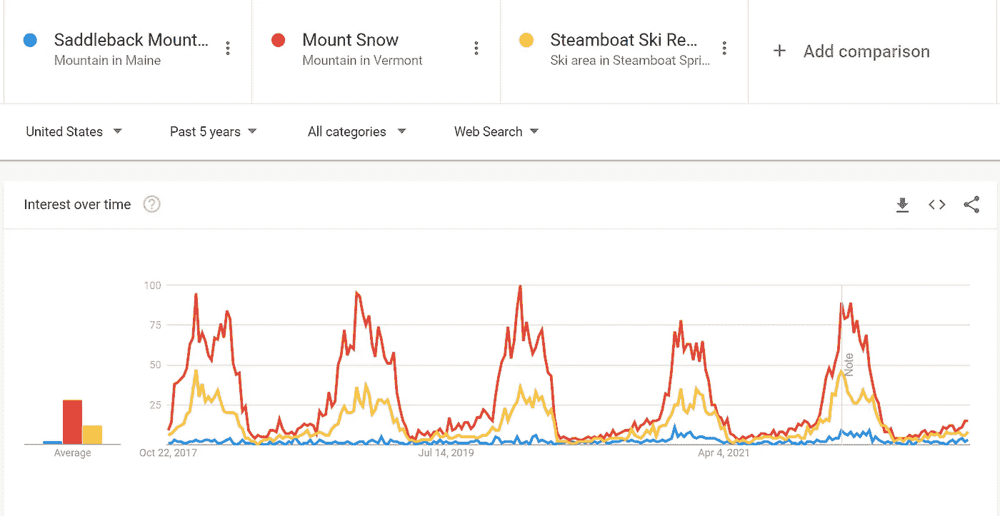

Search trends for Mount Snow (Red), Saddleback, and Steamboat Ski resorts

## 二。来自斯诺山最近扩张的线索:

值得注意的是，Mount Snow 的管理层计划对度假村进行重大投资，包括 4 亿美元用于电梯升级和设备现代化。这是一项重大投资，表明了对度假村长期生存能力和增长潜力的强烈信心。此外，Mount Snow 的管理层预计将在三年内收回投资，这对潜在投资者来说是一个积极的信号。这种投资和前瞻性管理预示着度假村的未来，并为该地区短期租赁物业的潜在成功提供了额外的支持。

## **三世。来自 AirDNA 的提示:**

我用来收集西多佛短期租赁市场信息的一个有价值的工具是 AirDNA。AirDNA 提供 Airbnb 或 VRBO 上列出的任何房产的详细数据，并根据短期租赁市场的表现为每个城市和社区指定一个市场等级。该等级由四个指标决定:租赁需求、收入增长、季节性和监管。根据 AirDNA，西多佛获得了 B 级，这表明该市场具有很高的盈利和投资潜力。这进一步证实了该地区短期租赁物业的潜力，并支持了西多佛市场的积极前景。

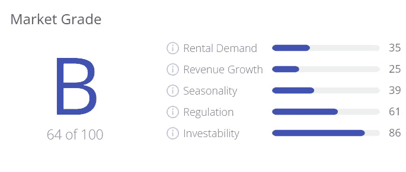

AirDNA Grade on Mount Snow

正如我们所看到的，通过使用多种方法，我们能够确认对雪山地区有强烈的需求。有了这些知识，现在让我们把注意力转向确定目标物业的公平市场价值。通过利用机器学习模型，我们可以估计财产的价值，将其与估价人的估计进行比较，并使用该信息对财产做出明智的报价。

# 2.预测房价

现在，我们已经很好地了解了该地区的需求和类似物业的公平市场价值，是时候估计目标物业的价值，并将其与评估值进行比较。在这一步，我将演示如何使用机器学习模型和房地产数据来估计财产的价值，并做出明智的报价。到这一步结束时，你将清楚地了解如何使用数据和技术来估计财产的价值，并提出有竞争力的报价

## **一、数据探索:**

估算目标物业价值的第一步是收集该地区可比物业的数据。为此，我使用网络抓取工具从 Zillow.com 收集了佛蒙特州西多佛的 452 处房产信息，包括房产类型、面积、位置和售价等细节。使用名为 Pandas 的 Python 库，我能够分析这些数据，并发现该地区出售的大多数房屋都是共管公寓，其次是独栋房屋。通过了解该地区的物业类型，我可以确保在评估其价值时，我将目标物业与类似的物业进行了比较。

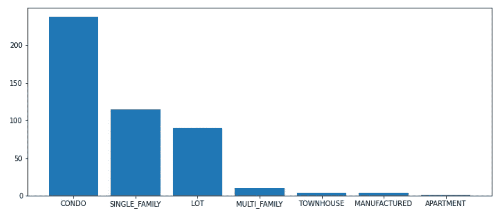

Bar plot of total homes sold by property type

有了这些数据，我使用 K-means 算法根据地理位置将这些房产分组。这让我能够识别数据中的模式和趋势，并了解不同位置的房地产如何相互比较。使用这种方法，我能够将 452 个属性分成七个组，如下图所示。如您所见，我的目标物业属于第三个集群(深紫色)，位于斯诺山附近。这些信息将有助于确定目标物业的公平市场价值，因为它允许我将其与相同地理位置的类似物业进行比较。

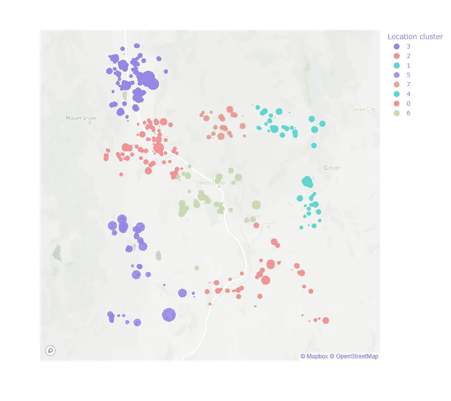

K-means clusters of Longitude and Latitude

图像中气泡的大小代表每处房产的售价，因此气泡越大，价格越高。通过观察第三和第五类，很明显最昂贵的房子是在这些地区出售的。为了从这些数据中获得进一步的见解，我将使用散点图来探索变量之间的不同关系。我要研究的第一个关系是房产售价和居住面积之间的关系。这将有助于我理解房产的大小如何影响其价值和价格。

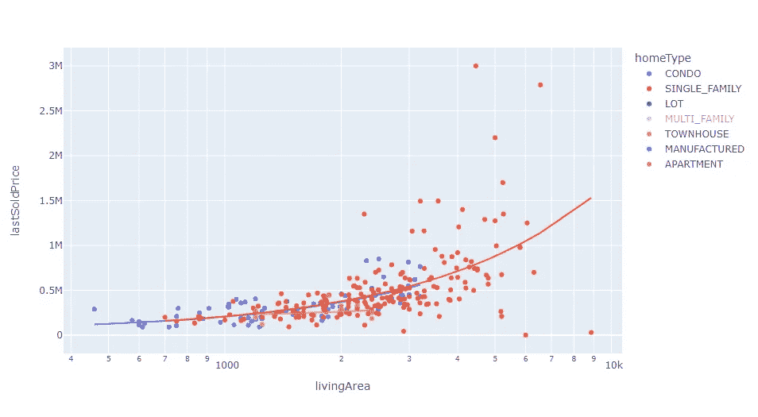

Relationship between 'Living Area' and 'LastSoldPrice' colored by 'Home type.'

散点图显示了房产的居住面积和销售价格之间的正相关关系，但这种关系不是线性的。我们可以看到超过 3000 平方英尺的房产偏离了预测线。然而，对于居住面积低于 3，000 平方英尺的房产，这种关系要强得多，并且密切遵循预测线。这告诉我们，较小物业的出售价格对其面积高度敏感，但随着物业面积的增加，美学等其他因素在决定价格方面变得更加重要。

为了获得更多的见解，我在另一个散点图上绘制了相同的变量，但这一次我使用了 K-means 算法创建的聚类来给观察结果着色。这有助于我了解聚类与房产价格和面积的关系。例如，很明显，靠近斯诺山的第 5 类房产往往价格较高，尤其是居住面积较大的房产。此外，同样靠近雪山的集群 3 中的房产往往是该地区第二高的价格，这可能是由于靠近度假村和该地区的需求。

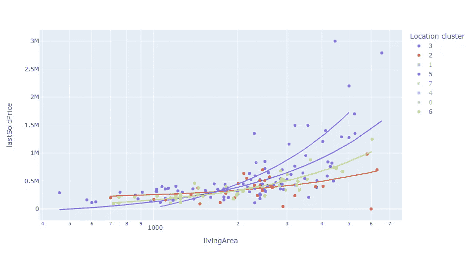

Relationship between 'Living Area' and 'Last Sold Price' colored by 'Location Cluster.'

## **二。XG 升压**

为了估计目标资产的公平市场价值，我使用了一种极端梯度推进算法来训练一个模型。该算法在 80%的数据集上进行训练，20%用于测试。该模型根据房屋类型、浴室数量、卧室数量、居住面积、房龄、房间数量、出售房屋的年份和月份以及位置聚类等特征进行训练。虽然可能有其他因素与确定房产价值相关，如房屋质量或地段大小，但我选择在此模型中关注这些特定因素。这意味着模型在更一般的属性上可能比在唯一属性上表现得更好。

我使用最大深度为 6 的树和均方误差损失函数将该算法应用于 304 次观察。为了评估模型的性能，我比较了训练集和测试集的平均绝对误差。

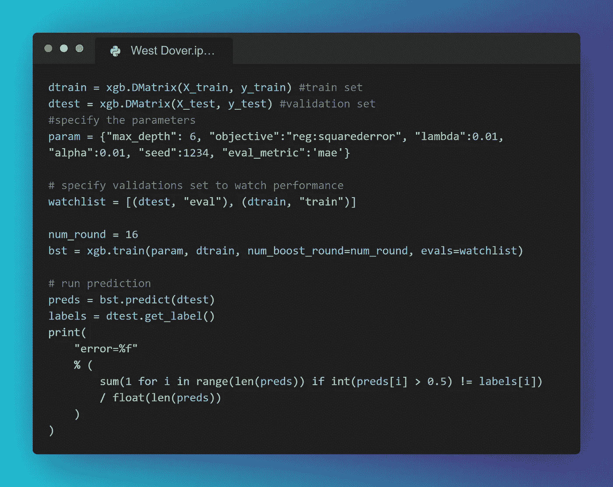

该模型的结果显示，第 15 次助推迭代的评估误差最低，为 69，245 美元。然而，我也进行了误差分析，以评估模型的预测准确性。我发现，在预测具有独特特征的大房子的价值时，这个模型表现不佳。这表明，如果我们希望在未来提高模型的准确性，一个潜在的解决方案可能是将更多的特征纳入分析，如房屋的质量或地段的大小。

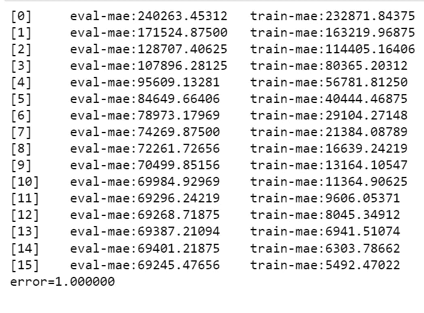

15th boosting iteration results in the best evaluation set mean absolute error

利用模型提供的信息和有关目标物业的数据，我们可以预测其公平市场价值。在这种情况下，我们的 XGB 模型预测目标资产的售价为 311，091 美元。有了这个预测，我们现在可以将其与评估值进行比较，并决定是否继续投资。

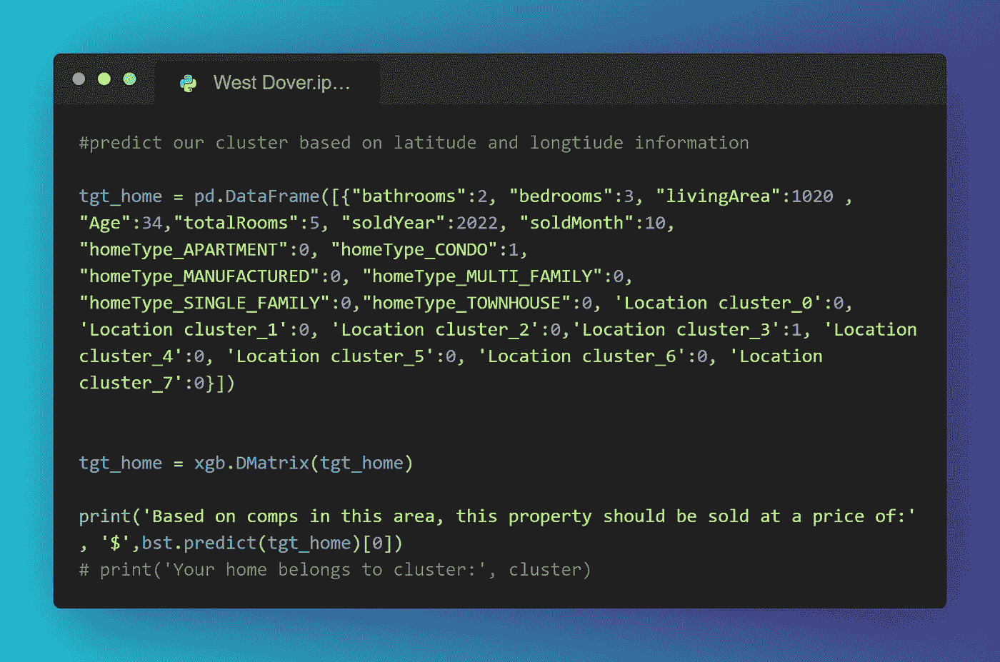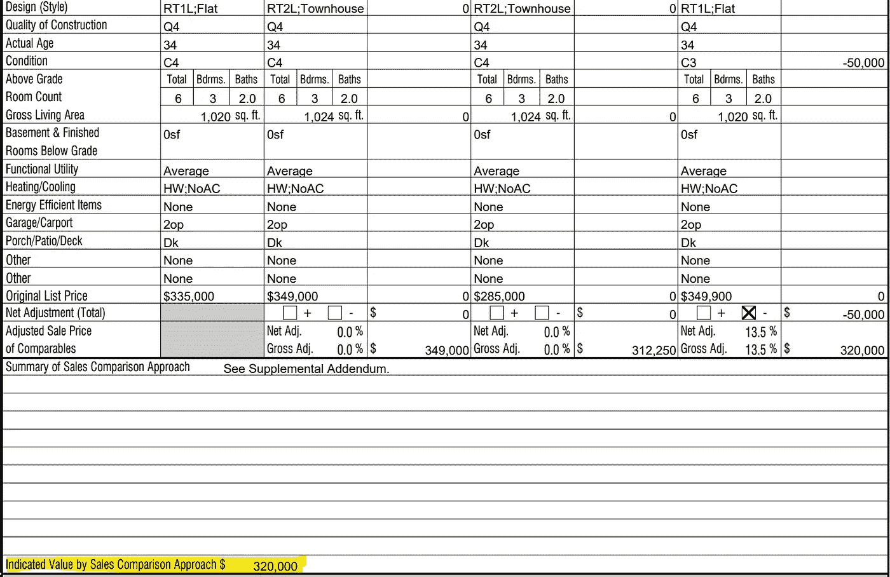

Appraiser indicated value = $320,000

有了算法的预测，我们现在可以将其与评估值进行比较。在这种情况下，评估师对目标物业的估价为 320，000 美元，略高于算法预测的 311，091 美元。这是一个有希望的结果，表明我们的算法的预测是相当准确的。既然我们对房产的公平市场价值有了很好的认识，下一步就是使用贴现现金流模型来决定是接受还是拒绝这个投资提议

# 3.贴现现金流模型(DCF)

DCF 是一种通过估计投资的预期未来现金流来评估投资价值的流行方法。在这种情况下，我们会使用十年的时间跨度，意思是如果投资在十年内不赚钱，我们就不追求了。DCF 模型使用六个主要部分，包括估计未来现金流、费用、终端现金流、贴现未来现金流、初始投资和评估指标，如净现值和内部收益率。这将有助于我们了解投资的盈利能力以及是否值得追求。

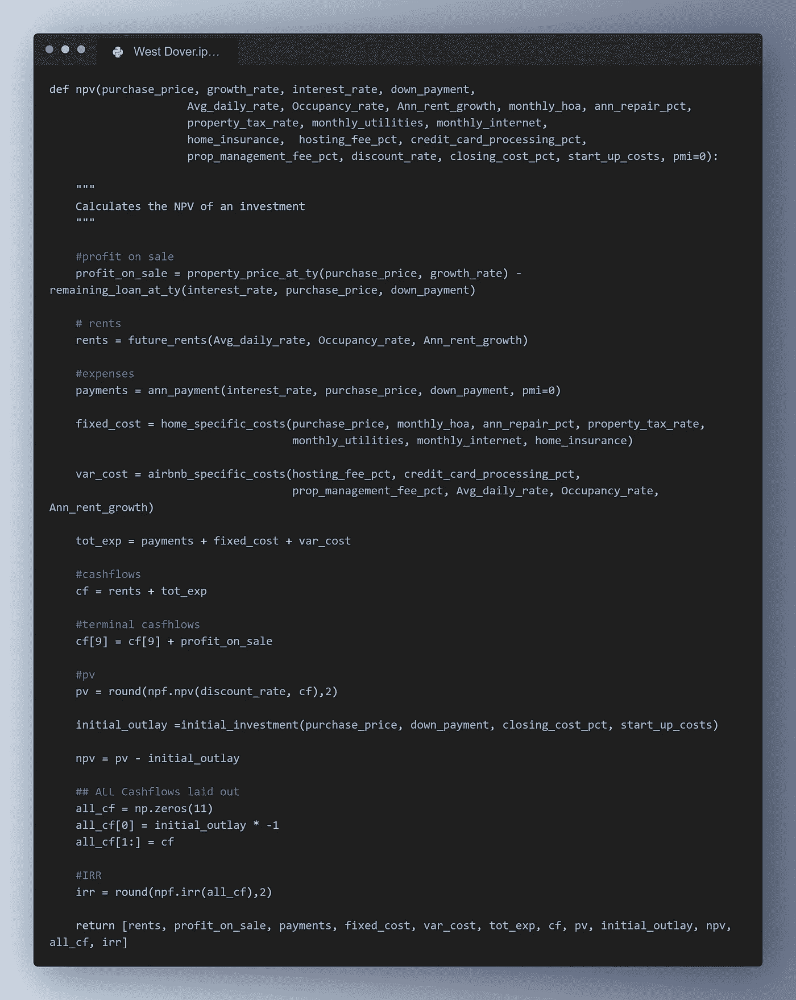

This function returns multiple parameters such as total rents, payments, present value, initial outlay, net present value, and IRR.

上面开发的净现值(NPV)函数采用一组 20 个参数，并输出用于项目评估的多个指标。出于本文的目的，我们将重点关注 NPV 和内部收益率(IRR)。

NPV 是一个财务指标，它按照给定的贴现率调整未来的现金流(这里是利润，因为我们使用的是基于现金的会计方法)。贴现率是你作为投资者要求获得的最低投资回报，以补偿进行这项投资的风险。内部收益率(IRR)是项目的实际回报。

```
present_value = cashflow_of_year / (1 + discount_rate)^n
```

在这个模型中，我们使用 8%作为贴现率。这意味着如果这个项目不能产生 8%的回报，NPV 将为零，所以我们将拒绝这项投资。

我们的下一步是将所有 20 个参数插入到函数中。例如，如果我们以每天 700 美元的价格预订该物业，入住率为 30%，那么 8%的贴现率为我们带来 384，000 美元的净现值和 44%的内部收益率。

使用 NPV 函数，我们可以迭代多个**日平均房价和入住率**，并生成 NPV 敏感度分析。


# 结论

我在本文中的目标是向您展示如何使用三角测量技术来了解目标市场对 Airbnbs 的年度需求，然后我们讨论了估计您应该为给定物业提供的价格的方法，最后，如何根据贴现现金流来决定是接受还是拒绝一个投资项目。

如果你喜欢阅读，请点击下面的按钮或评论，如果你想看到更多的数据驱动的投资相关文章。

*本文仅供参考和娱乐。不应将其视为财务或法律建议。并非所有信息都是准确的。在做出任何重大财务决定之前，请咨询财务专家。*

[](/mlearning-ai/mlearning-ai-submission-suggestions-b51e2b130bfb) [## Mlearning.ai 提交建议

### 如何成为 Mlearning.ai 上的作家

medium.com](/mlearning-ai/mlearning-ai-submission-suggestions-b51e2b130bfb)