# 使用 BigQuery 和 dbt 云的 AirStats 分析项目—分步教程

> 原文：<https://medium.com/mlearning-ai/airstats-analytics-project-with-bigquery-and-dbt-cloud-step-by-step-tutorial-4f08df6c693e?source=collection_archive---------2----------------------->

这是一个小型 dbt(数据构建工具)项目的分步指南。目的是介绍 dbt 的基本工作原理，让完全初学者更容易入门 dbt。

# 目录

*   介绍
*   设置 BigQuery 并加载数据
*   连接到 dbt 云并设置存储库
*   dbt 云建模
*   推荐 dbt 课程

# 介绍

我们的数据来自[我们的报告](https://ourairports.com/data/)，我的项目数据于 2022 年 7 月 25 日修改(原始数据可在[我的 GitHub repo](https://github.com/xibei-chen/airstats_dbt_project_tutorial/tree/main/raw%20data) 上获得)。在[数据字典](https://ourairports.com/help/data-dictionary.html)中可以找到所有表格中所有列的描述。我们可以下载 6 个 csv 文件供以后使用，包括机场，机场频率，导航设备，跑道，国家和地区。我在这个项目中使用的数据仓库是 GCP(谷歌云平台)BigQuery。csv 文件将被上传到 BigQuery。我们将使用 dbt 云进行一些数据转换，并创建我们的最终分析层。最终，我们将使用 preset 作为数据可视化的 BI 工具。dbt cloud 上的建模代码可在 [my GitHub repo](https://github.com/xibei-chen/airstats_dbt_project_tutorial/tree/main/models) 上获得。现在让我们开始吧！

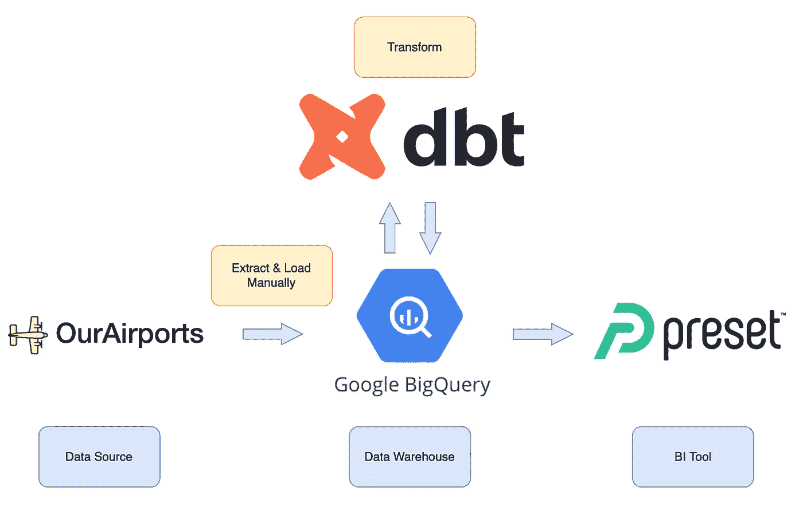

AirStats Analytics Project Overview

# **设置 BigQuery 并加载数据**

## 建立

*   登录您的 Google 帐户
*   前往 [GCP](https://cloud.google.com/) ，创建您的帐户(如果您还没有)，新客户将获得 300 美元的免费积分
*   创建一个名为 airstats-project 的新项目，然后确保选择这个项目，如下所示


*   在搜索栏上搜索 BigQuery，然后单击 BigQuery
*   单击 airstats-project 右侧的三个点，然后单击创建数据集

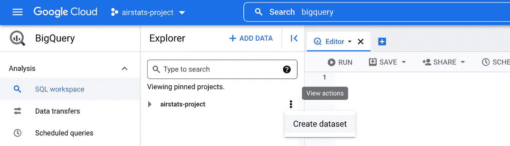

*   给出数据集 ID: airstats，选择离您的位置更近的数据位置，然后单击创建数据集

## 加载数据

*   点按 airstats 右侧的三个点，然后点按“创建表格”
*   选择从上传创建表格
*   浏览并选择要上传的 csv 文件
*   为您的表命名，例如 airports for airports.csv
*   滴答自动检测
*   单击创建表格
*   对我们从机场下载的所有 6 个 csv 文件重复加载数据的过程

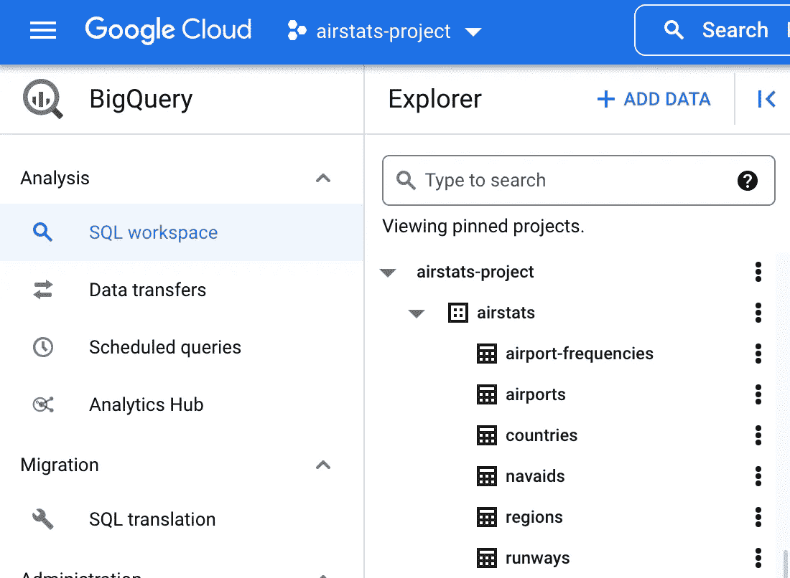

All tables uploaded

# **连接 dbt Cloud 并设置存储库**

## 生成您的 BigQuery 键

*   转到[大查询凭证向导](https://console.cloud.google.com/apis/credentials/wizard)
*   选择 BigQuery API，选择应用程序数据，不，我没有将它们用于其他云功能，单击下一步
*   在服务帐户名中键入 dbt-user，点击创建并继续。
*   选择角色 BigQuery Admin，点击继续
*   将您的电子邮件地址添加到服务帐户用户角色和管理员角色，点击完成

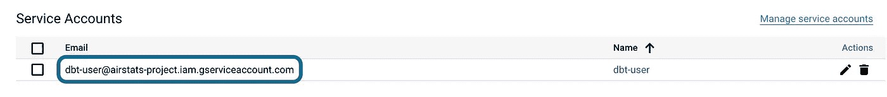

Service account created

*   单击您刚刚创建的服务帐户
*   转到密钥，单击添加密钥，然后创建新密钥，JSON，然后创建

现在私钥已经下载到您的计算机上了。向 dbt 提供这个键将允许 dbt 访问您的 BigQuery 项目。

## 将 [dbt 云](https://cloud.getdbt.com/)连接到 BigQuery

*   创建您的 dbt 云帐户
*   选择 BigQuery 来设置连接
*   上传保存在您计算机中的私钥 JSON 文件，所有其他必需的字段将自动填充
*   BigQuery 可选设置:Location 应该用您为 BigQuery 数据集选择的位置来填充
*   点击测试以验证连接是否成功
*   看到连接测试成功后，单击继续！

## 设置存储库

(接下来我在建模部分展示的所有代码都可以在[我的 GitHub repo](https://github.com/xibei-chen/airstats_dbt_project_tutorial/tree/main/models) 上获得。请随意分叉我的回购，并将代码添加到 dbt Cloud，作为从头开始做所有事情的替代方案。)

*   在添加存储库来源下选择托管
*   给你的库起个名字，我的名字是 air stats-analytics-dbt-tutorial，然后点击 Create
*   看到成功导入的存储库后，点按“继续”

# dbt 云建模

## 开始开发

*   点击开始开发，这将需要几分钟来加载
*   单击初始化您的项目
*   单击提交，编写提交消息:初始提交，单击提交
*   用 blow 代码替换 Scratchpad 中的代码，然后点击 Preview 来测试您是否能够直接从 BigQuery 查询数据

```
select * from `airstats-project.airstats.airports`
```

## 创建层:src、dim 和 mart

*   用名称创建一个新分支
*   删除模型文件夹下的示例文件夹
*   在 models 文件夹下创建 sources.yml，它设置了数据的来源，以后使用 jinja 模板会更容易引用

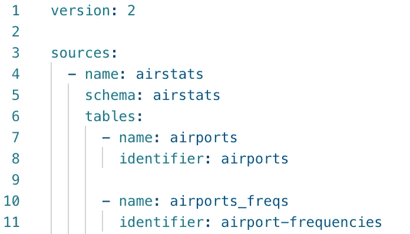

Part of sources.yml

*   在 models 下创建一个名为 src 的子文件夹，然后开始在 sql 文件中创建源模型。对于每个源模型，我们使用 CTE 和 jinja 模板来引用数据源，我们可以做一些简单的转换，比如只选择我们感兴趣的、对以后的分析有用的列，以及更改列名。这里我只展示了一个 src_airports.sql 的例子


src_airports.sql

*   接下来，我们在 models 文件夹下创建一个名为 dim 的子文件夹。例如，我在 dim_airports_filtered.sql 中过滤掉了关闭的机场，在 dim _ airports _ aggregated . SQL 中过滤掉了关闭的跑道，并做了一个简单的汇总来计算每个机场的跑道数量

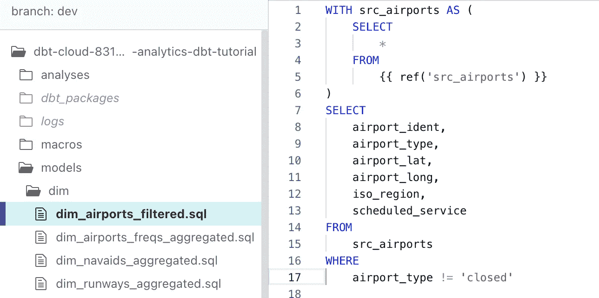

dim_airports_filtered.sql

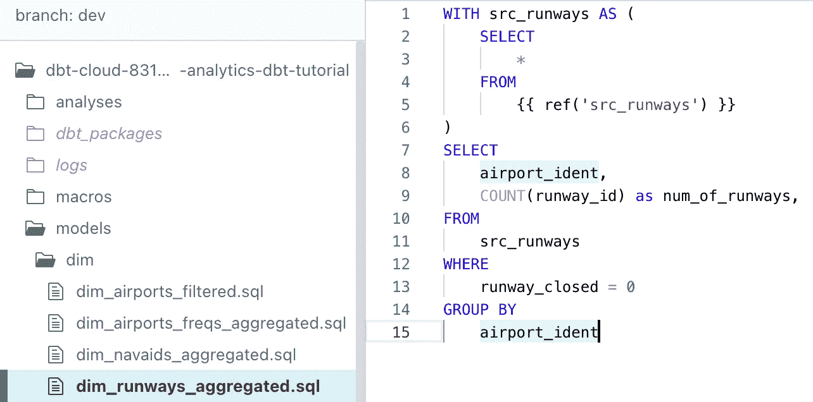

dim_runways_aggregated.sql

*   然后，我们在 models 文件夹下创建一个子文件夹 mart，我们将所有的表连接在一起，以创建最终的分析层，以便稍后连接到 BI 工具

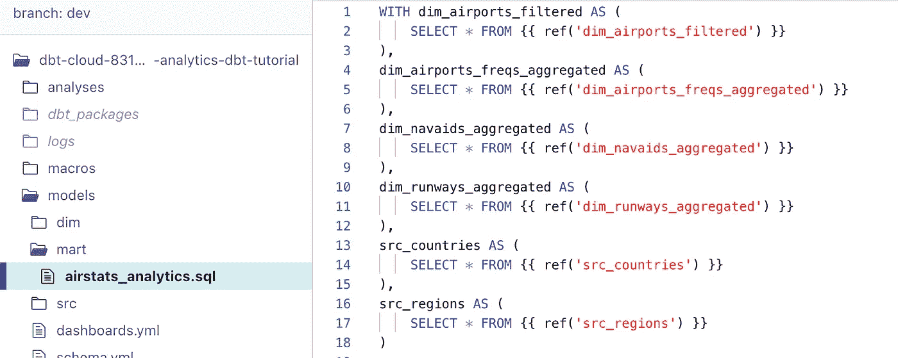

1\. Use CTEs and jinja template to refer to table

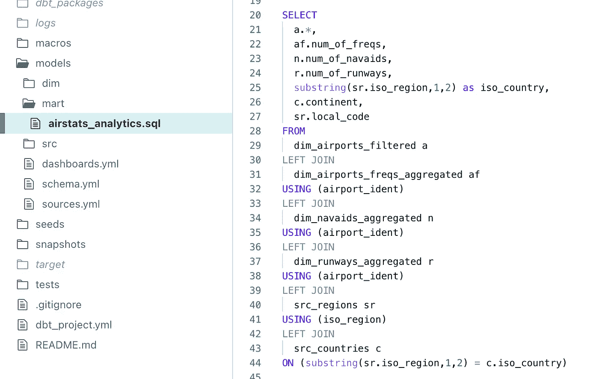

2\. Join tables and do some simple transformation to get the correct country ISO code

*   现在，我们在页面底部键入 dbt run 并点击 run，dbt 将自动检查依赖关系是否正确并构建所有模型

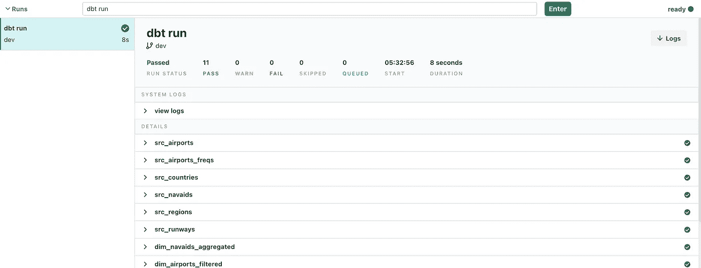

dbt run

*   现在，如果我们转到我们的 BigQuery，我们可以看到，所有的表都是在模式 dbt _[您的名字和姓氏的首字母]下创建的

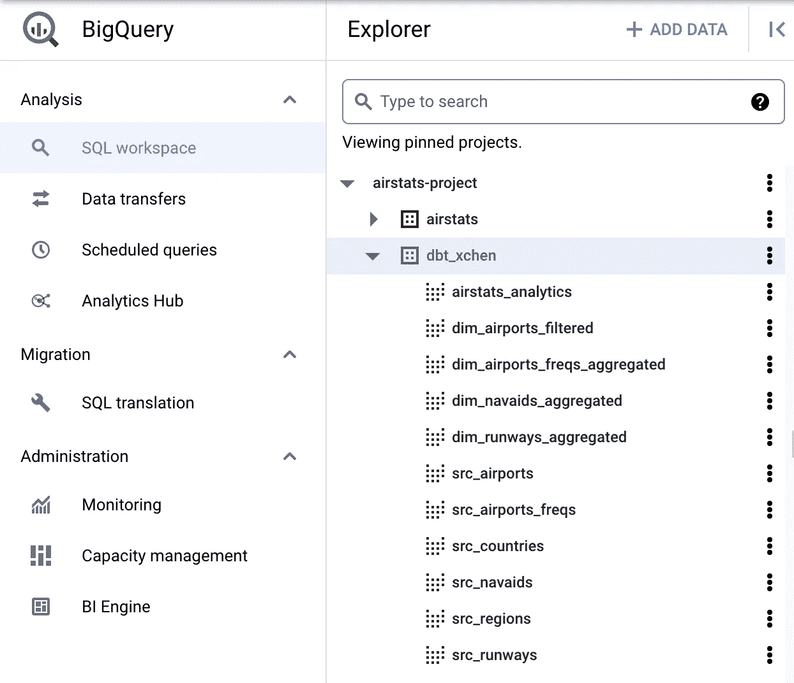

Analytics models in BigQuery generated

## dbt 试验

这里我想介绍一下 dbt 中测试的概念。有两种:单一测试和一般测试。为了进行单一测试，我们通常编写将返回失败记录的特定 sql。它们通常是一次性的测试，只有一个目的。另一方面，通用测试是在一个带有参数和自变量的测试块中定义的，并且可以反复使用。dbt 为我们提供了四个已经定义好的通用测试:unique、not_null、accepted_values 和 relationship。我想说明我们如何在我们的项目中进行这 4 个通用测试。

*   我们在 models 文件夹下创建一个名为 schema.yml 的文件


Part of the code in schema.yml

*   如上图所示，我们可以测试 airport_ident 是否唯一且不为空，airport_type 列是否只有这 6 个可接受的值，以及 dim_airport_freqs_aggregated 中的每个 airport_ident 是否存在于 dim_airport_filtered 中。
*   我们在页面底部键入 dbt test 并按 enter 键，dbt 将执行所有测试。如果测试通过了，那我们就没事了。如果没有，我们需要通过查看测试的细节来找出如何修复错误。

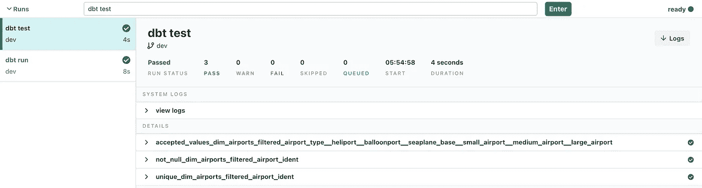

dbt test passed

## BI 仪表板

最后，我们希望可视化我们的分析。这里我使用预设作为我的 BI 工具。

*   创建一个[预设的](https://preset.io/)账户
*   然后单击顶部选项卡中的数据->数据库
*   添加数据库->选择 Google BigQuery ->上传 BigQuery 的私钥 JSON 文件，然后点击连接
*   单击顶部选项卡中的数据->数据集
*   添加数据集->选择 Google BigQuery ->选择模式 dbt _[您的名字和姓氏的首字母]，因为这是我们的最终市场模型的存储位置，然后选择 airstats-analytics
*   然后，我们可以轻松地从这个数据集创建一些图表和仪表板

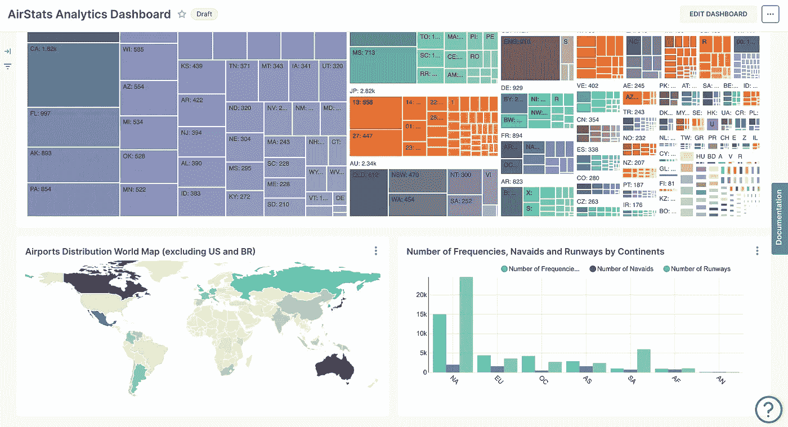

Dashboard

## dbt 文件和风险

dbt 的另一个优点是，它还使代码和文档紧密地联系在一起。我们可以很容易地更新模型、依赖关系、描述等。dbt 文档将自动更新。我们还可以在 dbt 文档中查看谱系图。dbt 风险允许我们从 dbt 文档中直接查看我们的仪表板。

*   首先让我们设置 dbt 曝光，点击你的预设仪表板上的三个点->共享->复制永久链接到剪贴板
*   然后转移到 dbt cloud，在 models 文件夹下创建 dashboards.yml，在 url 粘贴链接，可以指定仪表板的成熟度，仪表板依赖于哪个模型，所有者是谁等。省省吧。

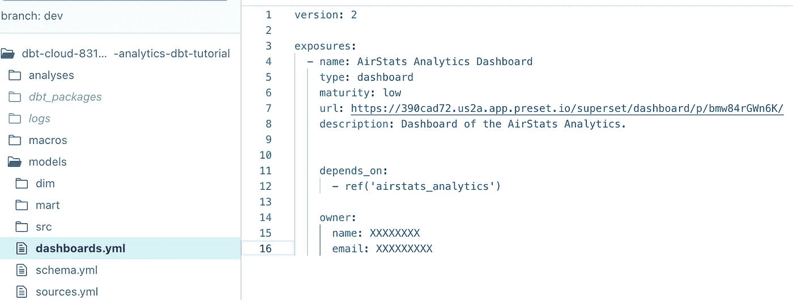

dashboards.yml

*   在页面底部键入 dbt docs generate，然后按 Enter 键
*   您将看到一个弹出窗口，提示您可以查看文档，然后单击查看文档

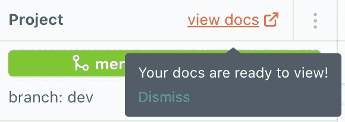

dbt docs are ready

*   单击您的仪表板，然后单击查看此暴露，您将被定向到预设仪表板

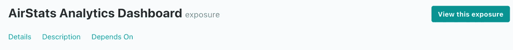

View this exposure

*   您也可以单击页面右下角的“查看谱系图”

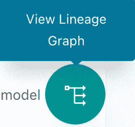

Click View Lineage Graph

*   然后我们可以看到我们项目的谱系图，我们也可以通过资源、包、标签等进行过滤。这让我们对模型的依赖性有了一个直观的了解。

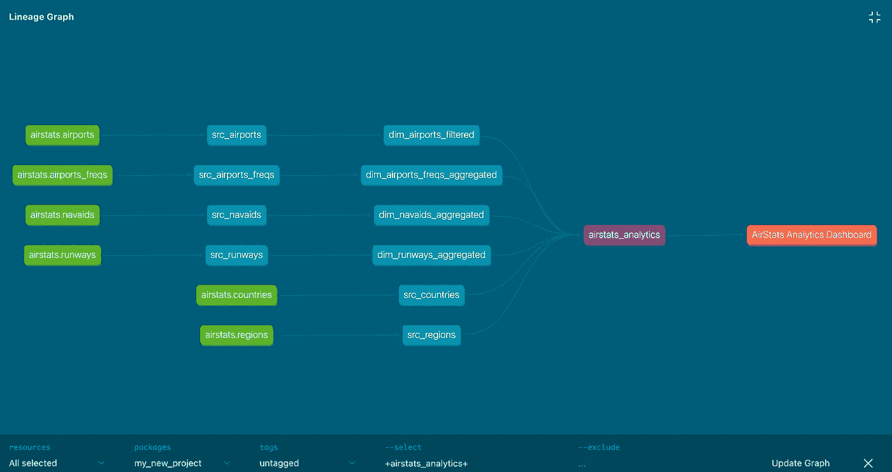

# 推荐 dbt 课程

这个 AirStats dbt 项目主要是为了练习 dbt 的基础知识，让完全的初学者快速开始使用 dbt。还有很多其他的 dbt 概念和实践需要我们继续探索。如果您想了解更多关于 dbt 和分析工程的知识。推荐你去看看 [**dbt(数据构建工具)Bootcamp:学习分析工程**](https://www.udemy.com/course/complete-dbt-data-build-tool-bootcamp-zero-to-hero-learn-dbt/?referralCode=659B6722C93EF4096D11) 。

该课程是由我的导师从中欧大学 Zoltan 托特和迈克 Petridisz。在学习期间，我从他们那里获得了很好的关于数据工程和云计算的学习经验。当时 dbt 不在我们的课程之内，所以我不得不通过各种在线资源来学习它。与我学过的所有其他课程相比，这门 Udemy 课程非常准确。在几个小时内，我们可以掌握所有的基本概念，如物化、种子、源代码新鲜度、快照、宏、自定义测试、包、文档、分析、挂钩和暴露等。而实用的部分，就是用 dbt 和雪花(另一家顶级云数据仓库解决方案提供商)搭建一个真实世界，动手操作的 Airbnb 项目。如果你完全是这个领域的新手，没必要担心，你可以简单地按照课程的自上而下的方法先学习理论，然后用 dbt 进行实践。最重要的是，导师们一直致力于根据学生的反馈和行业的趋势和热点话题更新课程，这真的很有动力，也正是我定期查看这门课程以了解更新资料的原因。

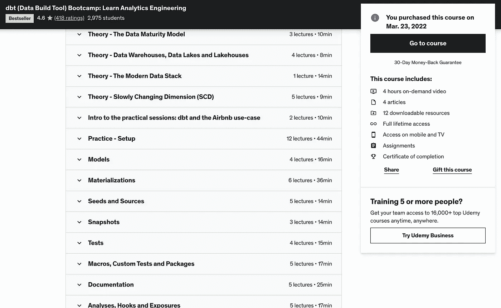

dbt (Data Build Tool) Bootcamp: Learn Analytics Engineering

总而言之，希望大家学习 dbt 愉快！它是一个非常流行的数据转换工具。我相信，对于任何与数据仓库交互并使用 SQL 的人来说，将 dbt 放入我们的工具箱将是一个明智的决定，无论您是分析工程师、数据工程师还是数据科学家等。

[](/mlearning-ai/mlearning-ai-submission-suggestions-b51e2b130bfb) [## Mlearning.ai 提交建议

### 如何成为 Mlearning.ai 上的作家

medium.com](/mlearning-ai/mlearning-ai-submission-suggestions-b51e2b130bfb)