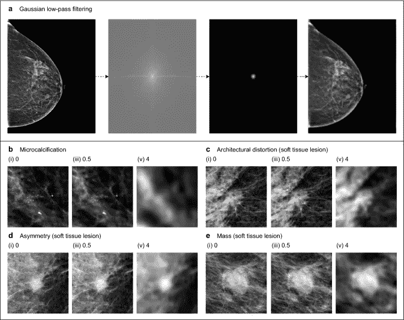

# 人工智能还没有取代医生

> 原文：<https://medium.com/mlearning-ai/ais-are-not-replacing-doctors-just-yet-3ee53fbf6c8a?source=collection_archive---------10----------------------->

尝试使用人工智能通过图像诊断疾病可能会导致比人类检查者更多的误诊。如果你热爱人工智能，这个发现可能会让你感到有点惊讶，因为你可能已经看到了[人工智能诊断真实疾病的有效性](https://www.medicalnewstoday.com/articles/326460)。如果你不了解最新的人工智能新闻，这种可能性可能会令人困惑。

为了理解这一发现的影响，你需要理解使用人工智能来检测疾病的运动有多大。像在大多数领域一样，人工智能的整合越来越普遍。事实上，根据 [IBM 的 2022 年全球人工智能采用指数](https://newsroom.ibm.com/2022-05-19-Global-Data-from-IBM-Shows-Steady-AI-Adoption-as-Organizations-Look-to-Address-Skills-Shortages,-Automate-Processes-and-Encourage-Sustainable-Operations)，35%的公司正在他们的业务中使用人工智能，考虑到每天收集的数据量，这一数字正在快速增长。每天都有 2.5 万亿字节的数据被收集，对于所有这些数据，毫不奇怪，我们正在寻找机器来整理这些数据并提供见解，因为没有一个人——甚至一群人——可以完全分析这些数据并从中获得有意义的见解。

医疗保健领域也不例外。该行业已经在某些方面成功地将人工智能融入到日常运营中。它这样做是为了降低成本，准确预测疾病，确定病人应该接受的护理类型和时间长度，而这只是皮毛。这也是最近这项研究令人失望的原因。所以，让我们来看一下这项研究，讨论一下它的发现。

一组主要来自纽约的研究人员——其中一人出于某种奇怪的原因来自波兰——查看了 720 张乳房 x 光片的数据集。一些图像是乳腺癌患者的，一些是没有乳腺癌的患者的。他们使用深度多视图分类器和全局感知的多实例分类器框架来建立 5 个不同的深度学习模型，试图预测图像显示的是乳腺癌患者还是非乳腺癌患者。

Sample of the mammograms in the study.

研究人员随后向 10 名放射科医生展示了 720 张乳房 x 光照片。然后，放射科医生被要求对那些显示患有乳腺癌或没有乳腺癌的患者进行分类。之后，他们将进行他们认为显示乳腺癌的乳房 x 光检查，并确定至少 3 个可疑区域。这样做的原因是为了比较人工智能用来区分这两个类别的东西与放射科医生使用的东西，后者是基于医学专业知识的。他们的发现很有趣。

事实证明，人工智能使用了与放射科医生相同的乳房 x 光片区域来识别乳腺癌。然而，当他们扭曲图片时，人工智能的预测精度下降。

*顺便提一下，我是在口语中使用术语“准确性”，而不是统计定义*

但准确性的下降似乎是由于人工智能在识别的区域使用了不同的特征。

这绝对是这项研究的一个简化版本，如果你想阅读全部内容，我鼓励你这样做。

但是这一切意味着什么呢？首先，我们人类仍然比目前用于识别疾病的人工智能技术更聪明，所以，请为人类鼓掌。但这也意味着医生不应该轻易接受人工智能的决定。由于这些模型没有考虑医学文献，医生仍然应该亲自检查他们的病人，以进一步增强给病人的决定的信心。然而，我不确定有多少医生完全依赖人工智能诊断，我的猜测是很少，但我可能错了。

总有一天，这些诊断会和医生的诊断一样准确，甚至更准确，当这个时候到来时，它将是革命性的。这样，医生将花更少的时间来检查乳房 x 光片，从而减少在医院的时间。你进去，做乳房 x 光检查，人工智能不仅可以立即检测乳腺癌，还可以检测出现在胸部的其他疾病。

顺便说一下，更少的时间意味着更少的成本。您将因占用医生更少的时间而收取更少的费用。此外，医生的时间将不再稀缺，这意味着看病人的基线价格应该下降。这样想想，如果你一天有 10 个小时的空闲时间，有人让你跑去商店买 20 美元，你可能会这么做。但是，如果你只有两个小时的空闲时间，他们很可能会付给你更多的钱去商店。

坦率地说，我不能等待这项技术变得更加可用，因为它将对医疗保健行业产生深远的影响。想象一下引入这种节省成本和时间的措施后，我们可以改变的医疗保健政策。毫无疑问，这将使大多数人受益，即使你是个男人。

 [## Mlearning.ai 提交建议

### 如何成为 Mlearning.ai 上的作家

medium.com](/mlearning-ai/mlearning-ai-submission-suggestions-b51e2b130bfb)