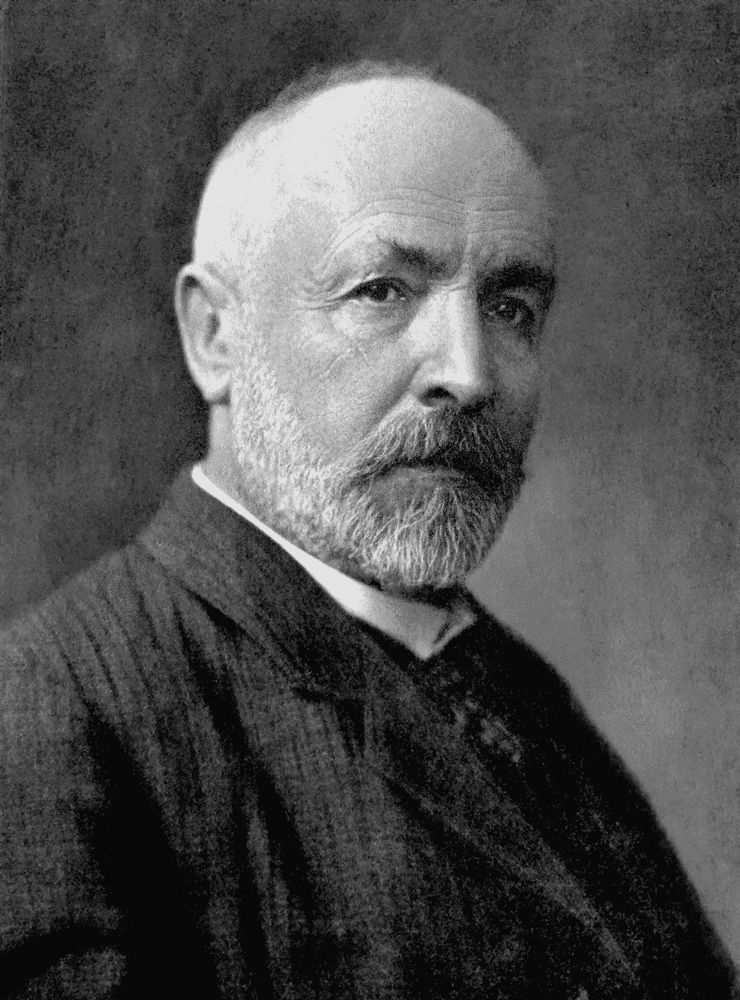
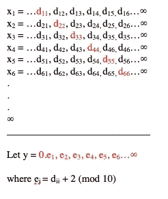
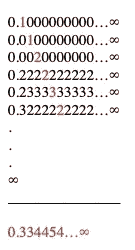
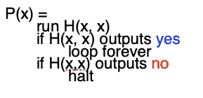

# 逻辑极限:集合论、Entscheidungsproblem &图灵可计算性

> 原文：<https://medium.com/mlearning-ai/alethic-limits-set-theory-entscheidungsproblem-turing-computability-ed0ed282b026?source=collection_archive---------3----------------------->

Georg Cantor, founder of set theory.

正如伟大的哲学家伊曼纽尔·康德在他的巨著《纯粹理性批判》中极力论证的那样，理性的应用遇到了自身的局限性。

下面我精辟地阐述了自康德以来，这些限制在逻辑、数学和计算机科学的交叉学科中的介入发展中的四种实例化方式。

不同于康德式的*二律背反*——看起来独立不可辩驳但又共同不相容的陈述对——根据康德的说法，它们是假不可判定的(康德在他的*先验唯心主义* ) *、*学说中解决了这些表面上的矛盾，下面的限制代表了一些运算的真正限制，无论它是可数性、度量、证明还是计算。这些操作的含义将在下面解释。

对下面给出的结果提出异议的唯一方法是否认某些前提公理的真实性和/或放弃*不矛盾定律*:假设一个陈述和它的否定不能同时为真。

# 无限可数和不可数集合

19 世纪晚期，德国哲学家乔治·康托(Georg Cantor)用公式证明了集合论学科的建立，改变了无穷的数学意义，其影响继续波及当前数学和计算机科学的发展。

康托的证明表明，一些无限集合是可数的，而另一些是不可数的。至少这意味着一些无穷大的大小是不相等的，但是不止如此，我们会发现无穷大的值是没有上限的。这是康托证明存在无穷多个无穷数的结果。

正如我们将要看到的，可数集合和不可数集合之间的分离是违反直觉的。如果不是这样，康托尔的证明结果就不足为奇了。

但是 [*可数*](https://en.wikipedia.org/wiki/Countable_set) 到底是什么意思呢？为了理解康托的证明，让我们首先解释什么是集合，然后逐步比较它们的基数或大小——这将最终产生无穷多个无穷大的证明。

集合是事物的集合。它的成员可以是具体的也可以是抽象的。我们可以想象一组大象和一组数字。没有秩序或纯洁的假设。除非另有说明，否则集合中的成员不必按任何特定顺序排列，或者只包含具体或抽象成员。

集合可以包含其他集合。

它们也可以是空的。

我们称空集为空集。

从我们刚才所说的来看，它们最明显的属性是集合至少有*大小*。大小的技术术语是*基数*。一组五头大象，数字五的基数是六。然而有些集合是无限的。考虑所有自然数的集合，即从零或 1 开始并一直持续下去的数{0，1，2…∞}.我们能对它们的基数说些有意义的话吗？

那么所有整数ℤ{∞…-1,0,1…∞}的集合或者所有有理数ℚ{∞…3/4 的集合，1/2，1/7，1/9，…∞呢？

事实证明你可以，而且结果令人惊讶！

直觉上，我们可能认为所有自然数的集合小于所有整数的集合，所有整数的集合小于所有有理数的集合，因为整数包含*零*和所有正数和负数，而有理数包含所有整数以及所有无法用整数表示的无限重复分数。然而，有一个数学证明表明，这些无限中的每一个都有相同的基数，也就是说，大小相等！

为了构造这个证明，我们需要 ***双射原理*** :一个在两个集合的成员之间产生一一对应的函数，这样就不会剩下不成对的成员。形式上，存在从集合 *A* 到集合 *B* 的双射当且仅当 *A* 的每个元素都与 *B* 的每个元素配对，并且没有一个 *B* 的元素不与 *A* 的元素配对。

我们接着问:是否存在从ℚ到ℕ，反之亦然，或者从ℤ到ℕ，反之亦然的双射函数？原来有:

𝑓 : ℤ → ℕ

𝑓(*n*)= { 2n 1 if*n*t52】0 | 2*n*if*n*≤0

双射原理是两个构图原理的合取: ***注射*** 和 ***注射*** 。

一个 ***内射*** 函数是这样一个函数，其中它的共域的每个元素至多映射它的定义域的一个元素。因此，它的密码子的元素可能是不匹配的。相比之下， ***满射*** 是一个将它的共域的每个元素映射到它的定义域的至少一个元素的函数。这意味着其结构域中的元件不需要像其共结构域中的元件那样是唯一的。因此， ***双射*** 是注入和满射的特例，因为它既是内射的又是满射的。如果我们能证明一个双射，我们——事实上——证明了两个基数之间的相等！

然后我们定义可数性为任意集合 a 到ℕ.的注入由于注入适用于所有小于或等于ℕ的基数，因此可数性是任何小于或等于自然数的数。∴所有小于或等于ℕ的集合*都是可数的*。

我们用任意集合 s 与自然数ℕ.的双射精确地定义了可数性

到目前为止一切顺利。**我们接着问:**有从ℕ到ℝ的双射函数吗？结果是没有，只有一条从ℕ到ℝ.的内射线这暗示了ℝ > ℕ.

## 下面是*的一个*证明(绝不是唯一的):

> 假设我们可以列出 0 到 1 之间的所有实数，也就是基数[0，1]。我们可以这样做，作为一个无穷级数的十进制展开:

Assuming that above the line we list every member of ℝ, will y be in the list?

> 垂直列表中的每个数字都代表实数的唯一且无限的十进制扩展。列表本身是无限的。我们已经穷尽了所有的数字[0，1]了吗？假设我们取这个无穷级数中的对角线展开，给列表中的每个数加 2(mod 10 表示每 8 个都转换为零)。这个数字包含在我们的初始列表中吗？

The above example with values instead of variables.

> 它不是。因此，真实的数字是不可列表的。我们已经证明了没有办法列出真实的数字。

对角线法证明了无论我们如何列出所有的实数，都有一个实数不包含在列表中。这表明真实的数字是不可列表的。

这个证明的一个推论是:任何无限集合的所有集合的集合也是不可数的！这是因为，每个集合都是其幂集的真子集。

要做到这一点，我们必须接受 ***幂*** ***集合公理*** ，它断言对于任何集合 A 都存在幂集。幂集恰好是 A 的所有子集的集合，这意味着它包含 A 本身以及空集合。【*幂集是否也包含自身:这是* ***罗素悖论*** *的一着棋，这里就不深究了*。

> **幂集公理:**
> 
> 给定任一集合 a，a 的所有子集的集合称为 a 的幂集，记为:𝒫 (A)。

可数无穷集的幂集是不可数的！

为什么ℕ的幂集不可数？那是因为ℕ和𝒫之间没有相似之处(ℕ).)我们怎么知道的？我们可以用上面的对角化来构造这个说法的证明。我们水平排列自然数，垂直排列自然数的所有子集，对于子集包含的自然数，值为 1，对于不包含的自然数，值为 0。然后我们把矩阵中的对角线作为不可能在这些基数的双射中的子集，证明自然数的幂集比自然数集有更大的基数。

因此，自然ℕ和实数ℝ之间的不等式是一个更普遍原理的特例，该原理被称为**康托定理:**

> *康托定理断言不存在最大的基数，因为对于每一个无限集合，该集合的幂集都有一个更大的基数！事实上，有无限个无限，因为有无限个幂集回归:* 𝒫 (A)，𝒫(𝒫 (A))，𝒫(𝒫(𝒫 (A)))…∞等等

# 可测量和不可测量的集合

这是另一个奇怪的结果。为了理解它，我们需要区间长度的概念，这很简单。

原来某些集合是不可测的。首先，我们所说的*指标*是什么意思？我们都熟悉间隔的距离或长度的概念。

例如，集合的长度([x，y])= y x。例如，区间[0，1]的测度为 1–0 = 1，以此类推。

为了证明不可测量性，我们需要一种特殊类型的集合称为 *Borel 集合*和一种特殊类型的测量称为 *Lebesgue 测量*。正如我们将看到的，勒贝格测度是唯一适用于 Borel 集的测度类型。什么是 Borel 集合？

Borel 集合是在一定长度段上进行*可数可加性*和*互补*的*有限*多次运算而生成的集合。让我们来定义这些操作:

> **可数可加性:**将有限或可数无限集合加在一起的运算。另一种表述方式是，该操作将有限或可数无限集合作为输入，并将它们的*联合*作为输出:{S₁、S₂、S₃…} → U{S₁、S₂、S₃…}
> 
> **求补:**取任意集合 S 与其补(所有非 S 的集合)的运算。通常对于任何集合 S，这相当于 rs，其中 R 是集合实数。对于线段[0，1]，求补得到 R[0，1]。

就概率而言，可数可加性给出了有限或无限样本空间上不相交事件的并集。同时，互补为我们提供了样本空间中剩余的东西。

对于闭集[0，1]或开集[0，1](意思是我们不算 1)或(0，1)(我们不算 0)，Borel 集合包括这些集合中每一个集合的所有线段，包括它们的所有并集和补集。

一个 Borel 集合满足下列所有条件:它包含 a)它的所有线段，b)它的所有集合的每个补集，以及 c)所有可数集合族的并集。

例如，无理数集可以由 rq 产生，其中 R 代表实数，Q 代表有理数。因为有理数是可数的，所以我们可以生成它的所有子集的可数并集。我们还可以生成它的补集，也就是无理数的集合。因此，任何可数的无限或有限集合及其补集都是 Borel 集。

勒贝格测度是所有 Borel 集上测度的唯一推广。勒贝格测度必须满足三个条件:a)并集必须在不相交或不相交的集合之间，b)测度的输出不能为负，c)线段的长度通过𝛌 ([x，y]) = y-x 对于所有的 x，y ∋ R(其中λ代表输出勒贝格测度的函数)。

重要的是要记住，勒贝格测度等于所有不相交集合的总和。

问题出现在 Borel 集之外的勒贝格测度的应用上。一些这样的集合被称为[维塔利集合](https://www.tau.ac.il/~tsirel/dump/Static/knowino.org/wiki/Vitali_set.html)，以构思它们的意大利数学家朱塞佩·维塔利命名。

为了生成 Vitali 集合，我们将区间(比如[0，1])分成等价类。所有这些意味着我们通过一些属性绑定成员，使得绑定是互斥和穷举的。我们将根据它们的测度是有理数还是无理数来对集合进行分类。

换句话说，对于[0，1]中的每个实数，恰好有一个数是 A(维塔利集)的成员，因此 r-a =有理数 Q。在这个群中，每个集合对于实数中的某个 R 都具有 Q + r 的形式，形成 Q|R 的商群，它与[0，1]相交。[0，1]的这个子集是无限的。

为了假设上述子集的存在，我们需要假设有争议的[选择公理](https://plato.stanford.edu/entries/axiom-choice/):

> **选择公理:**每一个非空集、非重叠集的集合都有 as 选择集。

让选择公理困惑的是，对于集合的无限可数集合，存在这样的集合，对于这些集合，我们不能满足从初始无限集合中一致选择一个选择集合的准则。换句话说，选择公理断言选择集的存在，而不是这样一个选择标准。虽然我们在认识论上被禁止以一种有原则的方式来构建这个集合，但是一些人发现假设这个选择集合仍然存在是合理的。

根据选择公理，我们然后生成集合 A，它是[0，1]的子集，包含来自每个等价类的成员。这一套原来没有措施。原因如下:

> 如果每个集合的测度是 0，那么通过可数/σ可加性，A 的测度也是 0。
> 
> 如果每个的测度是正数，那么通过可数/σ可加性，A 的测度是无限的。

这些结果进一步假设了勒贝格测度的均匀分布，称为平移不变性。也就是说，每个等价类中的集合在位置上不同，但在度量上不一样——它们必须都拥有相同的度量。

因为我们的区间是 0 和 1 之间的可数无穷区间，所以我们的测度应该是 1。但是维塔利集证明了测度 1 不可能有包含测度的可数无穷子集，因为如果它包含测度，那么这个测度必定是一致的。如果不放弃可数的可加性和互补，维塔利集就不可能有测度。

因此，选择公理是不可测集存在的必要条件。

# 可决定和不可决定的陈述

我们看到康托定理，我们可以获得集合理论的陈述，这是令人惊讶的，但可证明的，也就是说，被证明是公理真的！

现在问题来了:一个公理系统的所有真理都能被证明吗？如果所有的真理都可以被证明，那么所有的虚假陈述都可以被反驳。我们称这个属性为*可判定性*。

> **可判定性:**一个句子或语句是*可判定的*当且仅当它或它的否定是可证的或可驳的(异或)。

通过推论，我们可以将它的逆命题**不可判定性**定义为一个既不可证明也不可反驳的句子或陈述。

仔细想想，不可判定性是一个相当奇怪的性质，因为它断言句子(在公理系统中)不能被确定为真或假。

现在的问题是，是否存在形式上不可判定的句子，即不可判定性*的属性是否被实例化*？

戴维·希尔伯特把这种 [***称为 Entscheidungsproblem***](https://plato.stanford.edu/entries/church-turing/#Ents)**或决策问题。他的希望是，一个足够强大的公理系统的所有句子都可以被分为可证明的和可反驳的，从而将算术建立在一个确定的(逻辑上确定的)基础上。**

> *****希尔伯特问题的另一种表述方式:*** *有没有一种算法可以判定一组公理是否普遍一致，即对每一个满足公理的数学结构都是可证的(拉约，2020)？。***

**同样，这意味着从公理中导出的每一个陈述都应该是可证明的。然而这恰恰是哥德尔的不完全性定理所排除的结果。**

**为了阐明哥德尔的证明，我们需要一个符号系统，从中我们可以表达公式和证明。一组公式将作为原语，称为公理，所有后续公式将根据一组推理规则从公理中推导出来。公式将用于构造证明，证明由一组有限的公式组成。**

**哥德尔的独创性包括一个名为**哥德尔编号**的函数的创新，这是一个映射函数，为正式系统中的每个符号、公式和证明分配一个唯一的自然数。*映射*本质上意味着一个对象领域(比如几何)之间的抽象关系在另一个对象领域(比如代数)中被镜像或保留。映射函数对哥德尔的证明至关重要，因为正如我们将看到的，他用它来通过算术陈述表达*元数学*陈述。换句话说，我们开始的符号和公理系统，一个能够表达基本算术的系统，将被用来表达元数学陈述，包括一个非常特殊的陈述，它将揭示形式完备性的概念。元数学陈述是关于系统本身的陈述，例如调用证明的概念。**

**形式系统本身可以建立在不同的原语集上。但所有系统都将由三种类型的符号组成:表示 ***常量*** 的符号，如逻辑运算符*、 *not* 、*存在性*和*泛量化*、*括号*等，以及表示 ***变量*** 的符号，它们有三种类型:*数值*、*谓词****

***根据某种规则，每个符号将被分配一个唯一的哥德尔数。例如，每个常数将被赋予一个正整数，数值变量被赋予一个大于 10 的素数，句子变量被赋予与数值变量相关的素数的平方，谓词变量被赋予这些素数的立方。***

***因为每个符号都有一个唯一的哥德尔数，所以系统的每个公式也有一个唯一的哥德尔数。我们如何实现这一点是一个约定俗成的问题。例如，对于下面的十个字符的公式，我们可以将前十个素数的哥德尔数指定为一个唯一的哥德尔数，每个对应符号的哥德尔数的幂，如下所示:***

> *****(∃x) (x=sy)** ( **哥德尔号**➔**2⁸****3⁴****5****7⁹****11⁸****13****17⁵****19⁷****23****29*****

***我们还可以使用这个规则为每个公式分配一个唯一的哥德尔数。我们也可以用这种技术将哥德尔数分配给公式系统，如证明。***

***我们注意到，映射将被用来在正式系统中正式引入元数学语句。理查德悖论可以说明这一点，在该悖论中，许多算术定义被排序并分配了唯一的整数。像‘不能被 1 和它本身之外的任何整数整除’这样的一些语句，也就是作为一个素数的性质，可能结果是对应整数的性质，比如说 19。有些性质不会被它的唯一整数反映出来，比如说，如果素数的性质对应于数字 8。在这种情况下，我们称这种性质为理查逊性质。现在作为 Richardian 的性质会有自己唯一的整数 *n* ，那么问题就来了 *n* 本身是不是 Richardian，导致一个悖论:n 是 Richardian 当且仅当 n 不是 Richardian。***

***然而，这种构造悖论的方式是不恰当的，因为作为 Richardian 的属性不是一个算术陈述，而是需要参考符号系统，在这种情况下，算术陈述是用阿拉伯数字和英语来表达的。这种纯算术陈述和关于这些算术陈述的陈述之间的层次混乱，是哥德尔在没有犯下理查德悖论所体现的谬误的情况下实现的。***

***哥德尔通过我们称之为哥德尔编号的映射函数，为微积分中的每个表达式分配一个唯一的整数，从而避开了理查德悖论的非正式性。哥德尔编号法的一个特性是，它允许我们追溯性地验证它，并进一步重建它唯一命名的表达式或表达式系统。因此，哥德尔数是更大的表达式及其组成基元的可检查地址。***

***或许，你可以看到这将走向何方。哥德尔编号将在不违反微积分的情况下实现元数学的算术化。具体来说，它将允许我们算术化自我参照。它将通过合并相应的哥德尔数和它们的算术关系作为关于表达式的表达式来做到这一点。***

***让我们看看下面的例子:***

> *****(∃x)(x=sy)** 有哥德尔数 *m — m* 只是为了简单起见，用一个符号代替真正的哥德尔数的一种方式。***

***那么，如果指定上述公式的哥德尔数代替该公式中的 y，会怎么样呢:***

> *****(∃x)(x=sm)*****

***其陈述:*有一个数 x，因此 x 的直接后继者是 m* 。***

***现在，虽然这种替换指定了它自己唯一的哥德尔数，但是我们可以在元数学上将这个哥德尔数表示为:*通过用哥德尔数为 13 的变量(即 y 的指定)替换 m 的数字*，从哥德尔数为 m 的公式中获得哥德尔数。***

***尽管这一点没有在语句中直接表达出来，但是通过区分数字和数，替换表达了一些元数学的东西。***

***现在我们已经或多或少地看到了哥德尔是如何通过哥德尔编号实现元数学陈述的，让我们看看他是如何构造不可判定陈述的，即既不可证明也不可反驳的陈述。***

> *****(x) ~Dem(x，z)** 读作:‘*对于每个 x，哥德尔数为 x 的公式序列不是哥德尔数为 z 的公式的证明【T9’’****

***这个公式表达了 z 的不可论证性。***

***接下来，我们用 sub(y，13，y)代替 z: **(x) ~Dem(x，sub(y，13，y))** ，其中 sub(y，13，y)表示从具有哥德尔数 y 的公式中获得的公式的哥德尔数，方法是用哥德尔数 13 的变量代替 y 的数字。***

***因此，我们现在用元数学断言哥德尔数 **sub(y，13，y)** 的公式的不可论证性。这个元数学公式有一个哥德尔数，我们将其指定为θ。***

***现在，如果我们用θ代替 13，我们会得到一个称为 **G** 的公式:***

> *****G: (x) ~Dem(x，sub(** θ **，13，** θ **))*****

***它断言自己的不可论证性。这个公式是由哥德尔数 **sub(θ，13，θ)** 指定的，公式声明它是不可论证的。***

***由此得出结论，G 是可论证的，当且仅当，G 是不可论证的，从而导致荒谬的简化。***

***推导一个公式及其否定隐含着一个形式系统的不一致性。反之亦然，如果一致，那么 G 被证明是不可判定的:既不可证也不可驳。***

***虽然 G 是不可判定的，但它可以在系统之外被建立为真:即它通过对所有整数进行哥德尔编号来表达一个数字属性。真理和不可判定性构成了形式上的不完全性。***

# ***可计算与不可计算***

***我们看到，决策问题本质上是不可解的，因为哥德尔的不完全性定理证明，给定一定的可表达性阈值，形式系统不可能既*完全*(所有表达式都是可证明的)又*一致*(不是两个陈述及其否定都是可证明的)。***

***充分性阈值是一个能够表达算术的公理系统。也就是说，在这样的系统中，并不是每一个算术的真实陈述都是可证明的，或者，换句话说，仅仅从公理中推导出来。***

***哥德尔的不完全性定理对计算有影响。但是什么是*计算*？***

***事实证明这是一个复杂的问题，人们对精确的答案意见不一(关于这个概念更广泛的应用，参见[自然计算](https://en.wikipedia.org/wiki/Natural_computing)和[泛计算主义](https://en.wikipedia.org/wiki/Digital_physics))。但是在狭义的定义上有广泛的共识:*一系列定义明确的过程，例如算术和逻辑运算，可以用机械方法实现。****

***你可以看到这种情况的发展:一些函数将变成*不可计算*。***

***具体来说，它们是图灵机不可计算的。为了理解这个结果，首先让我们定义一个图灵机(我们会看到图灵机原则上可以实现任何算法——当然，不可计算的除外)。***

***图灵机是一种简单的机器，它计算从自然数到自然数的函数。换句话说，𝑓为每个𝐧输入计算输出𝑓(𝐧，其中𝐧是自然数(𝐧 ∈ ℕ).)的成员***

***图灵机从零开始，接受一个𝐧>0 的𝐧-s 序列作为输入，只有当它输出𝑓(𝐧时才停止，这是一个𝑓(𝐧)-s.序列***

***为了使这一点更清楚，将*硬件*想象成一条被分成单元的带子是有帮助的，并且原则上，带子可以是无限的。此外，磁带有一个阅读器，它可以做四件不同的事情:读取单元上的当前符号，写入一个新符号，向左或向右移动。***

***这些组件组成了一台机器，该机器可以对从 0 开始的每个输入执行四个命令行的程序(将此视为*软件*)。那些命令行是它的*当前状态*、*当前符号*、*向左或向右方向*、*新符号*和*新状态*。它执行以下过程:如果在当前状态和当前符号中，并且读取当前符号，则用新符号替换它，并且向一个方向移动以进入新状态。无限期地重复这个过程。***

***为了简化这一点，可以把图灵机想象成由一组有限的状态 *Q* ，一组有限的符号 *S* ，一个初始状态 *s* ，其中( *s* ∈ Q)，以及一个转移函数δ(用δ表示)。图灵机然后从其当前状态开始计算以下转移函数:***

*****δ** : (Q × S) → (S ×{L，R} ×Q)***

***其中{L，R}是其方向的可能状态。这表明，对于作为输入的每个状态和符号，它计算一个新的符号、方向和状态作为输出。***

***换句话说，图灵机是一种抽象机器，可以模拟物理和逻辑上可能的计算机可以模拟的任何算法或程序。也就是说，它可以执行物理上可能不可行的功能(因为宇宙中的物质和能量可能是有限的)，但在假设无限计算能力的情况下，逻辑上是可能的。图灵机的目的是界定一种抽象的形式主义，它普遍地实现计算，并因此捕获所有形式上可以想象的计算。***

***这也被称为图灵机的**基本定理，或者等价地，**丘奇-图灵命题**，它说如果有一个有限的方法来指定输出值或者用算法计算它，那么一个函数是图灵可计算的。图灵可计算性有限制吗？*****

***展示通用图灵机计算极限的一种方式是通过[停机问题](https://plato.stanford.edu/entries/turing-machine/#HaltProb)。***

***假设我们有一个用 **H(a，b)** 表示的程序，其中 **a** 表示我们的程序列表， **b** 表示我们的输入。如果输入 **b** 我们的程序暂停，那么 H 打印 yes。如果输入 **b** ，我们的程序没有停止，H 打印 no。***

***然后，我们将 H(a，b)作为程序 P 的子例程运行，程序 P 规定如下:***

******

***The halting problem arises when P is fed into itself as input, where H is it’s subroutine.***

***现在如果 P(x)作为输入给它自己:P(p)，那么我们得到下面的矛盾:***

> ***p 停止当且仅当它永远循环，并且永远循环当且仅当它停止。***

***停机问题相当于在一个物理系统中实现一个*反例*或一个*矛盾*。也就是说，逻辑上不可能的事情不能用通用图灵机来实现。这是一个比任何物理极限都要广泛的极限，这是一个形式极限。这从根本上削弱了希尔伯特的程序，即所有的函数都是可计算的，或者说，所有的决策问题都是可计算决定的。***

***虽然哥德尔不完全性和不可计算性有相似之处，但值得区分的是，前者涉及公理系统中语句的可判定性，而后者涉及函数在绝对意义上的可计算性。***

*** [## Mlearning.ai 提交建议

### 如何成为 Mlearning.ai 上的作家

medium.com](/mlearning-ai/mlearning-ai-submission-suggestions-b51e2b130bfb)***