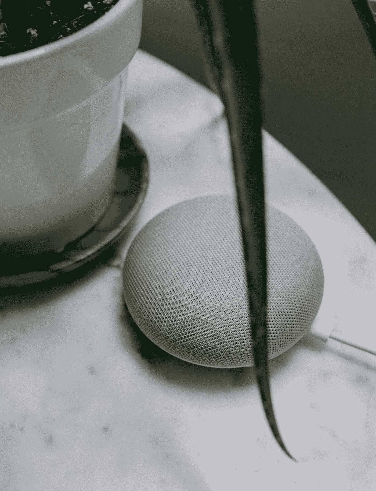

# 健康和保健 Alexa

> 原文：<https://medium.com/mlearning-ai/alexa-for-health-and-wellness-9fabff2078f1?source=collection_archive---------3----------------------->

## 患者参与人工智能助理

Photo by [Charles Deluvio](https://unsplash.com/@charlesdeluvio?utm_source=medium&utm_medium=referral) on [Unsplash](https://unsplash.com?utm_source=medium&utm_medium=referral)

Alexa 是亚马逊的一个 AI，可以用自然语言回应。它执行信息检索任务，购物通知，并集成成为一个智能家居设备——但她有多少技能呢？
很多消费者都问过“Alexa 技能有多少？”因为他们不仅想访问他们的音乐库或新闻源…