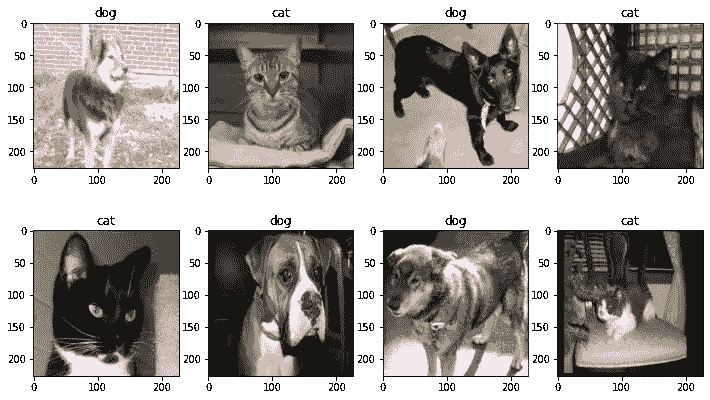
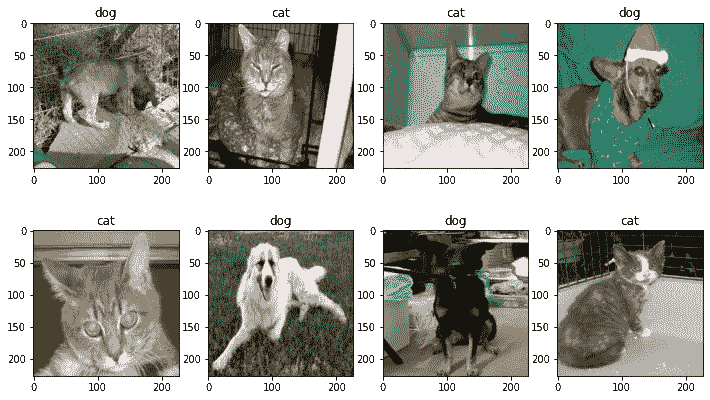
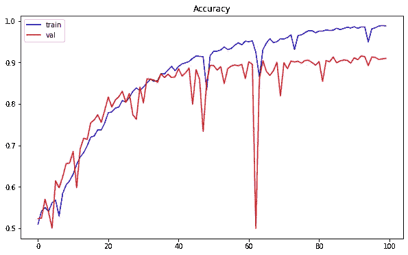
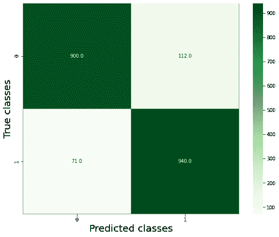
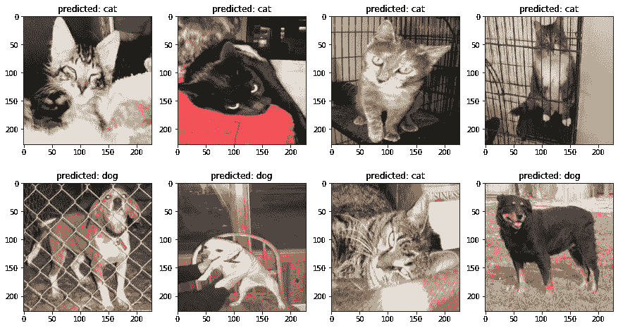

# Alexnet 与图像分类

> 原文：<https://medium.com/mlearning-ai/alexnet-and-image-classification-8cd8511548b4?source=collection_archive---------0----------------------->

Alexnet 是一个卷积神经网络，由 Alex Krizhevsky 与 T2、伊利亚和 T4 合作设计。在 2010 年 ImageNet 大规模视觉识别挑战赛(ILSVRC)中，这个网络被训练成将 120 万张高分辨率图像分为 1000 个不同的类别。它实现了 37.5%和 17%的前 1 名和前 5 名错误率，优于当时最先进的方法。

Alexnet 和 LeNet 的设计非常相似，但 Alexnet 更深入，每层有更多的过滤器。它由八层组成:五个卷积层(其中一些层后面是 max-pooling 层)、两个全连接隐藏层和一个全连接输出层。特别是在多个 GPU 上训练这个网络也是可行的。在 ***ILSVRC 2012*** 中，该模型的一个变体在一些技术的贡献下被训练，以避免过拟合，如数据扩充、丢失。因此，它以 15.3%的前 5 名测试错误率赢得了比赛。

在本文中，我们将探索这个网络的架构，以及它在 Keras 平台上的实现。我们进一步将这个网络应用于狗和猫图像的分类问题。

# 一.建筑

Alexnet 的架构描述如下图[1]:


Figure 1: The architecture of Alexnet model. Source [1]

在第一层中，使用大小为 11 × 11 的卷积窗。正是由于输入的大小很大，所以我们需要使用一个大的内核来捕捉对象。接下来的层中的卷积窗形状逐渐减小到 5× 5 和 3 × 3，但是滤波器的数量并行增加。第一个和最后一个卷积层之后是最大池层，其中应用了大小为 3 × 3 的池窗口和 2 个步长。因此，在这些池层中，输出大小减半。

在这个模型中，应用了 ReLU 激活函数[1]。关于这个功能的更多细节你可以看我之前的[帖子](https://lekhuyen.medium.com/activation-functions-17f8e7d5fcf8)。此外，作者还使用了一些技术来减少过拟合现象，如数据增加和丢失。更详细地说，在两个最初完全连接的层中应用了下降技术，下降率为 50%。

在 Keras 上实现 Alexnet 模型；

总结模型:

```
***Alexnet_model = Alexnet()
Alexnet_model.summary()***Model: "sequential"
_________________________________________________________________
Layer (type)                 Output Shape              Param #   
=================================================================
conv2d (Conv2D)              (None, 55, 55, 96)        34944     
_________________________________________________________________
max_pooling2d (MaxPooling2D) (None, 27, 27, 96)        0         
_________________________________________________________________
conv2d_1 (Conv2D)            (None, 27, 27, 256)       614656    
_________________________________________________________________
max_pooling2d_1 (MaxPooling2 (None, 13, 13, 256)       0         
_________________________________________________________________
conv2d_2 (Conv2D)            (None, 13, 13, 384)       885120    
_________________________________________________________________
conv2d_3 (Conv2D)            (None, 13, 13, 384)       1327488   
_________________________________________________________________
conv2d_4 (Conv2D)            (None, 13, 13, 256)       884992    
_________________________________________________________________
max_pooling2d_2 (MaxPooling2 (None, 6, 6, 256)         0         
_________________________________________________________________
flatten (Flatten)            (None, 9216)              0         
_________________________________________________________________
dense (Dense)                (None, 4096)              37752832  
_________________________________________________________________
dropout (Dropout)            (None, 4096)              0         
_________________________________________________________________
dense_1 (Dense)              (None, 4096)              16781312  
_________________________________________________________________
dropout_1 (Dropout)          (None, 4096)              0         
_________________________________________________________________
dense_2 (Dense)              (None, 1000)              4097000   
=================================================================
Total params: 62,378,344
Trainable params: 62,378,344
Non-trainable params: 0
_________________________________________________________________
```

***这个模型有 6200 多万个参数。***

# 三。Alexnet 模型在犬猫图像分类中的应用

数据集收集自 Kaggle，该数据包括:

*   包括 4006 幅狗图像和 4001 幅猫图像的训练集。
*   包括 1013 幅狗图像和 1012 幅猫图像的测试集。

## 1.数据加载和探索

***a .显示训练集和测试集中狗和猫图像的数量:***

```
*>>> The training set consists of  4006  dog images and  4001  cat images.*
```

```
>>> *The test set consists of  1013  dog images and  1012  cat images.*
```

***b .加载图像和标签***

负载训练和测试集:

因为加载需要很多时间，所以您应该保存它们以备后用:

将 X_train，y_train，X_test，y_test 保存到字典中，即 ***data_dict:***

装载 X_train，y_train，X_test，y_test:

随机显示训练集的一些图像:



## 2.数据预处理

该任务由以下步骤组成:

*   将整数值转换成浮点数
*   正常化
*   一键编码标签

预处理后随机可视化训练集的一些图像:



## 3.定义 Alexnet 模型

注意，在我们的问题中，我们只有两个类别，狗和猫。因此，Alexnet 模型的输出需要调整以适应问题。更详细地说，在这种情况下，输出层中的神经元数量是 2。

***库:***

***创建模型:***

新模型概述:

```
***Alexnet_model = Alexnet()
Alexnet_model.summary()***Model: "sequential_1"
_________________________________________________________________
Layer (type)                 Output Shape              Param #   
=================================================================
conv2d_5 (Conv2D)            (None, 55, 55, 96)        34944     
_________________________________________________________________
max_pooling2d_3 (MaxPooling2 (None, 27, 27, 96)        0         
_________________________________________________________________
conv2d_6 (Conv2D)            (None, 27, 27, 256)       614656    
_________________________________________________________________
max_pooling2d_4 (MaxPooling2 (None, 13, 13, 256)       0         
_________________________________________________________________
conv2d_7 (Conv2D)            (None, 13, 13, 384)       885120    
_________________________________________________________________
conv2d_8 (Conv2D)            (None, 13, 13, 384)       1327488   
_________________________________________________________________
conv2d_9 (Conv2D)            (None, 13, 13, 256)       884992    
_________________________________________________________________
max_pooling2d_5 (MaxPooling2 (None, 6, 6, 256)         0         
_________________________________________________________________
flatten_1 (Flatten)          (None, 9216)              0         
_________________________________________________________________
dense_3 (Dense)              (None, 4096)              37752832  
_________________________________________________________________
dropout_2 (Dropout)          (None, 4096)              0         
_________________________________________________________________
dense_4 (Dense)              (None, 4096)              16781312  
_________________________________________________________________
dropout_3 (Dropout)          (None, 4096)              0         
_________________________________________________________________
dense_5 (Dense)              (None, 2)                 8194      
=================================================================
Total params: 58,289,538
Trainable params: 58,289,538
Non-trainable params: 0
_________________________________________________________________
```

## 4.训练模型

我们将数据扩充技术应用于训练集以减少过度拟合。包括图像旋转 5 度，宽度移动范围 10%，高度移动范围 10%，水平翻转。这些技术会受到来自***keras . preprocessing . image***模块的***imagedata generator***函数的影响。

定义培训功能:

```
Epoch 1/100
62/62 [==============================] - 117s 2s/step - loss: 0.6932 - accuracy: 0.5027 - val_loss: 0.6914 - val_accuracy: 0.5230
Epoch 2/100
62/62 [==============================] - 116s 2s/step - loss: 0.6911 - accuracy: 0.5344 - val_loss: 0.6877 - val_accuracy: 0.5245
................
................
................
Epoch 99/100
62/62 [==============================] - 116s 2s/step - loss: 0.0286 - accuracy: 0.9894 - val_loss: 0.3615 - val_accuracy: 0.9086
Epoch 100/100
62/62 [==============================] - 116s 2s/step - loss: 0.0291 - accuracy: 0.9885 - val_loss: 0.3721 - val_accuracy: 0.9095
64/64 [==============================] - 5s 77ms/step - loss: 0.3721 - accuracy: 0.9095
90.954
```

保存训练历史和准确度:

保存已训练的模型:

在训练模型期间，可视化训练集和测试集的准确性:



我们看到，随着历元数的增加，两个数据集的准确率都有增加的趋势(训练集的准确率高达 98.85%，测试集的准确率高达 90.95 %)。这些值仍然可以通过更多的历元来提高。

## 5.预言；预测；预告

确定混淆矩阵:



该矩阵描述了在每个类别中被正确或错误分类的图像的数量。根据这个矩阵，我们看到:

*   900 个狗图像和 940 个猫图像在它们的类中被正确分类。
*   112 只狗的图像被归入“猫”类。
*   71 幅猫的图像被归入“狗”类。

***可视化一些图像及其预测类:***



# 三。结论

我们已经发现了 Alexnet 模型的架构及其在 Keras 平台上的实现。将该模型应用于狗和猫图像的分类，在测试集上取得了 90.954 %的分类性能。但是，仍然可以通过获取更多的训练数据、尝试更多的历元数、更改超参数等等来提高性能。除此之外，在每种特定的情况下，还有一些其他的技术来改进模型，它们将在下一篇文章中详细介绍。

希望这篇文章对你有帮助，不要犹豫在 medium 上找我[发现类似内容。](https://lekhuyen.medium.com/)

感谢阅读！

***Github 代码*:**[https://Github . com/khu yenle-maths/Alex net _ model _ with _ image _ class ification/blob/main/Alex net _ and _ image _ class ification . ipynb](https://github.com/KhuyenLE-maths/Alexnet_model_with_image_classification/blob/main/Alexnet_and_image_classification.ipynb)

***我的博客页面***:[https://lekhuyen.medium.com/](https://lekhuyen.medium.com/)

________________________________________________________________

**参考文献:**

[1] Krizhevsky，a .，Sutskever，I .，& Hinton，G. E. (2012 年)。基于深度卷积神经网络的图像网分类。*神经信息处理系统的进展*， *25* ，1097–1105。