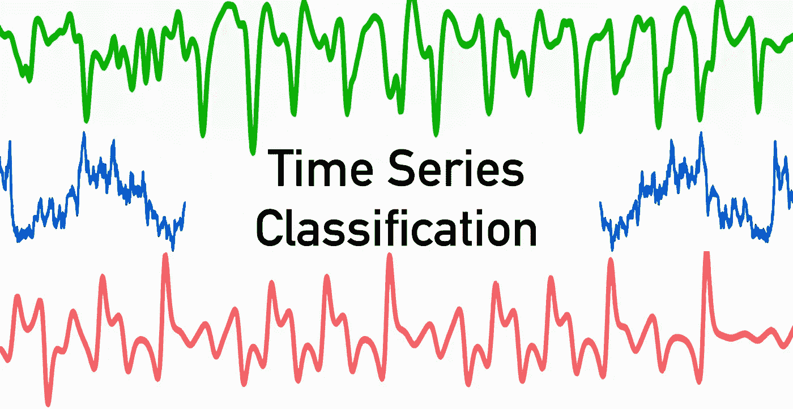

# 所有 8 种时间序列分类方法

> 原文：<https://medium.com/mlearning-ai/all-8-types-of-time-series-classification-methods-2c8e4b323ea2?source=collection_archive---------0----------------------->

## 时间序列分类算法综述

对时间序列进行分类是应用机器和深度学习模型的常见任务之一。

这篇文章将涵盖 8 种时间序列分类方法和时间序列数据分类的建模技术。这从简单的…