# 关于神经网络中的激活函数

> 原文：<https://medium.com/mlearning-ai/all-about-activation-functions-in-neural-networks-f2a1889f59f1?source=collection_archive---------2----------------------->

神经网络激活功能是深度学习的重要组成部分。激活函数决定了深度学习模型的输出，其准确性，以及训练模型的计算效率——这可以成就或摧毁一个大规模的神经网络。激活函数对神经网络的收敛能力和收敛速度也有很大影响，或者在某些情况下，激活函数可能会首先阻止神经网络收敛。

# 一个简单的人工神经元:

深度学习模型通常由许多分层堆叠的神经元组成。为了简单起见，让我们考虑单个神经元。

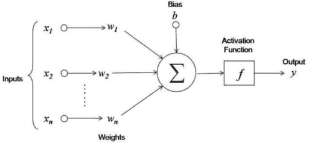

Single-layer Perceptron

神经元执行的操作基本上包括线性的乘法和加法操作，并产生输出。在这之后，一个激活函数被应用于产生神经元的最终输出。

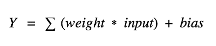

如果不应用激活函数，上面的函数就像一个线性函数，将输入映射到输出。

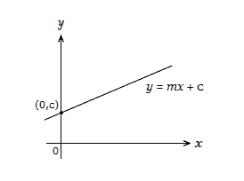

这使得神经元只能近似线性函数。因此，模型无法识别数据中的复杂模式。

# **为什么需要激活功能？**

为了使神经网络逼近非线性或复杂函数，必须有一种方法将非线性属性添加到结果的计算中。

在神经网络中，称为输入的数字数据点被输入到输入层的神经元中。每个神经元都有一个权重，输入数乘以权重就得到神经元的输出，输出传递到下一层。

激活函数是馈送当前神经元的输入和去往下一层的输出之间的数学“门”。它可以像阶跃函数一样简单，根据规则或阈值打开或关闭神经元输出。或者它可以是将输入信号映射成神经网络运行所需的输出信号的变换。

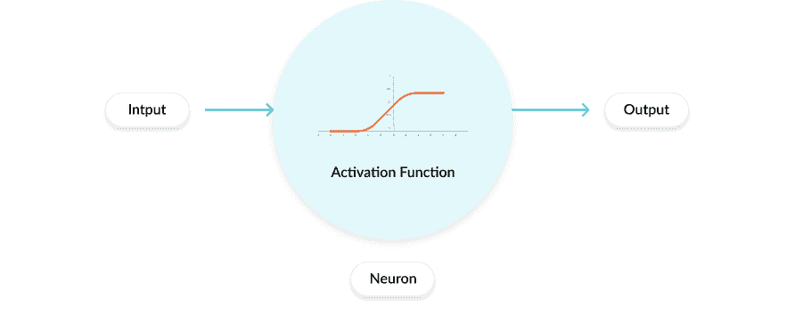

神经网络越来越多地使用非线性激活函数，这可以帮助网络学习复杂的数据，计算和学习几乎任何代表问题的函数，并提供准确的预测。

# A.任何非线性函数都可以用作激活函数吗？

不，在函数可以被认为是深度学习模型的良好候选之前，它应该具有以下属性:

1.  **非线性**:需要在模型中引入非线性。
2.  **单调**:要么完全不增，要么完全不减的函数。
3.  **可微分**:深度学习算法通过一种叫做[反向传播](https://en.wikipedia.org/wiki/Backpropagation)的算法来更新它们的权重。当使用的激活函数是可微的时，该算法可以工作。即它的导数是可以计算的。

# B.激活功能的理想特征:

# **1。消失渐变问题:**

当我们将神经网络训练得非常深(成百上千层)时，就会出现这个问题。使用过程梯度下降来训练神经网络。梯度下降包括反向传播步骤，该步骤基本上是获得权重变化的链式法则，以减少每个时期后的损失。考虑一下，一个 4 层神经网络由 4 个神经元组成，分别用于**输入层**，4 个神经元用于**隐藏层，**和 1 个神经元用于**输出层**。

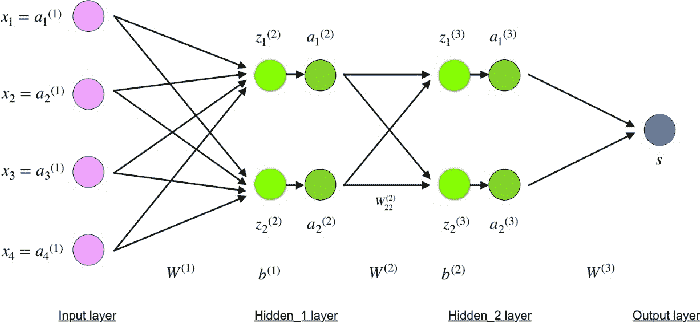

4- layer Neural Network

## 输入层

**紫色**的神经元代表输入数据。这些可以像标量一样简单，也可以像向量或多维矩阵一样复杂。

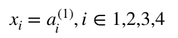

## 隐藏层

使用 *z^l* —层 *l* 中的加权输入和 *a^l* —层 *l* 中的激活，计算隐藏神经元的最终值，用**绿色**、表示。对于第 2 层和第 3 层，等式为:

*   *l = 2*

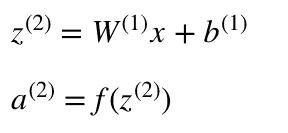

*   *l = 3*

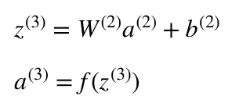

*W* 和 *W* 是层 2 和层 3 中的权重，而 b 和 b 是这些层中的偏差。

同时反向传播和计算梯度以更新权重 *W，*

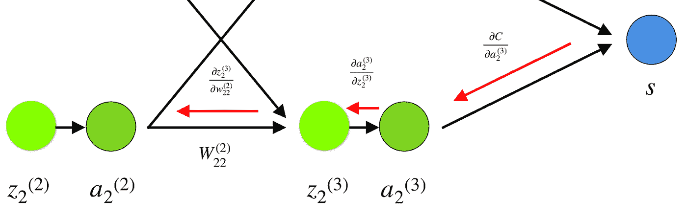

Backpropagation and Gradient calculation

权重 *(w_22)* 连接 *(a_2)* 和 *(z_2)* ，因此计算梯度需要通过*(z _ 2)**(a _ 2)*应用链式法则

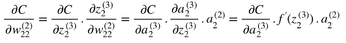

我们将多个梯度(导数)相乘，然后相乘后我们可能会得到非常小的值。

换句话说，由于网络的深度和激活将值移至零，它们的梯度趋于消失。这被称为**消失渐变问题**。所以我们希望我们的激活函数不会将梯度移向零。

# **2。以零为中心:**

激活函数的输出应该在零处对称，使得梯度不会移动到特定方向。

# ***3。*计算费用**:

在每一层之后应用激活函数，并且在深度网络中需要计算数百万次。因此，它们的计算成本应该很低。

# C.什么是神经网络激活函数？

激活函数是决定神经网络输出的数学方程。该函数附属于网络中的每个神经元，并基于每个神经元的输入是否与模型的预测相关来确定是否应该激活(“激发”)该函数。激活函数也有助于将每个神经元的输出标准化到 1 和 0 之间或-1 和 1 之间的范围。

激活函数的另一个方面是，它们必须在计算上高效，因为它们是针对每个数据样本跨数千甚至数百万个神经元计算的。现代神经网络使用一种称为反向传播的技术来训练模型，这增加了激活函数及其导数函数的计算负担。

# D.激活功能的类型

# 1.二元阶跃函数:

二元阶跃函数是基于阈值的激活函数。如果输入值高于或低于某个阈值，神经元就会被激活，并向下一层发送完全相同的信号。

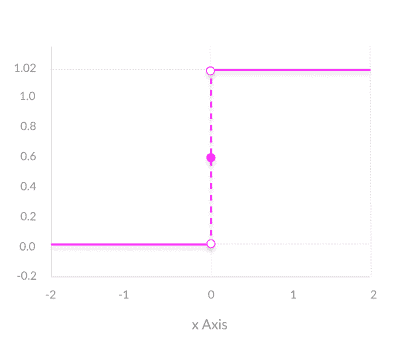

Binary Step Function Plot

阶跃函数的问题在于它不允许多值输出，例如，它不支持将输入分类到几个类别中的一个。

# 2.线性激活函数:

线性激活函数采取以下形式:A = cx

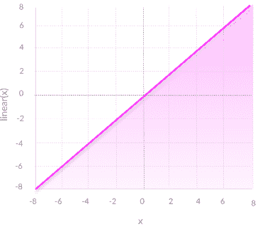

Linear Function Plot

它获取输入，乘以每个神经元的权重，并创建与输入成比例的输出信号。在某种意义上，线性函数比阶跃函数更好，因为它允许多种输出，而不仅仅是是和不是。

然而，线性激活函数有两个主要问题:

**a .无法使用** [反向传播](https://missinglink.ai/guides/neural-network-concepts/backpropagation-neural-networks-process-examples-code-minus-math/)(梯度下降)来训练模型——函数的导数是一个常数，与输入 x 无关。因此无法回过头来了解输入神经元中的哪些权重可以提供更好的预测。

**b .神经网络的所有层都坍缩成一个** —采用线性激活函数，无论神经网络有多少层，最后一层都将是第一层的线性函数(因为线性函数的线性组合仍然是线性函数)。所以一个线性激活函数把神经网络变成一层。

具有线性激活函数的神经网络仅仅是线性回归模型。它处理复杂多变的输入数据参数的能力有限。

# E.非线性激活函数

现代神经网络模型使用非线性激活函数。它们允许模型在网络的输入和输出之间创建复杂的映射，这对于学习和建模复杂的数据是必不可少的，例如图像、视频、音频和非线性或高维的数据集。

只要激活函数是非线性的，几乎任何可以想象的过程都可以表示为神经网络中的函数计算。

非线性函数解决了线性激活函数的问题:

1.  它们允许反向传播，因为它们有一个与输入相关的导数函数。
2.  它们允许多层神经元的“堆叠”来创建深度神经网络。需要多个隐藏的神经元层来学习高精度的复杂数据集。

# 常见的非线性激活函数及如何选择激活函数

# **1。乙状结肠/逻辑:**

逻辑函数在逻辑回归中用作挤压函数，用于挤压有限范围[0，1]内的异常值点。

s 形函数:f(x)=1/(1+exp(-x)

sigmoid **的导数:** df(x)=f(x)*(1-f(x))

**代号:**

Sigmoid Function and It’s Derivative

**优势:**

*   平滑渐变，防止输出值“跳跃”。
*   输出值介于 0 和 1 之间，使每个神经元的输出正常化。
*   清晰预测-对于大于 2 或小于-2 的 X，倾向于将 Y 值(预测)带到曲线边缘，非常接近 1 或 0。这可以实现清晰的预测。

**缺点:**

*   消失梯度-对于非常高或非常低的 X 值，预测几乎没有变化，从而导致消失梯度问题。这可能导致网络拒绝进一步学习，或者太慢而不能达到准确的预测。
*   输出不在零中心。
*   计算开销很大。

**我们什么时候用乙状结肠:**

(I)如果想要 0 到 1 之间的输出值，则仅在输出层神经元使用 sigmoid。

(ii)在做二元分类问题时，使用 sigmoid

否则乙状结肠不是优选的。

# 2.正切/双曲正切:

双曲正切函数是另一种可能的函数，可用作神经网络层间的非线性激活函数。它实际上与乙状结肠激活功能有一些共同之处。他们两个看起来非常相似。但是，sigmoid 函数会将输入值映射到 0 和 1 之间，而 Tanh 会将值映射到-1 和 1 之间。

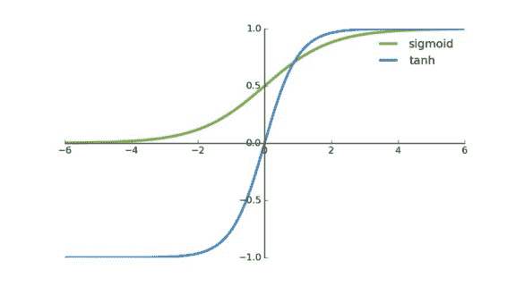

Plot for Sigmoid vs. tanh

像 sigmoid 函数一样，tanh 函数的一个有趣的性质是导数可以用函数本身来表示。下面是双曲正切函数的实际公式以及计算其导数的公式

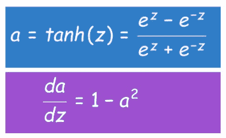

tanh function and it's derivative

**代码:**

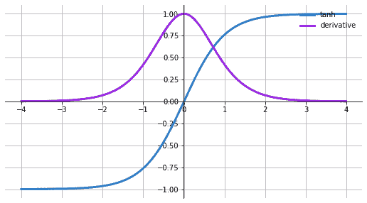

tanh function and its derivative plot

**优点**

*   **以零为中心的** —更容易对具有强负值、中性值和强正值的输入进行建模。通常用于神经网络的隐藏层，因为其值位于 **-1 到 1** 之间，因此隐藏层的平均值为 0 或非常接近于 0，因此通过使平均值接近于 0 来帮助*将数据*居中。这使得下一层的学习更加容易。
*   否则就像 Sigmoid 函数。

**缺点**

*   比如 Sigmoid 函数

# 3.整流线性单位

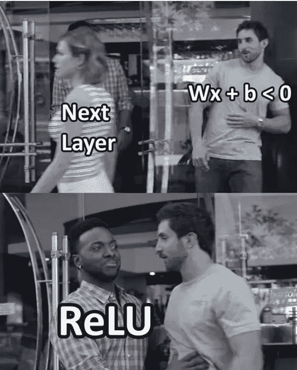

ReLU 在计算上比 tanh 和 sigmoid 便宜，因为它涉及更简单的数学运算。一次只有几个神经元被激活，使网络变得稀疏，从而使其高效且易于计算。

*   **方程:** f(x) = a =max(0，x)。如果 x 为正，它给出输出 x，否则给出 0。
*   **导数:**f '(x)= { 1；如果 z > 0，0；如果 z <为 0，如果 z=0，则未定义
*   **取值范围:-** [0，inf

它在一定程度上避免和纠正了**消失梯度**问题。现在几乎所有的深度学习模型都用 **ReLU** 。

**代码:**

ReLU function and it’s Derivative Plot

**优势**

*   **计算效率高** —允许网络快速收敛
*   **非线性—** 尽管 ReLU 看起来像线性函数，但它有一个导数函数，并允许反向传播

**不利于濒死 ReLU 问题** —当输入趋近于零或为负时，函数的梯度变为零，网络无法进行反向传播，无法学习。

# 4.泄漏 ReLU:

为了解决 ReLU 中的渐变问题，引入了另一个修改，称为 ***Leaky ReLU。***

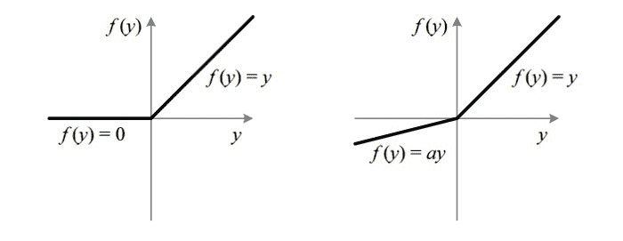

The difference in ReLU (left) and Leaky ReLU (right)

泄漏有助于增加 ReLU 功能的范围。通常 a 的值是 0.01 左右。当α不为 0.01 时，称为随机化 ReLU。

因此，泄漏 ReLU 的**范围**为(-无穷大到无穷大)。

**代码**:

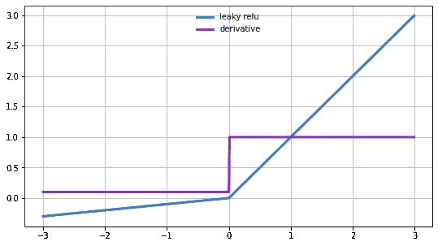

Leaky ReLU function and it’s derivative plot

**优点**

*   **防止死 ReLU 问题**—ReLU 的这种变化在负区域有一个小的正斜率，因此它确实支持反向传播，即使对于负输入值也是如此
*   否则像 ReLU

**缺点**

*   **结果不一致** — leaky ReLU 不能为负输入值提供一致的预测。

# 5.Softmax:

softmax 函数是一个激活函数，它将数字转化为总和为 1 的概率。softmax 函数输出一个向量，该向量表示结果列表的概率分布。它也是深度学习分类任务中使用的核心元素。

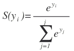

Softmax 函数将 logit[2.0，1.0，0.1]转换为概率[0.7，0.2，0.1]，概率总和为 1。Logits 是神经网络最后一层输出的原始分数。在激活发生之前。为了理解 softmax 函数，我们必须看看第(n-1)层的输出。

**优势**

*   当我们有多个类时，使用 softmax 函数。
*   这对于找出具有最大值的类是有用的。概率。
*   Softmax 函数理想地用在输出层，我们实际上试图获得概率来定义每个输入的类。
*   范围从 0 到 1。

# F.使用哪个激活功能？

所以到目前为止，我们已经看到了不同类型的激活函数，它们的优点和缺点。现在问题来了——我应该为我的神经网络使用哪个激活函数？

推荐一个适用于所有用例的激活函数是非常困难的。有许多考虑因素——计算导数有多困难(如果它是可微的话！)，你选择的 AF 的网络收敛速度有多快，有多光滑，是否满足泛逼近定理的条件，是否保持归一化等等。你可能关心也可能不关心这些。

*   **Sigmoid 函数**及其组合一般在**二元分类问题**的情况下效果更好。
*   由于梯度消失的问题，Sigmoid 和 tanh 函数有时会被避免。
*   由于死神经元问题，Tanh 在大多数情况下被避免。
*   **ReLU** 激活功能被广泛使用，并且是**默认选择**，因为它产生更好的结果。
*   如果我们在网络中遇到死亡神经元的情况，那么 leaky ReLU 函数是最好的选择。
*   **ReLU 函数**是否应该**仅**用于**隐藏层。**
*   在出现**回归问题时，**输出层**可以是**线性**激活函数。**
*   对于多类分类 **Softmax** 激活功能是最可取的

我希望这篇文章的目的是了解激活函数，为什么，什么时候，以及对于给定的问题陈述使用哪一个。

快乐学习！！！

# 参考:

1.  [https://missing link . ai/guides/neural-network-concepts/7-types-neural-network-activation-functions-right/](https://missinglink.ai/guides/neural-network-concepts/7-types-neural-network-activation-functions-right/)

2.[https://towards data science . com/everything-you-need-to-know-on-activation-functions-in-deep-learning-models-84ba 9 f 82 c 253 #:~:text = Simply % 20 put % 2C % 20 an % 20 activation % 20 function，fired % 20 to % 20 the % 20 next % 20 neuron。](https://towardsdatascience.com/everything-you-need-to-know-about-activation-functions-in-deep-learning-models-84ba9f82c253#:~:text=Simply%20put%2C%20an%20activation%20function,fired%20to%20the%20next%20neuron.)