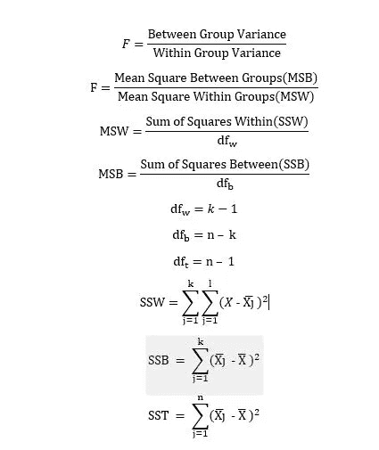
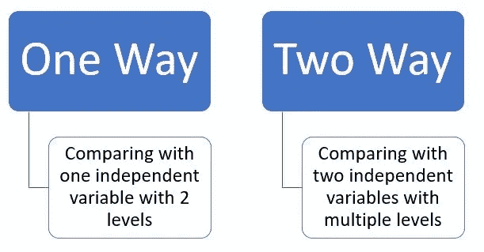
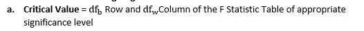
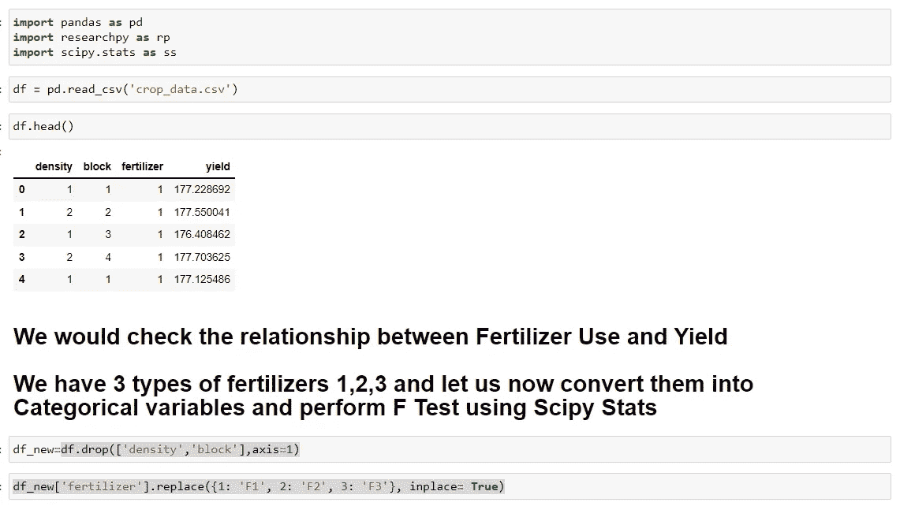
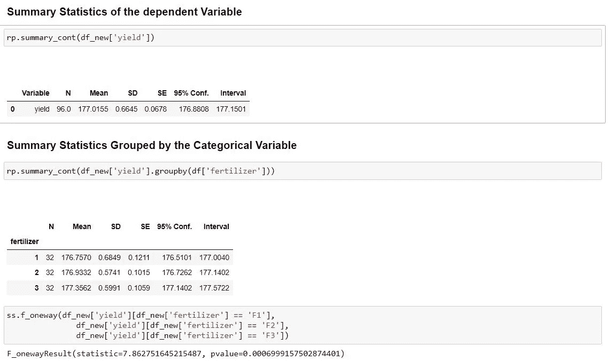
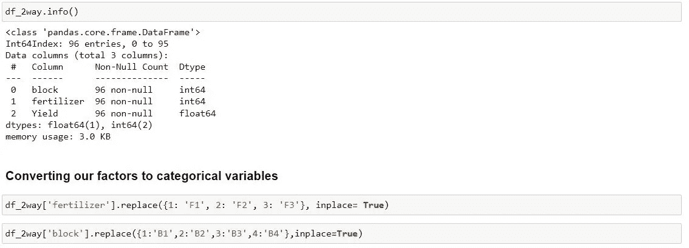
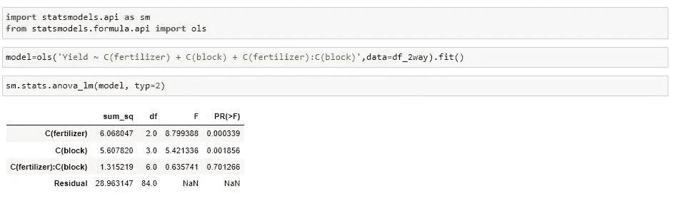

# 关于 ANOVA 的一切

> 原文：<https://medium.com/mlearning-ai/all-about-anova-e106b9f662af?source=collection_archive---------11----------------------->

**什么是方差分析？**

每当我们有一个包含多个因变量和一个自变量的数据集时，我们就可以进行 **ANOVA** 测试。 **ANOVA** 代表**方差分析**。它使用的是为了纪念罗纳德·费舍爵士而命名的 f 检验。

**为什么要进行方差分析？**

**ANOVA** 帮助我们了解各组之间的差异是否具有统计学意义。当我们清楚地知道变量的含义与其他变量有何不同时，我们就能理解哪些因素与因变量有联系，并开始理解是什么驱动了行为。通过 **ANOVA** 可以确定哪些特征对结果影响最大等问题。

**什么是 f 检验？**

**F 值**是**两方差**的**比值**，更准确的说是**两均方差**。均方差是计算自由度的方差，用于估计方差。它由以下公式给出

F Statistic Formulas

f 值是一个无单位的统计量，因此很难解释它们。然而，在零假设为真的情况下，F 值产生 1。但在其他情况下，F 值会大于 1。但是作为一个无单位统计量，很难解释它，所以我们用 p 值来确定 f 检验的显著性。低于显著性水平的低 p 值表明我们可以拒绝零假设。

**关于可变性的一切**

方差就是我们的数据点离平均值有多远。均值的差异越大，我们观察到的方差就越大。方差分析和 f 检验评估组间和组内均值之间的变异性，以确定这些差异是否具有统计学意义。

**方差分析的假设**

IID —独立同分布。

方差的同质性和同质性。

人口的正态分布。

样本的独立性。

各组的样本量相等。

因变量也是连续的。

**方差分析的类型**

Types of ANOVA

**什么时候去进行单向方差分析？**

1.在单因素方差分析中，有一个自变量影响因变量。

2.当我们想测试两组，看看他们之间有什么不同。

**例如**研究草药混合物对减肥的效果。所以这些人群可能是喝普通茶、草药混合物或者什么都不喝的人。

**限制**

一种方法是 ANOVA 会告诉你至少有两组是不同的，但不会告诉你哪些组是不同的。我们可能需要进行额外的测试来找出答案。

**什么时候进行双向方差分析？**

它是单向方差分析的扩展

在双向方差分析的情况下，我们有两个独立变量。还要注意，我们有一个数量变量和两个名义/分类变量。

所以我们可以说，当我们有一个定量的结果和两个分类变量时，我们进行双向方差分析。

我们有一株植物，我们想研究阳光和浇水频率是如何影响植物生长的。我们种下一些种子，我们将在不同的阳光照射和浇水频率条件下观察它们几个月。生长期过后，我们将观察这些植物的高度。我们想确定什么因素影响植物生长？

在方差分析中，这些分类变量也称为因子，因子被进一步分为不同的水平。

**如**性别可分为男性、女性、跨性别三个层次；收入可分为低收入、中收入和高收入等。

**方差分析中的假设**

**零假设**:均值相等(0 = 1 = … = n)

**交替假设**:均值不相等(0≠1≠…n)

**主和交互作用！**

当我们应用单因素方差分析时，即当我们单独考虑每个因素的影响时，主效应被显示出来。

交互作用效应是当我们检查因变量上的因素的组合效应时。

另一个假设通常是在检查交互效应时假设的，它只是简单地**检查交互效应的存在！**

**进行方差分析的步骤:**

1.陈述假设(无效和替代)

2.确定重要程度

3.使用自由度确定临界值。

Getting Critical Value from F Table

**4。**计算检验统计量(ANOVA)

**5。**如果 **F 临界< F 计算出**，我们拒绝零假设

**释义**

F 统计量越大，说明组均值之间存在差异的证据就越多。

如果 p 值小于显著性水平，那么我们可以拒绝零假设，并得出结论，各组的平均值之间存在统计学显著差异。

> 当 p 值小于α水平时，我们拒绝零假设。如果我们的临界 F 值小于我们计算的 F 值，我们不应该拒绝零假设，除非我们也有一个小的 p 值。

**Python 中方差分析的示例**

我使用了以下[链接](https://www.scribbr.com/statistics/one-way-anova/)中的作物数据集

**Python 中使用 scipy.stats 的单向方差分析**

Steps to Perform 1 Way ANOVA Part -1

Steps to Perform 1 Way ANOVA Part -2

**Python 中使用 statsmodels 的双向方差分析**

Two Way ANOVA Part 1

Two Way ANOVA Part 2

**参考文献**

https://statisticsbyjim.com/anova/f-tests-anova/

https://www.statisticssolutions.com/f-test/

https://people.richland.edu/james/lecture/m170/ch13-f.html

https://www . statisticshowto . com/probability-and-statistics/hypothesis-testing/ANOVA/

https://SPH web . bumc . bu . edu/otlt/MPH-Modules/BS/BS 704 _ HypothesisTesting-ANOVA/BS 704 _ HypothesisTesting-ANOVA 3 . html

https://sites . u Alberta . ca/~ lk gray/uploads/7/3/6/2/7362679/slides _-_ ANOVA _ assumptions . pdf

https://www.statology.org/two-way-anova/

https://www . qual trics . com/au/experience-management/research/ANOVA/？rid = IP & prev site = en & new site = au & geo = IN & geo match = au

https://www.scribbr.com/statistics/one-way-anova/

 [## 使用 Python 进行方差分析(带示例)

### ANOVA 检验用于比较 2 个以上组的平均值(t 检验可用于比较 2 个组)

www.reneshbedre.com](https://www.reneshbedre.com/blog/anova.html) 

[https://www . statistics show to . com/probability-and-statistics/f-statistic-value-test/# FandP](https://www.statisticshowto.com/probability-and-statistics/f-statistic-value-test/#FandP)

 [## Mlearning.ai 提交建议

### 如何成为 Mlearning.ai 上的作家

medium.com](/mlearning-ai/mlearning-ai-submission-suggestions-b51e2b130bfb)