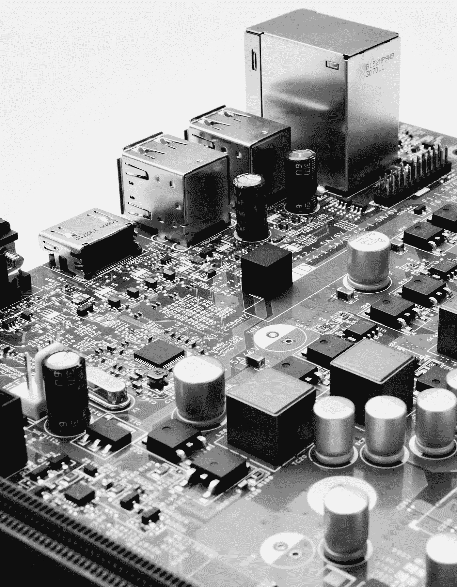

# 关于我的交易——第 2 部分

> 原文：<https://medium.com/mlearning-ai/all-about-my-trading-part-2-4adda369a184?source=collection_archive---------4----------------------->

Photo by [Michael Dziedzic](https://unsplash.com/@lazycreekimages?utm_source=unsplash&utm_medium=referral&utm_content=creditCopyText) on [Unsplash](https://unsplash.com/s/photos/algorithm?utm_source=unsplash&utm_medium=referral&utm_content=creditCopyText)

# 经纪人级别的市场数据

外汇市场的一个有趣的特点是它没有集中的交易所，如股票或期货交易所。因此，所有交易都是在柜台(OTC)进行的，这仅仅意味着它不是在受监管的环境中进行的，实际上通常被称为“场外”交易。