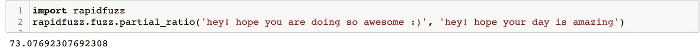
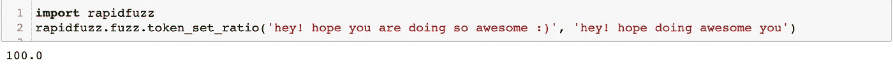
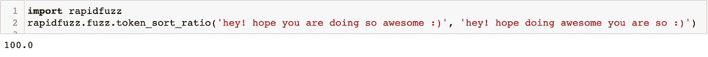
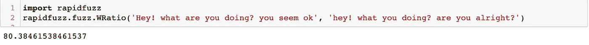
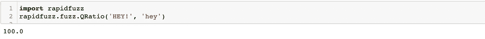
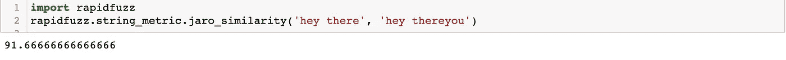
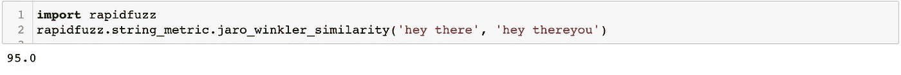
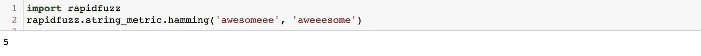

# RapidFuzz —字符串相似性和匹配

> 原文：<https://medium.com/mlearning-ai/all-about-rapidfuzz-string-similarity-and-matching-cd26fdc963d8?source=collection_archive---------0----------------------->

## 这些模糊的东西是什么？另一种模糊字符串匹配技术

[source](https://unsplash.com/s/photos/abstract)

RapidFuzz 是另一个字符串匹配库，它计算字符串之间的差异&它还提供了更多功能。这主要是用 C++编写的，以使字符串匹配工作得更快。有 3 个主要模块:

1.  模糊模块
2.  字符串度量模块
3.  过程模块

> GitHub 链接:[https://github.com/maxbachmann/RapidFuzz](https://github.com/maxbachmann/RapidFuzz)

# **模糊模块**

它提供了所有独特的方法，可以用来比较两根弦。共有 10 个比率，您可以通过它们来比较两个字符串。其中一些是:

1.  **比率:**计算归一化距离。

**2。Partial Ratio:** 查找较短字符串和较长字符串中长度为 m 的每个子字符串之间的比率相似性度量，并返回这些相似性度量的最大值。基本上，它在较长的字符串中搜索较短字符串的最佳对齐方式，并返回该对齐方式的 fuzz.ratio。

**3。Token Set Ratio:** 根据字符串中唯一的和常见的单词对它们进行比较。它获取字符串中所有标记的集合，然后进行比较。如果字符串 A 具有字符串 B 的所有元素，比率将是 100。但反过来就不一样了。

**4。Token Sort Ratio:** 对字符串中的单词进行排序，并计算它们之间的 fuzz.ratio

**5。w 比率**:根据其他比率算法计算加权比率。这取决于一个单词出现的次数、标记的顺序等。

**6。Q Ratio:** 它与 fuzzy.ratio 非常相似，只是它在计算距离之前对字符串进行预处理。

# **字符串度量模块:**

这个模块负责各种编辑距离的类型，度量越相似，两个字符串之间的编辑距离越大。最高的相似性指标是:

1.  **Jaro 相似度:**在这种情况下，两个字符串之间的相似度被归一化。0 表示完全不相似& 1 表示最相似。这取决于字符的交集、两个字符串的长度以及匹配字符串的换位次数。

**2。Jaro-Winkler 相似度:**它几乎和 Jaro 相似度一样，但是在这种情况下，它有一个比例因子 p，这使得它更加精确。

**3。汉明距离:**它描述了将 s1 转化为 s2 所需的最小置换量。对于汉明距离比较，两个字符串需要具有相同的长度。

使用哪种相似性度量或模糊比率，实际上取决于问题的使用情形。这取决于你的字符串有多严格地相似。如果仍然感到困惑，请务必从某个地方开始迭代，除非有一个指标适合您的用例。

谢谢！

## 参考:

1.  [https://github.com/maxbachmann/RapidFuzz](https://github.com/maxbachmann/RapidFuzz)