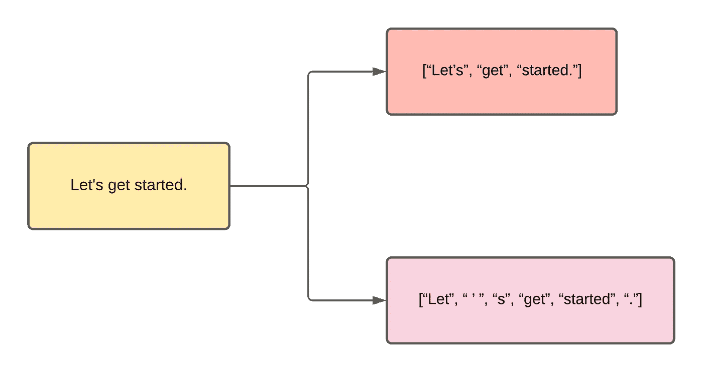
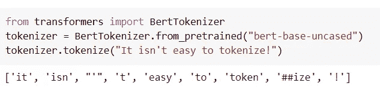
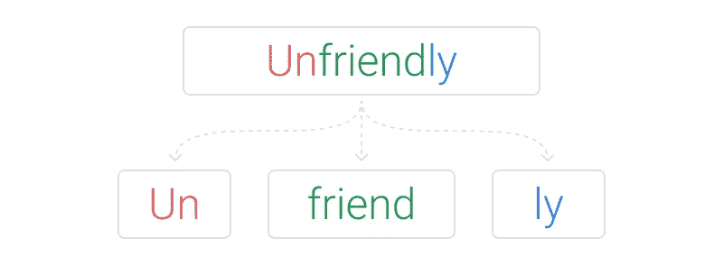
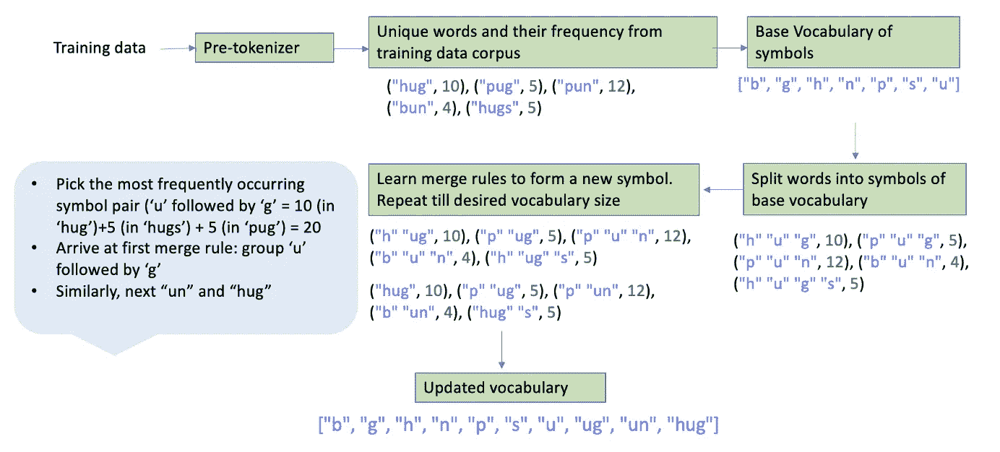

# 关于记号赋予者的一切

> 原文：<https://medium.com/mlearning-ai/all-about-tokenizers-fe92443e2ad?source=collection_archive---------2----------------------->

Photo by [Jason Leung](https://unsplash.com/@ninjason?utm_source=medium&utm_medium=referral) on [Unsplash](https://unsplash.com?utm_source=medium&utm_medium=referral)

我们正在学习记号赋予器，因为机器不会照原样读取语言，因此需要将语言转换成数字，这就是记号赋予器的作用。不严格地说，标记化就是把句子分成单词。这听起来很简单，但有一些注意事项，主要是因为我们希望将每个标记映射到一个数字，这样形成的映射的大小和意义对于机器学习任务来说是重要和关键的。

什么是记号赋予器？

Tokenizer 将文本拆分成单词或子单词，有多种方法可以实现。

例如，下面给出的文本可以用多种方式拆分成子词:

Source: Author

附在单词上的标点符号使它们不是最理想的。标点符号的存在将使模型学习特定的表示，并使其免于学习单词后面每个可能的标点符号的大量表示。

但这并不止于此。如果将“Let's”标记为“Let”和“' s”就更好了。这只是一个例子，说明了标记化如何根据应用的规则而有所不同。不同的标记化规则将为相同的输入文本产生不同的输出。

对于预训练模型，推理过程中的输入需要通过与训练数据处理过程中相同的标记化 rue。这类似于应用于测试数据的常规数据预处理技术，其与训练数据的预处理技术相同。

所以本质上文本被转换成更小的块。例如，如果使用空格和标点符号化将句子拆分成单词，那么这可能会导致巨大的词汇语料库，进而导致巨大的嵌入矩阵。就更高的时间复杂度和增加的内存而言，这将导致代价高昂的事件。

让我们看一个例子:

example shared by author

注意，所有的单词都是小写的，因为我们使用的是无大写模式。除了上面例子中的标点符号问题，请注意“tokenize”这个词不在词汇表中，因此被拆分为[“token”、“# # ize”]。“##”表示为了解码期间的再现性，该令牌需要与前一个令牌相连接

让我们看看我们的下一个最佳选择是什么，**字符级标记化？**由于其简单的标记化规则，它既不耗费时间也不占用大量内存。但它对模型性能造成了影响，原因很简单，它无法学习有意义的输入表示，例如，学习“C”与“Covid”的表示，就有意义的表示而言，哪一个似乎更容易学习？

所以，我们已经看到了单词和字符的标记化，并将求助于称为**子单词标记化**的混合方法。

**子词分词器及其特点:**

*   支持合理的词汇量
*   学习有意义的上下文无关的表示
*   处理以前没有见过的单词

让我们看看如何？

它的工作原理是将常用的子词连接在一起，形成相对较少的词。这样一个罕见词的意义是从它的组成子词的复合意义中派生出来的。遵循这一原则，它的优势是在尝试将以前未见过的单词分解成已知的子单词时，可以处理这些单词。

Image source: [https://www.thoughtvector.io/](https://www.thoughtvector.io/)

让我们来了解一下三个关键的子词分词器是什么:

*   BPE(字节对编码)
*   单词块
*   句子片段

**字节对编码:**

我试图用下面的图片来解释 BPE 子词的汉字化过程。希望它能帮助您理解各个步骤，比如预标记化、基本词汇形成以及合并规则如何导致更新的词汇。

Image created by author with example sourced from references

如果新单词“bug”出现，基于从 BPE 模型训练中学习到的规则，它将被标记为[“b”、“ug”]。如果新单词构成基本词汇中不存在的符号，例如“mug”包含原本不存在于词汇中的符号“m ”,则该符号将被替换为“<unk>”。注意，如果所有基本字符都出现在词汇表中，则不需要这个<unk>符号。这是使用字节级 BPE 实现的。</unk></unk>

**单词块:**它的工作方式类似于 BPE，不同之处在于它选择的符号对将最大化添加到词汇表中的训练数据的语言模型可能性，而不是 BPE 中频繁出现的符号对。

**SentencePiece:** 一个无监督的标记器，它包括字符集中的空格，然后应用 BPE 生成词汇表。

关键特征:

*   支持两种分段算法，即字节对编码(BPE)和单字语言模型
*   固定的词汇大小，因为实际上不可能将词汇中的所有单词都用数字表示出来。例如:荣耀和光荣，尊严和尊严，它们在语义上是相同的，不需要分配一个单独的向量。
*   直接生成词汇到 id 的映射
*   与语言无关，即将句子视为 unicode 字符序列，不受语言相关逻辑的限制。
*   直接从原始句子训练，并不总是需要预标记化
*   使用子字正则化和 BPE 丢弃等正则化方法，通过执行动态子字采样来实现数据扩充。这种技术产生了健壮的模型，并提高了神经机器翻译模型的准确性。

**总结:**

我们从理解什么是记号赋予器以及为什么首先需要它们开始。然后，我们学习了三种类型的标记词——字、词和次词标记词。在次标记符中，有三个关键的标记符——BPE、词块和句子块

参考资料:

*   [https://github.com/google/sentencepiece](https://github.com/google/sentencepiece)
*   [https://colab . research . Google . com/github/hugging face/notebooks/blob/master/transformers _ doc/tensor flow/tokenizer _ summary . ipynb](https://colab.research.google.com/github/huggingface/notebooks/blob/master/transformers_doc/tensorflow/tokenizer_summary.ipynb)
*   【https://arxiv.org/pdf/1609.08144.pdf 

 [## Mlearning.ai 提交建议

### 如何成为 Mlearning.ai 上的作家

medium.com](/mlearning-ai/mlearning-ai-submission-suggestions-b51e2b130bfb)