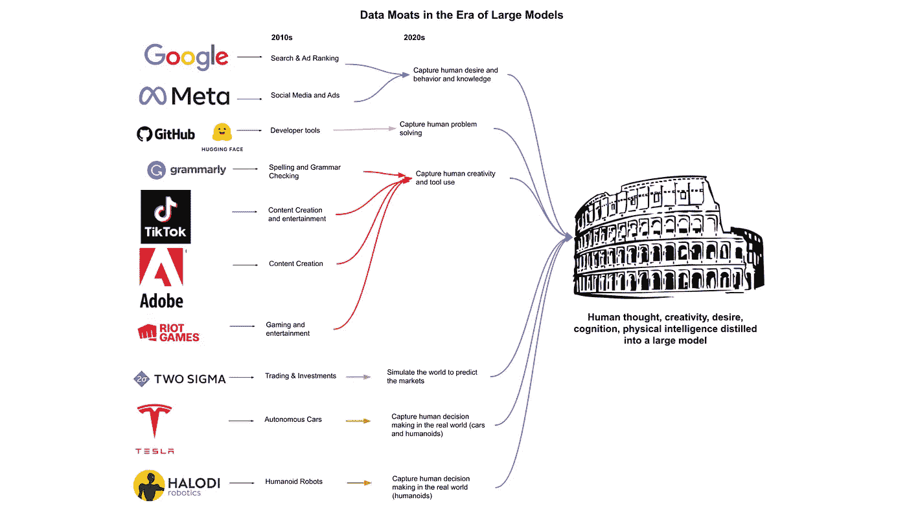

# 条条大路通 AGI，是吗？

> 原文：<https://medium.com/mlearning-ai/all-roads-lead-to-agi-or-do-they-e467cdfddb03?source=collection_archive---------5----------------------->

*条条大路通罗马:2022 年的机器学习就业市场*是 Halodi Robotics 新任人工智能副总裁 Eric Jang 的一篇沾沾自喜的文章。张成泽自吹自擂地谈论他赚钱的求职之路，他称之为市场调查。[【1】](https://bdtechtalks.com/2022/06/02/all-roads-lead-to-agi/?utm_campaign=Doing%20AI%20newsletter&utm_medium=email&utm_source=Revue%20newsletter#_ftn1)然而，引起我注意的不是可疑的反毒市场分析(其中包括许多未经证实的说法和假设)，而是张的断言，即每一家成功的科技公司都将是 AGI 公司，都需要“AGI 战略”

谢恩·莱格和他的同事本·戈泽尔和凯西奥·彭纳钦最近才使 AGI 流行起来。[【2】](https://bdtechtalks.com/2022/06/02/all-roads-lead-to-agi/?utm_campaign=Doing%20AI%20newsletter&utm_medium=email&utm_source=Revue%20newsletter#_ftn2)2007 年，Goertzel 和 Pennachin 编辑了一本名为*人工通用智能*的书，该书呼吁更坚定地坚持人工智能的原始愿景，而不仅仅是(如 Jang 所暗示的那样)“使软件更具适应性和更普遍有用的手段。”根据 Goertzel 和 Pennachin 的说法，AGI 拥有“自我理解和自主自控力”，拥有“在各种背景下解决各种复杂问题的能力，并学会解决他们在创作时不知道的新问题。”换句话说，AGI 是一个白板问题解决者，对问题的认识独立于解决问题的任何策略，任何目标都被解决方案所理解和共享。这对于应用问题解决来说是一个很高的要求，因为您的解决方案不需要知道它正在解决一个问题，但是您需要知道。

如果说莱格、Goertzel 和 Pannachin 用这个名字来处理当代“人工智能”的空洞本质，那就是修正主义了，人工智能对任何人来说几乎意味着任何东西。然而，今天“AGI”越来越多地被原创者用来区分他们的作品和嘈杂的当代“艾”标签。在同一时期，“AGI”已经从一个由不知名的研究人员推广的边缘理念，变成了人们令人惊讶地用来做出职业决策和作为企业使命宣言的东西。[【4】](https://bdtechtalks.com/2022/06/02/all-roads-lead-to-agi/?utm_campaign=Doing%20AI%20newsletter&utm_medium=email&utm_source=Revue%20newsletter#_ftn4)[【5】](https://bdtechtalks.com/2022/06/02/all-roads-lead-to-agi/?utm_campaign=Doing%20AI%20newsletter&utm_medium=email&utm_source=Revue%20newsletter#_ftn5)

在戈泽尔编辑*人工通用智能*的几年前，他的公司 Intelligence 和产品 Webmind 被视为在互联网上养育“婴儿”。媒体宣称这个婴儿是“哑巴”，但有着“辉煌的未来”[【6】](https://bdtechtalks.com/wp-admin/post.php?post=13885&action=edit#_ftn6)

《澳大利亚金融评论》称赞网络思维结束了“人类作为地球上唯一的推理和智能形式的统治”华尔街日报解释说，戈泽尔脱离实体的“全球大脑”是一个“超人类智能的新兴网络”，可以解决我们所有的问题。一直以来，Intelligenesis 都因其“不解决任何问题”的商业模式而破产。

具有商业头脑的技术领导者可能会认识到解决不了问题的商业模式可能失败的显著原因。纯人工智能公司之所以失败，是因为他们错误地认为技术转移是沿着一个单一的维度进行的，从基础研究到应用研究再到部署，你可以今天创造一个解决方案，明天解决一个未知的问题。具体来说，Webmind 失败了，因为它寻求基础知识来解决一般智力的基本问题，它认为这将解决其他问题，这些问题将神奇地产生一些财政意外之财。然而，这种要么全有要么全无的策略是无效的，大多数人无法在这样的盛宴或饥荒策略下生存。回想起来，Goertzel 在一次商业回顾中写道,“创造一台思考机器，然后将其商业化”的目标应该是“在与任何严肃的商人的谈话中一笑而过”幸运的是，对于纯人工智能的创业公司来说，严肃的商务人士仍然短缺。[【9】](https://bdtechtalks.com/2022/06/02/all-roads-lead-to-agi/?utm_campaign=Doing%20AI%20newsletter&utm_medium=email&utm_source=Revue%20newsletter#_ftn9)[【10】](https://bdtechtalks.com/2022/06/02/all-roads-lead-to-agi/?utm_campaign=Doing%20AI%20newsletter&utm_medium=email&utm_source=Revue%20newsletter#_ftn10)

这种文化对于研究来说是一种格雷欣法则。这不是一个“劣币驱逐良币”的经济原则，而是一个基础研究被视为被过早暴露于任何现实世界客户或应用讨论所污染的研究原则。这种方法意味着任何具有社会重要性的实际问题都必须被忽略。[【12】](https://bdtechtalks.com/2022/06/02/all-roads-lead-to-agi/?utm_campaign=Doing%20AI%20newsletter&utm_medium=email&utm_source=Revue%20newsletter#_ftn12)c . p .斯诺解释了两种研究文化，以及从事基础研究的研究人员如何经常“为他们的工作在任何可以想象的情况下都没有任何实际用途而自豪”[【13】](https://bdtechtalks.com/2022/06/02/all-roads-lead-to-agi/?utm_campaign=Doing%20AI%20newsletter&utm_medium=email&utm_source=Revue%20newsletter#_ftn13)杨在*条条大路通罗马*中解释自己为何对创办自己的公司不感兴趣时，强调了这种文化。原因是他“对解决 AGI 比对解决客户问题更感兴趣”这似乎是硅谷的新文化，在这里，一些最聪明的人宁愿研究一些过时的思维理论，也不愿解决真正的问题，为客户创造真正的价值。

研究人员面临的实际问题是，当你开始解决一个问题时，需要进行解释。当一个问题的解释开始时，研究人员不再是在解决智力或设计解决新问题的方案。相反，他们解决问题并收集特定问题的信息，而不是发现与智力相关的基础知识。人工智能的先驱马文·明斯基在 1981 年由《纽约客》杂志撰写的传记中回忆了他对人工智能的态度，他说“我不能告诉机器该做什么。这就解决了问题。”[【14】](https://bdtechtalks.com/2022/06/02/all-roads-lead-to-agi/?utm_campaign=Doing%20AI%20newsletter&utm_medium=email&utm_source=Revue%20newsletter#_ftn14)消除一个问题是人工智能研究中的一个问题，也是任何认真考虑 AGI 策略的人的问题。

对 AGI 的朋友来说，解决一切而不是某些事情的愿望很重要。根据 DeepMind 的联合创始人兼首席执行官戴密斯·哈萨比斯在 2017 年联合撰写的一篇博客文章，DeepMind 将不再专注于赢得围棋，而是“开发先进的通用”解决方案。哈萨比斯补充说，通用解决方案“有一天可能会帮助科学家解决一些最复杂的问题，如找到新的疾病治疗方法，大幅降低能耗，或发明革命性的新材料。”[【15】](https://bdtechtalks.com/2022/06/02/all-roads-lead-to-agi/?utm_campaign=Doing%20AI%20newsletter&utm_medium=email&utm_source=Revue%20newsletter#_ftn15)

这种不仅仅是赢得棋盘游戏的渴望是值得称赞的。然而，哈萨比斯对解决这些问题中的任何一个都不感兴趣(例如，疾病的新疗法、减少能源消耗、[【16】](https://bdtechtalks.com/2022/06/02/all-roads-lead-to-agi/?utm_campaign=Doing%20AI%20newsletter&utm_medium=email&utm_source=Revue%20newsletter#_ftn16)或发明新材料)，而是对解决所有这些问题感兴趣。解决问题需要通过问题框架、领域知识、设计和运行实验、分析数据、与同行合作以及对监管者、客户和患者负责来消除问题。解决所有问题不会。这就是为什么解决所有问题比解决一个问题更有吸引力。所有相关人员都不会被起诉。正如张在他的文章中所言，追求忽视问题并不是“无限的勇气”。将自己从世界和日常生活的忧虑中隔离出来，以利于个人深奥的追求是伪善的。

请记住，基础研究并不关心解决问题所带来的社会或经济利益。它寻求认识论的目的。例如，DeepMind 最近在加托上发布，该公司将其描述为“通用”解决方案。加托可以完成 600 多种不同的任务，包括玩视频游戏、整理物品、给图片加字幕和聊天。一位 DeepMind 的研究人员甚至声称，关于 AGI，“游戏已经结束了！”然而，这六百项任务中没有一项与治疗疾病、减少能源消耗或发明新材料有关。即使我们接受加托是通用的，而不是某种炫耀的多功能解决方案(事实就是如此)，DeepMind 也未能解决他们在五年前宣布为通用解决方案的重要问题。他们玩的游戏与私人或公共价值创造无关，因为没有任何问题重要到需要解决。[【18】](https://bdtechtalks.com/2022/06/02/all-roads-lead-to-agi/?utm_campaign=Doing%20AI%20newsletter&utm_medium=email&utm_source=Revue%20newsletter#_ftn18)

*条条大路通罗马*在这种背景下是一个困惑的习语，它错误地暗示所有“人工智能”活动都通向一个单一的无定形的地方。此外，声称成功的企业需要 AGI 战略是完全落后的。AGI 战略要求一个人忽略问题，寻求一个可能在以后解决问题的总体解决方案。与此同时，我们的问题变得越来越大，就像所有问题被忽视时一样。“有朝一日可能解决问题”的解决方案的不明确目标没有什么经济价值。有商业头脑的技术领导者明白，问题有一个解决方案，但没有人找到。技术领导通常是用新的方法多次解决一个问题或老问题，而不是寻求一个解决方案来解决所有问题。企业不能渴望解决所有问题，而不是某些问题。

本文之前由 [bdtechtalks](https://bdtechtalks.com/2022/06/02/all-roads-lead-to-agi/?utm_campaign=Doing%20AI%20newsletter&utm_medium=email&utm_source=Revue%20newsletter) 发布。

[1] *条条大路通罗马:2022 年的机器学习就业市场。*

[2]名称历史:[https://ai . stack exchange . com/questions/20231/who-first-coding-the-term-artificial-general-intelligence](https://ai.stackexchange.com/questions/20231/who-first-coined-the-term-artificial-general-intelligence)。

[3] Ben Goertzel 和 Cassio Pennachin，*人工通用智能*，(纽约:Springer，2007)。

[4] OpenAI 的[使命宣言](https://openai.com/about/)是“建设安全有益的 AGI”

[5] DeepMind 的[使命声明](https://deepmind.com/about)写着“我们的长期目标是解决智能，开发更通用、更有能力的解决问题的系统，被称为人工通用智能(AGI)。”

[6] Ben Goertzel，“从梦的经济中醒来”，2001 年 4 月 9 日

[7]凯夫，M. (2000 年 5 月 11 日)。一个有着辉煌未来的哑巴婴儿。澳大利亚金融评论。

[8] S. Shead，“ [Alphabet 的 DeepMind 年亏损飙升至 5.7 亿美元](https://www.forbes.com/sites/samshead/2019/08/07/deepmind-losses-soared-to-570-million-in-2018/)，”*福布斯*，2019 年 8 月 7 日。艾米.汤姆森。"[随着人工智能成本上升，谷歌放弃 15 亿美元 DeepMind 贷款](https://www.bloomberg.com/news/articles/2020-12-17/deepmind-says-2019-revenue-jumped-158-on-ai-research-work)"2020 年 12 月 17 日，彭博 Bloomberg.com。

[9] Ben Goertzel，“从梦的经济中醒来”，2001 年 4 月 9 日。

[10] Goertzel 的新公司 TrueAGI 将专注于为企业提供“思维即服务”

11 唐纳德·斯托克斯。完成布什模型:巴斯德象限。(第。3)

[12]在 2012 年一篇题为“重要的机器学习”的论文中，喷气推进实验室的奇莉·瓦格斯塔夫解释了当今的机器学习研究如何与对科学和社会重要的问题脱节。

[13] C.P .斯诺，*《两种文化:再看:两种文化与科学革命的扩展版》，第二版*。剑桥大学出版社，1964 年。第 32 页。

14 杰里米·伯恩斯坦。“简介:马文·明斯基”《纽约客》，1981 年 12 月 14 日。pg。73

[15]戴密斯·哈萨比斯和大卫·西尔弗，“AlphaGo 的下一步棋”，DeepMind，2017 年 5 月 27 日。

[16]平心而论，DeepMind 对其母公司产生了一些影响。*参见*和 Jim Gao，“ [DeepMind AI 降低谷歌数据中心冷却费用 40%](https://www.deepmind.com/blog/deepmind-ai-reduces-google-data-centre-cooling-bill-by-40) ”，DeepMind，2016 年 7 月 20 日。

[17]埃里克写道:“机器人公司有这样一种趋势，即从通用机器人的使命开始，然后随着算账的人变得不耐烦，迅速专攻一些无聊的东西。”

[18]汉娜·肯纳，“[太多的人工智能研究人员认为现实世界的问题是不相关的](https://www.technologyreview.com/2020/08/18/1007196/ai-research-machine-learning-applications-problems-opinion/)，“*麻省理工科技评论*，2020 年 9 月 9 日。

 [## Mlearning.ai 提交建议

### 如何成为 Mlearning.ai 上的作家

medium.com](/mlearning-ai/mlearning-ai-submission-suggestions-b51e2b130bfb)