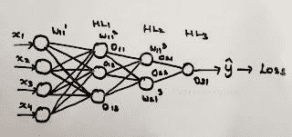
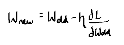
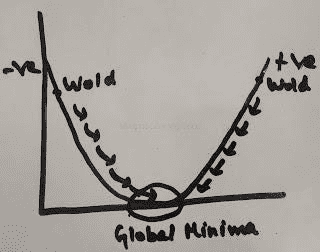
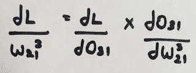
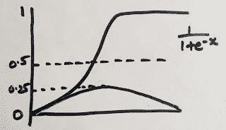
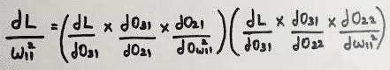

# 多层神经网络-深入！

> 原文：<https://medium.com/mlearning-ai/all-you-have-to-know-about-multi-layer-neural-networks-9ddcc097576c?source=collection_archive---------7----------------------->

**在此我们将了解:**

*   **多层神经网络**
*   **梯度下降优化器**
*   **链式法则**
*   **乙状结肠功能**
*   **消失渐变问题**

**在多层神经网络中，可以有 n 个隐藏层。神经网络中的每个神经元都有各自的权重。在这个多层神经网络中，它有一个输入层、三个隐藏层和一个输出层。X1，X2，X3，X4 是输入特征。传递给第一隐藏层的第一个神经元的权重被表示为 W11 1。这样就命名了所有神经元的权重。**

Multi-layer Neural Network

# **多层神经网络**

**O11 是第一个隐层的第一个神经元的输出，这里用的公式是** [**神经网络基础**](https://snega-s.medium.com/training-of-neural-networks-back-propagation-7047d6ffbdc4) **。这样，所有的神经元向前传播并预测 y-hat..然后计算损失函数，如果损失函数高，则使用优化器反向传播。**

# 梯度下降优化器

**优化器用于最小化神经网络的损失函数。其中一个优化器是梯度下降优化器。我们知道的权重更新公式是**

损失函数相对于旧权重的导数这一术语意味着我们将梯度下降权重，换句话说，权重将收敛直到它达到全局最小值。微分的原因是什么，但我们要找到权重的斜率。

Gradient Descent Graph

# **梯度下降图**

**例如，如果 w11’1 处于负斜率，则 Wnew 值变为正，因此权重开始通过 x 轴增加，并通过 y 轴减少，并达到全局最小值。如果 W11 1 处于正斜率，Wnew 值变得非常小，并开始减小。以这种方式，权重减小，直到它达到全局最小值。直到它在反向传播中达到全局最小值。**

**这就是梯度下降优化器的工作方式**。

**正如我们所知，优化器反向传播并更新权重。在多层神经网络中，最终输出受到每个神经元的所有输出的影响。在多层神经网络中，输出 O31 受到所有先前输出的影响。由于每个输出都影响后面的输出，因此权重更新的导数遵循链式规则。**

# 重量上升

weight updation

损失函数相对于旧权重的导数是它将影响的所有输出的微分链。

multi-layer neural network

# **链式法则**

**在反向传播中，如果权重 w21’3 要被更新，它可以被写成:**

**权重 w21’3 对输出 O31 有影响，因此找到损失函数相对于输出 O31 的导数，并与输出相对于将要更新的权重的导数相乘。以这种方式，在权重更新期间遵循链式法则**

# **消失渐变问题**

**其中一个激活函数是 sigmoid 函数，其函数值在 0 到 1 之间。如果输出低于 0.5，则值为 0，高于 0.5，则值为 1。因此，大输出在 0 到 1 之间收敛。这个 sigmoid 函数的导数范围在 0 到 0.25 之间。**

sigmoid function

**如果神经网络具有许多层，例如 50 层，则应该计算每层中神经元的所有输出的衍生链。在上述神经网络中，如果为 w11’2 更新权重，则它可以写成**

**由于 sigmoid 的导数范围在 0 到 0.5 之间，所以 O31 相对于 O21 的导数将非常小。当小数值相乘时，结果是一个小数字。因此权重 Wnew 将近似等于 Wold，并且权重需要很长时间来收敛并达到全局最小值。这就是所谓的消失梯度问题。这可以通过使用其他激活函数来解决，例如 Leaky relu。**

# **结论**

**因此，我们讨论了多层神经网络、梯度下降优化器、链规则、消失梯度问题以及如何使用激活函数来解决它。**

[https://medium . com/mlearning-ai/mlearning-ai-submission-suggestions-b 51e 2b 130 bfb](/mlearning-ai/mlearning-ai-submission-suggestions-b51e2b130bfb)

🟠 [**成为作家**](/mlearning-ai/mlearning-ai-submission-suggestions-b51e2b130bfb)