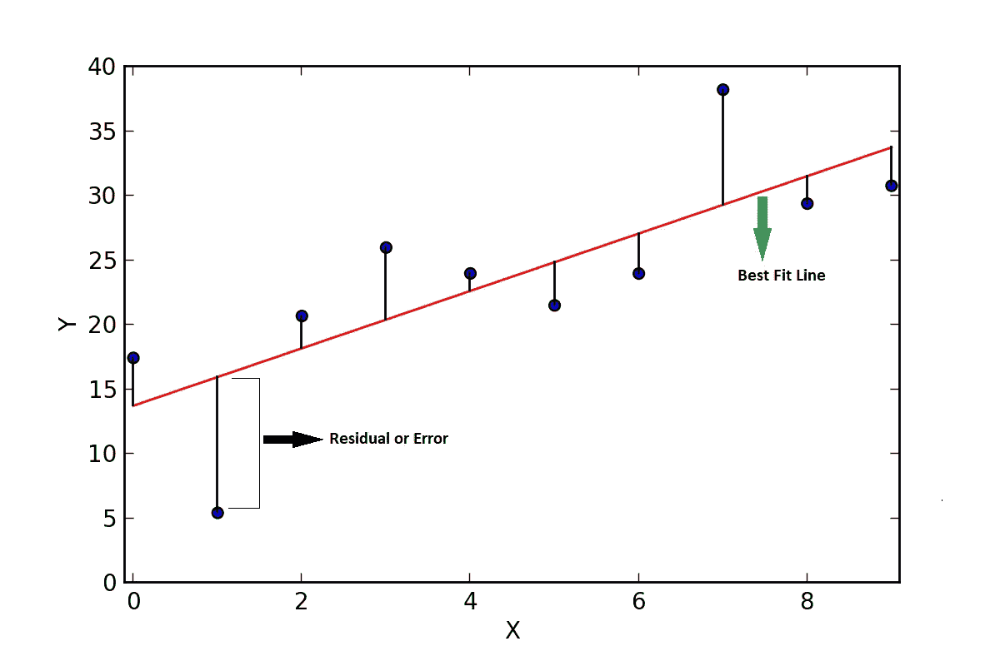
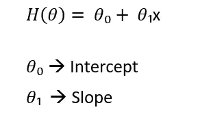
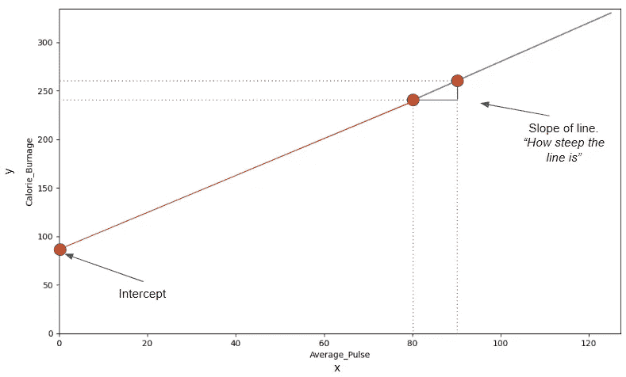
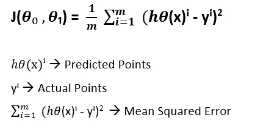
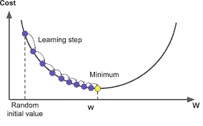
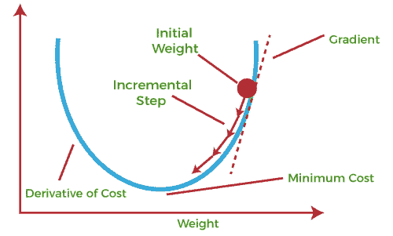
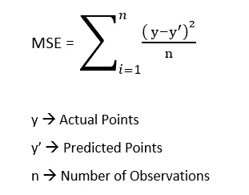
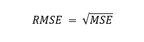
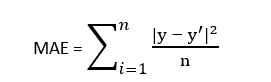

# 关于线性回归(理论)你需要知道的

> 原文：<https://medium.com/mlearning-ai/all-you-need-to-know-about-linear-regression-theory-9594f62515?source=collection_archive---------3----------------------->

线性回归是一种机器学习(ML)算法，用于估计定量变量之间的关系。它基于寻找输入变量和输出变量之间的线性关系的概念。

我们可以使用线性回归来:

1.  理解从属特征和独立特征之间关系的强度。
2.  对于给定的自变量数值，预测因变量的数值。

线性回归的例子:

1.  假设我们有一个只有两列(身高和体重)的数据集。目的是创建一个以身高为输入并预测体重的模型。
2.  创建一个以房间数量为输入并预测房价的模型。

## 线性回归的图形直觉

线性回归的主要目的是找到最佳拟合线，使得实际点和预测点之间的差值之和**最小**。预测点和真实点之间的差异称为残差或误差。

Linear Regression

这里，在上图中，蓝色的点是预测点，预测点与真实点(红线上的点)之间的差异称为残差或误差。线性回归试图减少这些误差或残差。所以在线性回归中，误差或残差的总和应该是最小的。

## 直线方程

为了理解线性回归，首先理解线性方程或直线方程的概念是很重要的。

*   **y = mx + b，** m 是斜率，b 是截距。
*   它也可以写成，在大多数研究论文中，它被写成:

Equation of a Straight Line

1.  **截距:**在最佳拟合直线中，当自变量(x)的值等于零时，最佳拟合直线与 y 轴相交的点称为截距。
2.  **斜率:**它告诉我们随着自变量(x)的单位运动，因变量(y)的运动是什么

Image Source: [w3schools](https://www.w3schools.com/datascience/ds_linear_slope.asp)

## 价值函数

线性回归的成本函数用于评估模型根据自变量的值预测因变量的能力。它还有助于找到模型参数(斜率和截距)的最佳值，使因变量的预测值和实际值之间的误差最小化。**成本函数是模型性能的衡量标准。**

**示例:**假设我们有一个只有两列高度和年龄的数据集。我们想根据人们的年龄来预测他们的身高。我们可以通过对数据进行直线拟合来使用线性回归。

然后，成本函数将用于测量人的预测身高和实际身高之间的差异。目标是找到模型参数值，使预测高度和实际高度之间的差异最小。θ0 和θ1 是参数。

Cost Function

## 梯度下降

如前所述，成本函数用于测量预测点和实际点之间的差异或残差，因此我们需要降低成本函数。这可以使用**梯度下降来完成。**

梯度下降是一种优化算法，用于查找模型参数(如斜率和截距)的值，以最小化预测数据点和实际数据点之间的误差。它的工作原理是从参数的初始值开始，然后在使误差最小化的方向上或在全局最小值的方向上调整它们。我们需要接近全局极小点或最小成本点，只有这样成本函数才会降低。

Source Image1: [Saugatbhattarai](https://saugatbhattarai.com.np/what-is-gradient-descent-in-machine-learning/), Source Image2: [Javapoint](https://www.javatpoint.com/gradient-descent-in-machine-learning)

**举例:**假设你站在山顶，试图找到到达山脚的最快路径。你可以选择一条直接下山的路线，这可能不是最快最安全的路线，或者你可以选择一系列较小的步骤，每次根据你面前的地形稍微调整你的方向。这类似于梯度下降的工作原理。

## 学习率

学习率决定收敛速度，并用于确定调整模型参数时优化算法所采用的步长。如果学习率太高，将导致剧烈的更新，并且收敛可能不会发生。如果学习率太小，将需要大量的时间来达到收敛。

Source: [Niser.ac.in](https://www.niser.ac.in/~smishra/teach/cs460/2020/lectures/lec8/)

## 成本函数

*   **均方误差(MSE):** 取预测点和实际点的平方差之和，然后除以观测总次数计算得出。它由以下公式给出:

Mean Squared Error

*   **均方根误差(RMSE):** 取 MSE 的平方根给出。

Root Mean Squared Error

*   **平均绝对误差(MAE):** 平均绝对误差的公式与 MSE 非常相似，但我们不是取实际值和预测值之差的平方根，而是取其绝对值。它由下面的公式给出。

Mean Absolute Error

*感谢阅读本文！如果你有任何问题，请在下面留言。可以关注我的*[*Linkedin*](https://www.linkedin.com/in/devsachin0879/)*和*[*GitHub*](https://github.com/devsachin0879)*。*

 [## Mlearning.ai 提交建议

### 如何成为 Mlearning.ai 上的作家

medium.com](/mlearning-ai/mlearning-ai-submission-suggestions-b51e2b130bfb)