# 亚马逊时尚发现引擎(基于内容的推荐)

> 原文：<https://medium.com/mlearning-ai/amazon-fashion-discovery-engine-content-based-recommendation-19d63563ef01?source=collection_archive---------1----------------------->


> R ***现实世界问题***

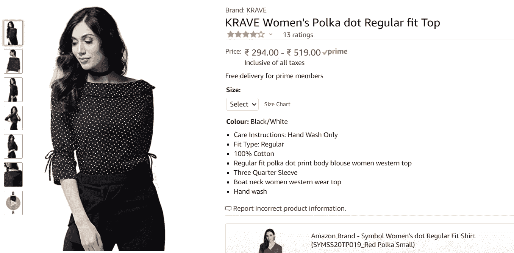

*   每当我们访问 Amazon.com，这是我们的**产品形象**。我们有同一产品的多个图像。
*   “Krave”是**的品牌名称**。
*   “KRAVE 女式圆点常规合身上衣”是**题**。标题中有很多有趣而重要的信息。
*   在标题下面，我们有**的价格、尺寸、颜色，然后是产品描述。**

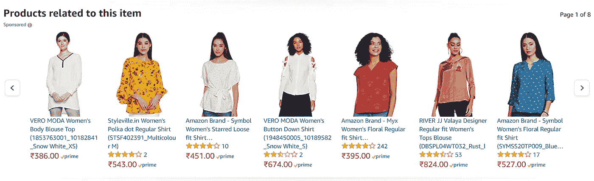

*   然后根据我们的搜索显示相关/相似的产品。


*   它还向我们展示了“客户也购买了”产品，这些产品也是推荐产品。
*   **为什么关心产品推荐？**
    据估计，亚马逊大约 35%的收入来自产品推荐。由于产品推荐栏，如上所示，用户最终会购买一两件产品。
*   亚马逊内部使用两种类型的推荐系统:
    1) **基于内容的推荐:** *当我们搜索关于圆点衫的时候，它使用文字和图片来推荐类似的商品*。
    2) **基于协同过滤的推荐:** *想象一下，用户 U1 浏览了 i1、i2、i3 的产品
    用户 U2 浏览了 i1、i3、i4 的产品
    那么我可以推荐用户 U3，当他在 i1 页面时的产品 i3。因此，这被称为基于协同过滤的推荐。可惜我们没有这个数据。*
*   因此，在我们的案例研究中，我们将使用基于内容的推荐。

> ***攻击计划***

*   设置 python
*   数据采集
*   数据清理
*   文本预处理
*   线性代数
*   基于文本的产品推荐
    -BoW
    -word 2 vec
    -Tf-IDF
*   基于图像的产品推荐
*   A|B 测试

> ***亚马逊产品广告 API***

我实际上使用了亚马逊自己的产品广告 API，因为我们需要以符合政策的方式使用我们选择的任何编程语言从 Amazon.com 获得数据。

我获得了女性上衣和衬衫的数据，得到了大约 183000 种产品的数据。我们得到的数据包括图片 URL、标题、价格、产品描述等。所以我们将主要关注女性上衣的数据。

> ***数据和术语概述***

*   数据集是一组数据点。
*   这里的一行代表该数据集中的一个产品，也称为数据点。
*   每一列代表给定产品的一个变量/特征。例如:它可以有一个价格，标题，图像等。
*   数据点/产品数量:183138
*   特征/变量数量:19

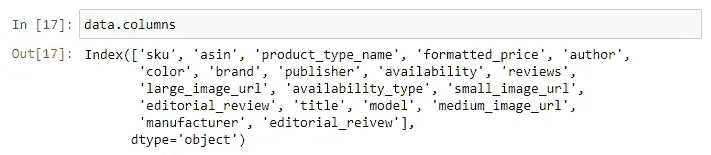

*   在本次研讨会中，我将只使用这 19 项功能中的 6 项。
    — 1。asin(亚马逊标准识别号)-在 Amazon.com 给每个产品一个唯一的编号。
    — 2。品牌(产品所属的品牌)
    — 3。颜色(服装的颜色信息，它可以包含多种颜色作为一个值，例如:黑色和蓝色条纹)
    — 4。产品类型名称(服装的类型，例如:衬衫/t 恤)
    — 5。medium_image_url(图像的 URL)
    —6。标题(产品的标题)
    — 7。formatted_price(产品价格)
*   我有意不使用描述，因为它很长，需要更长的时间来处理。

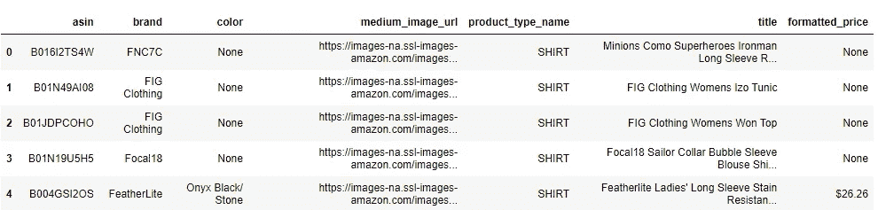

*   嗯，特性下降的一部分来自各种 EDA 技术，一部分来自领域专业知识。有时候也很直观。

> ***数据清理&理解***

这是机器学习中极其重要的一步，但却常常被忽视。我们越了解我们的数据，我们就能建立越好的模型。如果我们不想让我们的模特受苦，那就集中精力。


在这里，我们可以注意到，有一些单元格缺少数据或者没有数据。那么让我们来理解我们的数据。

1.  **功能的基本统计:产品类型名称**

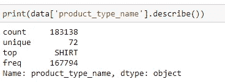

*   在 183138 种产品中，有 72 种产品是独一无二的。

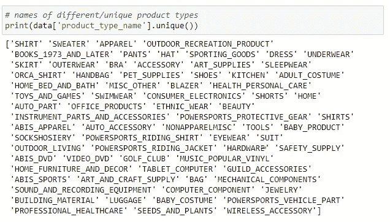

*   最常见的产品类型是“衬衫”，在 183138 件产品中有 167794 件，约占 91%。
*   10 个最常用的 product _ type _ names:

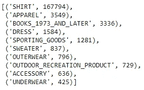

**2。功能基本统计:品牌**

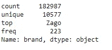

*   如数据所示，在 183138 种产品中，只有 182987 种产品给出了品牌名称。所以缺少 151 个值。
*   有 10577 个独特的品牌。
*   最上面的品牌是“扎戈”,有 223 排。
*   十大品牌是:

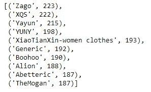

**3。特征的基本统计:颜色**

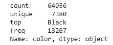

*   183138 种产品中有 64956 种产品有颜色信息。这大约是 35.4%。
*   有 7380 种独特的颜色。
*   最上面的颜色是黑色，在 13207 件产品中发现，占产品的 7.28%。

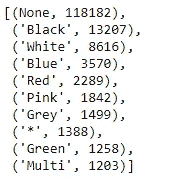

*   对于 118182 产品，完全不指定颜色。

**4。功能基本统计:formatted_price**

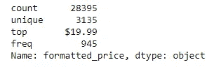

*   183K 中只有 28395 个产品有关于价格的信息，大概是 15.5%左右。
*   有 3135 个独特的价格点。
*   最高价位是 19.99 美元，适用于 945 种产品。

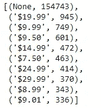

*   因此，许多产品和其他看起来合理的产品都缺少价格价值。

**5。特性的基本统计:标题**

*   标题简短，信息丰富。
*   它们是最重要的特性之一，我们将广泛使用它。

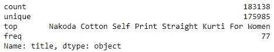

*   它们大多存在于每个产品中，这使得它成为最好的特性。

## 因此，我不是对 183，000 个数据点进行操作，而是通过删除一些数据为空的行来对数据点的子集进行操作。由于在 183K 数据集上操作计算量很大并且很耗时，所以我们将在它的子集上操作。

**6。删除 formatted_price 为空的行**

我删除了数据集中那些 formatted_price 为空或者没有给出价格信息的行。我在这里使用逻辑 not 操作来查找所有不为空的 formatted_price 字段，并将它们存储在数据中。

```
**data = data.loc[~data['formatted_price'].isnull()]
print('Number of data points After eliminating price=NULL :', data.shape[0])**Number of data points After eliminating price=NULL : 28395
```

**7。移除颜色为空的行**

以类似的方式，我删除了数据集中的那些行，其中 color 为空或者没有给出任何关于产品颜色的信息。我在这里使用了逻辑 not 运算来查找所有不为空的颜色字段，并将它们存储在数据中。

```
**data =data.loc[~data['color'].isnull()]
print('Number of data points After eliminating color=NULL :', data.shape[0])**Number of data points After eliminating color=NULL : 28385
```

## 我们将数据点的数量从 183K 减少到 28K。那些有时间并且没有计算问题的人，请随意在 183K 数据集上运行这个案例研究。

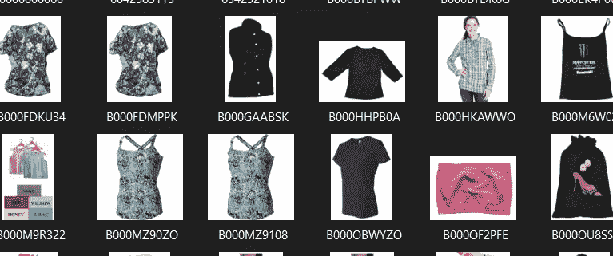

您可以使用下面的代码下载所有这些 28K 图像。你不需要运行这段代码，除非你也想下载图片。我已经在我的代码中注释了这段代码。

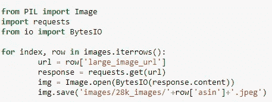

*   **我们如何处理太多的空值，这些空值很难进行插补，而且像价格这样的列非常重要，不能删除？**
    在这种情况下，我们将把所有没有价格=null 的行作为训练数据。price=null 的行被视为测试数据。因此，我们使用训练数据训练模型，并预测测试数据的价格，因为它的价格为零。现在，我们可以用预测值代替插补值。还有一种简单的方法，用“0”填充所有的空值。

## 移除重复的项目/产品

> ***删除重复:第一部分***

*   目前我们大约有 28K 产品。
*   我们需要找到标题重复或完全相同的产品的数量。众所周知，标题是最重要的特征之一，它短小精悍，信息丰富。

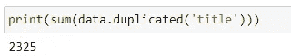

*   所以 28K 个产品中有 2325 个产品有重复的标题。

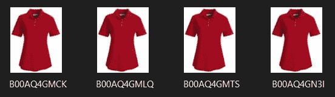

*   在这里，我们可以看到这些产品/衬衫的颜色完全相同，只是尺寸可能不同(S、M、L、XL)。比方说，第一个图像是查询产品，我们必须找到类似的产品。如果我们向客户推荐这些确切的衬衫作为只是不同尺寸的查询产品，那么它会导致糟糕的客户体验，因为标题完全相同。
*   因此，为了避免糟糕的客户体验，我们将删除重复的。

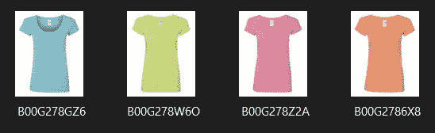

*   我们甚至可以有重复的例子，产品完全相同，但颜色不同。当这些图片之一是查询产品时，推荐同一产品的不同颜色产品并不总是最好的。
*   因此，在我们的数据中有许多类似上述示例的重复产品，我们需要对它们进行重复数据删除以获得更好的结果。

> ***删除重复:第二部分***

*   我会删除标题中很少几个字的所有产品。所以如果标题长度大于 5，那么我会考虑，否则我会去掉。

```
After removal of products with short description: 27949
```

*   现在，我将根据标题(标题的字母顺序)按降序对整个数据进行排序。

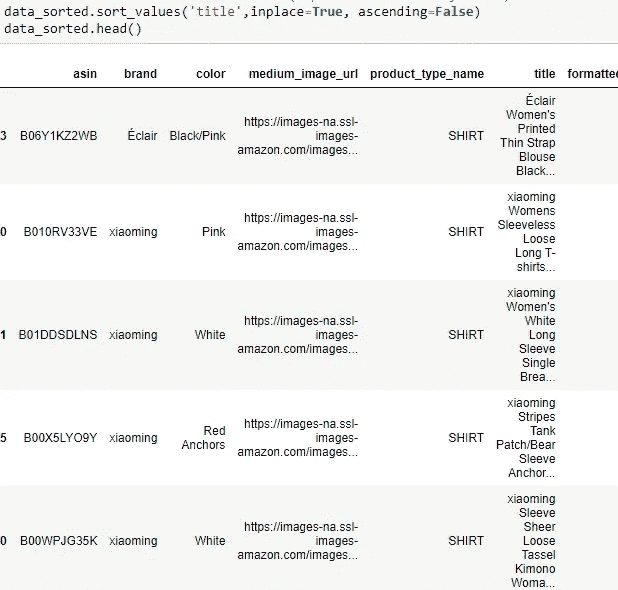

*   一些仅在最后几个单词/后缀不同的重复标题的例子。

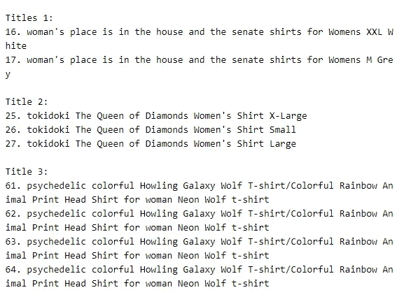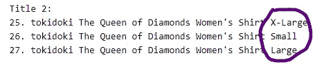

由于这些标题是按字母顺序排列的，我们可以得到这些相似的标题，只是最后几个单词不同而已。所以我们将这个逻辑。


假设我在这里有变量“I ”,在(i+1)这里有变量“j”。既然已经排序了，我就比较一下我的第 I 个标题和第 j 个标题相差多少字。我可以这样做，我可以把 T1 的所有单词和 T2 的所有单词放在一个集合中，然后在它们之间进行集合差分。如果差异小于 2，那么我们将认为这两个标题是相似的，并删除仅在结尾不同的重复。因此，我们将删除 T2，然后增加“j ”,并继续这样做。一旦我们把 T1 和其他所有东西进行比较。然后，我再次将我的“I”增加到 T3，将“j”增加到(i+1)位。我们将一直这样做，直到 for 循环结束。

```
Number of data points after removing the duplicates which differ only at the end :  17592
```

> ***删除重复:第三部***

以前，我们按照标题的字母顺序对整个数据进行排序。然后，我们删除标题是相邻的和非常相似的标题。

但是有一些产品的标题并不相邻但是非常相似。

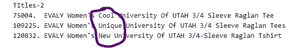

这些标题是完全相同的，除了一个单词不同，不能解决按字母顺序排序。那么我们如何移除它们呢？
i: 1 → n
j: 1 → n
对于每一对(I，j):我们会发现它们在单词上有多少不同。
如果(Title i，Title j)中的单词差≤ K 个单词(比方说)，那么我们就去掉 Title j。

我们知道，现在 n = 17K 的产品，那么我现在可以形成多少对呢？
→nC2 = n(n-1)/2
→17kc 2 = 17592(17592–1)/2 = 154730436 = 1.54 亿
所以，我们需要进行 1.54 亿个标题对比对。

```
Number of data points after stage two of dedupe:  16042
```

> ***文本预处理:分词和停用词去除***

*   停用词去除是自然语言处理中的一个文本预处理阶段。
*   停用词是一种语言中的一组常用词。英语中停用词的例子有**“a”、“the”、“is”、“are”等**。停用词通常用在文本挖掘和自然语言处理(NLP)中，以消除那些太常用而携带很少有用信息的词。
*   我使用了从 nltk lib 下载的停用词列表。
*   我删除了标题中所有的特殊字符，如“#$@！%^&*()_+-~?>< etc.
*   I converted all letters to lower case.
*   I removed stop words from the titles.
*   In my system, it took me around 3.5 seconds to remove stop words from all the titles from the data.

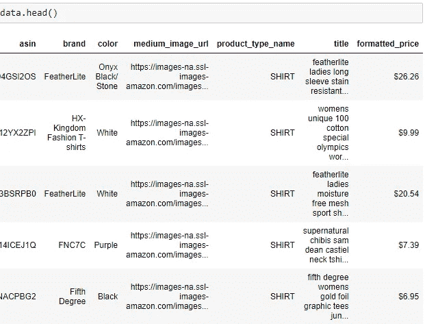

> ***文本预处理:词干***

*   简而言之，词干化就是去除单词的一部分，或者将单词简化为在字典中可能没有意义的词干或词根。
*   假设我们有一组单词:fishing，fisher，fished
    它的词根是 fish。同样地，这组词的词根是 argu。
*   我试着用波特词干分析器对我们的标题进行词干分析，但是效果不太好。归根结底，这都是实验。

## 所以在预处理步骤的最后:

*   重复数据删除
*   删除停用词

## 我剩下大约 16K 个产品作为我的数据集。

现在，让我们建立基于标题文本的产品相似性系统。

# ***基于文本的产品相似度***

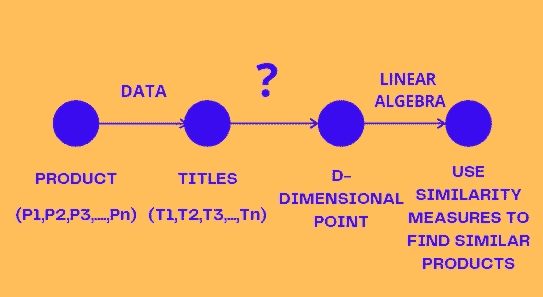

*   对于每种产品，我们都有一个标题。
*   **给定一个标题，如何将其转换成 d 维点？**
    有多种方法可以将一个文本转换成三维点。
*   给定标题的 d 维表示，我们可以使用相似性度量来查找相似的产品。

> ***将文本转换为 n-D 向量:单词包(BoW)***

1.  S =出现在任何标题(T1，T2，T3，…)中的单词集。，Tn)。
    假设这个集合 S 的大小为“d”，或者 d 是 S 中唯一单词的大小。
2.  现在，我将为每个标题创建一个 d 维向量。假设词汇/集合中的单词 1 在标题 1 中出现了 0 次，因此我们将值作为“0”放入向量中。类似地，单词 4 在标题 1 中出现了 2 次，所以我们将值设为向量中的“2”。

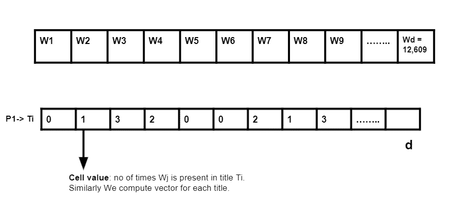

所以在单词袋中，我排除了文本的序列或序列信息。这是一个极其简单而强大的技术。

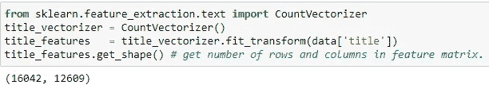

通过执行这 3 行代码，我们得到了一个 16042 行和 12609 列的矩阵。对于任何标题 Ti，它在 12609 个唯一字中最多可以有 20 个字，因此矩阵中的大多数单元将是“0”。因此，在我们的例子中，因为它们中的大多数都是零，所以存储 16K x 12K 单元的存储位置是没有用的。因此，我们将它们存储在稀疏矩阵中，而不是二维数组中，以解决存储问题。在上面的代码中，fit_transform 返回稀疏矩阵。

> ***基于产品相似度***

*   我们的函数 bag_of_words_model 将标题 id 和您希望它推荐的类似产品的数量作为参数。
*   pairwise_dist 将存储从给定输入服装到所有剩余服装的距离。我在这里使用的度量标准是欧几里德距离来衡量一个标题到另一个标题之间的距离。
*   np.argsort 将返回标题要素的最小距离的索引。
*   p 列表将存储标题要素的最小距离。
*   数据帧索引也存储最小距离的索引。
*   我们会通过
    1。doc_id
    2。title1
    3。title2
    4。get_result 函数的 URL
    5.model。
*   现在，我们将调用一个产品的词袋模型来获得类似的产品。

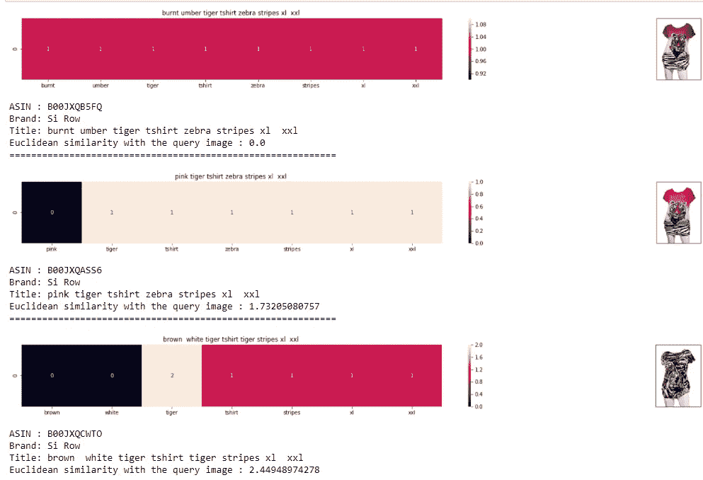

*   让我们来理解可视化:热图
    这里说，单词 pink 在查询中不存在，这就是为什么它是“0”。【tiger 这个词出现在查询中，所以是“1”。
    类似地，所有其他单词都出现在查询中。
    粉红色越多或非零值越多，两个标题越接近或重叠越多。颜色表示与查询/输入标题的交集。

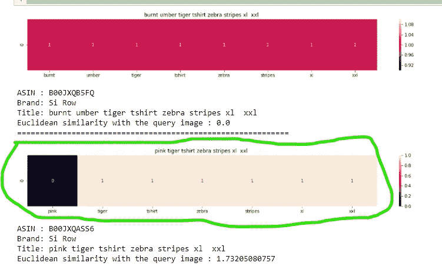

> ***TF-IDF:基于单词重要性特征化文本***

*   每个标题被称为文档，文档集合被称为文档语料库。

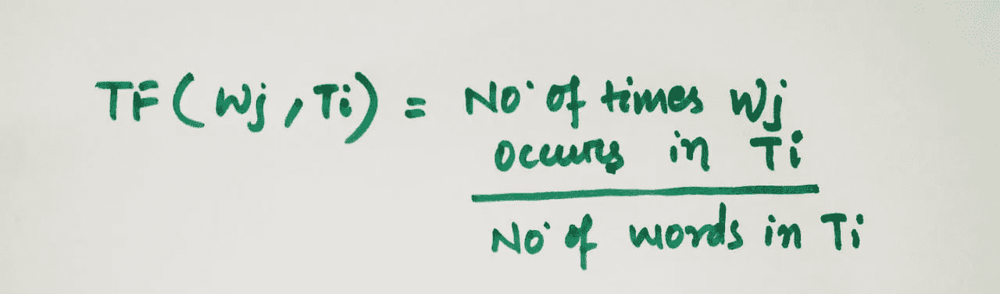

*   术语频率是指术语或词在文档/标题中出现的频率。如果 wj 在一个标题中出现多次，那么术语频率也会增加。
*   IDF(逆文档频率):给定一个文档语料库和单词 j，它通过包含单词 Wj 的语料库中的文档数量给出语料库中的文档数量的自然对数。

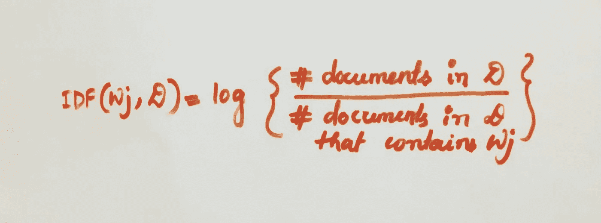

*   如果 Wj 在文档语料库中很少，IDF(Wj)会增加。分母越小，比值越大，整个函数的对数越大。
*   因此，Tf-IDF 现在测量和评估一个单词与文档/语料库集合中的文档的相关程度。TF-IDF 是词频和逆文档频的乘积。因此，如果一个单词在一个文档中出现多次，但很少在语料库的所有标题中出现。那么 IDF 就会高。这就是我们如何计算标题 Ti 的 TF-IDF 向量。

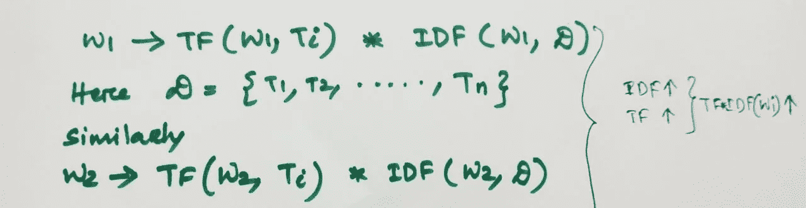

> ***基于 TF-IDF 的产品相似度***

*   我们的函数 tfidf_model 将标题 id 和您希望它推荐的类似产品的数量作为参数。
*   pairwise_dist 将存储从给定输入服装到所有剩余服装的距离。我在这里使用的度量标准是欧几里德距离，用来衡量一个标题到另一个标题之间的距离。
*   np.argsort 将返回标题要素的最小距离的索引。
*   p 列表将存储标题要素的最小距离。
*   数据帧索引也存储最小距离的索引。
*   我们会通过
    1。doc_id
    2。标题 1
    3。title2
    4。get_result 函数的 URL
    5.model。
*   现在，我们将为一个产品调用 tfidf_model 来获取类似的产品。

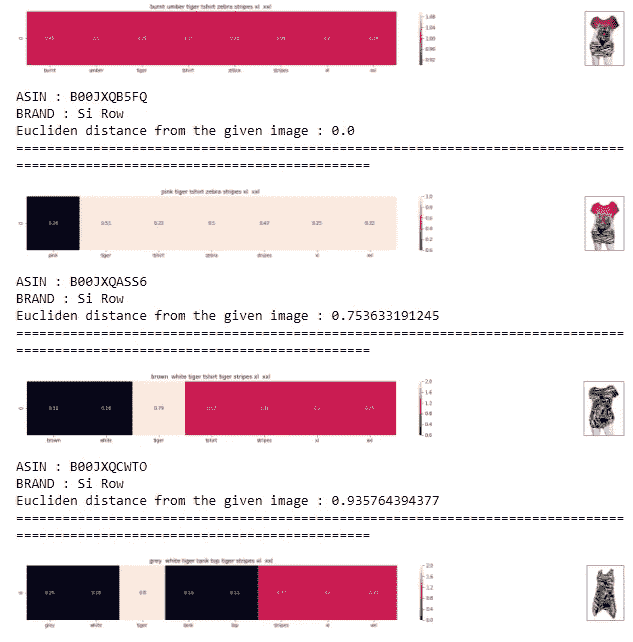

*   例如:“burned”是一个罕见的词，burned 的 tf-idf 值很高，因为 burned 属于查询标题，所以标题中包含“burned”的其他产品将与我们的查询图像相似。现在，这两个标题将是相似的，因为，burnt word 是一个罕见的词，所以 IDF 很高，这导致 tfidf 值很高。这里，相似性是基于 tfidf 值计算的。
*   现在，像“烧焦”和“棕色”这样的罕见词会有非常相似的 tfidf 值，比如分别为 0.2 和 0.3。在这种情况下，他们之间的距离将会更小，从而有更多的机会被推荐。
*   因此，相比基于单词包的相似度，我们有更好的机会获得更好的推荐。
*   因为“烧焦”有更高的 tfidf 值，所以我们最终也得到了这样的烧焦颜色顶级推荐。

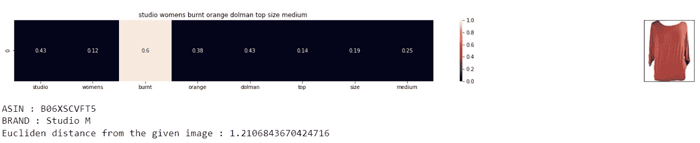

*   所以单词袋只是使用单词的频率，而 tfidf 使用单词的稀有性和重要性，这是一种非常好的推荐技术。

> ***基于 IDF 的产品相似度***

在本案例研究中，如果我们观察标题:

*   话不经常重复。
*   标题也有变化，有长有短。
*   较短标题的术语频率(TF)较高。在这种情况下，tfidf 会选择较短的标题。
*   所以在我们的例子中，如果 Ti 是一个网页或一个长文档，那么词频是有意义的，因为出现频率越高的词就越重要。这里每个标题几乎没有 15 或 20 个单词，所以最好去掉词频，只使用 IDF(逆文档频率)。我们可以试验一下，看看结果是否比 tfidf 更好。
*   为了仅使用 IDF 属性并忽略 TF 值，我们使用 CountVectorizer 拟合数据，并定义了我们自己的 IDF 函数。
*   在我们的案例中，效果并不理想。

> ***基于文本语义的产品相似度:Word2Vec***

*   单词袋和 tfidf 不考虑语义。两者都是基于频率的技术，用于返回稀疏向量。
*   给定标题，我们希望它转换成 d 维数组，并使用欧几里德距离寻找相似性。但是我们能找到语义相似吗？
*   一种非常流行的技术是 Word2Vec。它返回给我一个密集的数组或者大部分单元格都不为零。Word2Vec 算法将观察我们的数据语料库中的模式，并给我们一个 d 维向量。Word2Vec 通常需要非常大的数据语料库。
*   google 已经在 Google 新闻语料库上训练了 Word2Vec，对于该语料库中的每个单词，我们都获得了 300 维向量。谷歌免费为我们提供了这个模型。所以我们会用谷歌新闻 word2vec。

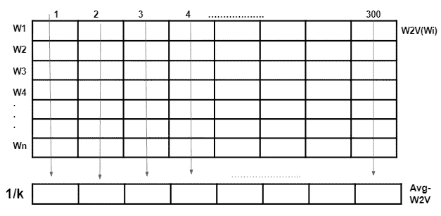

*   假设我们的 title Ti 中有 k 个单词。为了得到 Ti 的 word2vec，我们取所有单词的所有第一个分量的和，类似地继续将所有单元的分量相加，直到 300 维，并得到一个新的向量。然后，我会将新向量的所有分量除以 k。这就是所谓的任何句子的平均 word2Vec。

> ***平均 Word2Vec 产品相似度***

*   我们甚至可以使用自己的文本数据构建一个自定义的 Word2Vec。由于我们没有像 google 那样的大型语料库，所以我们将只使用 google 的 Word2Vec。作为参考你可以通过这个代码。如果您有足够的数据，那么构建您自己的定制 word2vec 模型是非常容易的。您需要为各种参数设置值，例如词向量维数、最小字数、并行运行的线程数量、上下文窗口大小等。然后你可以简单地初始化和训练你的模型。

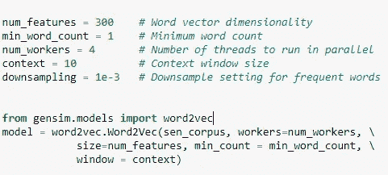

*   现在，如果你有一个 RAM ≥ 12GB，那么你可以成功地使用谷歌矢量文件，因为你会有数百万字的矢量，这将需要很多时间。如果我们回想一下，我们有大约 12，609 个独特的单词。因此，与其存储数百万个单词的所有数据，为什么我们不能创建一个简单的字典，在那里我们可以只存储/采样我们的 12，609 个单词及其相应的向量。所以这会节省很多内存，我把它放到了一个 pickle 文件中。
*   我们可以写下一些实用函数来获得 word2vec，用于计算距离和我们的热图函数，以及一个用于计算所有标题的平均 Word2Vec 的函数，如使用 build_avg_vec 函数之前所解释的。
*   现在，我们可以像其他模型一样构建 avg_w2v_model，在这里我们可以找到成对的距离，排序并找到最近的点。
*   我们会通过
    1。doc_id
    2。标题 1
    3。title2
    4。URL
    5.model 到 get_result 函数并调用某个产品的 avg_w2v_model 来获取类似的产品。让我们看看，w2v 如何给出不同的结果。

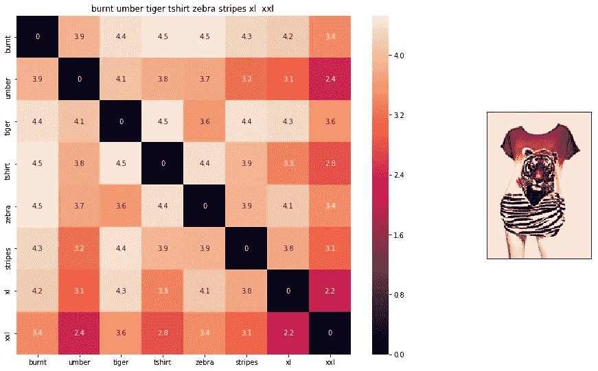

*   这里随便挑一个值，比如说 3.6，就是斑马的 word2vec 和老虎的 word2vec 之间的欧氏距离。该值越低，这两个术语越相关。只需查看 xxl 和 xxl 之间的欧几里德距离，因为它们相同，所以它们的值为“0”。因此，较暗的值是标度中较小的值。

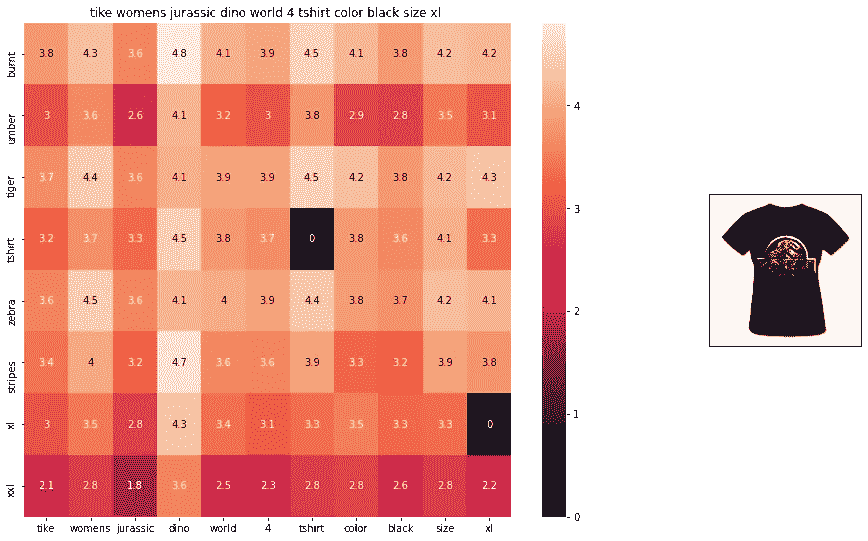

*   所以 word2vec 给了我们语义相似度。我建议你必须通过代码和所有的可视化来理解语义相似性，这是单词包 tfidf 所不能理解的。

> ***基于 TF-IDF 加权 Word2Vec 的产品相似度***

*   在 TF-IDF 中，我们使用单词重要性。现在，如果我们利用 tfidf 概念与 word2vec 相结合，那么我们就有了单词重要性以及语义相似性的潜力。这就是所谓的 TF-IDF 加权 Word2Vec。
*   我有一个标题为 D = {T1，T2，T3，…，TN}
    的文档语料库，假设 Ti 有 5 个单词，k = 5，Ti 的 Wi 是 300 维向量。我已经在语料库 D 的标题 Ti 中找到了这个单词 Wi 的 TF-IDF(Wi，Ti，D)，现在，无论我得到 TF-IDF 的什么值，我都将其乘以 Wi 的 300 维数组的每个分量。类似地，我用 Ti 的所有单词和它们各自的 TF-IDF 来执行这个过程。然后我会发现 N = Ti 中所有单词的所有 TF-IDF 值之和。
*   我们取所有单词的所有第一个分量的总和，类似地继续将所有单元的分量相加，直到 300 维，并且得到类似于平均单词 2vec 的新向量。然后，我会将新向量的所有分量除以 n。这就是任何句子的 TF-IDF 加权 Word2Vec。

> ***基于 IDF 加权 Word2Vec 的产品相似度***

*   而不是计算 TF-IDF，只能计算 IDF 加权 Word2Vec。IDF 还为我们提供了语料库中单词的重要性，因为如果一个单词出现几次，那么它将被赋予更高的重要性，而 word2vec 为我们提供了语义相似度。我没有在我的代码中使用带有 word2vec 的术语频率，因为标题很小，大多数单词只出现一次。
*   代码与我们之前所做的非常相似。这样你就可以浏览我的 github repo 的代码了。我们找到成对的距离，传递一些参数，并找到相似的产品。

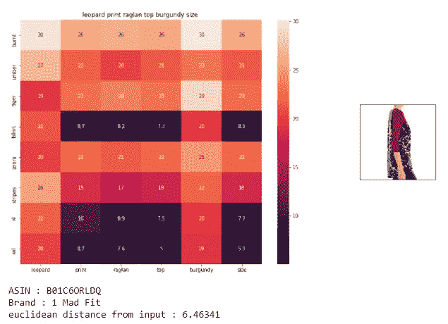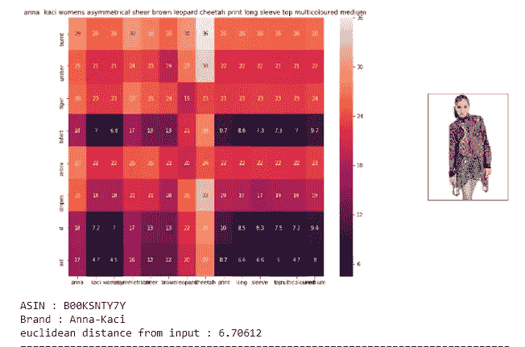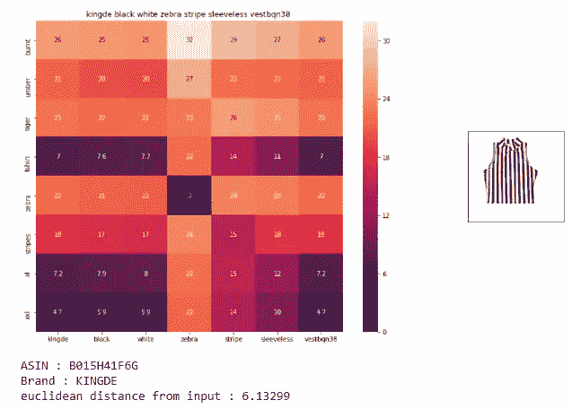

*   我们成功地基于其他模型没有给出的查询得到了一些真正有趣的类似产品。IDF 加权 Word2Vec 给了我们惊人的结果。
*   到目前为止，我们已经看到了不同的技术，如弓，TF-IDF，avgw2v，IDF 加权 w2v，每种技术都有一个公平的结果。但是从商业角度和影响来看，如何决定，哪种模式是最好的？为了达到这个目的，我们将理解 A|B 测试。

> ***加权相似度使用品牌&颜色***

*   到目前为止，我们只是用标题来表示产品的相似性。我们还没有使用品牌和颜色。这些是我们可以利用的额外变量。
*   对于每个产品 Pi，我们已经得到了标题向量。类似地，对于每个产品 Pi，我们将得到品牌向量和颜色向量。一旦我们得到这三个向量，我们将连接这些向量。
*   比方说，我有 m 个品牌。我们假设，产品 bi 有品牌 bi，我怎么把它写成向量？

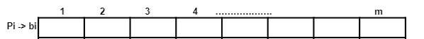

*   所以这将是一个 m 维向量。与品牌的单元格相对应的值是指数值。向量中只有第 I 个索引值将为“1”，其余所有单元格的值都将为“0”。这种编码被称为一个热编码。
*   同样，我们也将对颜色进行一次热编码。
*   现在，在连接之后，我有了一个向量，向量的一部分代表标题，向量的一部分代表品牌，向量的一部分代表颜色。

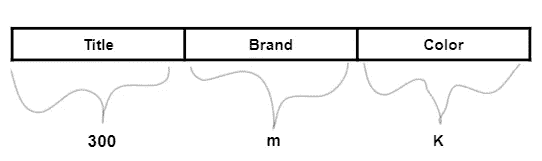

*   给定两个乘积，pi 和 pj，我可以简单地用这个全向量求出 pi 和 pj 之间的欧氏距离。
*   让我们假设，我们希望向客户展示相同品牌或相同颜色的产品。那么，我可以修改我的欧几里得距离来以某种方式纳入这种偏好吗？
    我们要做的就是取加权欧氏距离。我们必须构建三个权重:标题权重(Wt)，品牌权重(Wb)，颜色权重(Wc)。然后用 Wt 乘以 title 向量的每个元素，用 Wb 乘以 brand 向量的每个元素，用 Wc 乘以 color 向量的每个元素。相乘后，你只需要取欧几里德距离
*   举个例子:如果 Wt = 1，Wb = 5，Wc = 1，因为我们给了品牌更多的权重，所以我们最终更喜欢相同品牌的产品。重量越大，偏好越多。
*   权重的选择在很大程度上取决于领域知识，数据科学家的职责是调整权重值，看看什么更有效。
*   让我们来看看结果:

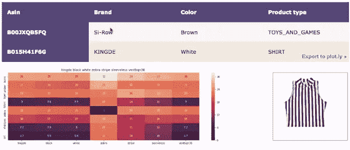

Here, brand and color are completely different from the query, still it pops up because we gave same weight of 5 and 5 to brand and color.

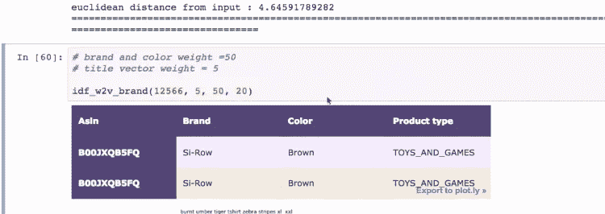

*   在这里，我们更加重视品牌和颜色。

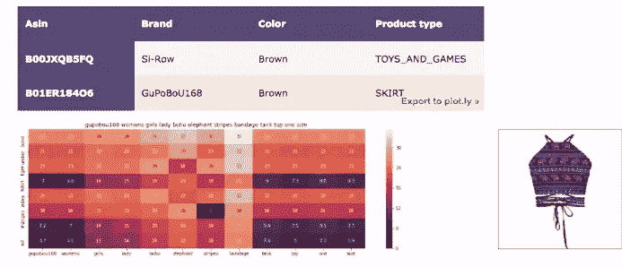

We can observe here, that as the brand changes, but the color stays brown. Even if one changes, the other one compensates because we have given equal weight of 50 to brand and color.

*   这些就是我们可以在推荐系统中采用的策略。

> ***构建真实世界解决方案***

*   我们致力于基于单词包的产品相似性模型。
    我们研究了基于 TF-IDF 的产品相似性模型。
    我们致力于基于 IDF 的产品相似性模型。我们致力于基于 Word2Vec 的产品相似性模型。
    我们致力于基于平均 Word2Vec 的产品相似性模型。
    我们研究了基于 TF-IDF 加权 Word2Vec 的产品相似性模型。
    我们致力于基于 IDF 加权 Word2Vec 的产品相似性模型。
    我们使用基于品牌和颜色的产品相似性模型来研究加权相似性。
*   所以，我们研究了多种技术。但是，现实世界的解决方案/系统是如何构建的呢？大多数公司使用多种技术。

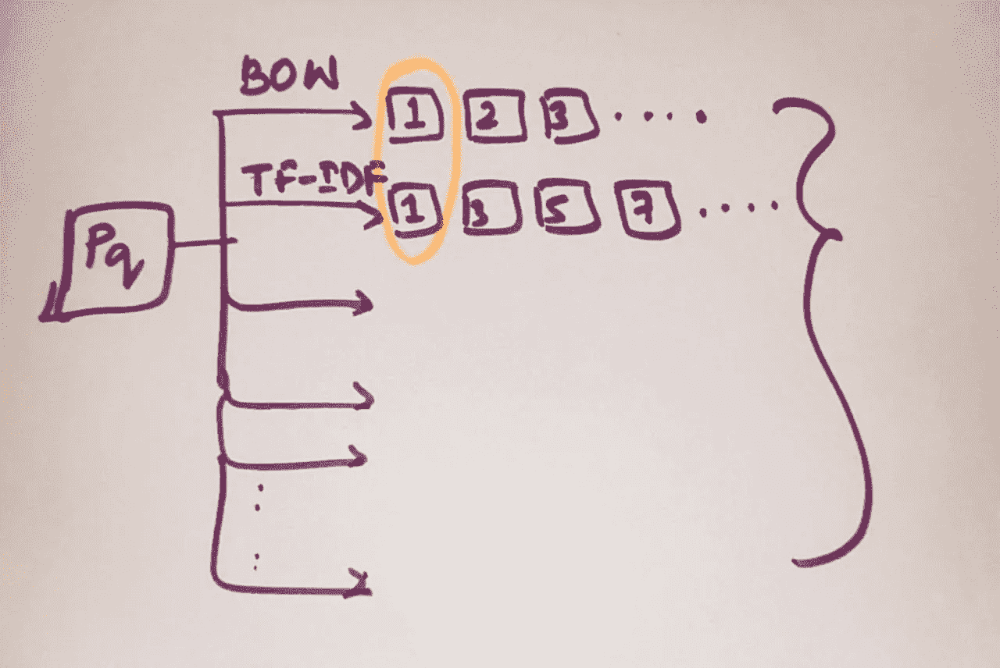

*   所有这些结果都被考虑在内，我们将所有这些结果组合起来。因为产品“1”出现了很多次，即使我使用了不同的算法，同样的结果还是会出现。可能这个结果非常重要。所以，我会应用商业规则。
*   商业规则可以是:
    ——不要展示相同品牌的产品超过两次或三次。
    -产品经理可以制定更多类似的规则，最终我们会得到最终的产品列表。
    -这些业务规则测试结果的质量。
*   我得到的最终列表将显示给客户。
*   现在，我们如何知道我们的解决方案是好的呢？为此，有一个|B 测试，也称为现场测试或桶测试。

# 基于深度学习的视觉产品相似度

> ***ConvNets:如何特征化图像:边缘、形状、部分***

*   对于每个产品 Pi，我都有一个图像的 URL。从这个网址，我可以下载产品图片。现在我如何将我的图像转换成一个 d 维向量？
*   我们可以从图像中提取各种特征，如边缘、形状、颜色、斑马纹、豹纹等。如果给定一幅图像我们可以构造一个向量。向量的一部分是关于颜色的，向量的一部分是关于形状的，向量的一部分是关于图案或边缘的。现在我可以用欧几里德距离来计算两个向量之间的距离。
*   因此，给定一张图像，我将使用像 VGG-16 这样的卷积神经网络来将我的图像转换为密集向量。如果两幅图像非常相似，那么图像 1 的向量 1 和图像 2 的向量 2 之间的欧几里德距离将非常小。
*   我们将使用一些现有的 CNN 的 VGG-16 为我们的任务建立基于图像的产品相似性。VGG-16 拍摄一幅图像，并将其转换成 25，088 维的密集矢量。
*   我所有的图像长度都是(224，224)并且我有大约 16，042 个样本。
*   重要功能 **save_bottlebeck_features** 有 3 部分。第一部分主要是建立 VGG-16 网络。生成器部分获取我的每张图像，并通过 VGG-16 网络运行，然后返回给我 25，088 个维度特征。我还为我的每件产品收集别名。最后，我做了一个 numpy 保存，我把我转换成 CNN 矢量特征的 16K 图像保存到。npy 文件以及 asin 名称。
*   记住，这里我们包括 top = false，所以它不包括最后完全连接的层，因此输出不会是 1000。VGG 16 中的最后一个 conv 层给出了形状为 512 x 7 x7 的输出。展平这个输出，我们将得到 25，088 长度的向量。
*   现在我们将使用欧几里德距离来寻找相似性。我将简单地加载 16K 图像的图像特性及其相应的 asins 名称。我将加载原始的 16K 数据集，其中有每个产品的标题、品牌、颜色、URL 和类型。现在，我们将使用 VGG 16 的 CNN 功能获得类似的产品。
*   我定义了函数“get_similar_products_cnn ”,并为我想要的查询传递了参数，比如图像 id 和相似结果的数量。就像我们以前的任何模型一样，我找到了我的成对距离，也找到了最近的点。我会直接调用函数，得到类似的产品。

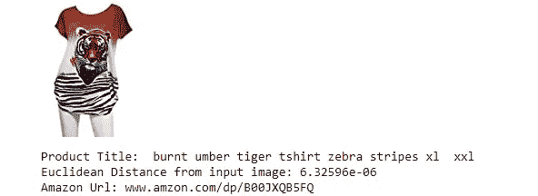

This is the query image.

*   在这里，它将只使用图像来查找类似的产品。

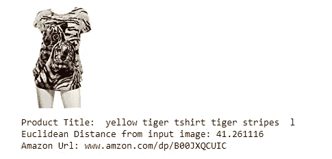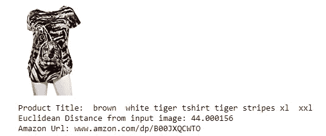

*   如果你观察的话，这些产品非常相似。根据查询图像，该模型更关注老虎纹和斑马纹。

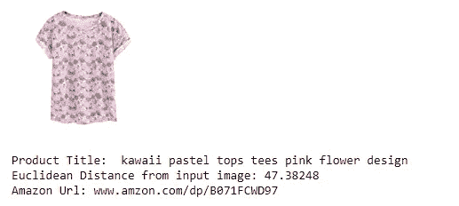

*   该产品以前根本没有相同的查询标题。所以，我们得到了一些新的相似的建议。

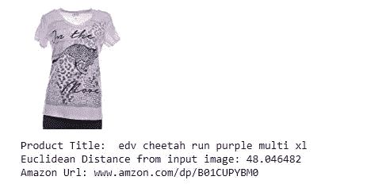

*   我只是用图像来寻找相似性，但我仍然得到了非常好的结果。在上面的产品推荐中，我们得到了猎豹图像以及斑马条纹，这是一个相当不错的无标题推荐。我们没有在任何基于文本相似性的方法中得到这个产品。

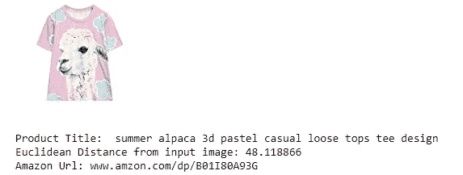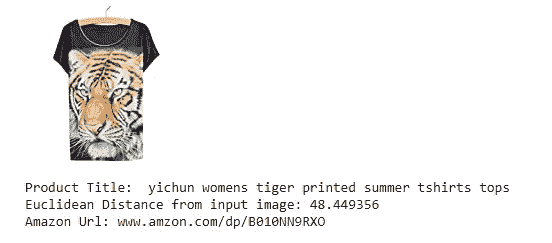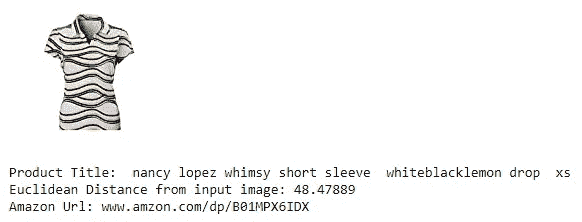

*   所以，我们从深度学习中得到了一些非常有趣的结果。在现实世界中，我们结合了多种方法的解决方案。

> ***测量我们解决方案的优度:A|B 测试***

*   在整个博客中，我一直在根据单个不正确的查询来评估我们的方法。但是在现实世界中，我们将会处理数以百万计的图片、标题或产品。那么，如何评价方案一和方案二呢？
*   让我们假设椭圆是访问**Amazon.com 的所有用户的集合。每天都有数百万用户访问 Amazon.com。我只是将我的用户随机分成两个不重叠的组:比如说 U1 和 U2。对于集合 U1 中的用户，我将向他们展示解决方案 1 的结果，向集合 U2 的用户展示解决方案 2 的结果。它们是大致相似的集合。现在，我在集合 1 上测量我的销售额，在集合 2 上测量我的销售额。如果销售(U1) >销售(U2)，那么用户倾向于更喜欢方案 1 而不是方案 2。因此，公司更倾向于方案 1。**
*   因此，为了进行评估，我们必须进行 A|B 测试，通过检查销售额来衡量我们解决方案的优劣。
*   有一天，我在看一个亚马逊工程师的视频，他说模型投入生产后，通常需要一个月才能获得模型性能的所有反馈。

> ***结论***

*   推荐系统可以帮助用户找到合适的产品。
*   它增加了用户的参与度。
*   在亚马逊，35%的产品因推荐而售出。
*   这有助于使内容更加个性化。

> ***实现在我的 GitHub 页面:***

[](https://github.com/Swetadas-1718/Amazon-Fashion-Discovery-Engine-content-based-recommendation) [## GitHub-Swetadas-1718/亚马逊-时尚-发现-引擎-基于内容-推荐

### 据估计，亚马逊大约 35%的收入来自产品推荐。由于…

github.com](https://github.com/Swetadas-1718/Amazon-Fashion-Discovery-Engine-content-based-recommendation)