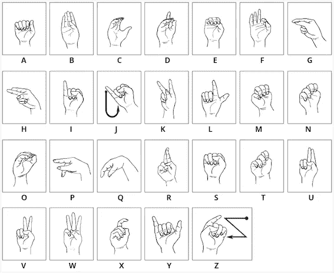
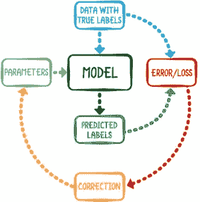
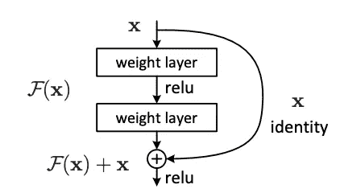
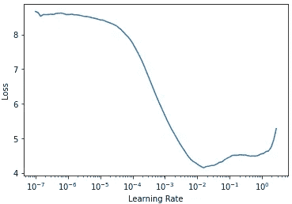
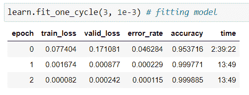
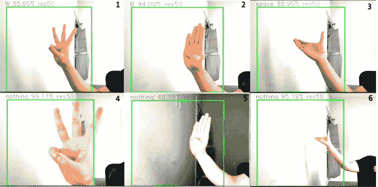
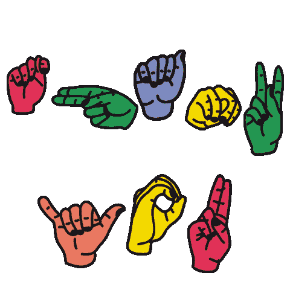

# 美国手语字母识别

> 原文：<https://medium.com/mlearning-ai/american-sign-language-alphabet-recognition-ec286915df12?source=collection_archive---------0----------------------->


“Rock on!” hand gesture in American Sign Language 🤘 —Source: [Teen Vogue](https://www.teenvogue.com/story/teen-translates-concert-into-american-sign-language-for-her-deaf-dad)

## 将美国手语翻译成书面语言将提供一个机会，让无声的声音被听到。

> *作者:* [*安德鲁【韩】*](https://www.linkedin.com/in/uknowandy93/)*[*郝*](https://www.linkedin.com/in/haohe1113/)*[*马修*](https://www.linkedin.com/in/matthew-ruffner-data-analytics/)*[*阿里*](https://www.linkedin.com/in/adsayyed/)*[*马歇尔*](https://www.linkedin.com/in/marshall-wurangian/)*[](https://www.linkedin.com/in/dian-zhao/)*****

# ***背景***

***人工智能在生活的各个方面越来越普遍。无论是自动化流程还是执行特定任务，人工智能的存在都是为了帮助人们解决他们的问题。然而，实际上，人工智能因不能包容所有人而享有 T42 的名声。从本质上来说，机器只能根据人类的编程来工作。因此，A.I 因对包括残疾人在内的边缘化人群有偏见而臭名昭著。***

***大约有 4800 万美国人(占总人口的 15%)有不同程度的听力损失。人们越来越有兴趣让人工智能系统反映残疾人的需求，尤其是听力残疾的人。我们的 ML 模型可以通过提供一个自动化框架来帮助听力损失的人，该框架通过从美国手语手势中识别字母来将美国手语(ASL)转录为书面语言。随着这种模式的应用，任何时候一个人用美国手语交流，生成文字作为字幕就有可能帮助有听力障碍的人通过文本理解口语。我们通过 fast.ai 库和 OpenCV，利用预训练的残差网络架构，用 Python 开发了我们的美国手语字母识别模型，以在实时行动中现场演示我们的发现。***

# ***方式和方法***

## ***数据集概述***

***我们使用的数据集是从 [Kaggle](https://www.kaggle.com/grassknoted/asl-alphabet) 获得的 87，000 幅图像的集合，这些图像由描绘美国手语字母的手势组成，分为 29 个文件夹，代表不同的类别。29 个类由英文字母表中的 26 个字母组成，*空格*，*无*，以及*删除*。***

******

***The American Sign Language Alphabet Hand Signals. Source: [APSEA](https://apsea.ca/home-learning/dhh/self-determination-advocacy/asl-abc-and-number-stories.html)***

## ***雷斯内特***

***我们使用*迁移学习*作为模型构建的基础，在此基础上，我们利用预训练的架构进行外推，并为该项目应用预测分类。我们使用的现有迁移学习架构是 ResNet。ResNet，或 residual network，是微软的研究人员在 2015 年发表的题为 [*图像识别的深度残差学习*](https://arxiv.org/pdf/1512.03385.pdf) 的论文中开发的一种人工神经网络。它旨在解决深层神经网络很难训练的潜在问题，这种问题会随着层数的增加而产生降低神经网络性能/准确性的瓶颈。基本动机是创建一个神经网络，它擅长深层处理，并且不会失去泛化能力。***

******

***The process of training a neural network. With Transfer Learning, we use pre-trained parameters to be applied to our dataset. Source: [Raywenderlich](https://www.raywenderlich.com/books/machine-learning-by-tutorials/v2.0/chapters/3-training-the-image-classifier)***

***此外，它解决了困扰深度神经网络的*消失梯度下降*的问题。神经网络使用梯度下降来微调权重。当梯度从最终层反向传播到更早的层时，作为链式法则的结果的重复乘法可能会降低梯度。小的梯度将使训练模型的效果差得多，因为它只会在正确的方向上迈出一小步，从而降低模型的准确性。类似地，ResNets 解决了*爆炸梯度、*大误差梯度累积并导致训练期间神经网络权重的指数更新的问题，因为它们具有明显更低的梯度，并且可以直接通过*跳过连接*执行身份映射以跳过层。它们的输出被添加到堆叠层的输出中，这既不增加额外的权重，也不增加计算复杂度。跳跃连接的引入在数学上简化了模型，并通过反向传播为梯度提供了替代路径，以实现更好的模型收敛。***

******

***A building block of residual learning using skip connections that speeds learning by reducing the impact of vanishing gradients, as there are fewer layers to propagate through. Source: [Deep Residual Learning for Image Recognition](https://arxiv.org/pdf/1512.03385.pdf)***

***根据问题的复杂程度和计算能力，使用迁移学习测试模型的方法有多种，比如 *ResNet (18，34，50 等。)*、 *VGG* 、 *Lenet* 、 *AlexNet* 和*异常。*出于本项目的目的，我们使用了 ResNet-50 架构，这是一种基于 ImageNet 数据库的 50 层模型。***

## ***fast.ai***

***Fast.ai 是一个基于 PyTorch 构建的深度学习库，为从业者提供高级组件，可以快速轻松地提供标准深度学习领域的最先进结果。fast.ai 库的核心使命是实现深度学习的民主化，它提供了许多有用的功能，可以快速轻松地建立和训练神经网络。我们用 fast.ai 调用 ResNet-50 架构，训练我们的模型。***

## ***OpenCV***

***OpenCV 是一个用于实时计算机视觉任务的库。它拥有超过 2，500 种机器学习和计算机视觉算法，可以处理人脸识别、相机运动跟踪、对象检测等任务。在我们的项目中使用 OpenCV，我们能够通过流视频实时实现我们的模型，通过从摄像机进行实时视频捕捉来输出美国手语字母的预测概率。***

# ***该过程***

***首先，我们必须使用 fast.ai 库下载 ResNet-50 架构。然后我们获得了最小化损失的最优学习率，如下面的代码所示。***

```
***resnet_model = models.resnet50(pretrained=True) # Obtaining the pretrained Resnet-50 architecturedef get_learner(m): return Learner(dls, m, metrics=[error_rate,accuracy]) 
    # The dls would be our training set of ASL alphabet classeslearn = get_learner(resnet_model)learn.lr_find() # Finding best learning rate***
```

******

***The output of the code above, in which shows the optimum learning rate***

***如左图所示，我们发现了学习率及其相应的损失。学习率被用作梯度下降的超参数，该超参数控制每次更新模型权重时响应于估计误差而改变模型的程度。选择一个既不太大也不太小的学习率以达到最小化误差取决于我们的洞察力。我们选择使用 10⁻作为我们的学习率，因为它是图表上最陡的波动点，在减少总损失方面迈出了最大的一步。虽然选择 10⁻提供了最小的误差，但它有使模型发散的风险。在用之前获得的学习率运行了 3 个时期来拟合我们的模型之后，我们最终达到了近乎完美的 100%准确率。***

******

***Fitting our model with 3 epochs and the optimal learning rate***

# ***现场测试我们的模型***

***下面的代码提供了我们如何通过 OpenCV 运行模型的一个片段:***

```
***# importing OpenCV
import cv2# initiate video capture
cap=cv2.VideoCapture(0)#saving all the captured frames to a video file called 'live prediction'
out=cv2.VideoWriter('try.avi',cv2.VideoWriter_fourcc(*'MJPG'),10, (192*4,108*4)) 

while(True):
    ret,img=cap.read() # grabbing each frame of webcam footage
    img = cv2.resize(img,(192*4,108*4)) # resizing frame size, must match video output frame size
    cv2.rectangle(img, (32,32),(432,432),(0,255,0),2) # adding a rectangle to the image
    frame=cv2.resize(img[32:432,32:432],(200,200))
    pred,percent=predict(frame)
    print(pred) # live prediction of frame
    print(percent) # confidence
    cv2.putText(img,'{} {:.2f}% res50'.format(pred,percent),(25,25),cv2.FONT_HERSHEY_SIMPLEX,0.9,(80,255,255),1)
    out.write(img) # output frame
    if cv2.waitKey(1) & 0xFF == ord('q'):
        breakcap.release()
cv2.destroyAllWindows()***
```

## ***成功的结果***

***从我们通过 OpenCV 显示的测试运行来看，我们的模型取得了令人印象深刻的预测性能，在大多数情况下都做出了准确的预测，并得到了统计上显著的置信度(> 90%)的支持。每秒每一帧，我们的模型将输出它的预测以及预测为真的概率。考虑到仅从手势就有 29 个类别要分类，令人印象深刻的是该模型能够快速准确地进行预测。同样值得注意的是，我们的模型成功地区分了即使是最相似的手势，如“A”与“E”、“M”和“S”。此外，在我们的小组成员在不同地方测试现场演示的测试过程中，我们的模型也表现出了对各种背景的高度适应性。下图 1-3 显示了一些高精度成功预测的例子。***

## ***模型缺点***

***虽然我们的模型显示了较高的整体预测性能，但我们也意识到了一些可能影响预测结果的问题。***

*****距离*****

***从我们的测试运行中，我们意识到我们的手和网络摄像头之间的距离是一个关键因素，可能会导致模型停止做出准确的预测。基于经验推理，我们认为最好的做法是让手势离摄像头 8 英寸左右。如果手太靠近或太远，模型可能会“什么都没有”，分别如下面的图 4 和图 6 所示。***

*****亮度*****

***影响模型性能的另一个因素是背景照明。我们意识到，如果捕捉手势的环境太暗，使我们的手变得非常明亮，预测结果就会受到污染。在这些情况下，模型要么预测错误的类别，要么预测置信度非常低的正确类别，甚至预测“无”，如下图 5 所示。另一方面，如果图像太暗，模型将无法区分类别并输出“无”***

******

***The 3 images on top represent successful cases, whereas the images on the bottom represent unsuccessful attempts (Image 4 — too close, Image 5 — too bright, Image 6 — too far)***

# ***进一步的改进***

## ***训练更多不同的图像***

***基于我们在运行模型时面临的缺点，我们相信添加更多具有不同背景和不同距离的所有类别的图像将覆盖更大的范围和现场演示的灵活性。为了进一步改进我们的模型，我们应该通过添加镜像图像作为我们左撇子数据集的一部分来进行*数据扩充*，这样它将是平移不变/等变的。通过这样做，我们可以防止我们的模型过度拟合图像中的特定背景、距离和手的位置。通过这样做，它使我们能够将我们当前的模型与新的数据集合并，从而提高预测每个字母的准确性。总体而言，拥有更多具有不同特征的图像将为我们提供最佳结果。***

## ***将模型发展得面目全非***

***我们可以尝试开发模型来识别单词、短语和连贯的句子，而不仅仅是识别字母。一旦我们开发了一个生成形成逻辑句子的文本/字幕的模型，我们就可以进一步进行自然语言处理，以便我们能够基于我们提取的文本进行不同的分析，例如情感分析，以找到单词背后的上下文和情感。这是有意义的，因为该模型将结合两种不同的认知计算方法:图像识别和文本分析。换句话说，该模型将成为代表从图像中提取文本的方法的示例之一。***

# ***结论***

***我们的团队能够使用 fast.ai 库中预先训练的 ResNet-50 构建 ASL 字母识别系统，并使用 OpenCV 实现实时预测。该识别系统能够从分成训练和验证集的 87，000 幅签名字母的图片中实现 0.0082%的训练损失和 0.0242%的验证损失。***

***涉及图像的项目可能会受到许多因素的高度影响，例如物体的距离(我们项目中的*手*)和图像的分辨率/亮度——从现场视频中捕捉。为了建立一个处理综合案例的系统，我们建议人们在构建数据集时要谨慎。我们可以肯定地说，你的模型只有在数据集被训练的情况下才是好的。***

***通过这个项目，我们希望引发关于人工智能算法的包容性和偏见的对话。我们可以证明，技术可以用于社会公益，帮助那些经常被社会边缘化的人。我们希望这个模型可以帮助有听力障碍的人，并作为一个框架来建立机器学习模型，通过识别 ASL 手势中的字母将 ASL 转录为书面语言。我们相信可以做出进一步的改进，并最终帮助提供一个机会，让*的无声*发出*的声音*被听到。***

******

***American Sign Language for “Thank you”***