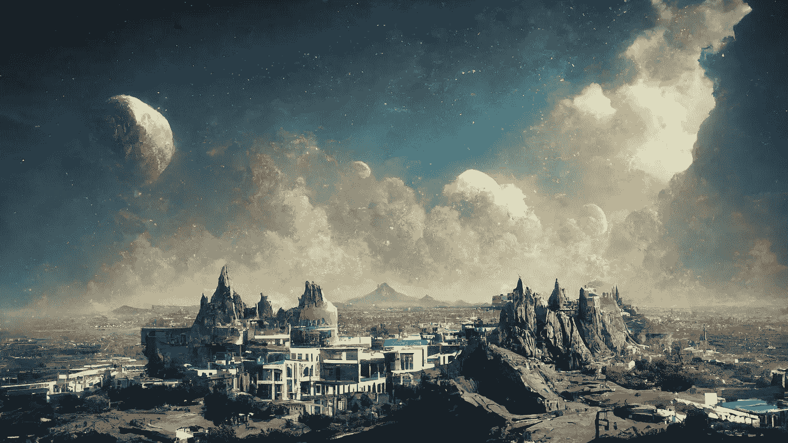

# 编写中途提示的高级指南(文本到图像)

> 原文：<https://medium.com/mlearning-ai/an-advanced-guide-to-writing-prompts-for-midjourney-text-to-image-aa12a1e33b6?source=collection_archive---------0----------------------->

## 图像生成，中途

## 一份详细的“备忘单”和一些通过使用更好的提示来提高图像输出的关键词

Image generated by Midjourney , text prompt : **beautiful, fantasy city unreal engine**

## 中途有一艘班轮吗？