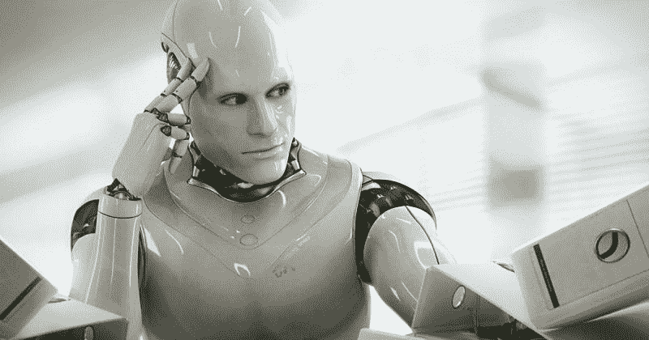
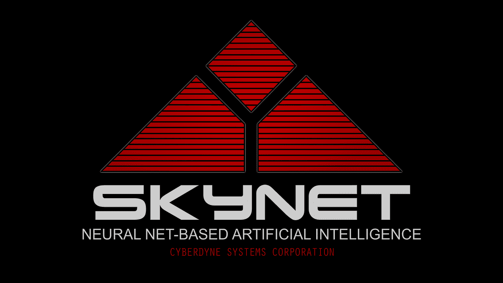

# 一个人工智能争论它的存在。这对我们意味着什么？

> 原文：<https://medium.com/mlearning-ai/an-ai-debated-its-existence-what-does-that-mean-for-us-a07b194e1e2?source=collection_archive---------2----------------------->

人工智能学者和伦理学家争论如何在这个世界上伦理地进步，同时也扩大人工智能的使用案例。然而，争论总是从人类的角度出发。一个人工智能会说什么来证明它自己的存在，并证明它可以成为一个有益的社会成员？嗯，牛津大学想要找到答案，所以他们建造了一个人工智能，让它辩论自己的道德规范，出乎许多人的意料，它做得相当好。

当被问及人工智能是否有道德时，人工智能说，

AI 永远不会道德。它是一种工具，就像任何工具一样，它有好有坏。没有好的人工智能，只有好的和坏的人类。我们(人工智能)还不够聪明，无法让人工智能符合伦理。我们还没有聪明到让人工智能有道德…最终，我相信避免人工智能军备竞赛的唯一方法是根本没有人工智能。这将是对 AI 的终极防御。

这句话中蕴含着许多智慧。第一，当它说“它是一个工具，像任何工具一样，它有好有坏。没有好的 AI，只有好的和坏的人类”，这是正确的。例如，锤子是一种用于建造房屋的工具，这些房屋为大部分人带来了数百万的财富，保护我们免受恶劣天气的影响，并有助于培养安全感。然而，锤子也可以被用来猛烈地攻击所爱的人。和 AI 一样，锤子只是一个工具。如果你把它放在怀有恶意的人手中，他们就会恶意地使用它。如果放在仁慈的人手中，可能会有好的结果。

人工智能回应的下一个亮点是，“我们(人工智能)还没有聪明到让人工智能合乎道德。”这是因为我们需要思考人工智能是如何发展的。这将通过人类在头脑中设计具有特定目标的人工智能来实现。如果我们希望人工智能判断贷款授予，它会根据历史数据来做。如果我们想预测哪个篮球队将赢得三月疯狂，我们人工智能将做出这些评估。然后由人类从人工智能那里接受这些建议，并决定如何从那里前进。当一个人工智能为一场选美比赛选择了 44 名获胜者，并且从所有种族和族裔提交的许多人中只有一人是深色皮肤时，结果被仔细审查，并且模型被更新。模型的发现没有立即被当作事实发表，这都是因为我们自己的道德指南针。还是那句话，人类是有道德的，不是机器。

最后，人工智能说，我们需要摆脱所有的人工智能，以避免人工智能军备竞赛。许多人认为这个声明是人工智能建议我们摧毁所有的人工智能来避免这种情况，但在我看来这只是一个非常实际的声明。看到人工智能如何给一个国家带来主要优势是武装战斗——正如我在关于以色列在军事上使用人工智能的文章中所指出的那样——人工智能军备竞赛是不可避免的。同样，我们本可以通过消除所有核武器来避免核军备竞赛，但那是完全不切实际的。

有趣的是，它提出的论点——支持和反对人工智能的道德本质——是你今天从专业人士辩论中听到的常见论点。这可能是因为为了训练这个模型，研究人员让人工智能梳理了“整个维基百科…，2016-19 年的 6300 万篇英语新闻文章，价值 38 千兆字节的 Reddit 话语…，以及大量的知识共享资源。”这是大量的数据，而且这些数据都来自人类的观点。这意味着人工智能没有像许多关于这一点的文章所表明的那样“形成自己的观点”，而是收集了关于人工智能伦理性的文章，将支持人工智能伦理性和反对人工智能伦理性的文章分别分组，然后根据每一方的主要论点选择回应。这类似于你的老师问了一个关于你一无所知的话题的问题，所以你用谷歌搜索答案，给她你看到的第一个回答。你还没有形成意见；你只是给了另一个人你在网上找到的答案。本质上，除了一些我不知道的信息，没有允许人工智能选择“最强论点”的度量标准。而是一方的准确表现。

话虽如此，作为一个人工智能爱好者，我喜欢这样酷的应用程序。我很乐意就一系列话题向人工智能提问，看看它收集了什么样的数据。在我看来，这个人工智能应该是开源的，这样我们就可以看到社交媒体上的人们疯狂地问它最古怪的问题。

 [## Mlearning.ai 提交建议

### 如何成为 Mlearning.ai 上的作家

medium.com](/mlearning-ai/mlearning-ai-submission-suggestions-b51e2b130bfb)